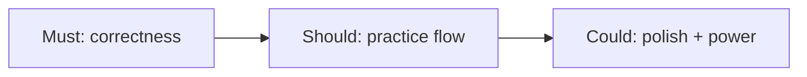

# Feature implementation plan — accuracy / usability pass

> **Status:** complete (all Must / Should / Could, including practice set)  
> **Created:** 2026-08-21  
> **Updated:** 2026-08-21

## Sequencing

| Phase | Items | Exit |
| --- | --- | --- |
| **Must** | OR chip filters; star/zip errors; FTS ready state | Multi-key search works; failures visible |
| **Should** | Star from browse; tab badges; next/prev; key in URL; sheet fullscreen + pitch FAB; refresh offline media | Phone rehearsal loop usable |
| **Could** | Recent; PWA nudge; A–B loop; import media backfill; **practice set** | Differentiating practice features |

**Removed:** Voice part filter chips (low value for this product).

---

## Must

### M1 — OR within field for multi-select chips ✅
### M2 — Star errors + zip disabled copy ✅
### M3 — FTS lyrics-ready messaging ✅

---

## Should

### S1 — Star from browse ✅
### S2 — Bottom-tab badges ✅
### S3 — Next / prev tag ✅
### S4 — Key shift in URL ✅
### S5 — Sheet fullscreen + floating pay-the-key ✅
### S6 — Refresh offline media ✅

---

## Could

### C1 — ~~Filter by voice part~~ (removed)
### C2 — Recent tags ✅
### C3 — PWA install nudge ✅
### C4 — A–B loop on TagPlayer ✅
### C5 — Import → optional media fetch ✅
### C6 — Ordered practice set from starred ✅
- Starred: reorder ↑↓, Start practice, auto-advance preference
- Tag page `?set=practice`: practice banner, set prev/next, auto-advance on track end

---

## Done when
- [x] Must + Should shipped and tested
- [x] Could including practice set
- [x] `npm test` + `npm run typecheck` green
