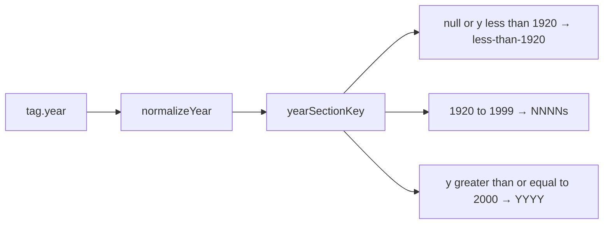

# Hybrid year section bins

List **section headers / groupings** for View by Year. Navigation via a density-weighted scrub rail is specified separately in [SCRUB_RAIL_PLAN.md](./SCRUB_RAIL_PLAN.md) (reusable component; Year first, Title later).

## Why this scheme

Catalog year counts are heavily right-skewed (~3% before 2000, dense recent years). Pure decades make the 2000s/2010s huge; pure years make early history a long jump rail of tiny sections.

**Chosen bins** (omit empty decades like 1920s):

| Key | Approx. size today |
|-----|-------------------|
| `<1920` (includes missing years) | ~4+ |
| `1930s` … `1990s` | ~2–50 each |
| `2000` … `2026` (one per year with tags) | tiny early 2000s, then ~250–650 |

**Bin count today:** ~35 headers on a full-catalog year browse (`<1920` + 7 decades + 27 years from 2000–2026), plus `Unknown year` if any tags lack a year. Filtered results show only bins present in the result set.

Switch to **single years at 2000**, not 2015: a full `2000s` decade would be ~1066 tags and hide the 2008/2009 spikes. ~35 bucket headers is fine for list landmarks; fast movement is the scrub rail, not a chip per bin.

No mid-decade “shorter ranges”; decades → years is enough.

## Implementation

Primary change in [`web/src/search/browse.ts`](../web/src/search/browse.ts) (keep [`web/src/lib/year.ts`](../web/src/lib/year.ts) as normalize-only):

1. Add `yearSectionKey(year: number | null): string`:
   - `null` or `y < 1920` → `<1920`
   - `1920 ≤ y ≤ 1999` → `${Math.floor(y / 10) * 10}s` (e.g. `1990s`)
   - `y ≥ 2000` → `String(y)`

2. Wire `sectionKeyFor(..., 'year')` through that helper. `sectionLabel` can keep returning the key as-is (`<1920`, `1990s`, `2015`).

3. Leave **tag sort** as today: newest calendar year first, then title. Walking the sorted list naturally emits newest sections first (`2026` … `2000`, then `1990s` … `<1920`). No change to jump-key discovery in `buildBrowseRows`.

4. Update tests in [`web/src/search/browse.test.ts`](../web/src/search/browse.test.ts):
   - Same calendar year still one section (`2023`)
   - `1999` → `1990s`, `2009` → `2009`, `1910` / missing → `<1920`
   - Two tags in the same decade share one jump key; different decades / years do not
   - Adjust the existing year-section case for hybrid keys

## Out of scope

- Year **filter** chips (`yearMin` / `yearMax`) stay exact calendar years
- No UI copy changes beyond section headers / jump labels produced by keys
- No rebuild of indexes
