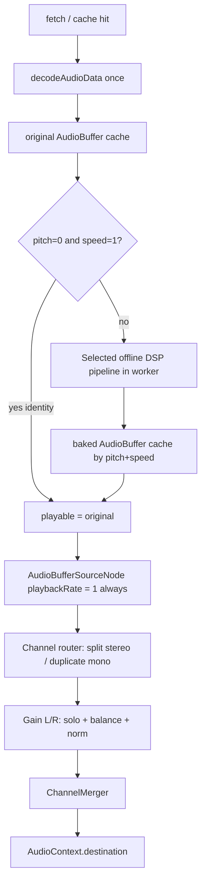

# Independent pitch / speed playback — phased plan

> **Status:** accepted (implemented)  
> **Created:** 2026-08-25  
> **Updated:** 2026-08-25 (multi-model adversarial review + implementation)  
> **Goal:** Pitch and speed are independent; balance/solo always work; identity playback meets the measured latency budget with no DSP.  
> **ADR:** [decisions/pitch-speed-bake.md](decisions/pitch-speed-bake.md)

---

## Product requirements

1. **Independent controls**
   - Speed changes tempo only (pitch stays put).
   - Pitch changes key only (tempo stays put).
   - Both may be combined.
2. **Balance / solo on every path** — including identity, speed-only, pitch-only, and combined. Prefer a live Web Audio gain graph after the playable buffer (not baking pan into files), so the slider stays instant.
3. **Identity path has no extra work** — `pitch = 0` and `speed = 1` never run stretch/pitch DSP. When the buffer is already decoded and the `AudioContext` is running, Play meets the measured start-latency budget (see Performance and memory budgets). First-play may still incur a one-time `AudioContext.resume()` after user gesture; that latency is separate from the identity fast path and must not be described as "instant."
4. **Quality** — learning tracks may be solo voice, voice plus piano, or full polyphonic mixes. The algorithm must be selected from measured candidate results, not assumed from package marketing.
5. **Downloads match playback** — zip transforms use the same bake functions as live audio.
6. **No silent coupling** — never fall back to audible `playbackRate ≠ 1` without verified DSP. Fail loudly (UI error / keep previous buffer).

---

## Why previous approaches failed (do not repeat)

| Approach | Failure mode |
| --- | --- |
| SoundTouch on `<audio>` with mismatched rates | Element `playbackRate=1`, worklet `0.5` → ~octave up, little slowdown |
| `preservesPitch` + `MediaElementAudioSourceNode` | MES breaks pitch-preserving speed → 50% needs +12 st |
| Always `ensureGraph()` / `setBalance(0)` creating MES | Forced broken path even for “simple” speed |
| Bake + swap `HTMLAudioElement.src` after MES | Silent / unreliable output |
| Live FormantCorrection + `BufferSource.playbackRate ≠ 1` | If worklet missing, playback couples speed+pitch; failures only logged |
| PSOLA stretch on learning mixes | Pitch/warp artifacts on polyphonic parts |

**Hard lesson:** `AudioBufferSourceNode.playbackRate` and MES-backed element rate are **not** safe tempo controls by themselves.

---

## Adversarial review corrections

The original proposal was directionally right about **baking transforms and always playing at rate 1**, but it made several unsafe assumptions:

1. **WSOLA was incorrectly described as polyphonic-friendly.** Its package documentation says it is intended for speech/moderate ratios and is *not* recommended for sustained polyphonic music. It remains a candidate for voice-heavy tracks, not the default.
2. **`@audio/shift-formant` is not proven for full mixes.** It is voice-oriented; applying it to accompaniment may introduce spectral artifacts. It remains a candidate, not a locked dependency.
3. **Pure sine tests are necessary but insufficient.** They catch speed/pitch coupling but not transient smearing, stereo image collapse, channel drift, formant damage, clicks, NaNs, or truncation.
4. **“Cached bytes” are not the same as “decoded and ready.”** `decodeAudioData` can still add latency. Identity playback needs proactive decode and a measurable readiness/latency target.
5. **Main-thread baking can freeze playback and UI.** DSP must run in a worker (or otherwise yield safely) before this is production-ready.
6. **`AbortController` cannot cancel synchronous batch DSP by itself.** Cancellation requires a worker-generation protocol; stale jobs must be terminated or ignored and their transferred buffers released.
7. **Timeline mapping by nominal speed alone is fragile.** Stretch algorithms add padding/trimming. Bakes must be normalized to an exact expected frame count, and seek mapping must use measured playable/original frame counts.
8. **Session caches need bounds and stronger keys.** Cache keys must include source identity, algorithm/version, sample rate, channels, and normalized transform values; memory needs explicit eviction.

### Multi-model review corrections (2026-08-25)

A second adversarial pass (independent reviewers) found additional contract gaps. Incorporated below:

9. **Many JS DSP packages need Web Audio nodes that workers do not expose.** A candidate that only works via `AudioWorklet` / live `OfflineAudioContext` cannot satisfy the “dedicated worker” invariant. Worker-runtime execution on transferable channel arrays is a **Phase 2 selection gate**, not a post-selection hope. If no candidate passes Vite import + real-worker smoke, the WASM/server path becomes the **default**, not an escalation.
10. **`decodeAudioData` needs a `BaseAudioContext`, but Play must await user-gesture `AudioContext.resume()`.** Prefetch/decode before first gesture requires an explicit predecode context (typically a short-lived `OfflineAudioContext`) or the identity fast-path guarantee is limited to tracks decoded after the first gesture.
11. **`decodeAudioData` is not cancellable.** Abort/generation gates drop stale results; the decode may still allocate. Cap concurrent decodes; document wasted work as acceptable.
12. **The gain graph only handles mono/stereo.** I8’s “preserve channel count” must mean supported channels are 1 or 2; decode results with 3+ channels are rejected or explicitly downmixed before caching/baking.
13. **Pitch/speed must be canonicalized once** at the public setter boundary (clamp + round + `-0` → `0`). Every later identity check, cache key, worker input, UI state, and “audible” comparison uses that canonical value — never raw UI floats.
14. **Frame contract must be a locked formula** (`expectedFrames`) with explicit rounding mode, pitch-only rule, and combined-transform rule — not “trim then hope.” Algorithm latency pads are documented deltas from that target.
15. **Player timeline API must stay on original seconds.** `duration` is always `originalFrames / sampleRate`; `currentTime` maps the live playable position back via measured frame ratio. TagPlayer scrubber/A–B/resume depend on these getters, not only UI helpers.
16. **Transformed A–B loops need a boundary strategy.** Identity loop-click assessment does not cover baked buffers (no DSP history at the seam). Require a browser-render loop gate and either dual-source overlap/crossfade at each boundary or an explicit limited-loop contract.
17. **Source identity must include content revision** (URL + trusted ETag/version/hash). A replaced asset at the same URL must not reuse stale decode, peaks, or bakes.
18. **Identity downloads are not the same as “encode from original.”** The shared bake pipeline starts from a decoded `AudioBuffer`. Decide and document: original-byte passthrough for identity, vs re-encode from the decoded/baked buffer (codec/container/metadata/sample-rate consequences).
19. **UI already exposes 0.25×.** Bake-off matrix, correctness tests, and memory rejection must include `0.25`, or the UI range is narrowed until proven.
20. **Main-thread `AudioBuffer` reconstruction and peak scans can blow the 50 ms budget** on long tags at extreme stretch. Budget chunked copy / idle scheduling; move peak/RMS into the worker; pre-check `originalFrames × stretchFactor` before starting a job.
21. **Decode cache and bake cache share one memory ledger.** Neighbor prefetch, pinned playable, in-flight swap crossfade, and bake LRU all compete for the same byte budget.
22. **Player and download share bake cache / in-flight promises** by the same canonical key; only cancel scopes are isolated, not recomputation.
23. **F0 oracles are restricted to mono sine / dual-tone fixtures.** Polyphonic fixtures use spectral-bin or fixture-specific oracles; mid/side metrics use stereo synthetics with known geometry.
24. **Cross-browser bitwise determinism is not a gate.** Tolerance-based metrics (optionally Chromium-only identity checks in CI).
25. **Real-browser CI (Playwright / `@vitest/browser`) is a Phase 0 exit criterion**, not a feasibility note — happy-dom cannot enforce Web Audio graph/oracle tests.

These corrections are incorporated into the phases below.

---

## Target architecture

### Invariants

| Invariant | Rule |
| --- | --- |
| I1 | Audible source `playbackRate` is **always `1`**. Tempo/pitch live only in the baked buffer (or identity buffer). |
| I2 | Solo/balance/normalize always run in the **same live gain graph** after the source. Stereo is split L/R; mono is explicitly duplicated to both output branches so rightward balance never becomes silence. Supported channel counts are **1 or 2 only**; 3+ channel decodes are rejected or explicitly downmixed before caching/baking. |
| I3 | Identity never enters the bake pipeline. Identity is detected only after **canonicalization** (`pitch === 0` and `speed === 1` on the clamped/rounded values). |
| I4 | Bake input is always the **original** decoded buffer (not a previous bake). |
| I5 | Bake failure → keep last good playable buffer + surface error; do not couple via `playbackRate`. |
| I6 | Timeline UI **and** player getters use **original** seconds. `duration === originalFrames / sampleRate`. `currentTime` maps the live playable position back via measured frame ratio. Bakes are trimmed/padded to the exact expected frame count; mapping uses measured frame counts, not nominal speed alone. |
| I7 | DSP runs off the main thread on transferable channel arrays (no Web Audio node dependency inside the worker). A stale result can never replace the current source/transform. |
| I8 | Processed output must contain only finite samples, preserve sample rate, preserve supported channel count (1 or 2 after any downmix), and have an exact contract-defined frame count. |
| I9 | No algorithm is selected until it passes synthetic correctness, stereo, robustness, performance, **worker-runtime smoke**, and representative-listening gates. |
| I10 | Bakes never start before the source decode completes. Analysis/peak measurement runs off the main thread whenever it would exceed the long-task budget. |
| I11 | The currently audible playable buffer is **pinned** in the LRU and cannot be evicted. If a new bake plus pinned buffers plus swap crossfade would exceed the memory budget, the new bake is rejected before allocation. |
| I12 | If the DSP worker/module cannot load, or the transform contract cannot be met, non-identity playback fails loudly and the last audible transform is preserved. There is no automatic fallback to coupled `playbackRate`. |
| I13 | Pitch and speed are canonicalized once at the public setter boundary; every identity/cache/DSP/UI/audible comparison uses that value. |
| I14 | Source identity includes immutable content revision (URL + ETag/version/hash). Decode and bake caches both key on it. |
| I15 | While `requested ≠ audible`, the scrubber/playhead continues on the **original** timeline mapped from the currently audible buffer. |

### Candidate algorithms (not locked)

| Role | Candidates | Adversarial notes |
| --- | --- | --- |
| Time stretch | `@audio/stretch-wsola`, `@audio/stretch-pvoc-lock`, `@audio/stretch-transient`, Rubber Band WASM / Signalsmith Stretch feasibility | WSOLA: speech/moderate ratios, weak on sustained polyphony. Phase-vocoder/phase-lock candidates are more plausible for harmony/full mixes but may smear attacks. WASM candidates require license, bundle-size, browser, and build evaluation. |
| Pitch | `@audio/shift-formant`, `@audio/shift-phase-lock`, `@audio/shift-transient`, possibly a composed stretch+high-quality resample pipeline | Formant is voice-oriented and must be tested on accompaniment. A single algorithm may not win for every track type. |
| Selection | One fixed “best general” pipeline first; optional voice/full-mix modes only if evidence clearly justifies complexity | Do not auto-classify content in v1. |
| Live worklets | **Not used** for v1 | Revisit only after offline reference path and tests are green. |

### Algorithm-selection rule

**Phase 2 entry criterion:** at least one candidate must pass Vite module-worker import + real transform smoke on transferable `Float32Array` channel data in Chromium (and ideally Safari/Firefox) **without** requiring `AudioWorklet`, live `AudioContext`, or `OfflineAudioContext` inside the worker. Packages that only expose worklet/node APIs are **not** selectable for the bake path unless a pure-array offline API is proven.

Phase 2 bake-off then selects the pipeline using:

- automated correctness and robustness tests;
- wall-clock and memory measurements on target mobile/desktop browsers;
- a checked-in representative fixture set (voice, voice+piano, sustained harmony, attacks);
- blinded/manual A/B notes using fixed settings;
- stereo processing rule: **joint / linked multichannel** (same algorithm instance or explicitly linked state for L/R). Independent per-channel stretch that causes measurable image wander fails A2.4 unless proven safe.

If no browser-side candidate meets the acceptance criteria, **stop before player integration** and adopt a proven WASM/native DSP engine (for example Rubber Band/Bungee-compatible options and licensing/build implications) or pre-rendered server transforms as the **default path**, not a last-resort escalation. Do not ship a merely “least broken” JavaScript pipeline.

### Caching layers

| Layer | What | When |
| --- | --- | --- |
| Offline / HTTP cache | Original media bytes (existing PWA / Cache API) | Already |
| Session decode cache | Promise + `AudioBuffer` keyed by **source identity + content revision** (URL + ETag/version/hash) + decode sample-rate policy | Prefetch/decode for current tag/part (+ at most one neighbor); deduplicate concurrent decode |
| Session bake cache | Bounded LRU keyed by source revision + algorithm/version/options + sample rate/channels + **canonical** pitch/speed | After successful validated bake; **shared** with download jobs via the same key / in-flight promise |
| Optional later | Persist baked blobs in IndexedDB | Out of scope for phases 0–4 |

**Unified memory ledger:** decode cache + bake cache + pinned playable + any in-flight swap dual-source overlap all count against one byte budget. Neighbor prefetch is dropped under pressure. Eviction never removes the pinned playable.

Identity play: decoded-buffer cache hit → start `BufferSource` immediately (no bake). An encoded-byte cache hit may still require decode and therefore does not satisfy the “immediate” fast-path claim by itself. Pre-gesture decode (if enabled) uses an `OfflineAudioContext` (or equivalent) and does not create the live playback `AudioContext`.

### Performance and memory budgets

Set concrete budgets during Phase 0 after measuring representative devices:

- identity play from decoded cache with a running `AudioContext`: target start call to scheduled source ≤ 50 ms;
- first Play after user gesture (context suspended): measured separately; must not block the UI thread other than the standard `resume()` await;
- no long task > 50 ms caused by DSP, peak scanning, decode analysis, **or `AudioBuffer` reconstruction/copy** on the UI thread;
- transform job progress/cancellation remains responsive;
- decoded + baked LRU has a byte budget (frames × channels × 4), not only an entry count;
- estimate peak job memory before accepting a transform (original + worker copy + intermediates + output + overlap during any swap crossfade); reject or narrow extreme ratios that exceed the device budget;
- pre-check `originalFrames × stretchFactor` (and projected peak) before starting a worker job; surface “transform too heavy for this track” per I12;
- pinned playable buffer counts against the budget but cannot be evicted; if it alone exceeds the budget, new bakes are rejected and the user is informed;
- loading a new tag releases unreferenced buffers/jobs; no detached worker, object-URL, or transferred `ArrayBuffer` leaks;
- worst-case reconstruction cost (longest representative tag × max stretch ratio, e.g. 0.25×) is measured in P0.9; if main-thread `createBuffer`+copy exceeds budget, use chunked copy / `requestIdleCallback` or an alternate transfer strategy before P3.

---

## Phased delivery

---

### Phase 0 — Contracts, harness, kill-list

**Exit:** Written invariants agreed; synthetic tone helpers exist; **real-browser CI job wired** for Web Audio tests; no product behavior change required yet.

#### Tasks

- [ ] **P0.1** Add this plan under `docs/` and link from `docs/decisions/README.md` as “proposed”.
- [ ] **P0.2** Define transform canonicalization + bake key:
  - `canonicalizeTransform(pitch, speed)` → clamps via existing `clampPitchSemitones` / `clampSpeed`, rounds pitch to 2 dp and speed to 3 dp, maps `-0` → `0`, returns the single value used for identity, cache, worker, UI, and audible state;
  - `bakeCacheKey(canonical, sourceRevision, sampleRate, channels, algorithmVersion)`;
  - identity ≡ `canonical.pitch === 0 && canonical.speed === 1`.
- [ ] **P0.3** Add `web/src/audio/synthTone.ts` (or test util): generate mono/stereo `AudioBuffer` of a pure sine (default 440 Hz, 1.0 s, 48 kHz).
- [ ] **P0.4** Add `web/src/audio/analyzeTone.ts` test helpers:
  - `estimateDominantHz(channel, sampleRate)` via autocorrelation or DFT peak in a band — **oracle restricted to mono sine / dual-tone fixtures**;
  - for chords/harmony fixtures: spectral peak bins or fixture-specific oracles (do not use `estimateDominantHz` as a polyphonic gate);
  - `measureRms(channel)`, `channelPeak`;
  - onset/impulse location, finite-sample check, inter-channel delay/correlation, mid/side energy, spectral-energy summary;
  - Tolerances documented per signal and transform; do not use one loose tolerance for every test.
- [ ] **P0.5** Build deterministic synthetic fixtures:
  - pure sine and harmonic vowel-like source;
  - dual-tone/chord (different frequencies per channel and same frequencies with known phase);
  - impulses/click train for transient timing;
  - silence, near-silence, DC offset, very short buffers, odd lengths;
  - 44.1 kHz and 48 kHz; mono and stereo;
  - optional 3+ channel fixture used only to assert reject/downmix behavior.
- [ ] **P0.6** Add a small checked-in representative fixture corpus with documented provenance/license:
  - solo sung vowel/phrase;
  - voice plus piano;
  - sustained four-part harmony;
  - percussive/strong-onset excerpt;
  - licensing checklist: no CI redistribution of unlicensed audio; synthetic-first if licensing is unclear.
- [ ] **P0.7** Define the worker message contract (`jobId`, source identity+revision, transform, algorithm/version, transferable channel arrays; progress/result/error/cancel). DSP must operate on channel arrays only — no Web Audio nodes inside the worker.
- [ ] **P0.8** Lock the exact output-frame contract in code comments + this plan:
  - `stretchFactor = 1 / speed` (example: `speed=0.5` → factor `2`);
  - pitch-only (`speed === 1`): `expectedFrames = inputFrames` (no length change from pitch);
  - speed/combined: `expectedFrames = round(inputFrames * stretchFactor)` using **`Math.round`** (document if a different mode is chosen; do not leave it ambiguous);
  - combined-transform order is decided in Phase 2; the frame target still follows speed only (pitch must not change length);
  - per-algorithm latency/padding is trimmed as a documented delta so the final buffer length **equals** `expectedFrames` exactly (pad with zeros only when trim undershoots);
  - preserve sample rate; preserve channel count after any mono/stereo downmix;
  - all samples finite and peak bounded (no hidden normalization unless specified).
- [ ] **P0.9** Measure and record baseline decode/start latency and memory on at least desktop Chromium + mobile-class emulation/real device; set concrete acceptance budgets. Include worst-case `createBuffer`+copy cost for longest representative tag × max stretch (`0.25×`).
- [ ] **P0.10** Confirm build-tooling feasibility gates (**hard exit** for Phase 0):
  - Vite module worker with dynamic imports of candidate DSP packages;
  - decision on `SharedArrayBuffer` (requires cross-origin isolation via COOP/COEP headers) versus copy-transfer of channel `ArrayBuffer`s; default to copy-transfer unless isolation headers are already deployed;
  - **browser-render CI job** (Playwright/`@vitest/browser`) for `OfflineAudioContext` graph tests — happy-dom cannot execute real Web Audio; this job must exist before P1 graph tests are considered enforced;
  - smoke: at least one DSP candidate imports and runs a no-op/identity transform on transferable arrays inside a real worker (or document that WASM is the default path).
- [ ] **P0.11** Document cache-key normalization spec (implements P0.2):
  - pitch rounded to 2 decimal places, speed rounded to 3 decimal places;
  - normalize `-0` to `0`;
  - include source identity **+ content revision**, sample rate, channel count, algorithm id, and package version;
  - add a unit test for float noise (e.g. `0.1 + 0.2`) collapsing to the same key as the UI literal.
- [ ] **P0.12** Autoplay / `AudioContext` / predecode lifecycle contract:
  - lazy-create live `AudioContext` on first user gesture;
  - `resume()` awaited before scheduling sources;
  - Play never assumes the context is running;
  - pre-gesture decode (if product requires readiness before first Play) uses a short-lived `OfflineAudioContext` (or equivalent) and **must not** create the live playback context;
  - if predecode is not implemented, the identity fast-path guarantee is explicitly limited to tracks decoded after the first gesture.
- [ ] **P0.13** Document decode sample-rate policy (shared by playback and downloads):
  - default: decode into a context whose sample rate matches the live `AudioContext` (typically 48 kHz) so playback and bake agree;
  - alternative: decode at file-native rate via `OfflineAudioContext({ sampleRate })` — only if product requires native rate; record the choice in the ADR;
  - cache keys always include the resulting sample rate.
- [ ] **P0.14** Document channel policy: supported inputs are mono/stereo; on decode, if `numberOfChannels > 2`, either reject with a clear error or downmix to stereo with a documented matrix; never silently drop channels 3+.
- [ ] **P0.15** Document kill-list in code comment / ADR: no MES for tag playback; no audible `playbackRate ≠ 1`; no PSOLA stretch as default; no silent coupled fallback; no main-thread batch DSP; no automatic downgrade to coupled `playbackRate` on worker failure; no independent per-channel stretch without stereo-image proof.

#### Synthetic tests (Phase 0)

| ID | Test | Expect |
| --- | --- | --- |
| T0.1 | Generate 440 Hz / 1 s buffer | `duration ≈ 1`, peak & RMS sane |
| T0.2 | `estimateDominantHz` on that buffer | ≈ 440 Hz within tolerance |
| T0.3 | Stereo identical L/R | helpers work per channel |
| T0.4 | Known delayed/phase-offset stereo | Delay/correlation helper reports expected relation |
| T0.5 | Impulse/click train | Onset helper finds expected sample positions |
| T0.6 | Silence / NaN-injected input | Analyzer handles silence; finite-sample validator rejects NaN |
| T0.7 | `canonicalizeTransform` | `-0`, float noise, and UI literals collapse correctly; identity only at `(0, 1)` |
| T0.8 | `expectedFrames` formula | Matches locked rounding for every UI speed including `0.25` |

---

### Phase 1 — Identity playback + always-on balance/solo

**Exit:** Normal playback meets latency budget after decode; balance and solo work; **no** pitch/speed DSP in this phase (controls may no-op or stay disabled until P3). Browser CI graph tests green.

#### Tasks

- [ ] **P1.1** Rewrite `TagAudioPlayer` core around:
  - `original: AudioBuffer | null`
  - `playable: AudioBuffer | null` (identity: same reference as `original`)
  - `AudioBufferSourceNode` with **`playbackRate = 1` always**
  - Persistent tail: channel router → gains → Merger → destination
  - Stereo router: split source channels to L/R gains.
  - Mono router: connect the one source channel to both L/R gains; mono solo controls remain disabled, but balance/pan still moves the duplicated signal.
  - Reject or downmix `numberOfChannels > 2` before attaching to the graph (P0.14).
- [ ] **P1.2** Add a deduplicating decode service:
  - cache the in-flight promise and successful buffer by **source identity + content revision** + decode sample-rate policy;
  - decode is triggered only for the currently opened tag/part (plus at most one immediate neighbor when the user is on next/prev); no list-wide prefetch;
  - measure and record decoded-buffer memory in the **unified** byte budget; drop neighbor prefetch under pressure;
  - distinguish “bytes cached” from “decoded ready” in metrics/state;
  - retry failed decodes without poisoning the cache;
  - predecode path (if enabled) uses `OfflineAudioContext` per P0.12.
- [ ] **P1.3** Add source-generation cancellation inside `TagAudioPlayer`:
  - pass `AbortSignal` to fetch;
  - treat `decodeAudioData` as **uncancellable work**: generation gate before and after decode; drop the buffer if stale; optionally cap concurrent decodes;
  - check source generation after fetch, `arrayBuffer`, decode, analysis (and later worker completion in P3);
  - `dispose()` invalidates all pending work;
  - a late old-source result can never mutate current player state.
- [ ] **P1.4** `load(url)`: resolve decode service → set `original`/`playable` → probe mono/peaks/norm → **do not bake**. Peak/RMS/finite scan must not exceed the long-task budget on the main thread — use stepped scan or a small analysis worker (align with I10).
- [ ] **P1.5** Play / pause / seek / loop against `playable` at rate 1. Player API contract (I6):
  - `duration` always returns `originalFrames / sampleRate` (original seconds);
  - `currentTime` returns the original-timeline position (for identity, equals buffer position; for later bakes, inverse of the measured frame-ratio map);
  - playhead UI and TagPlayer scrubber/A–B/resume consume these getters only.
- [ ] **P1.6** Implement A–B region playback explicitly:
  - source starts at mapped A/current offset;
  - set mapped `loopStart`/`loopEnd` for native looping where appropriate; loop points are re-mapped whenever `playable` changes;
  - for non-looping regions, schedule `stop(when)` at mapped B without a coarse UI timer;
  - distinguish natural-end (`onended` after natural stop) from manual stop (recorded intent flag) so the “ended” callback only fires when the region actually ended;
  - `AudioBufferSourceNode` is one-shot — every seek, region change, transform swap, or resume creates a new node;
  - define current-time modulo behavior for looping and assess boundary clicks via **browser-render** evidence (~128-sample render quantum is a soft target, not a happy-dom assertion);
  - generation IDs prevent stale `onended` handlers from ending a newer source.
- [ ] **P1.7** `setBalance` / `setSolo` only update gains (no source restart or DSP); works whether paused or playing.
- [ ] **P1.8** Ensure `play()` / `setBalance(0)` **never** create `MediaElementAudioSourceNode`.
- [ ] **P1.9** Remove or quarantine live FormantCorrection / SoundTouch usage from the player path (leave download stubs compiling until P4).
- [ ] **P1.10** Update unit tests for identity player, rapid part switching, stale `onended`, A–B boundaries, and original-timeline getters.

#### Synthetic / integration tests (Phase 1)

| ID | Test | Expect |
| --- | --- | --- |
| T1.1 | Load tone buffer (mock decode) → play | `usingBake === false`, source rate 1 |
| T1.2 | Balance −1 / +1 while playing | L/R gains match `stereoBalanceGains` |
| T1.3 | Solo left / right | Inactive side gain 0; active dual-routed |
| T1.3a | Mono source at center / full left / full right | Audible on both at center; only requested output at extremes; never accidental silence |
| T1.3b | Dual-mono stereo source | Mono detection disables solo choices; balance still routes predictably |
| T1.4 | Identity `setSpeed(1)` / `setPitch(0)` | No bake invocation; playable === original |
| T1.5 | Second `play()` after pause | No re-decode; no stretch/pitch imports |
| T1.6 | Two concurrent loads of same source | One fetch/decode; both await same promise |
| T1.7 | Decoded cache hit → play | Meets measured start-latency budget; no fetch/decode/DSP |
| T1.8 | Encoded cache hit but decode miss | UI reports preparing/decoding; does not falsely claim instant readiness |
| T1.9 | Rapid part switch / stale `onended` | Old source cannot pause/end the new source |
| T1.10 | A–B stop and loop (browser render) | Stops/restarts near mapped boundary; soft ~1 render quantum target |
| T1.11 | Abort during fetch/decode, then load another source | Late first load cannot change buffer, duration, peaks, or callbacks (even if decode finishes) |
| T1.12 | Real browser `OfflineAudioContext` graph render | Identity, mono duplication, balance, and solo produce expected channel energy |
| T1.13 | `duration` / `currentTime` getters | Always report original-timeline seconds on identity |
| T1.14 | Multichannel (>2) decode | Rejected or downmixed per P0.14; never silent channel drop |
| T1.15 | Source revision change at same URL | Decode cache miss; no stale buffer reuse |

#### Manual checklist (Phase 1)

- [ ] Open a cached starred tag: Play feels immediate.
- [ ] Balance and solo audible with Advanced open.
- [ ] Pitch/speed not required to work yet (may be disabled in UI with “coming back” or left unchanged but inert).

---

### Phase 2 — DSP bake-off, worker implementation, comprehensive suite

**Exit:** A pipeline has been selected from evidence; it runs in a real worker on transferable arrays; worker transforms satisfy the output contract; automated suite and representative A/B gate are green. Player is not wired yet.

**Entry gate:** P0.10 worker smoke passed for ≥1 candidate, **or** WASM/server path already chosen as default.

#### Tasks

- [ ] **P2.1** Build an isolated benchmark harness for candidate pipelines:
  - stretch: WSOLA, phase-vocoder lock, transient-preserving candidate;
  - pitch: formant, phase-lock/transient candidates, and composed stretch+resample where applicable;
  - test both operation orders for combined transforms;
  - record package/version/options with every result;
  - **disqualify** any candidate that cannot run its real transform in a DedicatedWorker on channel arrays (no AudioWorklet / live context dependency).
- [ ] **P2.2** Run candidates over synthetic and representative fixtures at the **full UI speed matrix** (`0.25`, `0.5`, `0.75`, `1.25`, `1.5`, `2.0`; pitch `−12`, `−5`, `−2`, `+2`, `+5`, `+12`; selected combinations). If `0.25` fails memory/quality gates, **narrow the UI** before Phase 3 — do not ship an unproven control.
- [ ] **P2.3** Score candidates on:
  - duration/F0 correctness (F0 oracle only on mono sine / dual-tone);
  - spectral-bin / fixture-specific checks for harmony fixtures;
  - transient displacement and smearing;
  - stereo delay/correlation / mid-side change;
  - NaN/Inf/clipping/truncation;
  - wall time, peak memory, output quality notes;
  - main-thread reconstruction cost after worker return.
- [ ] **P2.4** Conduct a fixed A/B review with at least two representative listeners if available. Record the selected general pipeline and rejected alternatives in an ADR. If no candidate is acceptable, adopt WASM/server as default and stop JS bake-off before player integration.
- [ ] **P2.5** Implement selected algorithms behind a stable `voiceTransform.ts` interface:
  - identity → return the same buffer reference without importing DSP;
  - non-identity always starts from original channel data;
  - pass the decoded buffer's actual sample rate to every algorithm that accepts/requires it;
  - use an explicit typed channel-array adapter where package declarations expose mono-only types;
  - **stereo rule:** joint/linked processing for L/R; independent per-channel adapters fail A2.4 unless proven;
  - normalize to the exact `expectedFrames` contract from P0.8;
  - validate output and recompute transformed peaks **in the worker** before exposing it;
  - pin exact validated dependency versions and record algorithm/options version in cache identities.
- [ ] **P2.6** Run batch DSP in a dedicated **long-lived** worker (or small pool) so rapid pitch/speed scrubbing does not thrash WASM/module init:
  - copy channel data from the `AudioBuffer` and transfer the copies; never detach the original channel storage;
  - do peak/RMS scanning and finite-sample validation inside the worker before sending back;
  - reconstruct the `AudioBuffer` on the main thread only after validation, within the long-task budget (chunked copy if needed);
  - always wait for the source decode to complete before starting a bake; do not race the decode;
  - pre-check `originalFrames × stretchFactor` + projected peak memory; reject before allocation if over budget.
- [ ] **P2.7** Implement real cancellation semantics:
  - prefer cooperative cancel between algorithm stages on a long-lived worker; terminate/replace only if a job wedges;
  - always ignore stale `jobId` results;
  - release transferred/result buffers for canceled jobs.
- [ ] **P2.8** No coupled `playbackRate`, media element, or live AudioWorklet in this module.
- [ ] **P2.9** Wire correctness tests into CI; run heavier quality/performance fixture tests in a separate deterministic **browser** job if normal unit-test time becomes excessive.

#### Synthetic tests (Phase 2) — **gate for Phase 3**

Use generated signals for deterministic correctness, plus checked-in real fixtures for robustness and quality regression. Real fixtures do not replace synthetic oracles.

| ID | Case | Expect |
| --- | --- | --- |
| T2.1 | Identity `(0, 1)` | Same buffer reference; F0 unchanged; duration unchanged |
| T2.2 | Speed `0.5` only | `duration ≈ 2×`; F0 ≈ original (± tol); not ~0.5× F0 |
| T2.2a | Speed `0.25` only | `duration ≈ 4×`; F0 ≈ original; or UI range narrowed + test skipped with ADR note |
| T2.3 | Speed `2` only | `duration ≈ 0.5×`; F0 ≈ original |
| T2.4 | Pitch `+12` only | Duration unchanged; F0 ≈ `2×` original |
| T2.5 | Pitch `−12` only | Duration unchanged; F0 ≈ `0.5×` original |
| T2.6 | Pitch `+2` only | F0 ≈ `original * 2^(2/12)` |
| T2.7 | Speed `0.5` + pitch `+12` | Duration ≈ `2×`; F0 ≈ `2×` original |
| T2.8 | Speed `0.5` + pitch `0` | **Must not** require +12 to “fix” pitch (guards the classic bug) |
| T2.9 | Stereo: stretch + shift both channels | L/R lengths equal; both F0 OK on dual-tone; joint processing |
| T2.10 | Invalid / throw inside DSP | Returns `null` (or Result err); never partial coupled buffer |
| T2.11 | `factor` mapping | Documented: `speed=0.5` → stretch factor `2`; `speed=0.25` → `4` |
| T2.12 | Exact frame contract at all speed options | Output length equals `expectedFrames` from P0.8 after trim/pad |
| T2.13 | 44.1/48 kHz; mono/stereo; odd/short lengths | Sample rate/channels preserved; no throw unless explicitly unsupported |
| T2.14 | Silence, near-silence, DC offset | No NaN/Inf, runaway gain, or unexplained tone |
| T2.15 | Impulse/click train at each speed | Onset spacing scales correctly; displacement/smear within selected threshold |
| T2.16 | Harmonic chord / sustained harmony | Spectral-bin / fixture oracles pass; no channel-length drift (**not** `estimateDominantHz`) |
| T2.17 | Stereo phase/delay fixture | Inter-channel delay does not change beyond threshold; no L/R independent-stretch image wander |
| T2.18 | Peak/RMS safety | All finite; peak ≤ defined bound; no undocumented normalization |
| T2.19 | Worker cancellation | Canceled/stale job cannot publish a result; memory is released |
| T2.20 | Main-thread responsiveness | No DSP- or reconstruction-caused UI long task > budget |
| T2.21 | Determinism | Same input/options/version produce **tolerance-defined** output (bitwise identity optional Chromium-only; never a cross-browser blocker) |
| T2.22 | Representative fixture regression | No truncation/clicks/silence; A/B notes meet accepted baseline |
| T2.23 | Long track / 0.25× estimate | Job is rejected before allocation if projected peak memory exceeds budget |
| T2.24 | Mid/side stereo metrics | Center energy and side residual remain within accepted change thresholds on known-geometry stereo synthetics |
| T2.25 | Worker-runtime smoke | Selected pipeline runs end-to-end inside a DedicatedWorker on transferable arrays |

**Anti-tests (must fail if coupling returns):**

| ID | Detection |
| --- | --- |
| A2.1 | Speed 0.5 result with F0 ≈ 0.5× original → **FAIL** (resampling, not stretch) |
| A2.2 | Speed 0.5 result with duration ≈ 1.0 s → **FAIL** (no time stretch) |
| A2.3 | Any non-finite sample, unexplained silence, or output-channel mismatch → **FAIL** |
| A2.4 | Stereo processed independently with measurable channel drift/image wander beyond threshold → **FAIL** |
| A2.5 | Candidate exceeds agreed mobile bake-time or memory budget → **FAIL or explicitly narrow supported range** |
| A2.6 | Candidate requires AudioWorklet / live AudioContext inside the worker → **FAIL** (not selectable) |

---

### Phase 3 — Player integration + UI

**Exit:** Speed-only, pitch-only, and combined work in the app; identity still meets latency budget; balance/solo always live; original-timeline getters correct under bake.

#### Tasks

- [ ] **P3.1** Player state:
  - bounded byte-accounted LRU bake cache on the **unified** memory ledger;
  - key = source revision + algorithm/version/options + sample rate/channels + **canonical** pitch/speed;
  - requested transform vs currently audible transform are distinct states;
  - one immutable `appliedPlayable { buffer, pitch, speed, peaks, sourceRevision, algorithmVersion }`;
  - worker `jobId`/generation so stale bakes never apply;
  - `playable` switches only on successful bake;
  - share bake cache / in-flight promises with download (P4) by the same key.
- [ ] **P3.2** `setSpeed` / `setPitchSemitones`:
  - canonicalize first (P0.2); all branching uses canonical values;
  - If identity → `playable = original`, clear “baking” UI, restart source if playing (rate 1).
  - Else → show pending → worker transforms original → validate → cache → atomically set `playable`.
  - While baking, keep the last valid audio playing (or paused) and label it as such; never make the pending control value look already audible.
  - While `requested ≠ audible`, drive scrubber from **original** timeline using the live map from the currently audible buffer (I15).
  - On successful completion, snapshot the current original-timeline position and atomically restart the new buffer at its mapped frame.
  - **Swap strategy (choose one, do not leave unspecified):**
    - default: dual-source short gain crossfade (old + new `BufferSource`, crossfading gains, generation-guarded teardown of the old node);
    - alternative: hard swap only if browser-render tests prove clicks stay under threshold;
    - optional brief norm-gain ramp if listening shows level jumps from peak changes (separate from sample crossfade).
- [ ] **P3.3** Timeline mapping helpers + tests:
  - map by measured frame counts: `playableFrame = originalFrame * playableFrames / originalFrames` (integer math at boundaries);
  - inverse map for `currentTime` getter;
  - Seek/loop A–B use **original** seconds in UI (existing TagPlayer), convert at player boundary;
  - assert `duration` stays on original timeline while a 0.5× bake is playing.
- [ ] **P3.4** Balance/solo unchanged (still live gains on whatever `playable` is). Gains use the peaks of the **current** playable, not the original.
- [ ] **P3.5** TagPlayer UI:
  - “Applying pitch/speed…” plus requested vs audible state while pending;
  - cancel pending job when returning to identity or changing track;
  - actionable inline error; keep/revert controls to the last audible transform after failure;
  - if `0.25` was narrowed out in P2, remove or disable that option in UI.
- [ ] **P3.6** Remove dead SoundTouch live path from `player.ts` / `soundtouch.ts` (keep offline helper only if still used).
- [ ] **P3.7** Add observability in development/test builds: source identity/revision, requested/audible key, job ID, output frames, bake ms, cache hit/miss, source playback rate assertion.
- [ ] **P3.8** Integration tests with mocked worker plus mandatory real-DSP smoke tests on short synthetic fixtures.
- [ ] **P3.9** Transformed A–B loop gate (browser render + listening):
  - either implement dual-source overlap/crossfade at each loop boundary for baked buffers, **or** document an explicit limited-loop contract (e.g. native `loopStart`/`loopEnd` only, known click risk accepted);
  - identity-only click assessment is insufficient for this gate.

#### Synthetic / player tests (Phase 3)

| ID | Test | Expect |
| --- | --- | --- |
| T3.1 | Identity load → play | Bake fn **not** called; start latency path has no DSP await |
| T3.2 | `setSpeed(0.5)` | Bake called once; after apply, source rate 1; cache hit on second set |
| T3.3 | Cache hit `setSpeed(0.5)` again | No second DSP work (spy on stretch import / fn) |
| T3.4 | Change pitch while at 0.5 | Bake from **original**, not from prior bake |
| T3.5 | Seek to original frame/time at speed 0.5 | Buffer offset follows measured frame-ratio mapping |
| T3.6 | Balance during baked playback | Gains update without rebake |
| T3.7 | Bake failure | Previous playable kept; error surfaced; rate still 1 |
| T3.8 | Rapid speed/pitch changes | Only latest job applies; requested/audible state remains truthful |
| T3.9 | Transform finishes while playing | Atomic swap preserves original-timeline position within tolerance |
| T3.10 | Return to identity during bake | Job canceled/ignored; original becomes audible; stale result cannot replace it |
| T3.11 | Change part/tag during bake | Old-source result cannot enter new-source cache/player |
| T3.12 | Cache key collision checks | Different source/revision/version/rate/channels/options cannot collide |
| T3.13 | LRU pressure | Eviction respects unified byte budget and never evicts the pinned playable; new bakes are rejected before allocation if they cannot fit alongside the pinned buffer and any active swap crossfade |
| T3.14 | Every created source | Runtime/test assertion: `playbackRate.value === 1` |
| T3.15 | A–B transformed playback | Original-time boundaries map to measured baked frames and neither overrun nor drift |
| T3.15a | A–B transformed **loop** (browser render) | Boundary strategy from P3.9 holds; discontinuity ≤ accepted click threshold |
| T3.16 | Identity after decoded-cache hit | No worker/import/transform; scheduled within latency budget |
| T3.17 | Hard swap / crossfade browser render | No discontinuity above the accepted click threshold |
| T3.18 | Worker/DSP module fails to load | Non-identity fails loudly with actionable message; no fallback to coupled `playbackRate`; identity still works |
| T3.19 | Cache key normalization | `-0`, `+0`, rounded pitch/speed collisions verified; different sample rate or algorithm version never collide |
| T3.20 | First Play after AudioContext creation | `resume()` awaited; latency budget is applied to subsequent plays, not the first |
| T3.21 | `duration` / `currentTime` during 0.5× bake | Getters stay on original timeline; scrubber matches |
| T3.22 | Mid-bake playhead | While `requested ≠ audible`, playhead remains stable on original timeline from audible buffer |
| T3.23 | Shared bake with download | Same canonical key hits in-flight/cached bake; no duplicate DSP for identical transform |

#### Manual checklist (Phase 3)

- [ ] Cached tag, identity: Play immediate.
- [ ] 50% speed: slower, **same** pitch; balance still works.
- [ ] +2 / −2 / +12 pitch at 100%: key changes, tempo same; balance works.
- [ ] 50% + pitch: both correct; no “need +12 to fix speed”.
- [ ] Solo left on learning track with transform on.

---

### Phase 4 — Downloads, cleanup, docs

**Exit:** Downloads use the same bake; dead code gone; decision accepted.

#### Tasks

- [ ] **P4.1** `download/transform.ts` calls shared `processOfflineTransform` (same as player).
- [ ] **P4.2** Download requests the exact same algorithm/version/options as playback. Prefer the **shared bake cache / in-flight promise** for identical canonical keys so player and download do not duplicate DSP or peak memory. Isolate **cancel scopes** only: canceling playback must not abort an in-flight download job (and vice versa) unless the user cancels both. Progress and cancel are exposed on the download UI.
- [ ] **P4.2a** Sample-rate policy for downloads matches P0.13 (same decode rate as playback).
- [ ] **P4.2b** Identity download contract (choose and document in ADR):
  - **preferred for identity:** original-byte passthrough (preserve codec/container/metadata; no re-encode);
  - **non-identity:** encode from the baked `AudioBuffer` with a documented codec/container (e.g. WAV/AAC) and sample rate;
  - do **not** claim “bytes encode from original” for the shared decode→bake path — that path cannot preserve encoded bytes.
- [ ] **P4.3** Download tests: identity passthrough vs re-encode per P4.2b; non-identity invokes bake; exact frame/sample-rate/channel contract; failure message clear; shared-cache hit when playback already baked the same key.
- [ ] **P4.4** Remove unused live-worklet dependencies/code; purge MES/`preservesPitch` tag-player paths.
- [ ] **P4.5** Mark this plan **accepted / implemented** in `docs/decisions/README.md`.
- [ ] **P4.6** Short note in `ARCHITECTURE.md` under audio playback.

#### Tests (Phase 4)

| ID | Test | Expect |
| --- | --- | --- |
| T4.1 | Download identity | Original-byte passthrough (or documented re-encode); no DSP |
| T4.2 | Download speed+pitch | Bake output duration/F0 match T2 expectations (tone fixture) |
| T4.3 | Download while playback bake is canceled/replaced | Download completes independently with the requested transform |
| T4.4 | Download after playback already baked same key | Hits shared cache / in-flight; no second DSP |

---

## Non-goals (this plan)

- Persisting baked audio to IndexedDB / offline zip of transformed files (beyond existing download-on-demand).
- Live low-latency worklet again (possible Phase 5 experiment **after** bake suite is green).
- Perfect artifact-free extreme ratios (0.25× / ±12 st may sound degraded but must stay pitch/tempo-correct).

---

## Phase 5 (optional later) — Live worklet revisit

Only if bake latency becomes a product issue:

1. Keep bake as correctness reference and fallback.
2. Prototype a live processor only behind the same transform contract; do not assume that a rate-1 source plus a pitch worklet implements tempo.
3. Require T2.* equivalents on a live tap/analyser before replacing bake.

---

## Suggested implementation order for the agent

1. Phase 0 contracts + harness + T0.* + **browser CI job** + worker smoke / WASM-default decision  
2. Phase 1 identity player + decode revision cache + original-timeline getters + T1.* (shippable partial: balance works, pitch/speed deferred)  
3. Phase 2 candidate bake-off (**worker-runtime gate**), full UI speed matrix including `0.25`, worker DSP, and **full T2/A2 gate**  
4. Phase 3 wire-up + dual-source swap + transformed A–B loop gate + T3.* + manual checklist  
5. Phase 4 downloads (passthrough vs re-encode) + shared bake cache + cleanup  

**Do not start Phase 3 until the candidate ADR is accepted and all T2/A2 correctness, stereo, worker-runtime, responsiveness, and memory gates are green.**

---

## Open choices (decide before or at the named phase)

| Topic | Default in this plan | Alternative | Decide by |
| --- | --- | --- | --- |
| UI while baking | Inline status on Advanced | Global spinner | P3 start |
| Pitch/speed during Phase 1 | Leave controls visible but inert with note | Hide until P3 | P1 start |
| Pipeline/order | Decide in Phase 2 bake-off | Do not preselect stretch→pitch | P2 end |
| Pre-gesture decode | `OfflineAudioContext` predecode for current tag | Limit identity fast-path to post-gesture | P0.12 |
| Decode sample rate | Match live `AudioContext` rate | File-native via OfflineAudioContext | P0.13 |
| Channels > 2 | Reject with clear error | Documented stereo downmix | P0.14 |
| Transform swap | Dual-source gain crossfade | Hard swap if click tests pass | P3.2 |
| Transformed A–B loop | Dual-source overlap/crossfade at boundary | Limited-loop contract (document click risk) | P3.9 |
| Identity download | Original-byte passthrough | Re-encode from decoded buffer | P4.2b |
| 0.25× support | Include in bake-off; ship if gates pass | Narrow UI if memory/quality fail | P2.2 |

There is deliberately **no default bake order** until the Phase 2 evidence selects one.
