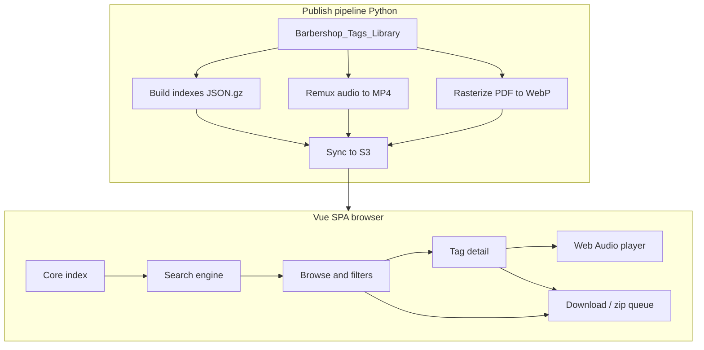

# SingTags.com — Phased Development Plan

> **Project root:** `~/dev/krys/barbershop-website` (SingTags.com). Phase 0 scaffold + 100-tag `sample-data/` with AAC MP4s are in place.

Static Vue 3 + TypeScript SPA hosted on S3 (CloudFront optional). No backend. Catalog and media are published as static objects; search runs entirely in-browser.

Reference implementation for player/pitch patterns: [`~/dev/krys/music-website`](/home/kpetrie/dev/krys/music-website) (Web Audio pitch synth, solo-left channel extract, zip download).

---

## Constraints and size budget

| Asset | Approx size (current library ~7.1k tags) | Load strategy |
| --- | --- | --- |
| Core catalog index (gzip) | ~240 KB | Immediate on first paint |
| Lyrics corpus (gzip) | ~164 KB | On “Full text” toggle; optional background prefetch |
| Facet lists (arrangers, keys, …) | tens of KB | Derived from core or tiny sidecar |
| App shell (Vue/router/pinia) | aim &lt; 200 KB gzip | Eager |
| pdf.js / rubberband | multi‑MB | **Never** on startup — not used for primary paths |
| SoundTouch worklet | ~73 KB | Dynamic `import()` on first pitch/speed change |
| wasm-media-encoders | ~66–158 KB gz | Dynamic `import()` on first MP3/OGG download |

Hosting default: **one S3 bucket** with prefixes `site/`, `indexes/`, `media/{tagId}/`, `sheets/{tagId}/`, fronted by **CloudFront** (see Decisions). App code stays origin-agnostic: base URLs via env/`import.meta.env`.

---

## Architecture

**App stack (fixed choices):**
- Vite + Vue 3 + TypeScript (strict) + Vue Router + Pinia
- UI: lightweight custom CSS variables (no Tailwind CDN bloat; optional UnoCSS if kept tiny)
- Zip: [`fflate`](https://github.com/101arrowz/fflate) (~8 KB)
- Search: custom typed inverted-index + query DSL (avoid MiniSearch if it cannot do exclusion/OR cleanly; MiniSearch only if it stays under ~20 KB gzip *and* meets DSL needs after a spike)
- Pitch/time: Web Audio graph + lazy **`@soundtouchjs/audio-worklet`** (~73 KB processor; pure JS SoundTouch, not a multi‑MB WASM heap) — loaded when user first changes pitch or speed independently
- Encode downloads: `wasm-media-encoders` (LAME MP3 / Vorbis) loaded only on first “Download as MP3/OGG”
- Sheet display: **pre-rasterized WebP** at publish time (not pdf.js on every view)

---

## Data model (TypeScript)

Strict types in `packages/site/src/types/`:

- `TagSummary` — core index row: `id`, `title`, `altTitle`, `arranger`, `key`, `writKey`, `rating`, `ratingCount`, `downloads`, `type`, `collection`, `classic`, `year`, `parts`, `hasSheet`, `audioParts: PartId[]`, `sheetPages: number`
- `TagDetail` — lazy JSON **per tag** (`tags/{id}/metadata.json` or equivalent); no sharding (see Decisions)
- `SearchQuery` — stacked clauses: full-text include/exclude, field filters with `and`/`or`, exact phrases
- `ZipQueueItem` — `{ tagId, parts: PartId[], format, transform?: AudioTransform }`
- `AudioTransform` — `{ pitchSemitones: number, speed: number }` (defaults `0` / `1` = as hosted)

Publish script reads current [`metadata.json`](lib/api.py) / accepted lyrics; never scrapes origin.

---

## Search design

**Default:** title (+ alt title) substring / token search against core index — no lyrics load.

**Full text checkbox:** fetch `indexes/lyrics.json.gz`, build inverted index in a Web Worker (search stays off main thread).

**Normalization (default for all token search):** strip apostrophes and other punctuation before indexing and querying. Apply the same fold to titles, arrangers, lyrics, free-text queries, **and sort keys** so `ev'rything`, `everything`, and `every thing` token paths stay aligned where possible, and `(Don't…)` sorts with *D* rather than punctuation.

- Fold: remove `'` `’` `` ` `` and general punctuation (commas, periods, `!?}{()`, etc.); collapse whitespace; lowercase.
- Tokens become alphanumeric runs only: `ev'rything` → `everything`, `darlin'` → `darlin`, `o'er` → `oer`, `don't` → `dont`.
- **Exact phrase mode** (`"..."`) uses the same punctuation-insensitive fold on both sides so `"merry little christmas"` still hits `Merry little Christmas!`, but does **not** invent word boundaries (punctuation does not become spaces unless it already separated words).
- Optional UI later: “Match punctuation” escape hatch is out of scope for v1; punctuation-insensitive is the default.

**Fuzzy lyric expansions (on top of punctuation fold):** stripping apostrophes alone is not enough for meaning variants (`'em` → `em` ≠ `them`; `goin` ≠ `going`). Keep a small bidirectional expansion map for those, regenerated at publish time from the corpus:

| Lyric form (pre-fold examples) | Expand to (also folded) |
| --- | --- |
| `'em` | them |
| `ev'ry` / `ev'rything` / … | every / everything / … (often already equal after apostrophe strip) |
| `o'er` / `ne'er` | over / never |
| `goin'` / `lovin'` / `nothin'` / `darlin'` / `mornin'` | going / loving / nothing / darling / morning |
| `gonna` / `wanna` / `gotta` / `ain't` | going to / want to / got to / aint→are not / is not (choose compact token expansions) |
| `thru` / `'til` / `mem'ry` / `heav'n` | through / until / memory / heaven |

Pipeline per token: **fold punctuation → expand aliases → expand digit ↔ number-words → match**. Query `everything` hits indexed `ev'rything`; query `them` hits `'em` via expansion; query `three` hits `3 Stooges`, and `345` / `three forty-five` / `three hundred forty five` match each other.

**Inclusion / exclusion / stacking:**
- Tokens: `love -heart` (include love, exclude heart)
- Field chips: `arranger:Joe Liles`, `key:Ab`, `type:Barbershop`, `collection:classic`, `minRating:4`, `hasAudio`, `hasSheet`
- Boolean between field groups: AND by default; OR within multi-value field pickers
- URL-synced query string so browse/search is shareable

**Browse modes:** A–Z title, arranger directory, rating sort, downloads, classic booklet order, collection, type, key — all filters against core index only.

---

## Tag detail page

1. **Sheet:** full-width stacked WebP pages, vertical scroll; pinch/wheel zoom optional later.
2. **Key:** primary metadata (large). Semitone shift control updates blown-pitch *and* track pitch together.
3. **Pay the key:** hold-to-play synthesizer (port of music-website: 40% sawtooth + 60% sine, 50ms fade-in, ~1s fade-out, ±cents). Derive note from `writ_key` / `key` (Major:Ab → Ab major tonic; document mapping).
4. **Expandable “All metadata”:** disclosure for full API-mapped fields (arranger, year, videos, notes, ratings, …).
5. **Player:** part selector (Lead/Bari/Bass/Tenor/Mix), play/pause, seek, loop, solo L / solo R (ChannelSplitter → mono, same approach as [`audio_processor_web.dart`](/home/kpetrie/dev/krys/music-website/lib/utils/audio_processor_web.dart)), independent **pitch (semitones)** and **speed (timestretch)** with high-fidelity WASM processor.
6. **Downloads:** per-track and zip; format picker (MP4 as hosted / MP3 VBR V2 / OGG); checkboxes default to learning tracks only; encode via lazy `wasm-media-encoders`.
7. **Download transform (current playback):** optional “bake in” the player’s active **key** (semitone shift) and/or **speed** into the downloaded file(s):
   - Presets / modes: **Original** · **Current key** · **Current speed** · **Current key + speed**
   - Uses the same SoundTouch offline path as live playback (lazy-loaded), then encodes via wasm-media-encoders when format is MP3/OGG (hosted AAC cannot carry arbitrary pitch/tempo — transformed “MP4” downloads emit WAV instead)
   - Filename suffix when transformed, e.g. `lead_+2st_95pct.mp3`, so originals stay distinguishable in a zip
   - Tag page: controls mirror the player’s current pitch/speed; queue items can store an explicit `AudioTransform` (default original when added from browse)

---

## Global download queue

- From any search/browse result: multi-select tags → “Add to zip queue” or “Download zip now”.
- Persistent queue (IndexedDB or Pinia + `localStorage`): across searches.
- Hard limit: **100 tracks** (not 100 tags) — enforce and surface clear UI error.
- Build zip client-side with fflate; stream progress.
- Queue items default to **Original** transform; from the tag page, “Add to queue” / “Download” can copy the player’s current key/speed into `AudioTransform`.

---

## Pitch pipe page (`/pitch-pipe`)

Port [`pitch_trainer_page.dart`](/home/kpetrie/dev/krys/music-website/lib/pages/pitch_trainer_page.dart) / [`pitch_player_web.dart`](/home/kpetrie/dev/krys/music-website/lib/utils/pitch_player_web.dart): chromatic layouts (grid / wide list / vertical piano), press-and-hold, detune ±50 cents, concert A presets. Pure Web Audio — no heavy libs. Highest pitches render toward the top.

**Virtual piano (polyphonic, separate page):** see [VIRTUAL_PIANO_PLAN.md](VIRTUAL_PIANO_PLAN.md).

**Tag roulette (weighted random suggestions):** see [TAG_ROULETTE_PLAN.md](TAG_ROULETTE_PLAN.md).

**Non-recombinable learning tracks** (hosted Opus when stems/mix won’t rebuild): see [NON_RECOMBINABLE_TRACKS_PLAN.md](NON_RECOMBINABLE_TRACKS_PLAN.md).

---

## UI / brand

- Name: **SingTags.com**
- Sleek, simple, modern; restrained palette (CSS variables: background, surface, text, accent — avoid purple-gradient AI cliché)
- Enterprise patterns: typed composables, feature modules, strict ESLint + `vue-tsc`, Vitest unit tests for search DSL and expansions
- Responsive: search-first mobile; player usable on phone

---

## Publish pipeline (Python, next to existing mirror tools)

New package under e.g. `web/` + `scripts/publish_singtags.py`:

1. Emit `indexes/core.json.gz`, `indexes/lyrics.json.gz`, `indexes/expansions.json`, optional `indexes/arrangers.json.gz`
2. Emit per-tag or sharded detail JSON
3. Remux all MP3 → MP4 (AAC) for hosting size (ffmpeg CLI on server, not in browser)
4. Rasterize PDF/GIF sheets → WebP pages under `sheets/{id}/`
5. `aws s3 sync` with cache headers: indexes short/immutable hash filenames; media long-cache

---

## Implementation status (as of 2026-08-20)

| Phase | Status | Notes |
| --- | --- | --- |
| 0 Scaffold | **Done** | Vite Vue TS, routes, tokens, Vitest, `deploy_s3.sh` |
| 1 Catalog + browse | **Done** | `core.json.gz`, sort modes, selection → zip queue |
| 2 Search DSL + FTS | **Done** | Fold, expansions, exclude/phrases/fields, lazy lyrics index |
| 3 Sheets | **Done** | Publish-time WebP via `rasterize_sheets.py`; `SheetViewer` |
| 4 Media player | **Done** | Part switcher, seek/loop, solo L/R (Web Audio) |
| 5 Pitch / pipe | **Done** | Pay-the-key + pitch pipe; SoundTouch worklet for independent pitch+speed |
| 6 Downloads / zip | **Done** | Queue + fflate zip, 100-track cap, format + transform modes |
| 7 Hardening | **Done** | a11y, empty/offline states, Storybook, component + perf tests, publish runbook |
| 8 Audio fidelity + remux | **Done** | SoundTouch worklet + `wasm-media-encoders` + download bake-in |

Sample: **250** finalized tags, WebP sheets, AAC MP4s, indexes under `web/public/indexes/`.

---

## Remaining work (resume here)

### Ops / content (optional)

- [ ] Full-library publish (~7.1k) when ready for production media (`docs/PUBLISH.md`)
- [ ] Wire real ACM/CloudFront distribution id into deploy env
- [ ] Sync Cursor plan file with this status table when desired

### Locked decisions (2026-08-20)

| Topic | Decision | Rationale |
| --- | --- | --- |
| **CDN** | **CloudFront in front of the S3 bucket** | Zero Vue/app code: only deploy/infra (`OAC`, ACM cert, SPA `index.html` error/200 for client routes). Always-free tier (~1 TB egress + 10M requests/mo) covers hobby/early traffic; S3→CloudFront transfer is free; HTTPS + custom domain need CloudFront anyway (S3 website endpoints do not). Cost is storage + tiny Route 53 if used — not a second product surface. |
| **Pitch/time lib** | **`@soundtouchjs/audio-worklet`** | Same independent pitch + tempo features as Rubber Band for our UI. Footprint: SoundTouch processor **~73 KB**; `rubberband-web` processor **~613 KB** (+ ~1.6 MB package / WASM-class heap). Choose SoundTouch for smallest download and runtime memory; keep `playbackRate` fallback if worklet fails to load. |
| **Detail JSON** | **Per-tag files, no shards** | Sample details average ~800 B; ~7.1k tags ≈ **~5.5 MB raw if ever bundled**, but we only fetch one tag on navigation. HTTP/2 + CloudFront cache make many small GETs fine. Sharding adds publish complexity, cache invalidation pain, and larger downloads when opening one tag — skip until a measured problem appears. |

---

## Phased delivery

### Phase 0 — Scaffold and design system (week 1)
- Vite Vue TS app under `web/`
- Routes: `/`, `/tag/:id`, `/pitch-pipe`, `/queue`
- Design tokens, layout shell, empty states
- S3 deploy script (empty indexes OK)
- CI: typecheck + unit test stub

### Phase 1 — Catalog publish + browse (week 1–2)
- Publish `core.json.gz` from library
- Load core without blocking UI (show spinner only on search pane)
- Browse: title A–Z, arranger, rating, downloads, type, collection
- Tag list cards → detail stub (metadata only, no player yet)
- Detail JSON fetch for one tag

### Phase 2 — Search DSL + full text (week 2–3)
- Query parser: phrases, `-exclude`, field filters, AND/OR
- Title search default; Full text checkbox → worker + lyrics index
- Punctuation/apostrophe folding on index + query (default); shared `normalizeToken()` used everywhere
- Expansion dictionary from corpus scan (publish-time regenerate) for meaning variants that survive fold (`'em`→them, `goin`→going, …)
- URL sync; “instant” feel via memoized filter pipeline

### Phase 3 — Sheets (week 3)
- Publish-time PDF/image → WebP
- Detail page sheet viewer (width-scaled, scroll)
- Fallback message if no sheet

### Phase 4 — Core media player (week 3–4)
- Play hosted MP4 parts; part switcher; seek/loop
- Solo left / solo right (Web Audio, music-website pattern)
- Wire remux pipeline for library audio → S3 MP4

### Phase 5 — Pitch, timestretch, pay-the-key, pitch pipe (week 4–5)
- Lazy-load pitch/timestretch WASM
- Semitone pitch + independent speed; link key-shift UI to both synth and playback
- Pay-the-key button on tag page
- Dedicated pitch-pipe page

### Phase 6 — Downloads and zip queue (week 5–6)
- Lazy `wasm-media-encoders`: MP4 → MP3 VBR V2 / OGG
- Per-tag zip with checkboxes (tracks default on)
- Multi-select from search + global “add to zip” queue; **100-track cap**
- fflate packaging + progress UI

### Phase 7 — Hardening (week 6+)
- Perf: Lighthouse, index prefetch strategy, worker memory caps
- A11y keyboard for player and pitch pipe
- Error/offline handling; empty lyrics still searchable by title
- Docs: local publish + deploy runbook

---

## Out of scope for v1

- User accounts, ratings POST to barbershoptags API
- Server-side search or SSR
- In-browser PDF parsing as primary path
- Loading heavy codec WASM / pdf.js on first page load

---

## Success criteria

- First meaningful search (title) interactive in well under 2s on broadband after HTML load
- Core index ≤ ~500 KB gzip; lyrics ≤ ~500 KB gzip at current scale
- Full-text and remux never block title search
- Pitch pipe and pay-the-key match music-website sonic approach
- Zip queue enforces 100-track limit with clear UX
