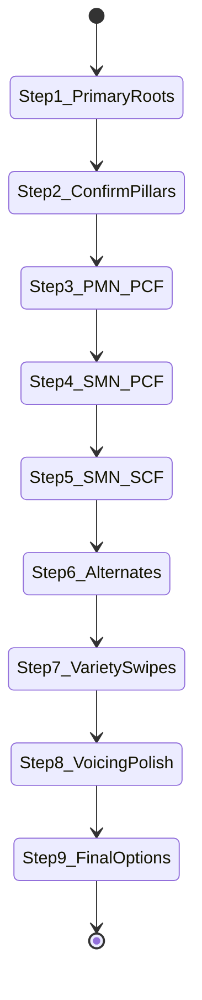

# Approach Two — the 9-step arranging wizard

Source: BAM pp. 141–205 (PDF ≈ 154–218). **Primary method** for building a chart.  
**Goal:** Fill harmony in a disciplined order so pillars stay true and color arrives late.

Read [03](03-harmonic-rhythm.md) (pillars) and [02](02-chord-vocabulary.md) (PCF/SCF) first.

---

## Big picture

```
Melody → ear pillars → confirm →
  structural notes on PCF →
  weak notes still on PCF if possible →
  leftovers via SCF →
  circle fillers / alts →
  variety (retrogression, swipes) →
  voicing polish →
  final options / climax choices
```

Software maps this to the guided wizard; humans should still **confirm pillars by ear**.

---

## Prerequisites

- Chord spellings + Circle of Fifths ([18](18-chord-charts-by-key.md), [21](21-circle-of-fifths.md), [13](13-szabo-theory.md)).
- Accurate melody (piano roll / MIDI). Sheet chord symbols optional assist.

## Labels

| Label | Meaning |
| --- | --- |
| PMN | Primary melody note — structural / stress / pillar-aligned |
| SMN | Secondary melody note — connective / weaker metric weight |
| PCF | Primary chord family on pillar root X |
| SCF | Secondary chord family Groups 1–6 relative to X |
| PP | PMN harmonized with PCF |
| SP | SMN harmonized with PCF |

## State machine



### Step I — Isolate primary harmony (printed ~169)

- Sing/enter melody; hum simplest bass (few changes).
- Record bass notes as **candidate primary roots**.
- Prefer roots over fifths when ambiguous.
- Output: timeline of pillar roots X under measures/beats.

**Computability:** heuristic + **user confirm** (ear is canonical).

### Step II — Cross-check pillars (~175)

- Compare ear roots to piano accompaniment / chord symbols (if available).
- Flag atypical moves (e.g. descending step between basics; rising thirds chains).
- Keep ear preference when chart conflicts, mark for later SCF repair.

**Computability:** deterministic lint of root motion + user resolve conflicts.

### Step III — Harmonize PMN with PCF (~178)

- For each PMN: choose PCF chord on X containing the lead pitch.
- Complete chords; add sevenths where appropriate; double roots on triads.
- Voice within ranges; label **PP**.
- Keep alternate versions where choice is unclear.

**Computability:** mostly deterministic candidate gen + voicing tables (SingTags harmonizer).

### Step IV — Harmonize SMN with PCF (~181)

- Harmonize most SMN with PCF color chords: add9, 6, aug, 7ths, 9ths → label **SP**.
- Notes that cannot be PCF-covered (P4/A4 above X, ½-step above X, etc.) remain for Step V.

**Computability:** deterministic membership + ranking; leftovers flagged.

### Step V — Apply SCF to remaining / weak spots (~184)

- Use SCF Groups 1–6 to cover leftover SMN and weak PMN spots.
- Example patterns from manual: Group 2 dim7 for chromatic leftovers; Group 1 m7 for V-of-X; Groups 3–4 for ½-step BS7 neighbors; Group 5 tritone; Group 6 IV/♭VI.

**Computability:** deterministic generators from X; user picks among legal groups.

### Step VI — Strengthen progressions (~188)

- Revisit weak measures; prefer four-note chords and good motion into next pillar.
- Allow a chord to serve dual SCF roles relative to current and following pillars.

**Computability:** heuristic ranking + user.

### Step VII — Variety, retrogression, early swipes (~192)

- Substitute SCF for color; invert dim7 for bass interest; insert retrogression for swipe-like motion.
- Prefer returning to primary harmony on strong beats of pillar spans.

**Computability:** optional suggestions; user-driven.

### Step VIII — Voicing conflicts & substitutes (~196)

- Resolve VL vs best-voicing conflicts.
- Tempo caution: rapid counterpart flicker may be unsingable — offer sustained substitute.

**Computability:** VL cost + tempo heuristic.

### Step IX — Final options / climax / revoice (~201)

- Optional richer SCF on PMN roots (rare).
- Climactic density vs lyric understatement.
- Revoicing for different effect while preserving basic harmony.

**Computability:** creative / user; engine offers ranked alts.

---

## Short worked phrase (manual model song)

Song used for Steps I–IX: *The Pal That I Loved Stole The Gal That I Loved* (printed key **Bb**; chord symbols often in G — transpose for men’s voices).

### Opening phrase (ear pillars → RN in Bb)

Melody opens over a tonic–subdominant–tonic span; ear bass ≈ roots:

```
| Bb     | Eb     | Bb     | …
| I      | IV     | I      | …
PMN/SMN: P  P  S  P …   (root/3rd/5th of current pillar = P; else S)
```

**Step III (PP):** place PCF on those PMN — e.g. Bb, BbM7, Eb6, etc., complete chords, roots doubled on plain triads.

**Step IV (SP):** color SMN still on PCF (add9, 6, 7, 9) where membership allows.

**Step V (SCF):** leftovers / weak spots — e.g. F°7 (SCF Group 2 of F pillar), Cmin7 (Group 1 of F), neighbor BS7s (Groups 3–4), etc.

**Step VI:** insert Circle-of-Fifths fillers (II–V into next pillar), dual-role SCF (Group 6 of current = Group 4 of next).

Transposed teaching skeleton in **C**:

```
| C   | F   | C   | … → G7 → C
| I   | IV  | I   | … → V7 → I
```

### Pillar hygiene (from Step II flags)

Manual warns when sheet/piano suggests **descending-step** basics or **rising-third** chains (Bb–D–F): atypical as primary barbershop highway — keep ear pillars, repair later with SCF / circle logic.

### Common Step mistakes

- Harmonizing before isolating **primary roots** (arranging too early).
- Treating piano symbols in the wrong key without transpose.
- Leaving SMN that sit a **P4 / A4 / ½ above X** on PCF — they need SCF.
- Retrogression / SCF color that never returns to primary harmony on a **strong beat**.
- Step VIII stuffing: going “too far,” then needing to back off for lyric/tempo.

**Full start-to-finish in B♭ (not C):** [19-melody-to-arrangement.md](19-melody-to-arrangement.md).  
**When something breaks:** [20-troubleshooting.md](20-troubleshooting.md).  
**Spellings by key:** [18-chord-charts-by-key.md](18-chord-charts-by-key.md).

## Product mapping (app flow — optional)

| User intent | Steps |
| --- | --- |
| Enter melody | before Step I |
| Select block (primary) chords | I–III |
| Add passing chords (homophonic stacks) | IV–VI |
| Variations / different chord choices | VII–IX + embellishment module |

---

**Path (Part IV):** Prev [02-chord-vocabulary](02-chord-vocabulary.md) · [Index](00-index.md) · Next [04-approach-one](04-approach-one.md)
