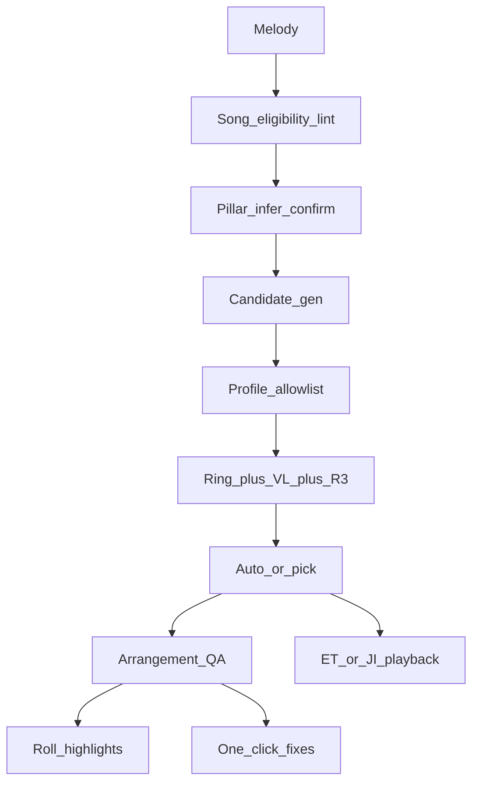

# Guidance automation — integrating the three supplements

**Audience:** Product / coach design. **Learners:** [`00-index.md`](00-index.md).

Goal: **as automated and simple as possible**, while keeping pillar confirmation human (`GO_WITH_LIMITS`).

**Canonical backlog & phases:** [`docs/implementation-plan.md`](../docs/implementation-plan.md) (comprehensive: engine, coach/QA, JI harmonicity, export, SingTags). **UX wizards / teaching workflows:** [`docs/ux-workflows.md`](../docs/ux-workflows.md). Keep this file as coach *design* rationale; update ship statuses in the plan.

## Source roles

| Source | Role in product |
| --- | --- |
| 1980 Arranging Manual | Wizard workflow (Approach Two/Three) |
| Szabo Theory (1976) | Motion/naming grammar behind the wizard |
| Rylander 11 chords | Contest allowlist + JI ratios + ring ranking |
| Prietto 2nd ed. | Practical checklist, voicing strength, SAI/BHS profiles, SSAA ranges |

## User-facing simplicity

Default path stays three buttons after melody entry:

1. **Infer pillars** (edit if wrong)
2. **Auto-harmonize** (PCF → SCF fill)
3. **Fix issues** (QA list with one-click repairs + on-roll highlights)

Advanced panels (candidate list, org profile, JI) stay collapsed.

## Automation layers

### 1. Profile (`contestProfile`) — DONE

| Profile | Allowlist |
| --- | --- |
| `sai11` / Rylander | 11 chords only |
| `bhs_extended` | 11 + half-dim + dim triad (1980) |
| `learning` | extended + soft warnings only |

### 2. Candidate ranking weights — DONE (core)

- Ring tier (Rylander LCD) — DONE  
- Approach Three motion score — DONE  
- Secondary-dominant toward next pillar — DONE  
- Strong voicing for lead’s chord tone (Prietto) — DONE (`w_SV` in `candidateRanker`)  
- VL distance from previous stack — DONE (`w_VL` via `prevMidi`)  
- Penalties: aug as pillar, dim7 sustained — DONE via ranking + QA  

### 3. Arrangement QA + Fix — DONE (MVP)

| Lint | Severity | Auto-fix? | Status |
| --- | --- | --- | --- |
| Chord outside profile | error | swap to nearest legal | DONE |
| Doubled third on triad | warn | re-voice | DONE |
| Dom9 thin / fuller ninth | info/warn | re-pick ≥4 PCs | DONE (omit-5/omit-root depth still light) |
| Lead out of range preset | warn | transpose (confirm) | DONE (`leadRangeFix`) |
| Phrase length 3/5/7 | info | — | DONE (`phraseLengthRule`) |
| Unconfirmed pillars | warn | — | DONE |
| Aug used > N / as pillar | warn | soft re-pick | DONE |
| Few BS7s | warn | secondary-dom re-pick | DONE (probe canFix) |
| VL / strong voicing / motion / pillar fidelity | warn/error | re-voice / retarget | DONE (MVP heuristics) |
| On-roll highlight + click-to-select | — | — | DONE |
| Live QA + badge | — | — | DONE |
| Orphan stack remove | error | drop | DONE |
| Key suggestion transpose | warn | confirm destructive | DONE |
| Export block on errors | — | — | DONE |

### 4. Just intonation — DONE (MVP)

- Per-voice cents + MIDI pitch bend — DONE  
- HarmonicityScorer injected into ranker — DONE  
- Dull-harmonicity lint / fix — DONE (MVP)  
- Difference-tone / common-fundamental weight — PLANNED  

### 5. Coach UX — DONE (MVP)

- Tip strip / Why? / compare-hear — DONE  
- Org tips by profile — DONE  
- Advanced collapsed by default — DONE  
- Why? weight breakdown DTO — partial (`explainRankingBreakdown`)  
- **Teachable curriculum** — DONE domain (`knowledge/16` + `domain/arranging/education/`); UI Learn panel pending  
- **Theory teaching + autocomplete / partial-chord completion** — planned in [`../docs/theory-teaching-integration-plan.md`](../docs/theory-teaching-integration-plan.md); corpus [`17-general-theory-and-acappella.md`](17-general-theory-and-acappella.md)

### Deferred (not in this file’s scope)

- Tag Studio viewport (A17), SingTags Labs merge (P3–P4), MusicXML/sheet (E3–E5)
