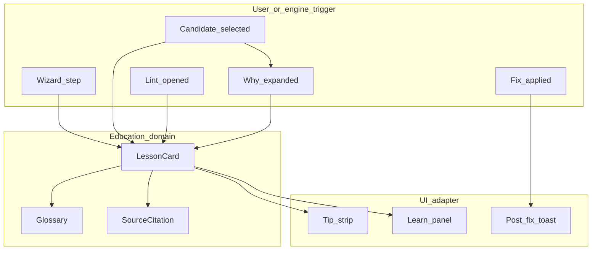

# Teachable curriculum — in-app education from source texts

**Purpose:** Turn arranging knowledge into **short, citable teaching units** the app can show when it suggests, ranks, or fixes harmony — so users learn *why*, not only *what*.

**Human learners:** For full chapters with worked examples, follow the reading path in [`00-index.md`](00-index.md). This file is the **compact** glossary/lesson index wired to UI IDs.

**Copyright posture:** We do **not** paste OCR pages into the product. Teaching copy is **original paraphrase** of our synthesized corpus, with **source citations** (manual / author + topic). Users who want deep study should buy/use the original books.

**Sources (already in corpus):**

| Id | Work | Knowledge file |
| --- | --- | --- |
| `bam1980` | *Barbershop Arranging Manual* (SPEBSQSA, 1980) | `01`–`11`, esp. `05`–`07`; walkthrough `19` |
| `rylander` | Rylander, *The 11 Chords of Barbershop* (2008) | `12`; charts `18` |
| `szabo` | Szabo, Theory (1976) | `13` |
| `prietto` | Prietto, *Arranging Barbershop Harmony* 2nd ed. | `14`; troubleshoot `20` |

**Engine binding:** each unit has `ids` the UI/domain can resolve (`glossaryId`, `lessonId`, `ruleTag`, `lintRuleId`, `wizardStep`).

---

## 0. Deep-dive map (when a one-liner isn’t enough)

Follow the **Parts I–VIII** order in [00-index.md](00-index.md). Quick lookup (by topic, not filename number):

| If you need… | Read | Part |
| --- | --- | --- |
| Style gates + tritonal energy | [01](01-style-definition.md) | I |
| Song eligibility | [10](10-song-selection-form.md) | I |
| Eleven chords + JI / construction | [12](12-eleven-chords-ji.md) | II |
| Circle of fifths (map + barbershop use) | [21](21-circle-of-fifths.md) | II |
| Chord spellings beyond C/Am | [18](18-chord-charts-by-key.md) | II |
| Romans / I7 / II7 / free chords | [13](13-szabo-theory.md) | III |
| Pillars / strong-beat HR | [03](03-harmonic-rhythm.md) | III |
| SCF Groups 1–6 | [02](02-chord-vocabulary.md) | IV |
| Full 9-step method | [05](05-approach-two-workflow.md) | IV |
| NCT → chord choice | [04](04-approach-one.md) | IV |
| R1–R5 highway + counterparts | [06](06-approach-three-rules.md) | IV |
| TTBB stacks + doubles | [07](07-voicing-voice-leading.md) | V |
| Melody → arrangement walkthrough | [19](19-melody-to-arrangement.md) | V |
| Troubleshooting | [20](20-troubleshooting.md) | V |
| Strong voicing + SAI/BHS QA | [14](14-prietto-practice.md) | V |
| Swipes | [08](08-embellishments.md) | VI |
| Tags / intros / key lifts | [11](11-intros-tags-medleys.md) | VI |
| Tension, spacing, VL teaching | [17](17-general-theory-and-acappella.md) | VII |
| Doc audit / known issues | [22](22-adversarial-doc-review.md) | meta |

---

## 1. Glossary (always-on Learn)

| glossaryId | Term | One-liner (paraphrase) | Cite |
| --- | --- | --- | --- |
| `pillar` | Pillar | A primary harmonic destination under a stretch of melody — the chord the phrase is “about,” not every decorative change. | bam1980 Approach Two; prietto harmonic pillars |
| `pmn` | PMN | Primary melody note — structural / stressed note that should sit in the pillar harmony. | bam1980 Approach Two labels |
| `smn` | SMN | Secondary melody note — connective tone; may use color chords or passing harmony. | bam1980 Approach Two |
| `pcf` | PCF | Primary chord family — chords built on the current pillar root. | bam1980 Approach Two |
| `scf` | SCF | Secondary chord family — Groups 1–6 of passing roots related to the pillar. | bam1980 Approach Two Step V |
| `bs7` | Barbershop seventh | Dominant-quality 7th tuned with a harmonic (flat) 7th — the classic lock-and-ring four-note chord. | rylander; prietto |
| `lock_ring` | Lock & ring | Overtones reinforce when intervals are just; the “buzz” contest charts chase. | rylander; prietto |
| `circle_fifths` | Circle of fifths | Descending-fifth root motion is the barbershop harmonic highway — leap from I/IV, fall by fifths on BS7s, land on pillars. | bam1980 S11 + Approach Three R1; knowledge/21 |
| `springboard` | Springboard | I and IV may leap freely; after that, normal progression rules resume. | bam1980 Approach Three axiom |
| `secondary_dom` | Secondary dominant | A BS7 a fifth above a target that drives into that target (often the next pillar). | prietto; bam1980 R1 |
| `counterpart` | Tritone counterpart | Two BS7s a tritone apart share 3↔7 and can swap under the right melody tones. | bam1980 Approach Three R3 |
| `strong_voicing` | Strong voicing | Which chord tone the lead sings — 3rd/7th on dominants often “sings” stronger than root/5th. | prietto |
| `ttbb` | TTBB stack | Tenor above lead; bari often above lead when melody is low; bass lowest. | bam1980 voicing |
| `ji` | Just intonation | Exact frequency ratios vs equal temperament; used for coaching ears and MIDI bends. | rylander |
| `homophony` | Homophony | All parts change together under the lead — default barbershop texture before embellishment. | bam1980; prietto |
| `tension_release` | Tension & release | Unstable tones (especially in a BS7) move by step into a resting chord — the story of V7→I. | chorale common practice; knowledge/17 |
| `harmonic_series_spacing` | Series spacing | Nature’s chord: wider gaps at the bottom, tighter voicing on top for easier lock. | knowledge/17; bam1980 voicing |
| `common_tone` | Common tone | A pitch shared by two consecutive chords — often held in the same voice. | knowledge/17 |
| `contrary_motion` | Contrary motion | Outer parts move opposite directions — fuller chord successions, fewer empty parallels. | knowledge/17 |
| `parallel_5_8` | Parallel 5ths/8ves | The same perfect fifth or octave sliding between two parts — can thin the texture; soft-flag in contest charts. | knowledge/07; knowledge/17 |
| `omit_5` | Omit the fifth | When a chord has more tones than voices, drop the 5th first — bass on root still implies it via overtones. | knowledge/17; Dom9 practice |
| `leading_tone` | Leading tone | The 3rd of a dominant (scale degree 7) wants to rise to the tonic. | knowledge/17 |
| `active_seventh` | Active seventh | The ♭7 of a dominant wants to fall to the next chord’s 3rd. | knowledge/17 |
| `incomplete_chord` | Incomplete chord | Missing structural tones (root / 3rd / 7th on dominants) — complete or repair helpers fill them. | knowledge/17; plan theory-teaching |

See also [`17-general-theory-and-acappella.md`](17-general-theory-and-acappella.md) and [`../docs/theory-teaching-integration-plan.md`](../docs/theory-teaching-integration-plan.md).

---

## 2. Wizard-step lessons (Guided mode tips — deeper Learn)

| lessonId | wizardStep | Headline | Body (2–3 sentences, paraphrase) | Cite |
| --- | --- | --- | --- | --- |
| `L-melody` | melody | Lead first | Enter an accurate lead before inventing harmony. The arrangement exists to serve this line and its story (lyrics stay human). | bam1980 Approach Two prerequisites |
| `L-step1` | step1_roots | Find primary roots | Hum the simplest bass you can under the tune. Those notes are candidate pillars — prefer roots over fifths when unsure. Software suggests; your ear confirms. | bam1980 Step I |
| `L-step2` | step2_confirm | Confirm before filling | Cross-check odd root moves, then lock pillars. Unconfirmed pillars mean the chart is still a draft skeleton. | bam1980 Step II |
| `L-step3` | step3_pmn_pcf | PMN on PCF | Structural melody notes get chords from the pillar’s primary family. Prefer complete chords and BS7 color when the lead allows. | bam1980 Step III |
| `L-step4` | step4_smn_pcf | SMN still on PCF | Many weaker notes still work as PCF color (6, add9, 7ths). Leftovers that cannot sit on the pillar family wait for SCF. | bam1980 Step IV |
| `L-step5` | step5_smn_scf | Passing with SCF | Secondary chord families supply legal passing roots that keep the pillar story while covering connective melody. | bam1980 Step V |
| `L-step6` | step6_alts | Strengthen the highway | Revisit weak bars; prefer stronger approaches into the next pillar (often secondary-dominant BS7). | bam1980 Step VI |
| `L-step7` | step7_variety | Ornament last | Swipes and tags decorate a solid block+passing path — they are not a substitute for pillars. | bam1980 Step VII; structure vs ornament |
| `L-step8` | step8_voicing | Stack and lead | Polish TTBB order, doubles, and muddy clusters. Bari above lead is normal; tenor below lead is not. | bam1980 voicing |
| `L-step9` | step9_final | Taste and law | Clear hard errors, hear JI lock, export — then human taste, lyrics, and copyright remain yours. | bam1980 Step IX; feasibility gates |

---

## 3. Approach Three rule tags (candidate Why?)

| ruleTag | lessonId | Why we favored this | Cite |
| --- | --- | --- | --- |
| `R1_p5` | `L-R1` | Roots a fifth apart — especially down a fifth — are the strongest barbershop progression, including secondary dominants into pillars. | bam1980 R1 |
| `R1_retro` | `L-R1r` | Up-a-fifth “backup” on the circle can harmonize awkward tones, then resume forward motion. | bam1980 R1 retrogression |
| `R2_chromatic` | `L-R2` | Chromatic BS7→BS7 connects melody by half step while staying on ringing sevenths. | bam1980 R2 |
| `R3_tritone` | `L-R3` | Tritone counterparts share 3rd/7th; use carefully at fast tempos. | bam1980 R3 |
| `R4_dim7` | `L-R4` | Dim7 is transitional — anticipate, hold, or push — not a long pillar sonority. | bam1980 R4 |
| `R5_m3up` | `L-R5` | BS7 may move to a root a major third above (classic ♭VI7→I flavor). | bam1980 R5 |
| `springboard` | `L-spring` | From I or IV the harmony may leap; afterward normal rules apply. | bam1980 axiom |

---

## 4. Lint / fix teachable moments

| lintRuleId | lessonId | Why the app flagged this | What Fix teaches when applied | Cite |
| --- | --- | --- | --- | --- |
| `illegal-nature` | `L-vocab` | Outside the selected contest vocabulary (e.g. SAI-11). | Swap to nearest legal ringing chord. | rylander; prietto |
| `unconfirmed-pillars` | `L-step2` | Ear gate still open — software must not pretend pillars are final. | (Human) Confirm | feasibility |
| `orphan-stack` | `L-homophony` | Harmony with no lead under it breaks the “lead first” model. | Remove orphan | bam1980 |
| `voice-leading` | `L-ttbb` | Stack violates TTBB expectations (e.g. tenor under lead) or muddy intervals. | Re-voice | bam1980 voicing |
| `incomplete-triad` | `L-complete` | Triads should present clear chord tones; missing 3rd weakens identity. | Re-voice fuller | bam1980; prietto |
| `thin-ninth` | `L-dom9` | Dom9 has five pitch classes — omit 5 or root deliberately. | Prefer ≥4 PCs | prietto Dom9 |
| `doubled-third` | `L-doubles` | Doubling the third often weakens triad lock; prefer double root. | Re-voice | rylander maj triad; Approach Two |
| `aug-pillar` | `L-aug` | Augmented is last-resort / melody-forced — poor pillar. | Replace nature | rylander #11 |
| `few-sevenths` | `L-secdom` | Long spans without BS7 miss classic tension→release. | Insert secondary-dom flavor | prietto; bam1980 |
| `lead-range` / `key-suggestion` | `L-range` | Lead outside singable average — fix key early. | Transpose (confirm) | prietto ranges |
| `dull-harmonicity` | `L-ji` | Alternate voicing/nature may lock better in just ratios. | Prefer higher harmonicity | rylander |
| `strong-voicing` | `L-strong` | Lead on root/5 of a dominant often sings weaker than 3/7. | (Info) try stronger lead tone | prietto |
| `swipe-opportunity` | `L-step7` | Long hold may invite a swipe — optional ornament. | (Info) | bam1980 embellishments |
| `copyright-reminder` | `L-law` | Clearance is human/legal — software only reminds. | (Info) | feasibility |
| `phrase-length` | `L-form` | Contest ballads often breathe in 3/5/7-ish phrase groups. | (Info) | bam1980 form |

---

## 5. Ranking-factor explainers (Why? bars)

| factorId | Plain “why this scored” | Cite |
| --- | --- | --- |
| `motion` | Approach Three motion toward the pillar / springboard. | `06` |
| `primaryLayer` | PCF on the pillar keeps the structural story clear. | `05` |
| `seventh` | BS7 is the most characteristic ringing four-note chord. | `12` |
| `closedVoicing` | Closed spacing usually blends more easily. | `07` |
| `ring` | Nature’s ring tier (Rylander LCD idea). | `12` |
| `secondaryDominant` | BS7 a fifth above the next pillar drives home. | `06` R1; `14` |
| `augDimPrimaryPenalty` | Aug/dim7 as primary/long color fights lock. | `12` |
| `harmonicity` | Partial coincidence under just ratios. | `12` J-model |
| `voiceLead` | Smaller part motion between stacks sings cleaner. | `07` |
| `strongVoice` | Stronger lead chord-tone roles (Prietto). | `14` |
| `tensionRelease` | Prefers tension (BS7) approaching a pillar and release on structural arrivals. | `17` |
| `resolution` | Active tones (3/♭7 of a dominant) resolve by step into the next chord. | `17` |
| `spacing` | Harmonic-series-like spacing (wide bottom, tight top). | `17` |
| `contrary` | Bass vs upper unit in contrary motion. | `17` |
| `commonTone` | Shared chord tones held in the same voice. | `17` |
| `parallelPenalty` | Soft penalty for parallel P5/P8 or all-parts same-direction leaps. | `07`; `17` |

---

## 6. Product surfaces (where education appears)

**UX rules (with [`docs/ux-workflows.md`](../docs/ux-workflows.md)):**

1. Always show a **one-sentence tip**; deeper lesson is one tap (“Learn”).  
2. Why? uses **live ranking factors** + lesson blurbs — never marketing-only.  
3. Citations are **short** (“1980 Arranging Manual — Approach Three Rule 1”) — not page dumps.  
4. Learn-without-edit is a first-class path (UC-T / UW-09).

---

## 7. Rescan notes (educational pass over OCR)

Focused re-scan of `work/ocr/` for pedagogy (Circle of Fifths, pillars, vocabulary) **confirmed** the synthesized files `05`–`07`, `12`, `14` already capture the teachable claims. Additional OCR mining should:

- Prefer **concept extraction** into this file’s tables  
- Avoid shipping raw OCR (noise + copyright)  
- Flag contradictions (e.g. SAI “primary chord” vs theory I/IV/V) for careful UI wording — see Prietto note in `14`

**Future rescan targets (optional):** embellishment device names (`08`), song-form eligibility phrases (`10`), Szabo “free chord” language (`13`).

---

## 8. Implementation checklist

| Item | Layer | Status |
| --- | --- | --- |
| Curriculum tables (this file) | knowledge | DONE |
| Domain `education/` DTOs + lookups | domain | see `web/src/domain/arranging/education/` |
| `explainCandidate` enriched with lessons | domain | wired |
| Lint Learn blurbs by `ruleId` | domain | wired |
| Post-fix teaching toast DTO | application/UI | UI later |
| Glossary panel in Guided/Review | UI | design in ux-workflows C4.5 |
| Pedagogical notation miniatures (SVG) | domain `education/notation/` | DONE (9 examples) |
| Full staff engraver / OMR of manuals | — | out of scope (copyright + complexity) |
| Full-text search of manuals in-app | — | out of scope (copyright) |

---

## 9. Reconstructing notation visuals

Manual OCR **does not** recover engraved examples (notation becomes noise). We **do not** facsimile copyrighted figures.

Instead we ship **original pedagogical miniatures**: short TTBB chord sequences that illustrate the same *concepts* (circle of fifths, secondary dominant, TTBB order, doubles, PCF→SCF, Dom9 omit, springboard).

**Staffing:** upper = **tenor staff** (ABC `clef=treble-8`) for Tenor + Lead; lower = **bass clef** for Bari + Bass.

| Layer | Role |
| --- | --- |
| `NotationExample` | Abstract chords (label + TTBB MIDI + highlights) |
| `notationExampleToAbc` | Domain → ABC string (no DOM) |
| `NotationRenderer` + **abcjs** adapter | Real engraving (do not hand-roll SVG staves) |
| Lesson / lint binding | `teach*` attaches `notation[].abc` (+ optional `.svg`) |

**Do not** maintain a custom music-notation engraver. Pedagogy uses **abcjs**; full charts use **MusicXML + Verovio** (see [`docs/notation-library-strategy.md`](../docs/notation-library-strategy.md)).

**UI contract:** render `TeachableMoment.notationSvgs[].svg` with `v-html` (trusted domain string) or ``. Caption + concept cite below.

**Hear:** optional — play `chords[].midi` via `AudioPreview` using the same stacks (future UI).

**Later:** swap SVG adapter for VexFlow/ABC without changing `NotationExample` data.
