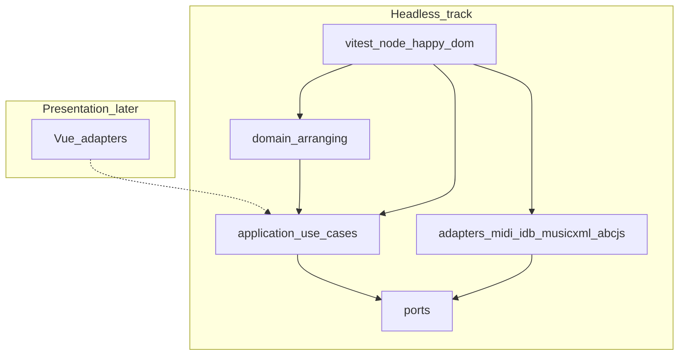
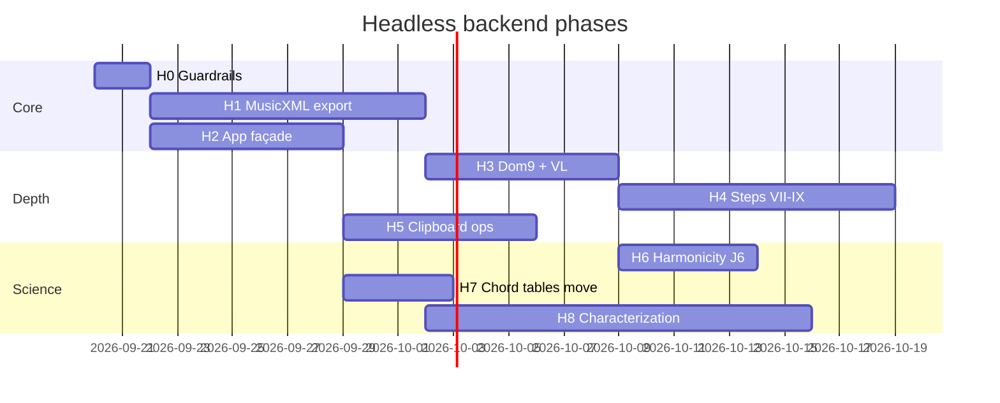

# Headless backend implementation plan

**Status:** Active plan for ports/adapters / domain / application work **without Vue**  
**Audience:** Engine maintainers  
**Companion docs:** [`implementation-plan.md`](implementation-plan.md) (master backlog) · [`notation-library-strategy.md`](notation-library-strategy.md) · [`tag-studio-alignment.md`](tag-studio-alignment.md) (SingTags Tag Studio bridge + port suggestions) · [`ux-workflows.md`](ux-workflows.md) · [`workflow-guides.md`](workflow-guides.md)

**North star unchanged:** hexagonal layering — domain pure; application orchestrates; ports abstract I/O; adapters implement; UI remains fungible.

---

## 0. Why this plan exists

The coach **engine** (harmonize, QA, fixes, JI, education DTOs, MIDI) is largely shipped and unit-tested. Product UI is the next *user-visible* milestone, but strong separation means we can still deepen:

1. Interchange (MusicXML)  
2. Approach Two Steps VII–IX domain passes  
3. Fix/lint depth (Dom9 omit, denser VL)  
4. Document ops (selection sets, clipboard)  
5. Application façade thinning (ARCH5)  
6. Harmonicity / packaging / characterization tests  

This document is the **ordered, acceptance-tested backlog** for that headless track. It does **not** replace Quick Arrange UI work — it runs **in parallel** or **ahead** of presentation.

---

## 1. Principles (non-negotiable)

| # | Rule |
| --- | --- |
| 1 | No Vue/Pinia/DOM in `domain/` or `application/` (except DTO shapes UI will render) |
| 2 | New I/O behind **ports**; Vitest fakes for every port |
| 3 | Features “done” when **headless tests** pass, not when a button exists |
| 4 | No god modules — prefer new files under budget (`architecture/godFiles.test.ts`) |
| 5 | Teaching: new lints/fixes get curriculum ids in `knowledge/16` + `education/` |
| 6 | Engravers (abcjs/Verovio) are adapters; **ArrangementProject** stays canonical |



---

## 2. Current baseline (what we already have)

| Layer | In place |
| --- | --- |
| Domain | Types, pillars, generator/ranker, JI + harmonicity, QA + FixStrategies, syncStacks, strengthen, embellishment seeds, education + ABC miniatures |
| Application | Infer, AutoHarmonize, RunQa, ApplyFix, ExportMidi, Strengthen, LabelRoles, ExplainCoach |
| Ports | Id, Clock, Repository, AudioPreview, MidiExporter, NotationRenderer, RankingWeights |
| Adapters | IndexedDB/localStorage, Web Audio, SMF MIDI, abcjs |
| Tests | ~86 headless tests; coverage gates on domain/application/adapters |

**Gaps this plan closes:** MusicXML export, VII–IX depth, Dom9/VL, clipboard ops, thinner app layer, J6, chord-table ownership, richer golden tests.

---

## 3. Workstreams overview

| WS | Name | Goal | Est. size |
| --- | --- | --- | --- |
| **H0** | Guardrails & packaging | Keep architecture green; optional extract prep | S |
| **H1** | MusicXML export | `MusicXmlExporter` + TTBB golden tests | L |
| **H2** | Application façade | Use-cases for all document mutations | M |
| **H3** | Dom9 + denser VL | C2.3 / C3.6–C3.9 depth | M |
| **H4** | Steps VII–IX domain | Embellish / polish / final checklist | M–L |
| **H5** | Selection & clipboard | A15 remainder (document ops) | M |
| **H6** | Harmonicity J6 + scorer presets | Ranker science | S–M |
| **H7** | Chord tables → domain | Kill `lib/tagRoll` domain import | M |
| **H8** | Characterization suite | Golden MIDI/MusicXML, fix matrices, fuzz | M |

**Recommended order:** H0 → **H1** → H2 → H3 → H4 → H5 → H6 → H7 → H8 (H7 can slip earlier if import pain is high; H8 continuous).

**Out of this plan (presentation):** Quick Arrange shell, Verovio Score view chrome, Tag Studio, PWA polish.

---

## 4. Workstream H0 — Guardrails

### Deliverables

| ID | Item | Acceptance |
| --- | --- | --- |
| H0.1 | ARCH9 checklist in repo (`docs/pr-architecture-checklist.md` or CONTRIBUTING blurb) | Linked from master plan |
| H0.2 | Ensure `domainPurity` + `godFiles` tests fail CI on regressions | Already present — document in this plan’s Definition of Done |
| H0.3 | Coverage gate ≥90% stmts/lines on domain/application/export adapters (`npm run test:coverage`) | DONE (audio/PWA/IDB excluded from gate) |

### Exit

Architecture tests green; contributors know headless DoD. Coverage thresholds enforced in `web/vitest.config.ts`.

---

## 5. Workstream H1 — MusicXML export (highest leverage)

Aligns with [`notation-library-strategy.md`](notation-library-strategy.md) E3.

**Tag Studio:** SingTags already ships `web/src/lib/tagRoll/musicxmlExport.ts` (partwise 3.1, written-score time). Prefer porting helpers (`midiToMusicXmlPitch`, measure ticks, mono collapse) and adding a TTBB two-staff layout option rather than inventing a second dialect — see [`tag-studio-alignment.md`](tag-studio-alignment.md) A-TS1 / TS8.

### H1.0 TagRoll bridge (parallel with H1)

| ID | Item | Acceptance |
| --- | --- | --- |
| H1.0 | `domain/arranging/bridge/tagRollBridge.ts` Arrangement ↔ TagRollProject | Round-trip fixture: TTBB stacks ↔ notes; ppq/bpm/title preserved |

### Ports

```ts
// ports/MusicXmlExporter.ts
export type MusicXmlExportOptions = {
  /** Default TTBB: tenor+lead on treble-8, bari+bass on bass */
  parts?: 'ttbb'
  includeLyrics?: boolean
  includeChordSymbols?: boolean
}

export interface MusicXmlExporter {
  export(project: ArrangementProject, options?: MusicXmlExportOptions): string
}
```

```ts
// application/ExportMusicXml.ts
export type ExportMusicXmlResult =
  | { ok: true; xml: string }
  | { ok: false; errors: ArrangementLint[] }

export function exportMusicXml(
  project: ArrangementProject,
  exporter: MusicXmlExporter,
  opts?: MusicXmlExportOptions & { blockOnErrors?: boolean },
): ExportMusicXmlResult
```

### Domain helpers (pure)

| Module | Responsibility |
| --- | --- |
| `domain/arranging/musicxml/projectToScoreModel.ts` | Map project → intermediate score DTO (measures, notes per voice, directions) |
| `domain/arranging/musicxml/ttbbLayout.ts` | Clef assignment, staff mapping, chord symbol attachment points |

Keep XML string building in **adapter** (`adapters/musicxml/arrangementMusicXmlExporter.ts`) so schema quirks stay out of domain — **or** build XML in domain if kept dumb/stringly; prefer **score model in domain + XML in adapter**.

### Mapping rules

| Arrangement field | MusicXML |
| --- | --- |
| `melody[]` | Lead part notes + optional lyric elements |
| `stacks[].midi` | Four pitched notes at onset (chord / backup) |
| `stacks[].natureId` + root | Harmony / chord symbols above |
| `ppq` / ticks | Divisions + durations |
| Tenor/Lead | Staff 1, clef G ottava bassa |
| Bari/Bass | Staff 2, clef F |
| Embellishment layer | Optional separate voice or notehead type — flag in options |

### Tests (headless)

| Test | Assert |
| --- | --- |
| Empty / no stacks | Well-formed minimal score or blocked by QA |
| Demo melody + autoHarmonize | 2 staves, 4 parts, note counts match |
| Lyrics | `<lyric>` under lead |
| Chord symbols | Present for each stack onset |
| Clef | Treble-8 (or equivalent octave-shift) + bass |
| Round-trip sniff | Parse with a lightweight XML check (no Verovio required in CI) |
| Export gate | `blockOnErrors: true` mirrors MIDI |

### Exit

`npm test` covers exporter; `ExportMusicXml` use-case wired in composition **without** Vue download button (optional Node CLI later).

---

## 6. Workstream H2 — Application façade (ARCH5)

Move Pinia orchestration into use-cases so the store only holds document + selection + calls app.

### New / expanded use-cases

| Use-case | Mutations today in store | Notes |
| --- | --- | --- |
| `CreateProject` / `OpenProject` / `DeleteProject` | create, open, remove | Uses Repository + Id + Clock |
| `UpdateMelody` | add/update/delete note + `syncStackAfterMelodyEdit` | History checkpoint policy as param |
| `UpdatePillars` | infer already exists; add edit/confirm single | |
| `SetProjectMeta` | title, bpm, tonality, profile, tuningMode | Triggers QA externally |
| `ApplyCandidate` | already `applyCandidateToProject` | Ensure store only delegates |
| `PersistArrangement` | saveAll | |
| `ExportMidiDownload` | optional — keep blob download in adapter helper, not store | |

### Selection model (domain-adjacent)

```ts
// domain/arranging/selection.ts
export type ArrangementSelection = {
  melodyIds: string[]
  stackIds: string[]
  pillarIds: string[]
}
```

Pure helpers: `selectOnly`, `toggle`, `clear`, `selectionForLint(lint)`.

### Tests

Use-cases with memory repository + sequential ids; store tests **not** required in this plan.

### Exit

Store file shrinks toward façade; no ranking/lint algorithms remain in Pinia (spot-check + grep guard optional).

---

## 7. Workstream H3 — Dom9 omit + denser VL

### H3.1 Dom9 (C2.3)

| Item | Detail |
| --- | --- |
| Generator | Explicit voicing strategies: omit-5 (bass on root) vs omit-root (bass on 5) per Prietto |
| Lint | `thin-ninth` distinguishes omit choice; message cites lesson `L-dom9` |
| Fix | Prefer omit-5 candidate with ≥4 PCs; fallback omit-root |
| Tests | Fixture lead on 9th → both strategies appear; fix lands legal ninth |

### H3.2 Denser VL (C3.6 / C3.9)

| Lint / cost | Behavior |
| --- | --- |
| Parallel P5/P8 | Already info — elevate warn under contest profile option |
| Cross / false relation | Detect + optional revoice fix |
| Homophony density | Strengthen thresholds; avoid flicker at high BPM |
| Tempo simplify | If `bpm > threshold`, penalize counterpart flicker / dim7 chains in ranker |

### Curriculum

Update `knowledge/16` + education catalog for new ruleIds.

### Exit

Fix matrix tests cover Dom9 + ≥1 new VL rule with canFix⇔apply.

---

## 8. Workstream H4 — Steps VII–IX domain passes (A14)

### VII — Variety / embellishments

| Deliverable | Detail |
| --- | --- |
| Catalog | Expand `EmbellishmentSeed.kind`: swipe, echo, tag_hint, penultimate, … (from `knowledge/08`) |
| Apply API | `applyEmbellishmentSeed` already exists — harden idempotency + history |
| Use-case | `SuggestEmbellishments` / `ApplyEmbellishment` |
| Lints | Keep `swipe-opportunity` info; add “orphan embellishment” if no hold |

### VIII — Voicing polish pass

| Deliverable | Detail |
| --- | --- |
| `polishVoicings(project, deps)` | Batch: run VL + doubled-third + incomplete-triad safe fixes in stable order |
| Use-case | `PolishVoicing` wrapping fix registry subset |

### IX — Final options (data, not creativity)

| Deliverable | Detail |
| --- | --- |
| `FinalChecklist` DTO | Taste / lyrics / copyright / errors=0 / pillars confirmed — **boolean probes**, no auto-clear of human gates |
| Use-case | `assessFinalReadiness(project) → ChecklistResult` |
| Lint | Keep copyright as info |

### Exit

Headless tests: VII seed apply; VIII reduces VL errors on fixture; IX checklist flags correctly.

---

## 9. Workstream H5 — Selection & clipboard (A15 remainder)

### Domain

```ts
export type ClipboardPayload = {
  melody: MelodyEvent[]
  stacks: ChordStack[]
  /** Tick origin of cut — paste rebases */
  originTick: number
}

export function copySelection(project, selection): ClipboardPayload
export function cutSelection(project, selection): { project; clipboard }
export function pasteClipboard(project, clipboard, atTick, idGen): ArrangementProject
```

### Application

`CopySelection`, `CutSelection`, `PasteClipboard` with history snapshots.

### Port (optional)

```ts
export interface SystemClipboard {
  writeText(text: string): Promise<void>
  readText(): Promise<string>
}
```

Internal clipboard can be memory-only first; system clipboard adapter later (needs browser — still not Vue).

### Tests

Copy/cut/paste round-trip; paste collision with existing onsets; undo restores.

### Exit

A15 marked DONE for document ops (UI multi-select gestures still presentation).

---

## 10. Workstream H6 — Harmonicity J6 + presets (J6/J8)

| Item | Detail |
| --- | --- |
| Difference tones | Weight pairwise difference frequencies near chord fundamentals |
| Common fundamental | Bonus when partials share inferred bass fundamental |
| Presets | `HarmonicityScorer` configs: `default`, `bright`, `dark` roll-off |
| Ranker | Inject via existing `RankerDeps` |
| Why? | Factor id `differenceTone` / `commonFundamental` in education catalog |
| Tests | Synthetic stacks: known ringing BS7 scores above dim7 |

### Exit

J6 DONE; J8 presets selectable in ranker deps (UI toggle later).

---

## 11. Workstream H7 — Chord tables into domain

| Step | Action |
| --- | --- |
| 1 | Move `lib/tagRoll/harmonizer/chords.ts` → `domain/arranging/chords/` |
| 2 | Re-export shim from old path for SingTags parity (temporary) |
| 3 | Update imports; domainPurity already OK |
| 4 | Document sync policy with barbershop-website in `integration-singtags.md` |

### Exit

No `domain/**` import from `lib/tagRoll/**` except deprecated shim outside domain.

---

## 12. Workstream H8 — Characterization & adversarial suite

| Suite | Contents |
| --- | --- |
| Golden MIDI | Fixture project → bytes hash / structural parse |
| Golden MusicXML | After H1 — snapshot or schema assertions |
| Fix matrix | Every FixStrategy: canFix false paths + apply success |
| Ranking | Secondary-dom bias, aug penalty, VL/SV monotonicity |
| Sync | Melody move/pitch → stack invariants |
| Education | Every P0 lint ruleId maps to a lesson |
| Fuzz (light) | Random short melodies under sai11 — no throw; export gate coherent |

Raise vitest coverage thresholds for `domain/` + `application/` only (e.g. lines ≥ 85% domain).

---

## 13. Phased delivery timeline (engine-only)



Dates are indicative sequencing, not calendar commitments. **H1 and H2 can parallelize.** H8 starts as soon as H1 exists and stays continuous.

---

## 14. Port & module map (target additions)

| Concern | Domain / app | Port | Adapter |
| --- | --- | --- | --- |
| MusicXML | score model mapper | `MusicXmlExporter` | `adapters/musicxml/*` |
| Score view | — | `ScoreViewer` | Verovio (**UI phase**, not this plan’s core) |
| Pedagogy draw | ABC string | `NotationRenderer` | abcjs (**done**) |
| Clipboard | copy/cut/paste pure | optional `SystemClipboard` | memory / navigator |
| Project CRUD | use-cases | `ArrangementRepository` | IDB (**done**) |
| MIDI | — | `MidiExporter` | SMF (**done**) |

---

## 15. Definition of Done (every H-item)

- [ ] Domain/application code has **no** Vue/DOM/storage imports  
- [ ] Port + fake adapter under `src/**/*.test.ts`  
- [ ] Happy path + adversarial/edge tests  
- [ ] Curriculum/lesson ids updated if new lint/fix  
- [ ] Master [`implementation-plan.md`](implementation-plan.md) status row updated  
- [ ] God-file budgets respected (split if needed)  
- [ ] `npm test && npm run typecheck` green  

---

## 16. Tracking table (copy into issues)

| ID | Title | WS | Status |
| --- | --- | --- | --- |
| H0.1 | ARCH9 checklist doc | H0 | PLANNED |
| H1.0 | TagRoll ↔ Arrangement bridge | H1 | DONE |
| H1.1 | Score model from ArrangementProject | H1 | DONE |
| H1.2 | MusicXmlExporter adapter + options | H1 | DONE |
| H1.3 | ExportMusicXml use-case + error gate | H1 | DONE |
| H1.4 | Golden MusicXML tests | H1 | DONE partial (structural asserts) |
| H2.1 | Create/Open/Delete/Persist use-cases | H2 | DONE |
| H2.2 | UpdateMelody use-case (incl. sync) | H2 | DONE |
| H2.3 | Selection helpers | H2 | DONE |
| H2.4 | Store delegation-only refactor | H2 | PLANNED (UI) |
| H3.1 | Dom9 omit-5 / omit-root | H3 | DONE |
| H3.2 | Denser VL lints + fixes | H3 | PLANNED |
| H4.1 | Embellishment catalog expansion | H4 | DONE partial (use-cases) |
| H4.2 | PolishVoicing use-case | H4 | DONE |
| H4.3 | Final readiness checklist | H4 | DONE |
| H5.1 | Clipboard domain ops | H5 | DONE |
| H5.2 | Copy/Cut/Paste use-cases | H5 | DONE |
| H6.1 | Difference-tone / common-fundamental | H6 | DONE |
| H6.2 | Harmonicity presets | H6 | DONE |
| H7.1 | Move chords into domain | H7 | DONE |
| H8.1 | Golden MIDI/MusicXML + fix matrix expansion | H8 | PLANNED |

---

## 17. Relationship to UI track

| Headless milestone | Unblocks UI |
| --- | --- |
| H1 MusicXML | Verovio Score view (lazy) without redoing mapping |
| H2 Façade | Thinner Pinia; easier Guided/Review modes |
| H3–H4 | Richer Fix issues / Step VII–IX Guided CTAs |
| H5 | Multi-select roll gestures become thin adapters |
| H6 | Better Why? factors |
| H8 | Safer refactors during UI rewrite |

**Suggestion:** Land **H1.1–H1.4** before or while Quick Arrange shell is built; do not block UI on H4–H7.

---

## 18. First concrete sprint (suggested)

1. Add `ports/MusicXmlExporter.ts` + score model types  
2. Implement TTBB mapper + XML adapter for auto-harmonized fixture  
3. `ExportMusicXml` use-case with `blockOnErrors`  
4. Golden tests (well-formed XML, clefs, part count)  
5. Update master plan E3 status → DONE partial  

That sprint is entirely headless and advances the notation strategy’s critical path.
