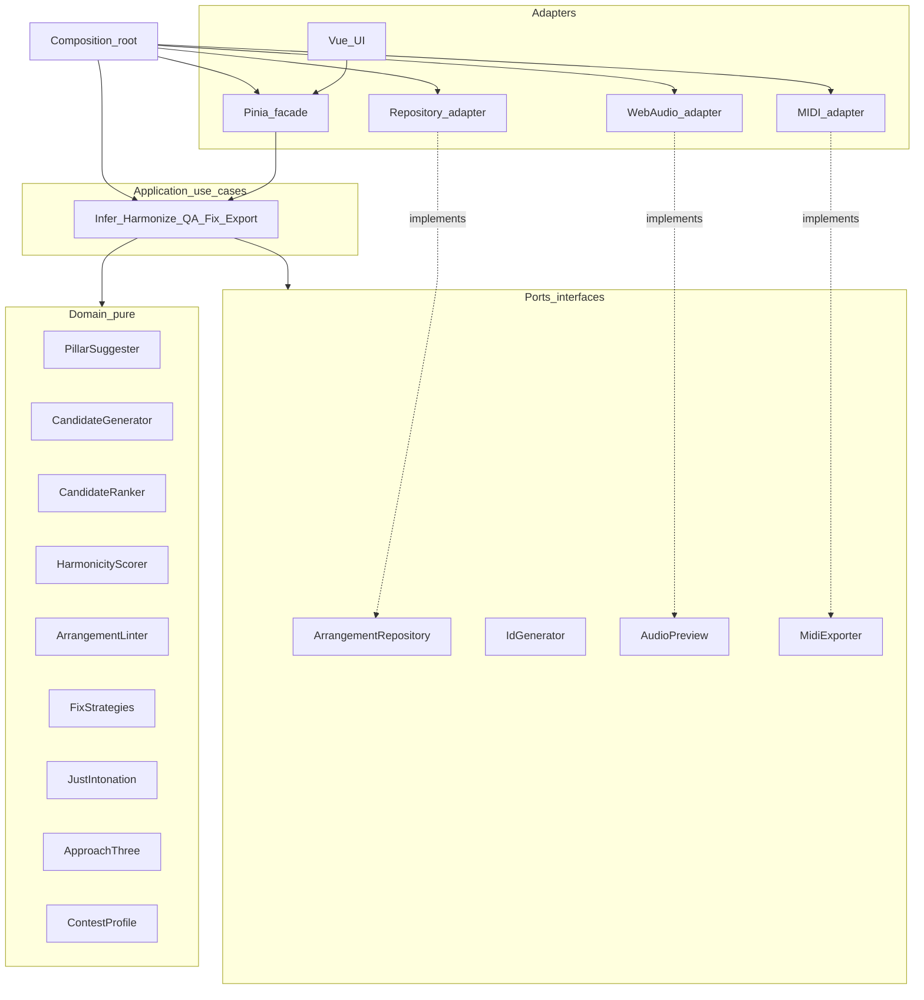

# Implementation plan — Barbershop Arranging

Living plan for the standalone arranging toolkit (UI today: Vue/TS PWA in [`web/`](../web/)), knowledge corpus in [`knowledge/`](../knowledge/), eventual merge into SingTags ([`integration-singtags.md`](integration-singtags.md)). Feasibility: [`feasibility.md`](feasibility.md) → **`GO_WITH_LIMITS`**.

**Priority order:** domain/core processing → ports & adapters → thin UI. The UI is fungible; the arranging engine is not.

**UX / wizard / teaching workflows (design lock before UI rebuild):** [`ux-workflows.md`](ux-workflows.md).  
**UI presentation layer (modes, DTOs, component inventory, test gaps):** [`ui-presentation-layer-design.md`](ui-presentation-layer-design.md).  
**UI workflow vs port-state evaluation:** [`ui-workflow-evaluation.md`](ui-workflow-evaluation.md).  
**Behavioral guides + user use-case catalog:** [`workflow-guides.md`](workflow-guides.md).  
**Headless ports/adapters engine track (no Vue):** [`headless-backend-plan.md`](headless-backend-plan.md).  
**Tag Studio / SingTags alignment:** [`tag-studio-alignment.md`](tag-studio-alignment.md) · [`integration-singtags.md`](integration-singtags.md).  
**Full score notation libraries:** [`notation-library-strategy.md`](notation-library-strategy.md).

Update statuses here when shipping. Coach automation rationale: [`knowledge/15-guidance-automation.md`](../knowledge/15-guidance-automation.md).

---

## 0. Architectural north star (non-negotiable)

We build **ports and adapters** (hexagonal / onion / clean architecture):

| Layer | Owns | Must not own |
| --- | --- | --- |
| **Domain** | Pure arranging rules, scores, lints, fixes, JI math, document types | Vue, Pinia, DOM, `localStorage`, Web Audio, MIDI devices |
| **Application** | Use-cases / workflows that orchestrate domain services | UI widgets, framework lifecycle |
| **Ports** | Interfaces the core needs (clock, id, persistence, audio render, clock) | Concrete implementations |
| **Adapters** | Vue UI, Pinia store façade, IndexedDB, Web Audio, MIDI file writers, Vitest fakes | Business rules |
| **Composition root** | Wire interfaces → implementations once (DI) | Scattered `new` / static coupling across modules |

### Principles

1. **Backend first.** Ship discrete, unit-tested domain/application features before (or independent of) UI polish. A feature is “done” when its port is covered by tests, not when a button exists.
2. **No god classes.** Prefer small services with one responsibility (e.g. `PillarSuggester`, `CandidateGenerator`, `CandidateRanker`, `HarmonicityScorer`, `ArrangementLinter`, `IllegalChordFix`). Orchestrators compose them; they do not absorb them.
3. **Depend inward.** Domain depends on nothing outward. Application depends on domain + port interfaces. Adapters implement ports. UI may call application services / store façade only — never reimplement ranking, lint, or JI.
4. **Inject, don’t hardwire.** Construction and config (contest profile, ranking weights, partial count \(N\), RNG/id factories) enter via constructors or factory options. Avoid module-level mutable singletons for scoring/lint.
5. **UI is an adapter.** Piano roll, wizard chrome, and Pinia are replaceable. Evolving the UI must not force domain refactors. Store holds document state + delegates mutations to use-cases.
6. **Test the core without Vue.** Domain and application suites run headlessly. UI tests are sparse and cover wiring only.

### Target package layout (evolve toward this)

```
web/src/
  domain/                 # pure: types, rules, scores, transforms
    arranging/
      types.ts
      pillars/
      harmonize/          # generator + ranker as separate modules
      approachThree/
      contestProfile/
      justIntonation/
      harmonicity/
      qa/
      voiceLeading/
      songEligibility/
      coachCopy/
  application/            # use-cases; depend on domain + ports
    InferPillars.ts
    AutoHarmonize.ts
    RunQa.ts
    ApplyFix.ts
    RankCandidates.ts
    ExportMidi.ts
    ...
  ports/                  # interfaces only
    IdGenerator.ts
    ArrangementRepository.ts
    Clock.ts
    AudioPreview.ts
    MidiExporter.ts
    RankingWeights.ts     # optional config port
  adapters/
    persistence/          # localStorage → IndexedDB
    audio/                # stackPlayer
    midi/
    ui/                   # Vue components, views, router
    store/                # Pinia = thin façade over application + document
  composition/            # wire DI for the app (and test doubles)
```

**Migration note:** Today logic lives under `web/src/lib/arranging/*` and the Pinia store calls it directly. Treat a **Phase 1a refactor** as first-class work: extract interfaces, split oversized modules, move use-cases out of the store, keep Vue as a consumer. Do not grow god-modules while adding features.

### Dependency rule (diagram)



### Anti-patterns (reject in review)

- Vue components calling `candidatesForMelodyNote` / lint internals directly for business decisions
- Pinia store accumulating ranking, QA, and persistence as one blob
- One `harmonize.ts` that generates, scores, filters, and mutates projects
- Importing `localStorage` / `AudioContext` from domain modules
- “Temporary” UI-only copies of contest rules or JI tables

---

## 1. Product vision

Guided barbershop arranging that is as automated and simple as possible, musically honest:

```
Melody in
  → song eligibility hints
  → primary (block) chords / pillars   [human confirms]
  → passing chords (stacked homophony)
  → Fix issues (audit / highlight / one-click repair)
  → optional variations (swipes, tags, …)
  → piano roll + sheet views
  → MIDI (+ JI pitch-bend) and MusicXML
```

**Default user path (three actions after melody):** Infer pillars → Auto-harmonize → Fix issues. Advanced controls stay collapsed.

### Non-goals (v1 honesty)

| Do not claim | Reality |
| --- | --- |
| Fully automatic contest charts | Pillars + taste stay human |
| Just intonation in MusicXML engraving | JI is playback + MIDI bend layer |
| Auto lyric/Song Assessment | HUMAN |
| Auto copyright clearance | HUMAN warn only |

---

## 2. Status legend

| Tag | Meaning |
| --- | --- |
| DONE | In repo today |
| NEXT | Immediate implementation slice |
| PLANNED | Committed for MVP / near-MVP |
| LATER | Post–coach-MVP / post-merge |
| HUMAN | Assist only; never auto-dismiss |

---

## 3. Delivery priority (process)

Work proceeds in this order whenever a feature spans layers:

1. **Domain** module + pure unit tests  
2. **Port** interface(s) if I/O needed  
3. **Application** use-case + tests with fakes  
4. **Adapter** (persistence / audio / MIDI) + adapter tests if non-trivial  
5. **UI** wiring last (store façade + view)  

UI-only polish (layout, motion, chrome) never blocks domain progress. Prefer shipping test-covered use-cases behind a minimal CLI or Vitest harness if the UI is not ready.

---

## 4. Knowledge & research (foundation)

| ID | Item | Status |
| --- | --- | --- |
| K1 | OCR 1980 Arranging Manual (462 pp.) + synthesis `knowledge/01`–`11` | DONE |
| K2 | Rylander 11 chords + JI ratios → `12` | DONE |
| K3 | Szabo Theory OCR → `13` | DONE |
| K4 | Prietto practice extract → `14` | DONE |
| K5 | Guidance automation design → `15` | DONE |
| K6 | Feasibility `GO_WITH_LIMITS` | DONE |
| K7 | Refresh corpus when contest rules / org handbooks change | LATER |

Local PDFs stay gitignored-friendly. Committed artifacts = **original synthesis** only.

---

## 5. Feature backlog by area

Statuses below describe **capability**. Implementation must still satisfy §0 (interfaces, DI, no god classes). Items marked DONE today may need **ARCH** follow-up to meet the layering bar.

### 5.ARCH Architecture & DI (do early; keep green)

| ID | Item | Status |
| --- | --- | --- |
| ARCH1 | Document layering + dependency rule (this §0) | DONE |
| ARCH2 | Introduce `ports/` interfaces: Id, Repository, Clock; composition root | DONE |
| ARCH3 | Split `harmonize` into Generator + Ranker (+ HarmonicityScorer) | DONE |
| ARCH4 | Extract use-cases from Pinia (`InferPillars`, `AutoHarmonize`, `RunQa`, …) | DONE |
| ARCH5 | Pinia becomes document + selection façade only | DONE partial (still orchestrates mutate/persist/export) |
| ARCH6 | Ban domain imports of Vue/DOM/storage/audio (lint or path convention) | DONE (architecture domainPurity test) |
| ARCH7 | Folder move: domain lives at `domain/arranging`; `lib/arranging` re-exports | DONE |
| ARCH8 | Vitest suites by layer (domain / application / adapters) | DONE (expanded adversarial + layer tests) |
| ARCH9 | No new god modules: review checklist in PR template / change control | PLANNED |

### 5.A Core arranging engine (domain + use-cases)

| ID | Item | Status |
| --- | --- | --- |
| A1 | Vue shell (adapter only) | DONE |
| A2 | Chord tables / voicings / `placeVoicing` (domain) | DONE |
| A3 | Arrangement document + wizard step ids (domain types) | DONE |
| A4 | Approach Three classify + score (domain) | DONE |
| A5–A7 | Melody ops, pillars, PCF/SCF candidates / auto-fill | DONE |
| A8 | Contest profiles | DONE |
| A9 | Ring-tier ranking + secondary-dominant bias + VL/SV weights | DONE |
| A10 | Stack player (audio **adapter**; domain supplies cents) | DONE |
| A11 | Melody drag / move / resize | DONE |
| A12 | Playhead + transport | DONE |
| A13 | PMN/SMN heuristics + override | DONE |
| A14 | Steps VI–IX domain passes | DONE partial (VI + VII seeds/use-cases + VIII polish + IX checklist) |
| A15 | Multi-select / clipboard / undo-redo (app + document history port) | DONE partial (undo/redo + clipboard domain/app; UI multi-select deferred) |
| A16 | Lyrics on syllables | DONE |
| A17 | Tag Studio viewport port (UI adapter) | LATER |
| A18 | Project repository → IndexedDB adapter | DONE |

### 5.B Just intonation, harmonics, playback

| ID | Item | Status |
| --- | --- | --- |
| J1 | Rylander ratio → cents; per-voice JI | DONE |
| J2 | Tuning mode on project | DONE |
| J3 | **HarmonicityScorer** (pure domain; JI fundamentals → partials) | DONE |
| J4 | Inject scorer into **CandidateRanker** (after style filters) | DONE |
| J5 | QA lint using harmonicity vs alternatives | DONE (dull-harmonicity) |
| J6 | Difference-tone / common-fundamental weight | DONE |
| J7 | Why-this-rings explanation DTO (UI only renders) | DONE partial (explainRankingBreakdown) |
| J8 | Spectral roll-off presets as scorer config | DONE (default/bright/dark presets) |
| J9 | Vowel/formant coaching | LATER |

**J3 model:** just path uses exact Rylander ratios (octave-matched to MIDI); partials \(n f\); cross-voice coincidence − roughness. Scorer injectable into ranker.

### 5.C Coach: audit, highlight, auto-fix, guided help

Every **error** has: detect (domain), optional fix strategy (domain), presentation DTO (application), highlight targets (UI adapter maps DTO → roll).

#### C0 contracts

| ID | Item | Status |
| --- | --- | --- |
| C0.1 | Primary chrome: Infer → Auto-harmonize → Fix issues | DONE |
| C0.2 | Advanced collapsed by default | DONE |
| C0.3 | Lint DTO: id, ruleId, severity, message, targets, optional fix | DONE |

#### C1 Highlighting & live QA

| ID | Item | Layer | Status |
| --- | --- | --- | --- |
| C1.1 | Run QA | domain `ArrangementLinter` | DONE |
| C1.2 | Map lint → roll highlight | UI adapter | DONE |
| C1.3 | Click lint → select target | UI + store | DONE |
| C1.4 | Live QA after mutations | store refreshes via `RunQa` | DONE |
| C1.5 | Badge counts from lint DTO | UI | DONE |
| C1.6–C1.7 | Unconfirmed pillars; block export on errors | domain + export use-case | DONE |

#### C2 Auto-fix (`FixStrategy` interface per issue)

| ID | Item | Status |
| --- | --- | --- |
| C2.1 | Outside profile → nearest legal candidate | DONE |
| C2.2 | Incomplete triad / thin ninth re-voice | DONE |
| C2.3 | Dom9 omit / fuller ninth voicing | DONE (omit-5 preferred, then omit-root; voicing table ordered) |
| C2.4 | Lead out of range → key transpose (confirm) | DONE (leadRangeFix + keySuggestionFix) |
| C2.5 | Orphan stack remove | DONE |
| C2.6 | Illegal VL re-place | DONE |
| C2.7 | Fix all safe (batch) | DONE |
| C2.8 | Few BS7s → secondary-dom insert | DONE |

Each fix: `canFix(lint, project) → boolean`, `apply(lint, project, deps) → ProjectPatch`. Registry injected into `ApplyFix` use-case. No switch-of-doom god class — register strategies.

#### C3 Expanded lints / C4 help / C5 human gates

Same intent as prior plan (eligibility, VL, strong voicing, motion, tips, Why?, compare-hear, HUMAN pillars/lyrics/copyright/artistry). Implement as **composable lint rules** (`LintRule` interface) and **copy providers**, not one mega-`qaLint.ts`.

| Area | Status |
| --- | --- |
| C3.1 crude suite | DONE |
| C3.2 song eligibility | DONE |
| C3.3 key suggestion | DONE |
| C3.4 voice leading | DONE |
| C3.5 strong voicing | DONE |
| C3.7 harmonic motion | DONE |
| C3.8 missing pillar / orphan | DONE |
| C3.6, C3.9 denser VL/homophony | DONE partial (homophony + doubled-third) |
| C3.10 swipe opportunity | DONE (info lint) |
| C4.1 tip strip | DONE |
| C4.2 Why? | DONE |
| C4.3 compare-hear | DONE |
| C4.4 org tips | DONE |
| C4.5 glossary / teachable curriculum | DONE (domain `education/` + `knowledge/16`; UI Learn panel later) |
| C5.* | HUMAN |

### 5.D Export, views, embellishments

| ID | Item | Status |
| --- | --- | --- |
| E1–E2 | MIDI export + JI bend (**MidiExporter** port; file adapter) | DONE |
| E3–E5 | MusicXML / sheet / PNG | DONE partial — MusicXML exporter **H1** shipped ([`headless-backend-plan.md`](headless-backend-plan.md)); Verovio viewer still UI-phase ([`notation-library-strategy.md`](notation-library-strategy.md)); abcjs pedagogy-only |
| E6–E9 | Swipes, tags, embellishment catalog, medley | LATER |

### 5.E Platform & SingTags

| ID | Item | Status |
| --- | --- | --- |
| P1–P2 | Path parity docs | DONE |
| P3–P4 | Labs route + shared package of **domain** (not Vue) | LATER |
| P5–P7 | PWA / a11y / mobile | DONE partial (install prompt + sr-only; mobile polish ongoing) |

SingTags merge consumes **`domain/` + `application/` + ports`**; UI may differ.

---

## 6. Phased delivery

### Phase 0 — Knowledge & verdict — DONE

Corpus, feasibility, supplements, initial `web/` scaffold.

### Phase 1a — Architecture hardening — DONE

- ARCH2–ARCH5: ports, split harmonize, extract use-cases, thin Pinia  
- Composition root + memory repo / sequential id fakes for tests  
- Existing behavior covered by domain + application tests  

**Exit met:** Store does not contain ranking/lint algorithms; domain has zero Vue/storage imports.

### Phase 1b — Core processing MVP — DONE

- J3–J4 HarmonicityScorer + ranker injection  
- C2.1 + LintRule/FixStrategy registry  
- C1.* live QA, highlights, badge; A11–A12 drag + transport  
- E1–E2 MIDI (+ JI bend) with export blocked on errors  

**Exit met:** Melody → pillars → fill → QA/fix illegal chords → JI audition → harmonicity-aware ranking — unit-tested without mounting Vue.

### Phase 2 — Coach depth — MOSTLY DONE

Shipped: IndexedDB, undo/redo, strong-voicing, re-voice/orphan/VL/aug/few-BS7/key-transpose fixes, Why?, Fix-all-safe, compare-hear ET/JI + top-2, coach tip strip, PMN/SMN auto-label, Strengthen (Step VI), motion/key/orphan/swipe lints, SingTags toolchain parity.

Remaining thin: C2.4 lead-range as dedicated fix (covered via key-suggestion), Tag Studio viewport port (A17), denser C3.6–C3.9, P5–P7 polish.

### Phase 3 — Interchange & editor fidelity — PLANNED

E1–E2 MIDI ports/adapters; A17–A18; A14; P5–P7.

### Phase 4 — Notation & embellishment — LATER

E3–E9; P3–P4 share domain package into SingTags Labs.

---

## 7. Module & port map

| Concern | Domain / app | Port | Adapter |
| --- | --- | --- | --- |
| Types / schema | `domain/.../types`, `knowledge/schemas` | — | — |
| Pillars | `PillarSuggester` | — | UI confirm |
| Generate candidates | `CandidateGenerator` | — | — |
| Rank candidates | `CandidateRanker` | optional `RankingWeights` | — |
| Approach Three | motion scorer | — | — |
| Contest / ring | profile policy | — | profile picker UI |
| JI | ratio tables, cents | — | audition UI |
| Harmonicity | `HarmonicityScorer` | injectable strategy | Why? view |
| QA | `LintRule[]` + `ArrangementLinter` | — | roll highlight |
| Fixes | `FixStrategy[]` + `ApplyFix` | — | Fix issues panel |
| VL / eligibility | dedicated services | — | — |
| Persistence | — | `ArrangementRepository` | localStorage / IDB |
| Ids / time | — | `IdGenerator`, `Clock` | crypto/random, `Date` |
| Preview | cents + MIDI from domain | `AudioPreview` | Web Audio |
| MIDI file | project → bytes use-case | `MidiExporter` | file download |
| UI state | — | — | Pinia + Vue |

---

## 8. Ranking formula (domain `CandidateRanker`)

After allowlist filter:

\[
\begin{aligned}
S &= w_{R3}\,S_{\text{motion}} + w_{\text{ring}}\,S_{\text{tier}} + w_{\text{SD}}\,S_{\text{secDom}} \\
&\quad + w_{H}\,S_{\text{harmonicity(JI)}} + w_{VL}\,S_{\text{voiceLead}} + w_{SV}\,S_{\text{strongVoice}} \\
&\quad - \text{penalties}
\end{aligned}
\]

Weights injected; style legality never overridden by harmonicity alone.

---

## 9. Testing strategy (core of quality)

| Layer | What | How |
| --- | --- | --- |
| Domain | Scorers, generators, each `LintRule`, each `FixStrategy`, JI, profiles | Vitest, no Vue; pure fixtures |
| Application | Use-cases with fake ports | In-memory repo, fixed ids/clock |
| Adapters | MIDI bytes, repository round-trip | Focused tests |
| UI | Sparse: façade wiring, highlight mapping | Optional component tests |

**Gates:** `npm test && npm run typecheck && npm run build`. Domain coverage treated as the primary gate for arranging correctness.

**Characterization:** Before splitting `harmonize` / store, lock current outputs with golden tests so ARCH refactors stay honest.

---

## 10. Acceptance — desired goals

### Architecture

- [ ] Clear domain / application / ports / adapters boundaries  
- [ ] DI composition root; no god classes in arranging core  
- [ ] Core arranging features unit-tested without UI  
- [ ] UI replaceable without domain rewrite  

### Arranging / coach / sound / platform

Same product checklist as before: pillars → fill → live QA + fixes → JI + harmonicity ranking → MIDI → mergeable domain into SingTags; HUMAN gates unchanged.

---

## 11. Immediate next slice (start here)

1. Port Tag Studio viewport / richer audio (A17) when editor fidelity needs it  
2. Embellishment / swipe seed pass (E6) on long holds  
3. PWA install prompt + a11y keyboard pass (P5–P6)  
4. Raise coverage thresholds as domain tests grow  

---

## 12. Change control

When adding a rule from `knowledge/*`:

1. Add/adjust ID in §5  
2. Implement as domain rule/strategy/scorer (± application use-case)  
3. Unit tests at domain (and app if orchestration)  
4. Wire UI adapter only if needed for exposure  
5. Mark DONE here  

PRs that put business logic in Vue/Pinia, or grow a single arranging mega-file, fail review against §0.
