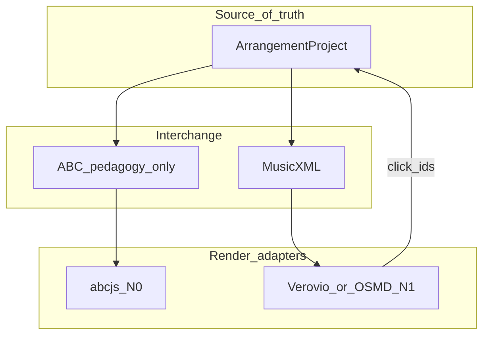

# Notation library strategy

**Status:** Decision record for view → edit roadmap  
**Source of truth:** always `ArrangementProject` (domain JSON). Engravers are **adapters**, never the document.

Related: [`implementation-plan.md`](implementation-plan.md) E3–E5 · [`headless-backend-plan.md`](headless-backend-plan.md) (H1 MusicXML) · [`ux-workflows.md`](ux-workflows.md) · pedagogy ABC in `web/src/domain/arranging/education/notation/`

---

## 1. What we need (phased)

| Phase | Capability | Must support |
| --- | --- | --- |
| **N0** (now) | Coach miniatures | Short TTBB examples, tenor staff + bass, captions |
| **N1** | Full arrangement **view** | TTBB (treble-8 + bass), chord labels, lyrics, multi-measure, highlight QA targets |
| **N2** | Selection / sync with roll | Click notation ↔ select melody note / stack |
| **N3** (much later) | Constrained **editing** | Change pitch/duration/lyric via UI → mutate domain → re-render |
| **N4** | Interchange | MusicXML import/export (MuseScore, SingTags, publishers) |

There is **no** mature open-source “MuseScore in the browser.” Editing means **we** own the edit model; the library only engraves and (ideally) reports hit-targets.

---

## 2. Library comparison (honest)

| Library | Best at | Weak at | Fit for us |
| --- | --- | --- | --- |
| **[abcjs](https://www.abcjs.net/)** | Tiny scores from ABC, playback hooks, small API | Not a MusicXML document pipeline; not a full editor | **Keep for N0 pedagogy** (already wired) |
| **[OpenSheetMusicDisplay](https://opensheetmusicdisplay.org/)** | MusicXML → SVG, TypeScript, browser viewer | Explicitly **not** a note editor; VexFlow 1.x fork internally | Strong **N1 viewer** if we standardize on MusicXML |
| **[Verovio](https://www.verovio.org/)** | Best-in-class engraving (MEI), MusicXML in, SVG out, interaction tutorials | WASM weight; MEI-centric mental model | Strong **N1–N2** viewer + click selection |
| **[VexFlow](https://github.com/vexflow/vexflow)** 4/5 | Low-level TypeScript drawing primitives | You build layout, MusicXML, and editing yourself | Only if we invent a custom engraver (avoid) |
| Commercial (Flat, etc.) | Real editors | Lock-in, cost, hexagonal mismatch | Out of scope unless product strategy changes |



---

## 3. Decision

### Primary score stack (N1+)

**Adopt MusicXML as the sheet interchange format** (already planned E3–E5), and **Verovio as the default full-score renderer**.

| Choice | Why |
| --- | --- |
| MusicXML out of domain | Industry standard; MuseScore / Finale / Dorico / SingTags path; matches backlog E3–E5 |
| Verovio to SVG | Highest engraving quality; loads MusicXML; SVG elements can be bound for **N2 selection**; used in serious digital-score apps |
| Domain unchanged | `ArrangementProject` → `MusicXmlExporter` port → Verovio adapter; never store Verovio/MEI as canonical |

**Runner-up:** OpenSheetMusicDisplay if Verovio WASM/PWA cost is unacceptable — same MusicXML pipeline, swap only the adapter.

### Pedagogy stack (N0)

**Keep abcjs** for Learn-panel miniatures (`NotationExample` → ABC → `NotationRenderer`).

- Tiny, already integrated, perfect for 1–4 chord examples  
- Do **not** grow abcjs into the full-chart viewer  
- Optional later: generate the same miniatures as MusicXML and render with Verovio for one visual language

### Editing (N3) — design constraint

```text
User gesture on SVG
  → adapter maps element id → melodyId / stackId / voice
  → application use-case mutates ArrangementProject
  → re-export MusicXML (or patch)
  → re-render Verovio
```

We will **not** treat the SVG or MEI DOM as editable source of truth. That keeps hexagonal architecture and undo/QA intact.

---

## 4. Ports to add (when N1 starts)

```ts
// ports/MusicXmlExporter.ts
export interface MusicXmlExporter {
  export(project: ArrangementProject, opts?: { parts?: 'ttbb' }): string // MusicXML
}

// ports/ScoreViewer.ts  (adapter: Verovio)
export interface ScoreViewer {
  loadMusicXml(xml: string): Promise<void>
  render(target: HTMLElement): void
  /** Map SVG/MEI id → domain targets for selection */
  hitTest?(clientX: number, clientY: number): ScoreHit | null
  destroy(): void
}

export type ScoreHit = {
  melodyId?: string
  stackId?: string
  voice?: 'tenor' | 'lead' | 'bari' | 'bass'
}
```

Composition root wires Verovio (dynamic `import()` — do not ship WASM in the critical path of Quick Arrange).

---

## 5. TTBB engraving rules (all adapters)

| Voice | Staff | Clef |
| --- | --- | --- |
| Tenor, Lead | Upper | Treble ottava bassa (`treble-8` / tenor staff) |
| Bari, Bass | Lower | Bass |

Chord symbols above upper staff; lyrics under Lead; QA highlights via SVG class/color from lint targets.

---

## 6. Implementation sequence

| Step | Work | Library |
| --- | --- | --- |
| Done | Pedagogy miniatures | abcjs |
| Next (E3) | `MusicXmlExporter` from `ArrangementProject` (TTBB + lyrics + chord labels) | domain + tests (no UI) |
| E4 | Vue **Score view** (read-only) beside / instead of roll | Verovio adapter, lazy-loaded |
| E4b | Sync selection roll ↔ score | `ScoreHit` |
| E5 | PNG/SVG export of page | Verovio render |
| Later N3 | Pitch/duration edit affordances on selected note | domain mutations + re-export |

---

## 7. What we explicitly reject

| Approach | Reason |
| --- | --- |
| Hand-rolled SVG engraver | Unmaintainable; already removed |
| VexFlow-only custom layout for full charts | Rebuilding OSMD/Verovio |
| abcjs as the arrangement document | Wrong interchange story; weak multi-page TTBB product path |
| Engraver-as-source-of-truth editor | Breaks QA, undo, pillars, SingTags merge |

---

## 8. Bundle / PWA notes

- **abcjs:** OK in Learn panel; prefer async route/component so Quick Arrange stays light  
- **Verovio:** always dynamic import + WASM; load only when user opens Score view  
- Piano roll remains the **primary editing surface** until N3 is intentional product work  

---

## 9. Summary

| Role | Library |
| --- | --- |
| Coach examples | **abcjs** (current) |
| Full sheet view + future select/edit loop | **MusicXML + Verovio** (OSMD acceptable fallback) |
| Document | **ArrangementProject** only |

This gives a real engraver for product-quality notation without pretending any single npm package is “our MuseScore.”
