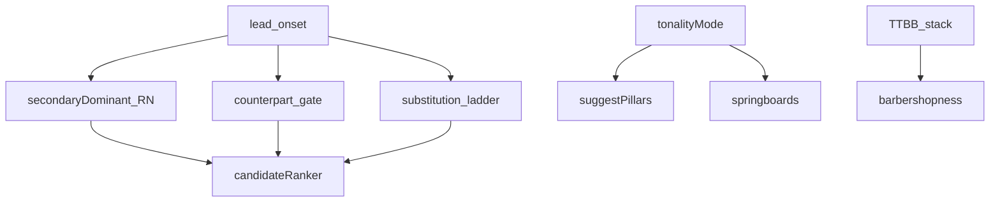

# Remediation plan — arranging depth gaps

**Status:** Done (executed this pass)  
**Companion:** [`tag-studio-alignment.md`](tag-studio-alignment.md) · [`headless-backend-plan.md`](headless-backend-plan.md) · knowledge `06`, `13`, `14`, `16`

---

## 1. Goals

Close corpus-backed gaps that tests alone cannot paper over:

| ID | Feature | Outcome |
| --- | --- | --- |
| **R1** | Secondary dominant / V/V analysis | RN labels + tightened bias/fix toward “BS7 a P5 above target” |
| **R2** | Tritone counterpart (Rule 3) | Melody 3/7 (or ♭5) gate + suggest-counterpart use-case |
| **R3** | Minor-feel arranging | `tonalityMode` + pillar infer / springboards for i/iv/V |
| **R4** | Substitution ladder | Ordered Prietto/Approach One alts as ranked branches |
| **R5** | “How barbershop is this?” | Contest suitability heuristic over 3–4 part stacks at lead onsets |
| **R6** | Characterization tests | Fixtures for II7→V→I, counterpart gate, minor pillars, barbershopness |

**Out of scope (explicit):** counterpoint, rounds, solos, pickups as separate analysis.

---

## 2. Architecture notes

All new logic stays in `domain/arranging/` (+ thin `application/` wrappers). No Vue.

---

## 3. Work packages

### R1 — Secondary dominant / V of V

| Deliverable | Detail |
| --- | --- |
| `secondaryDominant.ts` | `isDominantOf(root, target)`, `romanForSeventh(root, tonality, mode)`, detect `V7` / `V7/V` (II7) / `V7/ii` etc. |
| Ranker | Keep bias when seventh root is P5 above **next pillar**; surface factor in `explainRankingBreakdown` |
| `fewSeventhsFix` | Prefer replacement whose root is P5 above next pillar (true secondary-dom), not any seventh |
| Tests | II7→V→I fixture; RN labels; fix lands correct root |

### R2 — Tritone counterpart

| Deliverable | Detail |
| --- | --- |
| `counterpart.ts` | `counterpartRoot(pc)`, `leadAllowsCounterpartSwap(nature, root, leadMidi)`, `suggestCounterpartStack(...)` |
| Generator / education | Tag `R3_tritone` only when swap is melody-legal (or annotate candidates) |
| Use-case | `suggestCounterpart` / apply in application layer |
| Tests | Lead on 3/7 allows; lead on 1/5 rejects; root differs by 6 |

### R3 — Minor-feel

| Deliverable | Detail |
| --- | --- |
| Types | `TonalityMode = 'major' \| 'minor'` on `ArrangementProject` (default `'major'`) |
| `suggestPillars` | Minor: boost degrees 0/5/7 as **i/iv/V**; score minor triad tones (0,3,7) + BS7 (10) |
| Springboards | Minor: i and iv (deg 0, 5) still free; document vs major I/IV |
| PCF bias | When mode=minor and layer=primary, slight preference for `minor`/`m7` natures |
| Tests | A-minor-feel melody prefers A/D pillars |

### R4 — Substitution ladder

| Deliverable | Detail |
| --- | --- |
| `substitutions.ts` | Ordered strategies: (1) plug melody into pillar chord (2) BS7 a P5 above/below pillar (3) relative-minor / substitute-6th (4) SCF group roots |
| API | `listSubstitutionBranches(note, pillar, tonality, mode) → ranked alts` |
| Tests | Each strategy can fire on a fixture |

### R5 — How barbershop is this?

| Deliverable | Detail |
| --- | --- |
| `barbershopness.ts` | Per stack with ≥3 sounding parts at a lead onset: score vocabulary legality, BS7 density, lead strong-tone, TTBB order, Dom9 completeness, secondary-dom approaches, counterpart legality, ring tier |
| Aggregate | 0–100 contest suitability + factor breakdown + per-stack notes |
| Use-case | `assessBarbershopness(project)` |
| Lint hook (optional) | Info lint when score &lt; threshold under contest profile |
| Tests | Strong BS7 highway scores high; illegal/thin/broken VL scores low |

### R6 — Tests

Suites: `remediationSecondaryDom.test.ts`, `remediationCounterpart.test.ts`, `remediationMinorMode.test.ts`, `remediationSubstitutions.test.ts`, `remediationBarbershopness.test.ts`.

---

## 4. Execution order (this pass)

1. Types + mode plumbing  
2. R1 secondary-dom/RN + fewSeventhsFix  
3. R2 counterpart  
4. R3 minor pillars/springboards  
5. R4 substitution ladder  
6. R5 barbershopness  
7. Application exports + education factor wiring  
8. Tests + `npm test` / coverage green  

---

## 5. Definition of Done

- [x] Headless tests cover R1–R5 happy + edge paths  
- [x] Domain purity preserved (new modules under `domain/arranging/`)  
- [x] Persistence migrate defaults `tonalityMode: 'major'`  
- [x] Application exports: `assessHowBarbershop`, `listSubstitutionsForNote`, `suggestCounterpartForStack`, `applyCounterpart`, `romanLabelForStack`  
- [x] Full suite green (1000+ tests)  
