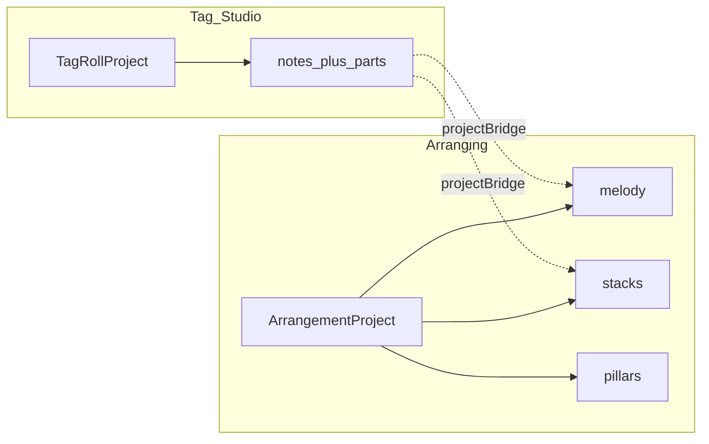
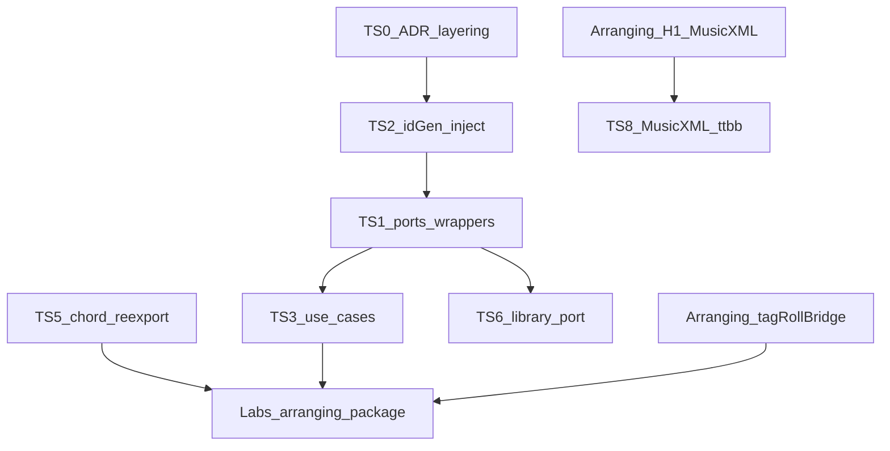

# Tag Studio alignment & ports/adapters suggestions

**Scope:** Align arranging’s headless engine with SingTags Tag Studio (`../barbershop-website`), and list **concrete Tag Studio changes** that make a clean Labs merge possible.  
**Companions:** [`integration-singtags.md`](integration-singtags.md) · [`headless-backend-plan.md`](headless-backend-plan.md) · SingTags [`plans/tag-roll.md`](../../barbershop-website/docs/plans/tag-roll.md)

---

## 1. What Tag Studio is today

Tag Studio is a Labs piano-roll editor (routes `/tag-studio`, `/tag-studio/:id`), not a hexagonal slice.

| Area | Reality |
| --- | --- |
| Document | `TagRollProject` (`singtags.tagRoll.project.v1`) — flat `notes[]` + `parts[]`; melody = `view.melodyPartId` |
| Mutate / persist | Fat Pinia `stores/tagRoll.ts` + IndexedDB `offline/tagRollDb.ts` |
| Pure helpers | `lib/tagRoll/*` (snap, history, tempo map, MIDI/MusicXML, bounce, sheet PNG) |
| Harmonizer | `lib/tagRoll/harmonizer/chords.ts` + `applyHarmony.ts` + UI panel |
| Architecture | Catalog SPA boundaries in `docs/architecture.md`; **no ports/adapters for Tag Studio** |
| God files | Store / editor view / viewport ~1k+ LOC (hardening ratchet exists) |

**Already strong (reuse, don’t reinvent):** PPQ=480, SMF Type 1 MIDI, MusicXML 3.1 partwise, fermata-aware tempo map, clipboard/selection, Labs gate pattern, god-file tests, chord/voicing contract.

**Already shipped beyond the hardening “out of scope” note:** MusicXML export lives at `web/src/lib/tagRoll/musicxmlExport.ts` (written-score time, not fermata-expanded).

---

## 2. Document model mismatch (must bridge)

| Concept | Tag Studio | Arranging |
| --- | --- | --- |
| Schema | `singtags.tagRoll.project.v1` | `arranging.arrangement.v1` |
| Melody | Notes on a part (`melodyPartId`) | First-class `melody: MelodyEvent[]` |
| Harmony | Other parts’ notes at same onset | First-class `stacks: ChordStack[]` (+ natures, layers, ruleTags) |
| Pillars / wizard | — | `pillars[]`, `wizardStep`, contest profile, JI mode |
| Expression | Fermata / rit / accel | Not yet (playback honesty deferred) |
| Parts | Arbitrary named parts + midiGroup | Fixed TTBB roles on stacks |



**Alignment rule:** Keep both schemas. Introduce a **bidirectional bridge** (domain-pure) rather than forcing Tag Studio documents into arrangement shape or vice versa.

| Direction | Behavior |
| --- | --- |
| Arrangement → TagRoll | Expand stacks → TTBB notes; melody → Lead (or `melodyPartId`); preserve ppq/bpm/title/tonality/preferFlats |
| TagRoll → Arrangement | Melody part → `melody[]`; simultaneous non-melody notes → stacks (best-effort nature/voicing unknown → `natureId: 'unknown'` or infer later); drop expressions or map to a future field |

Bridge lives in arranging `domain/arranging/bridge/tagRollBridge.ts` (or shared package later). Tag Studio should **call** the bridge, not own arrangement rules.

---

## 3. What arranging should change to align with Tag Studio

These update our headless plan / merge posture (not a Vue rebuild).

| ID | Change | Why |
| --- | --- | --- |
| **A-TS1** | **H1 MusicXML:** Port/adapt SingTags `musicxmlExport.ts` patterns (`midiToMusicXmlPitch`, mono collapse, measure math, partwise skeleton) instead of greenfield XML | Same interchange consumers; less drift |
| **A-TS2** | Add `domain/.../bridge/tagRollBridge.ts` + golden round-trip tests on a TTBB fixture | Merge without dual editors fighting schemas |
| **A-TS3** | Keep `TAG_ROLL_PPQ` / `ARRANGING_PPQ` = **480**; same default snap semantics | Shared roll math |
| **A-TS4** | Chord tables: single source of truth (H7) with SingTags re-export shim | Already required |
| **A-TS5** | MIDI: optional export modes mirroring Tag Studio (`one` / `two` / `all` part groupings) when projecting via bridge | Familiar export UX on merge |
| **A-TS6** | Do **not** copy Tag Studio canvas into arranging; keep A17 as **viewport port** consuming arrangement (or bridged TagRoll) DTOs | UI fungible |
| **A-TS7** | Defer fermata/rit/accel in arrangement until post-merge; when added, reuse Tag Studio `tempoMap` / `fermataNoteSplit` as adapters behind a `PerformanceTimeline` port | Honesty story already solved there |
| **A-TS8** | Mirror Labs prefs key pattern: `singtags.labs.arranging.enabled.v1` | Same gate UX |

Suggested headless backlog addenda: treat **A-TS1/A-TS2** as part of **H1** / early H2.

---

## 4. What Tag Studio should change (ports/adapters readiness)

Ordered by leverage for merge. None require deleting the piano-roll UI.

### TS0 — Document the target layering (cheap)

Add a short ADR or section under SingTags `docs/architecture.md` / `docs/decisions/`:

> Tag Studio / Arranging Labs: **domain pure → application use-cases → ports → adapters**; Pinia = document + selection façade only.

Link to arranging’s [`implementation-plan.md`](implementation-plan.md) §0. Gives reviewers a shared north star without a big-bang rewrite.

### TS1 — Extract ports from existing `lib/tagRoll` I/O (medium)

Introduce thin interfaces Tag Studio already implements implicitly:

| Port | Today | Suggested home |
| --- | --- | --- |
| `TagRollRepository` | `offline/tagRollDb.ts` | `ports/TagRollRepository.ts` |
| `MidiExporter` | `midiExport.ts` | port over `TagRollProject` **or** shared bytes exporter after bridge |
| `MusicXmlExporter` | `musicxmlExport.ts` | same |
| `AudioPreview` / bounce | `useTagRollAudio` + `audioBounce.ts` | port; keep PitchTone as adapter |
| `IdGenerator` | `newLocalId` from offline | inject; stop importing IDB helpers from harmonizer |
| `Clock` | `Date.now` in store | inject for tests |

**Composition root** (e.g. `composition/tagStudio.ts`) wires adapters once; store/use-cases take deps.

### TS2 — Decouple `applyHarmony` from IndexedDB (small, high value)

`applyHarmony.ts` currently imports `newLocalId` from `offline/localLibraryDb`. That blocks pure domain packaging.

**Change:** accept `idGen: () => string` (or `IdGenerator`) as argument; default only at call site / composition.

### TS3 — Thin the Pinia store into use-cases (large, incremental)

Extract from `stores/tagRoll.ts` without renaming the store API overnight:

| Use-case | Mutations |
| --- | --- |
| `CreateTagRoll` / `OpenTagRoll` / `DeleteTagRoll` / `PersistTagRoll` | CRUD + debounce policy |
| `MutateNotes` / `MutateExpressions` | note + expression edits + history checkpoints |
| `ApplyHarmony` | calls pure apply + chords |
| `ExportMidi` / `ExportMusicXml` / `BounceAudio` | call ports |

Store becomes: hold `project` + selection + playhead + call use-cases. Matches arranging **H2 / ARCH5**.

### TS4 — Split god modules along existing seams (ongoing)

Hardening already identified budgets. Prefer:

- Viewport: hit-test / selection / draw helpers already in `lib/tagRoll` — keep growing **out** of SFCs  
- Harmonize panel: preview pitches = domain; panel = render + call `ApplyHarmony`  
- Editor view: export menus call use-cases only  

Do not block arranging merge on finishing this; **ratchet** LOC down when touching files.

### TS5 — Shared chord package ownership (medium)

After arranging **H7**:

1. Canonical tables live in `domain/arranging/chords/` (or `@singtags/barbershop-chords` package).  
2. Tag Studio `lib/tagRoll/harmonizer/chords.ts` becomes a **re-export** (or thin wrapper around `placeVoicing`).  
3. CI check: chord ID / voicing string snapshot shared or duplicated test fixture.

### TS6 — Library save behind a port (small)

`saveToLibrary.ts` imports Pinia stores. Replace with:

```ts
export interface LibraryIngest {
  ingestTagRollArtifacts(input: { png: Blob; wavTracks: ...; meta: ... }): Promise<{ entryId: string }>
}
```

Adapter uses Local Library; Tag Studio Labs and Arranging export can share it.

### TS7 — Optional: `TagStudioViewport` port (later, A17)

When arranging needs the roll UI:

```ts
export interface PianoRollViewport {
  /** Render + emit intent events; no document mutation inside. */
}
```

Tag Studio viewport becomes an adapter that speaks **intents** (`AddNote`, `MoveNote`, …) → application layer. Avoid importing `useTagRollStore` inside canvas forever.

### TS8 — MusicXML honesty / TTBB layout (product)

Current exporter uses a generic treble clef per part. For contest/arranger merge:

- Prefer **two-staff TTBB** option (tenor+lead / bari+bass) matching arranging pedagogy and Verovio path  
- Keep current one-staff-per-part as `layout: 'perPart' | 'ttbb'`  

Implement in shared MusicXML adapter once H1 lands.

### TS9 — Do **not** fold ArrangementProject into TagRoll schema

Avoid stuffing pillars/wizard into `TagRollProject.view`. Prefer:

- Separate Labs route `/labs/arranging` (or `/tag-studio` mode toggle later)  
- Bridge when “Open in Tag Studio” / “Promote to arrangement coach” is needed  
- Shared exports (MIDI/MusicXML/Library) via ports  

---

## 5. Suggested SingTags work sequence



**Minimal merge-ready bar for Tag Studio:** TS0 + TS2 + TS5 + bridge tests on arranging side.  
**Comfortable bar:** also TS1 + TS6.  
**TS3/TS7** can continue after Labs arranging ships.

---

## 6. Shared contracts checklist

| Contract | Owner after merge | Sync rule |
| --- | --- | --- |
| Chord natures / voicing strings | Arranging domain (H7) | Tag Studio re-exports; snapshot test |
| PPQ / tick math | Shared constant 480 | Never diverge |
| MIDI SMF Type 1 | Shared exporter adapter | Tag Studio modes + arranging JI bends as options |
| MusicXML 3.1 | Shared adapter | Prefer flats; TTBB layout option |
| Labs flags | SingTags preferences | `tagRoll` + `arranging` keys |
| Project schemas | Separate | Bridge only; no silent field stuffing |
| Id / Clock | Ports | No offline imports from pure helpers |

---

## 7. First PRs (concrete)

**On arranging (this repo):**

1. Add `tagRollBridge` + fixture tests (A-TS2).  
2. H1 MusicXML: start from SingTags `midiToMusicXmlPitch` / measure helpers (A-TS1).  
3. Extend [`integration-singtags.md`](integration-singtags.md) status when bridge lands.

**On SingTags (`barbershop-website`):**

1. TS0 ADR stub.  
2. TS2: inject id into `applyHarmonyToNotes`.  
3. Optional TS1: `ports/` + composition wire for repository + MIDI/MusicXML (wrappers around existing functions).

No need to rewrite the canvas before arranging Labs lands.
