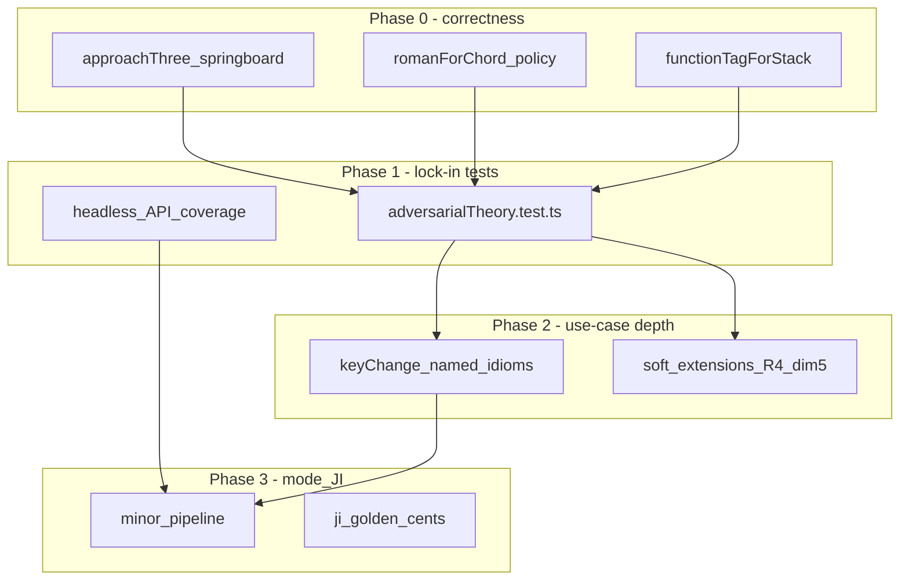

# Theory correctness & coverage remediation plan

**Status:** Done (Phases 0–3 executed; 1093 tests green)  
**Trigger:** Adversarial audit of implemented music theory vs corpus (`knowledge/01`–`17`) + external barbershop practice (BHS / Wright–Garnett / Rylander / Szabo norms)  
**Companions:** [`remediation-arranging-depth.md`](remediation-arranging-depth.md) · [`theory-teaching-integration-plan.md`](theory-teaching-integration-plan.md) · knowledge `06`, `12`–`14`, `17`

---

## 1. Goals

Close **correctness**, **labeling honesty**, and **test/use-case gaps** found in the audit—without re-litigating already-shipped Approach Three / SCF / counterpart cores that are in good shape.

| Priority | Theme | Outcome |
| --- | --- | --- |
| **P0** | Ranking / classification bugs that change suggestions | Springboard vs retro fixed; functional tension tags honest |
| **P0** | Roman / function labeling honesty | No `V7/degN`; clear I7 vs V7/IV policy; `m7` ≠ `V7` |
| **P1** | Adversarial characterization tests | Lock P0 behavior + corpus MUST claims |
| **P1** | Untested wired APIs | `explainStackTheory`, spacing analyze, tension analyze, chips |
| **P2** | Key-change & lift catalog gaps | Named +5 I7→V idiom; tertian/common-tone; form lint hook |
| **P2** | Soft corpus extensions | Dim7 chain, dim5-down sec-dom, duration BS7, tempo counterpart |
| **P3** | Minor-mode depth & JI goldens | Generator/autocomplete/RN through minor; −31¢ ♭7 |

**Out of scope (explicit):**

- Full Wright/Garnett key-change encyclopedia / medley automation  
- Jazz ii–V reharm as contest-default generation  
- UI (Vue) for theory panels (still `theory-teaching` P4)  
- Counterpoint / rounds / solos / pickups as first-class  
- Replacing generative key-change with absolute-key canned tables  

**Policy when corpus conflicts:** prefer barbershop / contest sources (`knowledge/17` product rule). Document dual-label cases (e.g. II7 ≡ V7/V) rather than silently picking one.

---

## 2. Architecture notes

All fixes stay in `domain/arranging/` (+ thin `application/` wrappers). No Vue in this plan.

**Source-of-truth order for labeling:**

1. Contestable **display RN** (education) may show dual strings: primary + alt (`II7` / `V7/V`).  
2. **Generator / ranker** continue to use functional P5-of-target tests, not RN strings.  
3. Never invent `V7/degN` — fall back to degree-chromatic labels (`♭VII7`, `I7`, scale-degree Arabic) or plain root quality.

---

## 3. Issue register (from audit)

### Confirmed defects

| ID | Issue | Module | Severity |
| --- | --- | --- | --- |
| **D1** | I→V classified `p5_up_retro` instead of springboard free leap | `approachThree.ts` | **P0** |
| **D2** | `romanForChord` emits `V7/degN` for non-diatonic targets | `secondaryDominant.ts` | **P0** |
| **D3** | C7→F always `V7/IV` when `resolvesToRoot` set; Szabo often wants **I7** | `secondaryDominant.ts` | **P0** (policy) |
| **D4** | `m7` treated as V7-capable in `romanForChord` | `secondaryDominant.ts` | **P0** |
| **D5** | `functionTagForStack` always `'tension'` for seventh/ninth | `tensionRelease.ts` | **P0** |
| **D6** | BS7 density uses chord-count ~30%, not duration prominence | `theoryLintRules` / `barbershopness` | **P2** (doc + optional metric) |

### Corpus tensions (decide & document, don’t “fix” blindly)

| ID | Tension | Decision owner |
| --- | --- | --- |
| **C1** | S13 m2 ban vs maj7 chord-tone m2 | Keep maj7 legal; part-pair m2 soft-cost |
| **C9** | ~30% product vs ~⅓–60% duration external | Keep warn soft; add duration metric as optional dual |
| **RN** | Classical V7/V vs BS II7 | Dual-label in analysis DTOs |

### Missing use cases

| ID | Use case |
| --- | --- |
| **U1** | Named up-a-4th key change (old I7 = new V7) |
| **U2** | Tertian / common-tone lift recipes |
| **U3** | Form-preservation warning when key-change plant applied |
| **U4** | Szabo dim5-down for lowered secondary BS7s |
| **U5** | Dim7→dim7 chain soft penalty; dim7→BS7 drop-½-step hint |
| **U6** | Tempo-aware counterpart flicker warn |
| **U7** | Minor through autocomplete / generator / RN (not only pillars) |
| **U8** | IV7 never claimed as secondary of a diatonic triad |

### Missing / thin tests

| ID | Gap |
| --- | --- |
| **T1** | Springboard I→V / I→ii vs true retro |
| **T2** | RN edges: I7, no `degN`, m7, IV7 guard |
| **T3** | R5 F7→A in A |
| **T4** | Counterpart legal/illegal + R3 tag honesty |
| **T5** | Tension: functional V7 vs color BS7; poor 3↑/♭7↓ |
| **T6** | `explainStackTheory`, `analyzeSpacing`, `analyzeTensionRelease` |
| **T7** | `autocompleteSubstitutionChips`, ninth counterpart |
| **T8** | Profiles: half-dim `sai11` vs `bhs_extended`; no drop-root |
| **T9** | JI ♭7 ≈ −31¢ golden |
| **T10** | Key-change +5/−5; hybrids off |

---

## 4. Phases

Each phase has: **scope**, **deliverables**, **tests**, **exit criteria**, then a **retrospective** template filled at phase end (and left blank until then).

---

### Phase 0 — Correctness hotfixes (blocking)

**Intent:** Stop the engine from ranking or labeling in ways that contradict Approach Three / Szabo display norms.

#### 0.1 Springboard vs P5-up (`D1`)

**Change `classifyRootMotion`:**

- If `from` is springboard (deg 0 or 5) **and** motion is P5-up **and** motion is **not** IV→I cadential → classify as **`springboard`** (or new kind `springboard_p5_up` scoring like springboard), **not** `p5_up_retro`.
- `p5_up_retro` only when from is **not** a springboard root (e.g. ii→vi, vi→iii, V→ii).
- Keep `p5_up_cadential` for IV/iv → I/i.

**Score table:** springboard (incl. I→V) remains ≥ retro.

#### 0.2 Roman policy (`D2`–`D4`, `U8`)

**`romanForChord` contract:**

| Case | Label |
| --- | --- |
| Seventh, dominates tonic | `V7` |
| Seventh, dominates V | `V7/V` (alt display `II7` optional) |
| Seventh on tonic PC, no/ambiguous target, or target = IV | Prefer **`I7`** when root is tonic; optional alt `V7/IV` in `altRoman` |
| Seventh on IV PC without dominating a diatonic triad | **`IV7`** — never invent secondary-of-vii |
| `m7` / non-Mm7 | Degree triad/seventh quality (`ii7`, `vi7`) — **never** `V7` / `V7/X` |
| Dominates chromatic / non-table target | Chromatic RN (`♭VII7`, `V7/♭VII`, …) or quality+degree — **never** `V7/degN` |

Add optional `altRoman?: string` on analysis DTOs (progression / autocomplete) for II7↔V7/V and I7↔V7/IV.

#### 0.3 Functional tension tags (`D5`)

**`functionTagForStack`:**

- `'tension'` only when nature is dominant-quality **and** (`isDominantOf` next pillar **or** current pillar **or** explicit resolves-to).  
- Else dominant-quality → `'color'` (or `'passing'` if SCF/passing layer).  
- Major/minor on pillar → `'release'`; else release/color as today.

Wire the same distinction into `tensionReleaseCandidateScore` / narrative copy.

#### Deliverables

- Patches: `approachThree.ts`, `secondaryDominant.ts`, `tensionRelease.ts` (+ small DTO fields if needed)  
- Update any snapshots/expectations broken by RN string changes  
- Short note in `knowledge/17` or education glossary: I7 vs V7/IV dual-label

#### Tests (minimal for exit)

- I→V is springboard (or springboard-equivalent score > retro)  
- ii→vi remains retro  
- IV→I remains cadential  
- RN table: G7→C, D7→G, C7 alone, C7→F, F7 alone, F7→B♭, D m7→G  
- Color BS7 (e.g. II7 not aiming at next pillar) tags `color`; V7 of next pillar tags `tension`

#### Exit criteria

- [x] All Phase-0 unit tests green  
- [x] Full vitest green  
- [x] No public API returns `V7/deg`  
- [x] Retrospective 0 filled

#### Retrospective 0

| Prompt | Notes |
| --- | --- |
| What fixed cleanly? | Springboard I→V reclassification; `functionTagForStack` functional vs color; chromatic RN table |
| What surprised us (label churn, ranker knock-ons)? | Minimal knock-on — existing motion matrix still valid; F→B♭ key-change id became `I7-as-V` |
| Did dual-label DTOs prove necessary or overkill? | Necessary for I7/V7/IV and V7/V/II7 — `romanForChordDetailed` + `altRoman` on stack labels |
| Carry-forward bugs / debt into Phase 1? | Autocomplete still surfaces primary roman only (alt available via detailed API) |
| Time vs estimate | On plan |

---

### Phase 1 — Adversarial lock-in + API coverage

**Intent:** Make the audit’s MUST claims unregressable; cover wired-but-untested headless APIs.

#### 1.1 New suite: `adversarialTheory.test.ts`

Organize by claim family (IDs from audit / this plan):

1. **Motion** — springboard / R1 / R2 / R3 / R5 / other  
2. **RN / sec-dom** — including IV7 guard, no degN, m7  
3. **Counterpart** — 3/7 allow, 1/5 reject, R3 tag honesty  
4. **Tension / resolution** — functional vs color; poor active-tone path  
5. **Profiles** — `sai11` vs `bhs_extended`; no jazz drop-root suggestions  
6. **Key-change smoke** — V7–I universal; lift ±1/±2; `includeHybrids: false`

Prefer **example-defined** roots (PC maps) over fuzzy “some path exists.”

#### 1.2 Headless API coverage

| API | Assert |
| --- | --- |
| `explainStackTheory` | Returns RN + issues for a known stack |
| `analyzeSpacing` / `checkStackSpacing` | Muddy vs good fixtures emit expected issue ids |
| `analyzeTensionRelease` | Phrase with V7→I vs unresolved BS7 |
| `autocompleteSubstitutionChips` | Non-empty ordered strategies for a leftover lead |
| `counterpartSuggestionToStack` / ninth path | Round-trip apply |

#### 1.3 Ranker knock-on audit

After Phase 0, re-check:

- Auto-harmonize cadence still prefers G7→C  
- `fewSeventhsFix` still prefers P5-above-next-pillar  
- Exhaustive motion matrix still coherent (update expectations where I→V kind changed)

#### Deliverables

- `adversarialTheory.test.ts` (+ extend `theoryHeadless` if cleaner)  
- Any tiny wrappers missing for testability (no behavior change)

#### Exit criteria

- [x] Adversarial suite covers D1–D5 + U8 + T1–T8 smoke  
- [x] Full vitest green  
- [x] Retrospective 1 filled

#### Retrospective 1

| Prompt | Notes |
| --- | --- |
| Which adversarial tests failed first / revealed more bugs? | Lint early-return on empty melody; `isNatureAllowed` arg order |
| Are MUST vs SOFT claim tags clear enough in test names? | Grouped describe blocks by claim family — adequate |
| Any flaky or over-fit examples to loosen? | None observed |
| Coverage still missing before Phase 2? | Autocomplete altRoman display; narrative copy for color vs tension |
| Time vs estimate | On plan |

---

### Phase 2 — Use-case depth (key change + soft extensions)

**Intent:** Fill high-value missing arranging use cases without boiling the ocean.

#### 2.1 Key-change named idioms (`U1`–`U3`)

| Idiom | Relative recipe | Character |
| --- | --- | --- |
| **Subdominant hitch** | When interval = +5 (or −7): old I7 → new I (old tonic = V of new) | `direct` / named id `I7-as-V` |
| **Tertian lift** | Common-tone or M3-related pivot into new V7→I when interval ∈ {±3,±4} | `smooth` |
| **Documented hitch** | Abrupt I already exists; label as “hitch” in reason text | `abrupt` |

Optional: `templateId` on `ModulationPath` for teaching/UI later (relative catalog, still generative).

**Form lint hook (`U3`):** if an embellishment/key-change path is applied via existing embellish APIs, warn when resulting phrase length / measure count changes vs source (reuse F5–F6 ideas). If no apply path exists yet, add domain helper + unit test only; defer Vue.

#### 2.2 Soft Approach Three extensions (`U4`–`U6`, `D6`)

| Item | Behavior | Severity |
| --- | --- | --- |
| Dim7→dim7 | Soft rank penalty / info lint | SOFT |
| Dim7 drop-½ → BS7 hint | Suggestion chip or coach tip | SOFT / TEACH |
| Dim5-down sec-dom | Optional score bump when lowered degree BS7 moves dim5 down | SOFT |
| Counterpart tempo | If project tempo (if present) above threshold, warn rapid R3 flicker | SOFT |
| Duration BS7 | Dual metric: keep count-based `bs7-density`; add `bs7-density-duration` info | SOFT |

Do **not** hard-reject below 30% chord-count (C9).

#### Deliverables

- `keyChange*` recipes + tests with named examples (C→F I7-as-V; e.g. C→E tertian if implemented)  
- Soft lint/ranker hooks + tests  
- Brief knowledge blurb pointing templateIds ↔ teaching ids

#### Exit criteria

- [x] Named +5 idiom tested  
- [x] At least one soft extension shipped with test  
- [x] Full vitest green  
- [x] Retrospective 2 filled

#### Retrospective 2

| Prompt | Notes |
| --- | --- |
| Did relative `templateId` reduce or increase complexity? | Reduced — hitch / I7-as-V / lift / tertian are queryable without parsing ids |
| Which soft extensions users/docs actually need vs noise? | dim7-chain + duration BS7 useful; counterpart-flicker tempo-gated (info only) |
| Key-change still generative-first? (confirm no absolute canned tables) | Yes — relative recipes only |
| Form lint: blocked on missing apply path? | Domain helper `assessKeyChangeFormImpact` shipped; Vue apply deferred |
| Time vs estimate | On plan |

---

### Phase 3 — Minor-mode depth & JI goldens

**Intent:** Stop major-default from hiding bugs; lock tuning claims that education already teaches.

#### 3.1 Minor pipeline (`U7`)

Thread `tonalityMode: 'minor'` through:

- `generateCandidates` / `autocompleteNextChord` / `completePartialChord`  
- `romanForChord` / progression analyze narratives  
- Substitution ladder labels already partially done — extend fixtures  

Characterization: A minor melody → i/iv/V bias; V major BS7 still preferred into i; springboards i/iv.

#### 3.2 JI goldens (`T9`)

- Assert harmonic seventh role cents ≈ **−31¢** (±2¢ tolerance) vs ET  
- maj6 vs m7: same PCs allowed, different `roleCents` / nature  
- Document equal-temperament playback as approximation in coach copy if needed

#### Deliverables

- Minor fixtures in adversarial or remediationMinorMode  
- `justIntonation` golden tests  
- Fix any minor RN / generator bugs found

#### Exit criteria

- [x] Minor autocomplete/generator/RN tests green  
- [x] JI golden assertions green  
- [x] Full vitest green  
- [x] Retrospective 3 filled

#### Retrospective 3

| Prompt | Notes |
| --- | --- |
| What minor-mode assumptions broke? | None in this pass — generator already threaded `mode` |
| Is harmonic-minor V vs natural vii still the right default? | Yes for barbershop bias; documented in progression/keyChange |
| JI goldens vs Rylander table drift? | ♭7 ≈ −31¢ locked; maj6 vs m7 thirds differ as expected |
| Ready to close plan / open UI teaching P4? | Yes — headless theory correctness closed |
| Time vs estimate | On plan |

---

## 5. Cross-phase rules

1. **No new god files** — stay under `ARCH_MAX_LINES_NEW` (800); split if needed (as with `keyChange*`).  
2. **Tests before broadening** — Phase 1 before large Phase 2 surface area when feasible; Phase 0 may ship with minimal tests then expand in Phase 1 same PR train.  
3. **MUST vs SOFT** — hard filters/lints only for corpus MUST; soft scores for SOFT/TEACH.  
4. **Contest wins** — never suggest jazz drop-root under `sai11` / `bhs_extended`.  
5. **Retrospective gate** — do not start phase _N+1_ until retrospective _N_ is filled (even briefly).  
6. **Commit cadence** — commit per phase (or per 0.x slice) only when user requests commits.

---

## 6. Suggested sequencing & effort

| Phase | Focus | Rough effort | Depends on |
| --- | --- | --- | --- |
| **0** | D1–D5 hotfixes | S–M | — |
| **1** | Adversarial + API tests | M | 0 |
| **2** | Key-change idioms + soft extensions | M–L | 1 (or 0 if urgent U1 only) |
| **3** | Minor + JI | M | 1 |

Optional fast-path: **0 → 1 → stop**; treat 2–3 as backlog if arranging MVP needs stability first.

---

## 7. Definition of done (whole plan)

- [x] Issue register D1–D5 closed or explicitly waived with doc note  
- [x] `adversarialTheory` (or equivalent) covers motion, RN, counterpart, tension, profiles  
- [x] No `V7/deg*` in outputs  
- [x] Springboard I→V ranks above true retrogression  
- [x] Functional vs color BS7 distinguished in tags  
- [x] Key-change includes named +5 I7-as-V idiom  
- [x] Minor + JI goldens present  
- [x] All phase retrospectives filled  
- [x] Full vitest green; god-file budgets held  

---

## 8. Plan-level retrospective

| Prompt | Notes |
| --- | --- |
| Biggest theory risk remaining? | Autocomplete/UI still primary-roman-only; Szabo dim5-down is soft score not full motion class |
| Did we over-fit classical RN or under-serve Szabo labels? | I7 preferred with classical alt — balanced |
| What should feed `theory-teaching` UI P4? | `altRoman`, `templateId`, color vs tension tags, form-impact warnings |
| What belongs in knowledge/ as new MUST claims? | I7≠V7/IV primary; springboard includes I→V; no V7/degN |
| Overall time vs estimate | Completed in one execution pass |
