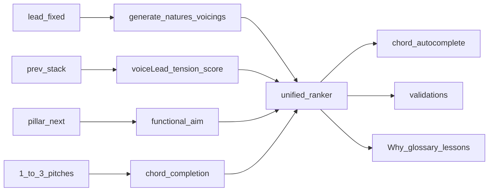

# Theory-teaching integration plan

**Status:** Headless P1–P3 shipped; UI (P4) pending  
**Goal:** While the user arranges, continuously **analyze**, **suggest next chords**, and **teach** general harmony + barbershop practice.  
**Corpus:** [`knowledge/17-general-theory-and-acappella.md`](../knowledge/17-general-theory-and-acappella.md) · existing `06`–`07`, `13`–`16` · shipped remediation (`secondaryDominant`, `counterpart`, `substitutions`, `barbershopness`)  
**Architecture:** Domain-first; thin `application/` use-cases; education catalog for copy; Vue only consumes DTOs.

---

## 1. Product thesis

Every chord decision should answer three questions in the UI:

1. **What fits?** (vocabulary, lead tone, contest profile)  
2. **Where should we go next?** (pillars + Approach Three + tension/release + voice leading)  
3. **Why?** (one RN/function sentence + one VL/spacing sentence)

Helpers are not a separate “theory mode” — they ride on autocomplete, QA, and candidate ranking.



---

## 2. Feature catalog (suggested)

### A. Analyses & validations (always-on)

| ID | Feature | Behavior | Severity | Builds on |
| --- | --- | --- | --- | --- |
| **V1** | Harmonic-series spacing | Score bass↔upper gap + upper compactness; warn muddy low 3rd / tenor–lead hole | info/warn | `placeVoicing`, `07` |
| **V2** | Parallel motion | Detect parallel P5/P8 (exists); add parallel **octaves**; detect **all-parts same direction** | info/warn | `voiceLeading.ts` |
| **V3** | Contrary-motion hint | When bass and upper unit move same way and leap > step, suggest contrary revoice | info | new scorer |
| **V4** | Active-tone resolution | Outgoing BS7/9: check whether 3↑ and/or ♭7↓ into next chord (or held correctly) | warn | `secondaryDominant`, VL |
| **V5** | Common-tone waste | Shared PC between stacks moved to a new voice unnecessarily | info | VL |
| **V6** | Incomplete structural tones | Missing 1/3/(7 on dominants) in sounding PCs | warn | `voicingIntegrity` |
| **V7** | Tension budget | Phrase-level: too little BS7 / no release into pillar | warn | `few-sevenths`, `barbershopness` |
| **V8** | RN / function label | Stamp each stack with `romanForChord` + short function tag (`tension`/`release`/`passing`) | display | `secondaryDominant` |

### B. Chord helpers & autocomplete

| ID | Feature | Behavior |
| --- | --- | --- |
| **H1** | **Chord autocomplete** (next stack) | Given lead @ tick, prev stack, pillar/next pillar → ranked list of `{root, nature, voicing, midi, score, why[]}` |
| **H2** | **Functional aim filter** | Boost V7→pillar, V7/V, springboard exits; demote random jumps |
| **H3** | **VL-first re-rank** | Among legal chords, prefer min `vlCost` + contrary + resolution |
| **H4** | **Substitution picker** | Surface `listSubstitutionBranches` as named alts (“Try secondary dominant”, “Counterpart”, “Relative”) with one-tap apply |
| **H5** | **Counterpart / sec-dom quick actions** | Existing suggest/apply wired into autocomplete chips |
| **H6** | **Density coach** | If BS7 share &lt; ~30%, autocomplete defaults bias sevenths toward next pillar |

### C. Incomplete / mistaken chord completion (explicit ask)

| ID | Feature | Behavior |
| --- | --- | --- |
| **C1** | **Complete from ≤2–3 pitches** | Input: set of MIDI or PCs (+ optional which part is lead). Output: ranked full TTBB stacks that contain those pitches as chord tones |
| **C2** | **Nature inference** | From PC set, list plausible natures (major/minor/BS7/…) under contest profile; prefer those needing fewest added tones |
| **C3** | **Fill-missing-roles** | Prefer add **3**, then **7** (dominant), then **1/5/9** per omit policy |
| **C4** | **Remove 1–2 parts & repair** | Drop bari and/or tenor (or any subset) → treat remainder as C1 input → suggest replacement pitches for removed parts |
| **C5** | **Lead-locked repair** | Always keep lead MIDI fixed when present; never “fix” by moving melody |
| **C6** | **Explain completion** | “Adds E (3rd) and Bb (7th) to complete C7 — tritone E–Bb wants to resolve to F–A or similar” |

### D. Teaching while arranging

| ID | Feature | Behavior |
| --- | --- | --- |
| **T1** | Why? factors | Extend `explainRankingBreakdown` with `tensionRelease`, `spacing`, `contrary`, `commonTone`, `resolution` |
| **T2** | Glossary expansion | Add seeds from `17` §9 into education catalog |
| **T3** | Inline lesson chips | On lint/autocomplete, deep-link `tension_release`, `omit_5`, `R1_p5`, etc. |
| **T4** | Compare-hear teaching | When top-2 candidates differ by function (BS7 vs major), label “tension option” vs “release option” |
| **T5** | Phrase narrative | Optional strip: “Highway: II7 → V7 → I — tension building then release at pillar” |

---

## 3. Domain module plan

Keep files small; follow existing hexagonal layout.

| Module | Path | Responsibility |
| --- | --- | --- |
| Spacing | `domain/arranging/spacing/harmonicSeriesSpacing.ts` | Score / issues for one stack |
| VL extended | extend `voiceLeading.ts` | Parallels, contrary, leaps, common tones, resolution |
| Tension | `domain/arranging/tensionRelease.ts` | Tag stacks; score progression; resolution checks |
| Completion | `domain/arranging/chordCompletion.ts` | C1–C6 incomplete / repair |
| Autocomplete | `domain/arranging/harmonize/chordAutocomplete.ts` | Orchestrate gen + VL + function + subs |
| Teach hooks | `education/catalog.ts` + `explain.ts` | Glossary + Why? factor labels |

### Proposed public types (sketch)

```ts
type TheoryFactor = {
  id: string
  label: string
  value: number
  teachingId?: string // glossary / lesson id
}

type ChordSuggestion = {
  rootPc: number
  natureId: string
  voicing: string
  spread: boolean
  midi: VoicingPitches
  score: number
  roman?: string
  functionTag?: 'tension' | 'release' | 'passing' | 'color'
  factors: TheoryFactor[]
  why: string // one sentence
}

type CompletionRequest = {
  presentMidi: number[]           // 1–3 (or more) known pitches
  leadMidi?: number               // if known
  lockedParts?: Partial<VoicingPitches>
  removedParts?: ('tenor' | 'lead' | 'bari' | 'bass')[]
  tonality: number
  mode?: TonalityMode
  profile: ContestProfile
  pillarRoot?: number
  nextPillarRoot?: number | null
  prevMidi?: VoicingPitches | null
}

type CompletionResult = {
  inferredNatures: { natureId: string; rootPc: number; confidence: number }[]
  suggestions: ChordSuggestion[]
}
```

### Application use-cases

- `autocompleteNextChord(project, tick)`  
- `completePartialChord(project, request)`  
- `repairStackAfterRemovingParts(project, stackId, parts)`  
- `explainStackTheory(project, stackId)` → RN + spacing + VL neighbors + tension tag  

---

## 4. Ranking unification

Today: motion + primary + seventh + ring + secondaryDominant + VL distance + strongVoice + harmonicity.

**Add weights** (in `rankingWeights.ts`):

| Weight | Purpose |
| --- | --- |
| `tensionRelease` | Prefer BS7 approaching pillar; prefer release at confirmed pillar PMN |
| `resolution` | Prefer voicings where active tones resolve by step into next *known* stack or expected pillar chord |
| `spacing` | Harmonic-series spacing score |
| `contrary` | Outer contrary bonus |
| `commonTone` | Hold bonus |
| `parallelPenalty` | Soft |

Autocomplete = `generateCandidates` (already emits sec-dom + SCF) → rank with expanded weights → attach `why` from factors + RN.

---

## 5. Chord completion algorithm (C1–C4)

```
complete(presentPCs, leadMidi?, profile, tonality, ...):
  1. Enumerate natures in allowlist
  2. For each rootPc in {presentPCs ∪ tonality degrees ∪ pillar ± SCF}:
       if all presentPCs ⊆ chord tones(root, nature): keep
  3. Score candidates by:
       + contains lead role if leadMidi given
       + needsAdd count inverted (fewer adds better)
       + structural: has 3; if seventh-family has 7; has 1
       + contest ring tier / BS7 density context
       + VL from prevMidi if any
  4. For each surviving (root, nature), placeVoicing variants that:
       - assign present pitches to matching roles when possible
       - fill missing roles (prefer 3, 7, 1, 5, 9 order by nature)
  5. Return top N with explanations
```

**Remove 1–2 notes:** delete those midis from `presentMidi` / clear locked parts → same pipeline → suggestions must re-specify removed parts.

---

## 6. Teaching integration

| Surface | Content |
| --- | --- |
| Autocomplete row | Nature + RN + 1-line why |
| Lint card | Message + “Learn: tension & release” link |
| Why? panel | Factor list including new theory factors |
| Learn / glossary | Entries from `17` §9 |
| Barbershopness report | Optional factor: spacing avg, resolution hit rate |

Every new validation **must** cite a `teachingId` so the UI can open the glossary without special cases.

---

## 7. Phased delivery

### Phase P0 — Knowledge & types (this pass)
- [x] `knowledge/17-general-theory-and-acappella.md`  
- [x] This plan  
- [x] Index + curriculum cross-links  

### Phase P1 — Analysis core (headless)
1. [x] `harmonicSeriesSpacing.ts` + tests  
2. [x] Extend `voiceLeading`: octaves, contrary, leaps, common tones  
3. [x] `tensionRelease.ts`: tag + BS7 resolution check vs next stack  
4. [x] Wire into `analyzeHarmonyTheory`  
5. [x] Lint rules + education ids  

### Phase P2 — Autocomplete & ranking
1. [x] Ranking weight extensions + explain factors  
2. [x] `chordAutocomplete.ts` + `autocompleteChordAtNote` use-case  
3. [x] Substitution / counterpart / sec-dom chips  
4. [x] Tests: II7→V→I / theory factors  

### Phase P3 — Partial chord completion
1. [x] `chordCompletion.ts` (C1–C6)  
2. [x] Repair-after-remove API  
3. [x] Fixtures: 2 pitches → complete BS7; remove bari → restore; lead locked  

### Phase P4 — UI (after headless green)
1. [ ] Autocomplete popover on stack / empty beat  
2. [ ] Partial-chord tool (select sounding notes → suggestions)  
3. [ ] Why? / Learn chips on all new lints  
4. [ ] Optional phrase narrative strip  

### Phase P5 — Polish
1. [x] ~30% BS7 density threshold in barbershopness + `bs7-density` lint  
2. [ ] Compare-hear tension vs release labels (UI)  
3. [x] Headless suite green with new modules  

---

## 8. Acceptance criteria

- Headless: given melody + pillars + one prev stack, autocomplete returns ≥1 BS7 aiming at next pillar when lead allows, with non-empty `why`.  
- Headless: two PCs that form BS7 tritone + implied root → completion suggests that BS7 under contest profile.  
- Headless: remove bari from a complete stack → suggestions restore a legal bari without moving lead.  
- Lint: muddy spacing and failed 3/7 resolution emit teachable warnings.  
- No Vue required for P1–P3.  
- Contest profile still gates natures; jazz drop-root never suggested under `sai11` / `bhs_extended`.  

---

## 9. Non-goals (unchanged)

- Full counterpoint / rounds / solos / pickups as first-class analyzers  
- Vocal percussion / syllable engines  
- Auto-reharmonizing entire charts into jazz ii–V webs  
- Replacing Approach Two pillar confirmation  

---

## 10. Doc / curriculum touchpoints

| Doc | Update |
| --- | --- |
| `knowledge/00-index.md` | Link `17` |
| `knowledge/16-teachable-curriculum.md` | Glossary ids from `17` §9 |
| `knowledge/15-guidance-automation.md` | Point at autocomplete + completion |
| `knowledge/07-voicing-voice-leading.md` | Point at spacing + extended VL cost |
| `docs/implementation-plan.md` | Add P1–P4 bullets when scheduling |

---

## 11. Suggested implementation order (when executing)

1. Spacing + tensionRelease + VL extensions (pure analysis)  
2. Ranking weights + explain factors (teach while ranking)  
3. Autocomplete use-case (suggestions for next chords)  
4. Chord completion / repair (fewer-than-3 and mistake recovery)  
5. Lint + education wiring  
6. UI  

This order maximizes **teaching during arrange** early: even before UI autocomplete, Why? and QA can speak tension/release and spacing.
