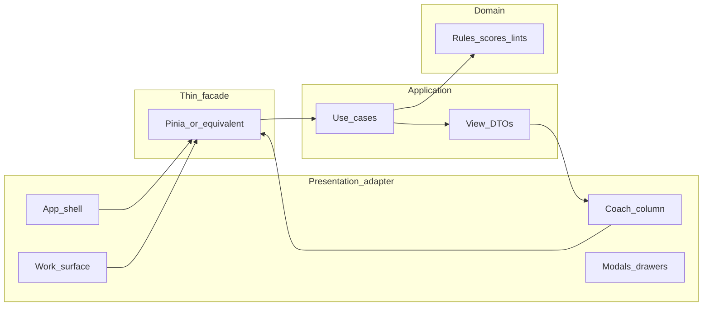

# UI presentation layer design + test-gap follow-up

**Status:** Design only (no UI code in this pass)  
**Date:** 2026-09-19 · **Part A tests:** done 2026-09-20 · **Port↔workflow snapshot:** [`ui-workflow-evaluation.md`](ui-workflow-evaluation.md)  
**Depends on:** [`implementation-plan.md`](implementation-plan.md) · [`ux-workflows.md`](ux-workflows.md) · [`theory-teaching-integration-plan.md`](theory-teaching-integration-plan.md) · [`workflow-guides.md`](workflow-guides.md) · recent source/doc↔code audits  
**Audience:** Presentation adapters (Vue today; fungible later)

This document answers two questions from the post-audit state:

1. **What tests are still missing** after theory/doc/code sync?  
2. **How should the UI presentation layer be designed** so every stated product goal can surface without putting business rules in Vue?

---

## Part A — Missing test cases

Domain coverage is strong for Approach Three unlocks, Dom9 omit preference, density counting, and counterpart gates. Gaps below are **regression risks** for the hygiene we just shipped, plus UI-contract tests that do not exist yet.

### A1. High priority (domain / application — ship before UI rebuild)

| Gap | Why it matters | Suggested test |
| --- | --- | --- |
| **Dom9-heavy chart ≠ `few-sevenths`** | Regression of D12: chart of mostly `ninth` must not warn “few sevenths” | Fixture ≥8 stacks, majority `ninth`, assert no `few-sevenths`; optional assert `bs7-density` still uses both |
| **`countSeventhDensity` includes ninth** | Helper used outside lint path | Pure unit: half seventh, half ninth → 1.0 |
| **Candidate generator R5 soft penalty** | `scoreRootMotion` unit exists; generator path may not | Same prev BS7, candidates major vs seventh at M3-up root → major’s `motionScore` ≥ seventh’s |
| **Raised-root counterpart reason string** | User-facing coach text | `suggestCounterpart` with ♯1 lead → reason matches `/raised root/i` (exists in adversarial; keep if UI surfaces `reason`) |
| **Outer parallel weight in ranking** | `parallelPerfectPenalty` tenor–bass 1.5 | Construct prev/next with only bass–tenor P5 vs only bari–lead P5 → outer penalty larger |
| **Thin-ninth fix prefers omit-root** | Autofix order | Fat candidates with both `5…` and `1…` voicings → applied voicing starts with `5` |
| **I7 dual-label presentation DTO** | Analysis may be primary-only in UI today | `romanForChordDetailed` / narrative: primary `I7`, alt contains `V7/IV` when tonic Mm7 drives IV |
| **Education catalog ↔ lint ruleIds** | Broken Learn chips | Snapshot: every `lintRuleId` on lessons exists in lint registry; every severity≥warn rule has a lesson or explicit “human-only” map |

### A2. Medium priority (theory coaching surfaces)

| Gap | Suggested test |
| --- | --- |
| `distanceFromHome` Bb/F maps (men’s keys) | B♭ tonic: F→1, C→2, G→3, D→4; F≠1 |
| Dim7 chain message mentions m6 | Lint message `/m6/` |
| Dom9 glossary / `L-dom9` body cites both schools | String contains root omit + fifth omit (or Prietto + Rylander) |
| Soft counterpart without gate: no `R3_tritone` tag | SCF G5 candidate with lead on root → emitted, tags exclude R3 |
| Density duration vs chord-count independence | Long major + short BS7: duration lint may fire while count does not (or reverse) |

### A3. Application / adapter contract (sparse, but required for UI rebuild)

| Gap | Suggested test |
| --- | --- |
| `ExplainCoach` / teachLint returns `CoachExplanation` for Dom9 thin, R5, density, counterpart | Headless: lint → explanation has `headline`, `glossaryIds`, optional `hear` |
| Fix registry: `thin-ninth` / `few-sevenths` / `bs7-density` probe `canFix` | Application layer with fake project |
| Store façade does not reimplement ranking | Architecture test already restricts god files; add “store must not import `classifyRootMotion`” if not present |
| **No Vue component tests yet** for modes | Defer until shell rewrite; then one Playwright/Vitest wiring test per mode CTA |

### A4. Explicitly out of scope for unit tests

- Full Approach Two Step I–IX UI rail (acceptance = workflow guide + manual)  
- Verovio full-score chrome  
- Artistry / copyright human gates  

**Verdict:** Yes — we have missing tests, concentrated on **regression of recent sync** and **explanation DTOs the UI will render**. Domain motion/JI core is largely covered.

---

## Part B — UI presentation layer design

### B0. Goals the UI must enable (from plans)

| Goal source | User-visible outcome |
| --- | --- |
| Implementation plan §10 | Pillars → fill → live QA + fixes → JI hear → export; UI replaceable |
| UX workflows | 3-action happy path; never silent; never stranded; teach in place |
| Theory-teaching P4 | Autocomplete, Why?/Learn, tension vs release compare-hear, optional narrative |
| Knowledge spine | Style → circle → charts → Approach Two/Three → voicing → troubleshoot, on demand |
| Doc↔code sync | Dom9 omit schools, R5 soft preference, density coach, Stevens distance, counterpart gate reasons appear as **copy**, not reinvented rules |

### B1. Architectural rule (presentation)



**Hard bans for Vue**

- No `classifyRootMotion`, SCF math, Dom9 omit preference, density thresholds, or Roman dual-label logic in components.  
- Components may only: bind inputs, call store/use-cases, render DTOs, map lint targets → roll highlights, play audio via port.

**DTO ownership:** Application builds `CoachExplanation`, `IssueBoardItem`, `CandidateCard`, `StepRailState`, `ModeChrome`. Vue templates are dumb.

### B2. Interaction modes (chrome, not separate apps)

Keep [`ux-workflows.md`](ux-workflows.md) §2 three modes. Presentation maps:

| Mode | Shell emphasis | Hidden by default |
| --- | --- | --- |
| **Quick Arrange** | Hero CTAs Infer → Harmonize → Fix; roll; issue badge | Step rail, candidate browser, narrative strip |
| **Guided Lesson** | Step rail I–IX + one tip + one step CTA | Full issue board (badge only until Step VIII–IX) |
| **Review / Polish** | Issue board grouped Blockers / Improve / Teach; Fix all safe; compare-hear; export | Step rail |

Mode is a **view preference** on the project (or session), not a different document. Switching modes never discards stacks/pillars.

### B3. Single-composition layout (first viewport)

Lock [`ux-workflows.md`](ux-workflows.md) §3; refine regions for recent teaching needs:

```
┌─ Brand · title · mode · undo/redo · play · export ──────────────┐
├────────────────────────────┬────────────────────────────────────┤
│                            │ COACH (one job per block)          │
│  WORK SURFACE              │ 1 Tip (1 sentence)                 │
│  Melody + stacks roll      │ 2 Primary CTAs (mode-filtered)     │
│  Pillar bands              │ 3 Issues (collapsed → expand)      │
│  Highlight overlays        │ 4 Context card (selection)         │
│                            │ 5 Advanced ▸                       │
├────────────────────────────┴────────────────────────────────────┤
│ Status: errors · warns · pillars · profile · tuning             │
└─────────────────────────────────────────────────────────────────┘
```

**Context card (new explicit region)** — appears when a note/stack/lint is selected:

| Selection | Card shows |
| --- | --- |
| Melody note | Role (PMN/SMN), candidates top-3, Why? for #1, Hear / Apply |
| Stack | Nature, Roman (+ alt), ruleTags, Dom9 omit strategy if ninth, distance-from-home if BS7, Fix if linted |
| Lint | Severity, message, Learn (lesson), Fix / Fix preview, Hear if stack-bound |

This is where **recent theory sync** becomes visible without a dashboard of panels.

### B4. View-model contracts (design, not types file yet)

Presentation consumes only these shapes (names illustrative):

1. **`ModeChrome`** — which CTAs, whether step rail / issue board / advanced are visible  
2. **`StepRailState`** — current wizard step, exit condition met?, tipId, primaryActionId  
3. **`IssueBoardItem`** — from lint + `teachLint`: severity, message, targets, `canFix`, `lessonId`, `destructive?`  
4. **`CandidateCard`** — nature, voicing label, omit strategy chip (`omit-root` / `omit-5`), motion tags, score, `CoachExplanation`, hear payloads  
5. **`StackAnnotation`** — for roll: Roman primary/alt, tension|release|color function tag, density contribution flag  
6. **`HearRequest`** — stack / compare-top2 / et-vs-ji / tension-vs-release (theory P4)

### B5. Teaching surfaces (map P4 + knowledge)

| Surface | Trigger | Content source | Goal covered |
| --- | --- | --- | --- |
| **Tip strip** | Wizard step | `coachTips` | Guided Lesson |
| **Why?** | Candidate / apply | `explainRankingBreakdown` + tags | Never silent |
| **Learn** | Lint / Why | `education/catalog` lessons + glossary | Teach in place |
| **Notation miniature** | Learn / Dom9 / R3 | abcjs `NotationExample` | Pedagogy without full score |
| **Narrative strip** (optional, Review) | Phrase selected | `analysisNarrative` | Theory-teaching continuous analysis |
| **Compare-hear labels** | Top-2 differ by function | tension vs release DTO | Theory P5 UI item |
| **Distance chip** | Selected BS7 | `distanceFromHome` | Circle pedagogy (Stevens) |
| **Omit chip** | Dom9 stack/candidate | `dom9OmitStrategy` + school hint string | Doc↔code Dom9 honesty |

**Progressive disclosure:** Tip + CTAs + badge always on; Why/Learn/notation behind one click; narrative / full candidate list / profile / JI in Advanced.

### B6. Feature exposure matrix (what UI must eventually show)

| Engine capability | Quick | Guided | Review | Notes |
| --- | --- | --- | --- | --- |
| Infer / confirm pillars | ● | ● | ○ | Human gate always |
| Auto-harmonize | ● | ● (per step) | ○ | |
| Live QA + highlights | ● | ● | ● | |
| Fix / Fix all safe | ● | late steps | ● | |
| Candidate autocomplete | Adv | Step V–VIII | Adv | Theory P4 |
| Dom9 omit chips | Adv/context | VIII | ● | |
| R5 soft preference copy | Why? | Why? | Why? | |
| Density coach | badge/info | IX | ● | Distinguish 30% coach vs BAM 35% in Learn |
| Counterpart / raised-root reason | Why? | V | ● | |
| Dim7 escape hints | Learn/Fix | IV–V | ● | |
| ET vs JI hear | secondary | VIII | ● | |
| Tension vs release hear | Adv | VIII | ● | |
| MusicXML export | secondary | IX | ● | Viewer later |
| Full score (Verovio) | LATER | LATER | LATER | Separate chrome; domain SoT |
| Tag Studio viewport | LATER | — | LATER | A17 |

● primary · ○ available · Adv = Advanced drawer

### B7. Component inventory (fungible adapters)

Design toward small adapters; do not grow `WizardPanel.vue` further as a god chrome.

| Adapter | Responsibility |
| --- | --- |
| `AppShell` | Brand, mode, transport, export menus |
| `WorkSurface` | Roll + pillar bands + highlights (existing MelodyRoll evolve) |
| `CoachColumn` | Tip, CTAs, issue summary, hosts ContextCard |
| `ContextCard` | Selection-driven teaching + apply |
| `StepRail` | Guided mode only |
| `IssueBoard` | Review mode grouping |
| `CandidateList` | Advanced / Guided mid-steps |
| `LearnDrawer` | Lesson + glossary + abcjs miniature |
| `HearControls` | Play / compare / ET–JI (port only) |
| `StatusBar` | Counts + profile + tuning + unconfirmed pillars |

Vue files today (`EditorView`, `WizardPanel`, `MelodyRoll`) are a **transitional** shell that already mixes Quick CTAs with advanced chrome. Rebuild should **slice** along the inventory above, not restyle the god panel.

### B8. State & events (presentation concerns only)

| Event | Store / UC |
| --- | --- |
| `setMode(quick\|guided\|review)` | Session + optional project preference |
| `selectMelody` / `selectStack` / `selectLint` | Single selection model; drives ContextCard |
| `inferPillars` / `confirmPillar` / `autoHarmonize` / `runQa` / `applyFix` / `applyCandidate` | Existing UCs |
| `openLearn(lessonId)` | Resolve catalog → drawer |
| `requestHear(HearRequest)` | AudioPreview port |
| `exportMidi` / `exportMusicXml` | Existing UCs; block on errors |

Live QA debounce and highlight mapping stay as in [`ux-workflows.md`](ux-workflows.md) §7.

### B9. Visual / UX principles (product, not theme)

Aligned with project UI rules and coach promise:

- One composition; roll is the product visual.  
- Brand / project title readable; mode switch secondary.  
- No dashboard stat strips; density appears as coach copy or status, not a KPI row.  
- Motion: tip fade on step change; issue highlight pulse on lint click; hear button feedback — purposeful, sparse.  
- Destructive confirms only for transpose / lead-range / batch delete.

### B10. Phased UI delivery (presentation track)

Ordered so each phase is demoable without waiting for Verovio/Tag Studio:

| Phase | Ship | Unlocks goal |
| --- | --- | --- |
| **U0** | Freeze DTOs + explanation contracts in application (headless tests from Part A3) | UI fungible |
| **U1** | Restructure chrome into Shell / Coach / ContextCard; implement **mode switch** without new engine features | UX modes |
| **U2** | Wire Learn drawer + Why? on all lints/candidates (catalog already exists) | Never stranded / teach in place |
| **U3** | Candidate autocomplete popover + Dom9 omit / distance / Roman-alt chips | Theory P4 |
| **U4** | Review IssueBoard + tension/release compare-hear labels | Polish / teaching |
| **U5** | Guided StepRail exit conditions + Strengthen/embellish seeds | Approach Two lesson |
| **U6** | Score view (Verovio) + Tag Studio port | Notation / merge path |

**Do not start U1 until U0 DTOs + Part A1 tests are green** — presentation must bind to stable contracts.

### B11. Acceptance checklist (presentation)

- [ ] User can complete Infer → Harmonize → Fix → Hear → Export in Quick mode without opening Advanced  
- [ ] Every lint with a fix shows Fix; every lint shows Learn or “human judgment”  
- [ ] Selecting a Dom9 shows omit strategy consistent with engine preference (omit-root primary)  
- [ ] Selecting a BS7 can show distance-from-home without Vue computing circle math  
- [ ] Why? factors match `explainRankingBreakdown` (spot-check in wiring test)  
- [ ] Mode switch does not clear document state  
- [ ] No arranging rule constants live under `components/` or `views/`  

---

## Part C — Relationship to current UI

| Today | Gap vs design |
| --- | --- |
| Single editor + dense `WizardPanel` | No mode switch; Advanced toggles a kitchen sink |
| Candidates + tips + QA inline | No ContextCard / IssueBoard / Learn drawer |
| Education domain exists | Not fully surfaced as Learn chips on every lint |
| Theory narrative / dual Romans / distance helpers | Headless ready; little/no presentation |
| MelodyRoll highlights | Keep; become WorkSurface |

Rebuild is an **adapter rewrite**, not a domain rewrite.

---

## Part D — Recommended next actions

1. ~~Add Part **A1** domain/application tests (regression of recent sync).~~ **Done** — [`docCodeSyncRegression.test.ts`](../web/src/domain/arranging/docCodeSyncRegression.test.ts); see also [`ui-workflow-evaluation.md`](ui-workflow-evaluation.md).  
2. Specify TypeScript DTO interfaces in a short `docs/ui-view-models.md` or under `application/dto/` (types only) as **U0**.  
3. Optional **U0.5:** fix hero Fix CTA / CTA enablement / QA debounce in the transitional shell.  
4. Only then implement U1 shell slice against those DTOs.

**Related:** [`ux-workflows.md`](ux-workflows.md) remains the interaction SoT; this file is the **presentation architecture + test-gap bridge** after source/doc/code audits. Port readiness vs modes: [`ui-workflow-evaluation.md`](ui-workflow-evaluation.md).
