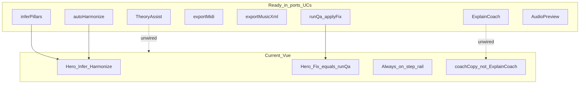

# UI workflow evaluation vs current port state

**Status:** Evaluation snapshot (documentation)  
**Date:** 2026-09-20  
**Depends on:** [`ux-workflows.md`](ux-workflows.md) · [`workflow-guides.md`](workflow-guides.md) · [`ui-presentation-layer-design.md`](ui-presentation-layer-design.md) · [`implementation-plan.md`](implementation-plan.md)  
**Code anchors:** `web/src/ports/` · `web/src/application/` · `web/src/composition/` · `web/src/stores/arrangement.ts` · Vue shell under `web/src/views/` + `web/src/components/`

This document records how far the **current ports / application layer** support the locked UX workflows, and what the transitional Vue shell still fails to expose.

---

## 1. Verdict

**Engine ports and application use-cases can already run the Quick happy path and most Guided/Review mutations.** The gap is almost entirely **presentation information architecture and DTO wiring**, not missing domain math.

The live UI is a **single transitional shell**:

- [`web/src/views/EditorView.vue`](../web/src/views/EditorView.vue)
- [`web/src/components/WizardPanel.vue`](../web/src/components/WizardPanel.vue)
- [`web/src/components/MelodyRoll.vue`](../web/src/components/MelodyRoll.vue)

That shell mixes Quick CTAs with an always-on Approach Two step rail and largely bypasses newer coach/theory use-cases (`ExplainCoach`, `TheoryAssist`).

**Gate status**

| Gate | Status |
| --- | --- |
| Part A1–A3 doc↔code regression tests | **Green** — [`docCodeSyncRegression.test.ts`](../web/src/domain/arranging/docCodeSyncRegression.test.ts) |
| U0 view-model / DTO freeze | **Unblocked** — not started |
| U1 mode chrome rewrite | Blocked on U0 |

Do not start a mode/shell rewrite until presentation DTOs exist. Optional **U0.5** current-shell honesty fixes (hero Fix CTA, enablement copy, QA debounce) may ship without waiting on a full U1 rewrite.



---

## 2. Port readiness (what workflows can call today)

Composition root: [`web/src/composition/createAppServices.ts`](../web/src/composition/createAppServices.ts).

| Capability | Port / use-case | UI today |
| --- | --- | --- |
| Infer / confirm pillars | [`InferPillars.ts`](../web/src/application/InferPillars.ts) | Wired via store |
| Auto-harmonize + candidates | [`AutoHarmonize.ts`](../web/src/application/AutoHarmonize.ts) | Wired; returns raw `HarmonizeCandidate[]` |
| Live QA + Fix / Fix-all-safe | [`RunQa.ts`](../web/src/application/RunQa.ts), [`ApplyFix.ts`](../web/src/application/ApplyFix.ts) | Wired; **hero “Fix issues” only calls `runQa`** |
| MIDI export (block on errors) | [`ExportMidi.ts`](../web/src/application/ExportMidi.ts) + MidiExporter | Wired |
| MusicXML export | [`ExportMusicXml.ts`](../web/src/application/ExportMusicXml.ts) | UC ready; **no UI** |
| Hear / compare | AudioPreview port | Wired in Vue via local `createAudioPreview()`; no `HearRequest` DTO |
| Teach / Learn / Why | [`ExplainCoach.ts`](../web/src/application/ExplainCoach.ts) | Headless ready; UI uses [`coachCopy`](../web/src/domain/arranging/coachCopy.ts) + [`coachTips`](../web/src/domain/arranging/coachTips.ts) |
| Autocomplete / narrative / Romans | [`TheoryAssist.ts`](../web/src/application/TheoryAssist.ts), DocumentOps | Engine only |
| Notation miniatures | NotationRenderer (abcjs) | Wired in composition; **unused by Vue** |
| Full score / Tag Studio | Verovio / Tag Studio ports | **Absent** (presentation phase U6) |

**Store debt:** [`arrangement.ts`](../web/src/stores/arrangement.ts) still bypasses [`ProjectCrud`](../web/src/application/ProjectCrud.ts), [`UpdateMelody`](../web/src/application/UpdateMelody.ts), and DocumentOps embellish paths for several mutations (inline domain calls).

**Ports inventory (implemented)**

| Port | Default adapter |
| --- | --- |
| `IdGenerator`, `Clock` | `adapters/persistence/systemServices.ts` |
| `ArrangementRepository` | IndexedDB (`indexedDbRepository.ts`) |
| `AudioPreview` | `webAudioPreview.ts` |
| `MidiExporter` | `arrangementMidiExporter.ts` |
| `MusicXmlExporter` | `arrangementMusicXmlExporter.ts` |
| `NotationRenderer` | `abcjsRenderer.ts` |
| Ranking weights | Domain defaults via composition `rankerDeps` (no separate adapter) |

---

## 3. Workflow readiness by mode

Interaction modes are specified in [`ux-workflows.md`](ux-workflows.md) §2. **No `interactionMode` (or equivalent) exists in code** — UC-P05 from [`workflow-guides.md`](workflow-guides.md) is unmet.

### 3.1 Quick Arrange (P0 happy path) — partially runnable, not doc-compliant

| Doc step ([`ux-workflows.md`](ux-workflows.md) §4) | Status |
| --- | --- |
| Melody entry on roll | Works |
| Infer pillars | Works |
| Confirm pillars (human gate) | Works in step panels; **no CTA enablement** (“Confirm pillars first”) |
| Auto-harmonize | Works; not disabled when pillars unconfirmed |
| Hero Fix → focus issues / `applyAllSafeFixes` | **Miswired** — button 3 → `store.runQa` only (`WizardPanel.vue`) |
| Live QA debounce ~150ms | **Missing** — sync `refreshQa` on every mutate |
| Hear ET vs JI as post-clean secondary | Candidate/compare hear exists; no dedicated post-QA hero Hear |
| Export MIDI | Works with error block |
| Mode chrome: hide step rail / advanced closed | **Fail** — full `WIZARD_ORDER` always visible in `EditorView` |
| 20s onboarding overlay | Absent |
| Learn on every lint | Absent |

**Acceptance (presentation B11):** Infer → Harmonize → Fix → Hear → Export **without opening Advanced** is **not met** today.

### 3.2 Guided Lesson — engine steps exist; rail is not a guided workflow

| Expectation | Status |
| --- | --- |
| Document `wizardStep` + tip strip + step panels | Present |
| Exit-gated Next (confirmed pillars, coverage, etc.) | **Missing** |
| Strengthen + embellishment seeds | Partially wired (store → domain embellishments; not always DocumentOps) |
| Done / checklist / artistry–copyright gate UI | **Absent** |
| Contest profile “Learning (soft)” | **Not** Guided Lesson mode — naming collision only |

### 3.3 Review / Polish — QA/fix/export exist; IssueBoard does not

| Expectation | Status |
| --- | --- |
| Flat lint list + Fix / Fix-all-safe | Works |
| Issue board grouped Blockers / Improve / Teach | **Missing** |
| Narrative strip | Engine (`analysisNarrative`) ready; no UI |
| MusicXML export button | **Missing** |
| Stack click → selection / ContextCard | **Missing** (melody-only selection on roll) |

### 3.4 Teaching surfaces (“never stranded”)

| Surface | Engine | UI |
| --- | --- | --- |
| Why? factors | `ExplainCoach` + ranking breakdown | Bullets via `explainCandidate` only |
| Learn + glossary + abcjs | Education catalog + `NotationRenderer` | Not surfaced |
| Dom9 omit / distance / Roman-alt chips | `dom9OmitStrategy`, `distanceFromHome`, `romanForChordDetailed` | Not in presentation |
| Autocomplete popover | `TheoryAssist.autocompleteChordAtNode` / chord autocomplete | Unwired |
| ContextCard (selection-driven) | Design only | Absent |

---

## 4. Critical presentation debt

1. **Hero “3. Fix issues” refreshes QA** instead of focusing the issues panel / invoking safe-fix ([`ux-workflows.md`](ux-workflows.md) CTA table).
2. **Dual coach paths** — live UI on `coachCopy` / `coachTips`; tested path is `ExplainCoach` → will diverge unless U0 unifies.
3. **Vue imports domain hear / JI / tips** in `WizardPanel` — violates “dumb adapter” rule; needs `HearRequest` + store façade.
4. **No interaction mode** — UC-P05 unmet; one chrome for all personas.
5. **Named Part B DTOs missing** — `ModeChrome`, `StepRailState`, `IssueBoardItem`, `CandidateCard`, `StackAnnotation`, `HearRequest` have zero code matches. Only `CoachExplanationDto` (alias of domain `TeachableMoment`) exists in application.

---

## 5. Presentation wiring map (today)

```text
HomeView / EditorView / MelodyRoll / WizardPanel
        → useArrangementStore (stores/arrangement.ts)
        → application: inferPillars, autoHarmonize, listCandidatesForNote,
           applyCandidateToProject, runQa, applyFix, applyAllSafeFixes,
           autoLabelMelodyRoles, strengthenArrangement, exportMidi, confirmAllPillars
        → getAppServices(): repository, idGen, clock, midiExporter, fixRegistry, rankerDeps
        → domain (direct): history, syncStacks, embellishments, orgTips, coachCopy
```

**Application exports not used by Vue/store (representative):** `exportMusicXml`, all `ExplainCoach` entry points, most of `TheoryAssist`, `ProjectCrud`, `UpdateMelody`, most of `DocumentOps`.

---

## 6. Recommended build order

Aligned with [`ui-presentation-layer-design.md`](ui-presentation-layer-design.md) Part B10; status updated after this evaluation:

| Phase | Action | Status |
| --- | --- | --- |
| Part A | Doc↔code regression tests (density, R5, Dom9, counterparts, ExplainCoach contracts, store architecture) | **Done** |
| **U0** | Freeze TS view-models under `application/dto/` (or `docs/ui-view-models.md` + types) + builders: `buildIssueBoard`, `buildCandidateCard`, `buildModeChrome`, `buildStepRailState`, `buildHearRequest`; headless tests; route Why/Learn through `ExplainCoach` | Next |
| **U0.5** | Current-shell honesty: hero Fix → focus/safe-fix, CTA enablement copy, debounced live QA | Optional parallel |
| **U1** | Slice Shell / CoachColumn / ContextCard; add `quick \| guided \| review` mode switch; hide rails by mode | After U0 |
| **U2–U5** | Learn drawer; Dom9/distance/Roman chips + autocomplete; Review IssueBoard; Guided exit-gated StepRail | Progressive |
| **U6** | Verovio score view + Tag Studio port | Later |

**Do not** grow `WizardPanel.vue` further as a god panel; U1 should split along the B7 component inventory.

---

## 7. Out of scope for this snapshot

- Implementing the Vue rewrite or Verovio/Tag Studio.
- Re-auditing domain theory vs BAM/Szabo sources (covered by prior audits + Part A tests).
- Playwright/Vue component tests (deferred until shell rewrite per presentation design A3).

---

## Related

- Interaction SoT: [`ux-workflows.md`](ux-workflows.md)
- Use-case catalog: [`workflow-guides.md`](workflow-guides.md)
- Presentation architecture + phased U0–U6: [`ui-presentation-layer-design.md`](ui-presentation-layer-design.md)
- Engine priority: [`implementation-plan.md`](implementation-plan.md)
- Headless ports track: [`headless-backend-plan.md`](headless-backend-plan.md)
