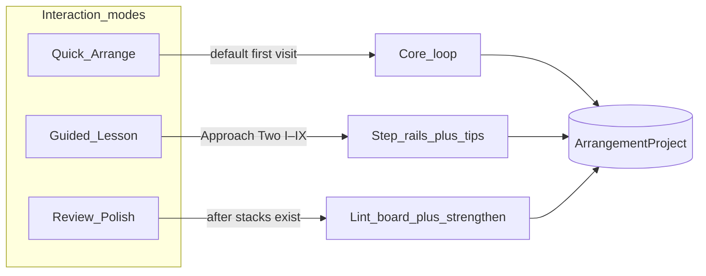
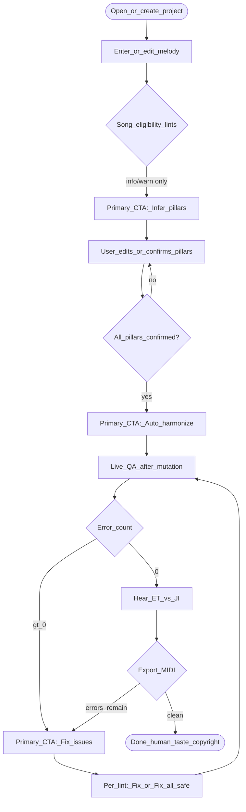
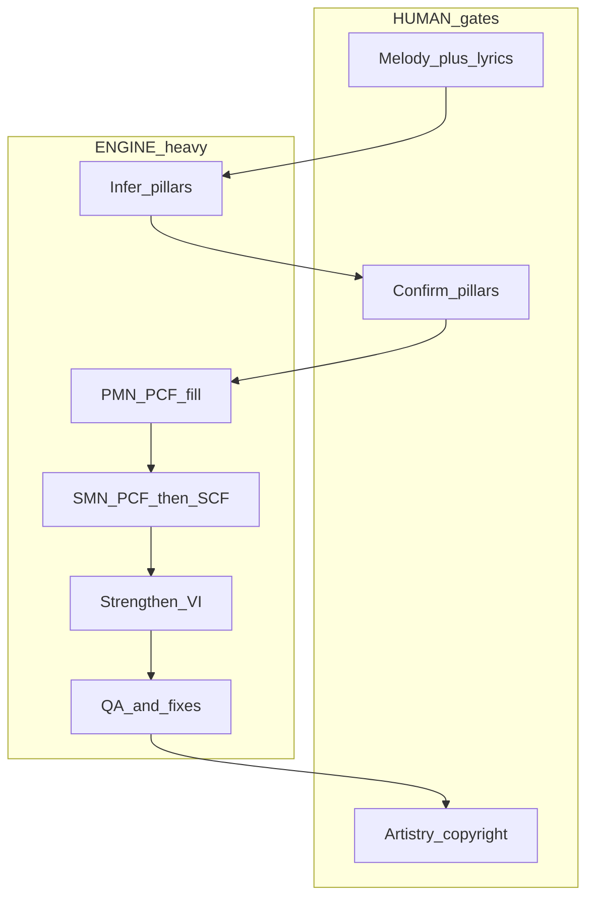
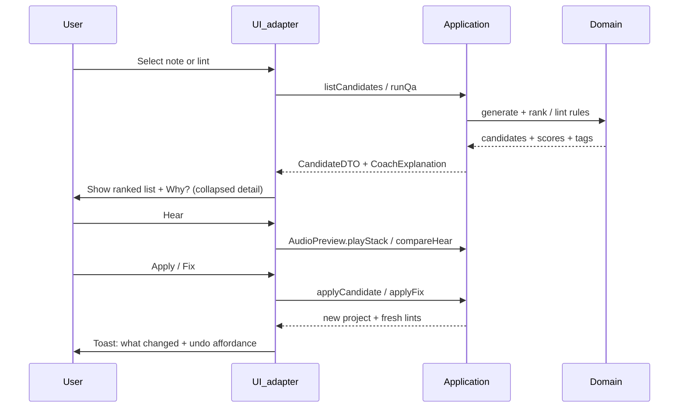
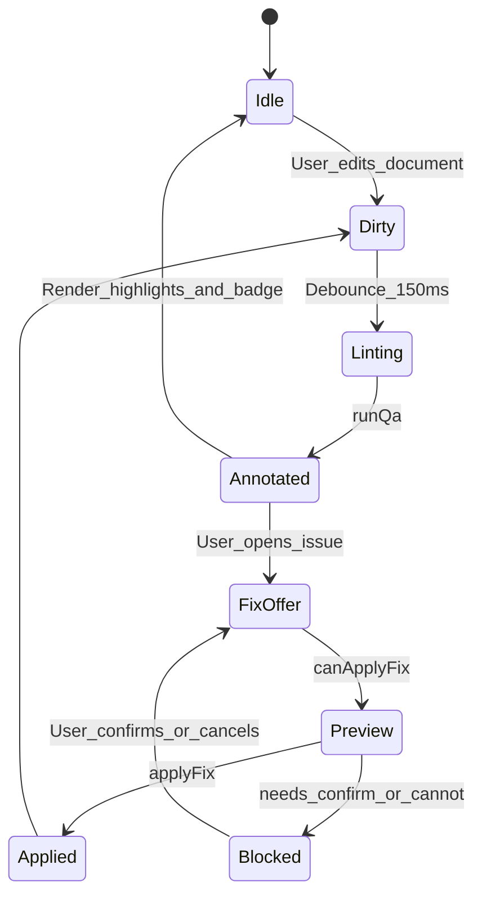
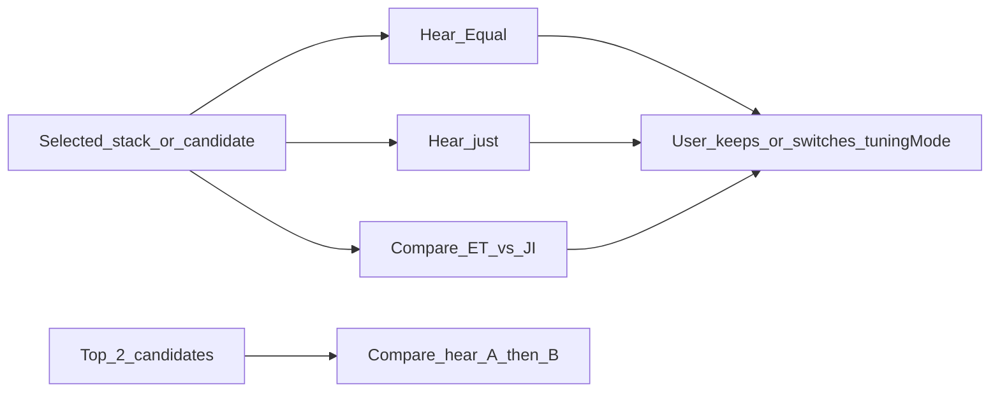
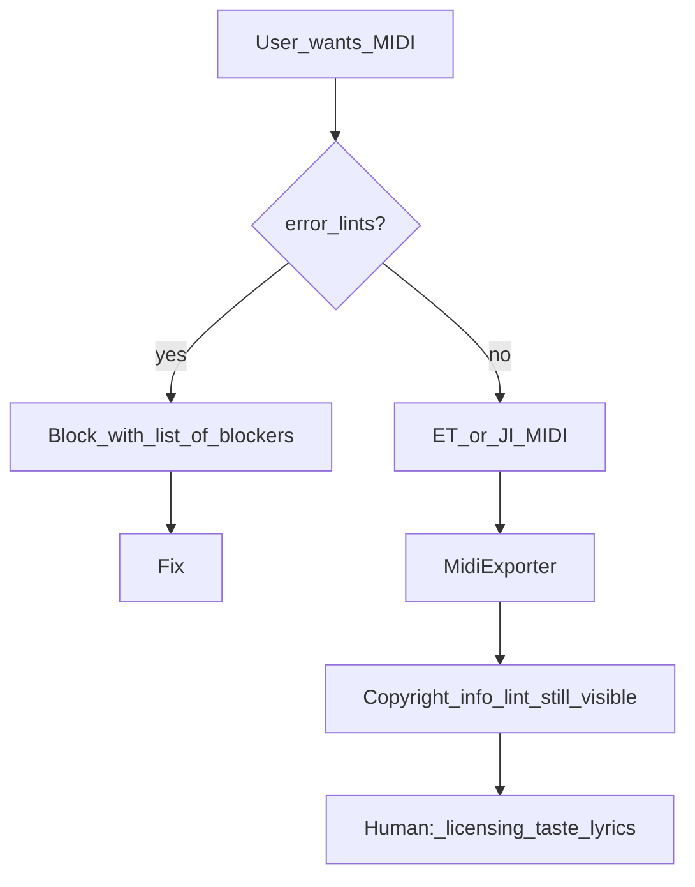
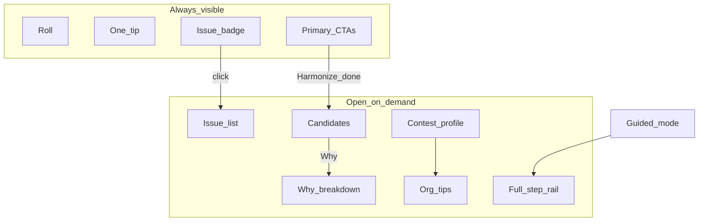

# UX & workflow design — Arranging coach

**Status:** Design lock before UI rebuild  
**Audience:** UI adapters (Vue today; fungible later)  
**Depends on:** Domain + application already shipped ([`implementation-plan.md`](implementation-plan.md), [`knowledge/15-guidance-automation.md`](../knowledge/15-guidance-automation.md))  
**Behavioral specs & full use-case catalog:** [`workflow-guides.md`](workflow-guides.md)  
**Port readiness vs these workflows (snapshot):** [`ui-workflow-evaluation.md`](ui-workflow-evaluation.md)  
**Teachable curriculum (glossary / Why? / citations):** [`../knowledge/16-teachable-curriculum.md`](../knowledge/16-teachable-curriculum.md) · domain `web/src/domain/arranging/education/`  
**Notation miniatures:** `NotationExample` → ABC → **abcjs** (pedagogy only).  
**Full score view/edit roadmap:** [`notation-library-strategy.md`](notation-library-strategy.md) — MusicXML + **Verovio** (OSMD fallback); domain remains source of truth.  
**North star:** As automated and simple as possible, while **teaching why**, and keeping **human gates** (pillars, lyrics, copyright, artistry).

---

## 1. Product promise

The product is not a notation editor first. It is a **guided arranging coach**:

1. Enter a lead melody  
2. Confirm primary pillars (software suggests; human locks)  
3. Let the engine fill harmony under contest rules  
4. Fix remaining issues with one-click repairs that explain themselves  
5. Hear Equal vs Just, then export  

Everything else (full Approach Two steps I–IX, candidate browsing, org tips, embellishments) is **progressive disclosure** — available, never required for a first chart.

### Success criteria (UX)

| Criterion | Concrete meaning |
| --- | --- |
| **3-action happy path** | After melody: Infer → Auto-harmonize → Fix issues |
| **Never silent** | Every suggestion shows *what*, *why*, and *what changed* |
| **Never stranded** | Every error has Fix, Hear, or Learn (glossary) — or explains why human-only |
| **Teach in place** | Why panels use real ranking weights / rule tags, not marketing copy |
| **Safe by default** | Destructive actions (transpose, delete orphans in batch) require confirm |
| **UI fungible** | Behaviors below map to use-cases / DTOs; widgets are replaceable |

---

## 2. Interaction modes (one app, three lenses)

Users choose a **mode** once per project (or switch anytime). Same document; different chrome emphasis.



| Mode | Who | Primary chrome | Engine calls |
| --- | --- | --- | --- |
| **Quick Arrange** | Beginners / “just get a chart” | Big 3 actions + roll + issue badge | `inferPillars` → `autoHarmonize` → `runQa` / `applyFix` |
| **Guided Lesson** | Learners wanting Approach Two | Step rail I–IX + tip strip + Why? | Same + `autoLabelMelodyRoles`, `strengthenArrangement`, embellishment seeds |
| **Review / Polish** | Returning to an existing chart | Issue board, Fix all safe, compare-hear, export | `runQa`, `applyAllSafeFixes`, strengthen, MIDI |

**Default:** Quick Arrange. First project shows a 20-second onboarding overlay that names the three buttons; never a wall of steps.

---

## 3. Information architecture (single composition)

First viewport = **one composition**, not a dashboard.

```
┌─────────────────────────────────────────────────────────────┐
│ Brand · Project title · mode switch · undo/redo · play/MIDI │
├──────────────────────────────┬──────────────────────────────┤
│                              │  Coach column (narrow)       │
│   Melody / stack ROLL        │  • Step tip (1 sentence)     │
│   (full-bleed work surface)  │  • Primary actions (1–3)     │
│                              │  • Issues (collapsed list)   │
│                              │  • Advanced ▸ (closed)       │
├──────────────────────────────┴──────────────────────────────┤
│ Status: errors · warnings · “pillars unconfirmed” · profile │
└─────────────────────────────────────────────────────────────┘
```

**Rules**

- Roll is the visual anchor (product-in-context).  
- Coach column has **one job per section**: tip → act → issues → (optional) deepen.  
- Advanced (candidates, Why breakdown, org tips, profile, JI toggle) starts **collapsed**.  
- No stats strips, pill clusters, or competing CTAs in the first viewport.

---

## 4. Core happy path (Quick Arrange)



### Primary CTAs (only these are “hero” buttons)

| Order | Label | Use-case | Enabled when | Disabled copy |
| --- | --- | --- | --- | --- |
| 1 | **Infer pillars** | `inferPillars` | Melody length ≥ 1 | “Add a melody first” |
| 2 | **Auto-harmonize** | `autoHarmonize` | ≥1 confirmed pillar | “Confirm pillars first” |
| 3 | **Fix issues** | focus Issues panel / `applyAllSafeFixes` | Error or warn count > 0 | “No issues — ready to hear” |

Secondary (never compete with primary): Confirm all pillars, Label PMN/SMN, Strengthen, Export MIDI (ET), Export MIDI (JI).

---

## 5. Guided Lesson mode — Approach Two mapped to engine

Wizard steps already exist on the document (`wizardStep`). Guided mode **rails** the user through them; Quick mode still advances `wizardStep` silently so switching modes never loses place.



| Step | User does | Software does | Teaching moment |
| --- | --- | --- | --- |
| **Melody** | Draw / drag notes; optional lyrics | Snap, range soft-lint | “Lead first — harmony serves the line” |
| **I Infer** | Tap Infer; nudge pillar roots | `inferPillars` | “Pillars = primary harmonic destinations” |
| **II Confirm** | Confirm / edit spans | Mark `confirmed` | **Human gate** — ear over algorithm |
| **III PMN+PCF** | Optional: hear each PMN stack | Auto-fill PCF on PMNs | “Primary melody notes get primary chord family” |
| **IV SMN+PCF** | Optional override role | Label SMN; try PCF | “Secondary notes may still sit on PCF” |
| **V SCF** | Accept passing options | Fill SCF toward next pillar | Show motion tag (R1/R2/…) + Why? |
| **VI Strengthen** | Tap Strengthen | `strengthenArrangement` | “Same chord, stronger lead tone / smoother VL” |
| **VII Variety** | Accept/reject swipe seeds | Embellishment seeds | “Optional color — never required for legality” |
| **VIII Voicing** | Fix VL / doubled third | Fix strategies | Compare-hear top-2 candidates |
| **IX Final** | Export; checklist | Block on errors | Copyright reminder is info, not auto-cleared |
| **Done** | Taste pass | — | Celebrate; link back to Review mode |

**Guided chrome:** step rail + one tip sentence + one primary action for *this* step. Next is disabled until the step’s exit condition is met (see §9).

---

## 6. Teaching system — How & Why (always available)

Teaching is not a separate tutorial app. It is a **contract** on every suggestion.

### 6.1 Explanation DTO (application → UI)

UI never invents pedagogy. It renders:

```ts
type CoachExplanation = {
  headline: string           // “Secondary dominant into the next pillar”
  plain: string              // 1–2 sentences, Approach Two language
  factors: { label: string; value: number; hint?: string }[]  // from explainRankingBreakdown
  ruleTags: RuleTag[]        // R1_p5, springboard, …
  glossaryIds?: string[]     // future C4.5
  hear?: 'stack' | 'compare-top2' | 'et-vs-ji'
}
```

Sources already in domain:

- Ranking: `explainRankingBreakdown` (motion, ring, VL, strongVoice, harmonicity, …)  
- Tags: `ruleTags` on stacks/candidates  
- Copy: `coachCopy` / `coachTips` / `orgTips`  
- Lints: `message` + `ruleId` → mapped lesson blurb table in application (not Vue)

### 6.2 Interaction pattern: Suggest → Explain → Hear → Apply



### 6.3 Why? panel content (minimum)

For a **candidate**:

1. Headline from top positive factor or secondary-dom tag  
2. Factor bars (normalized) — motion / ring / VL / strong lead / harmonicity  
3. One plain sentence: “We prefer this because …”  
4. Buttons: Hear · Compare top 2 · Apply  

For a **lint / fix**:

1. Severity + plain message  
2. “What we’ll change” preview (before/after nature, or “remove orphan stack”)  
3. If destructive: Confirm checkbox  
4. Learn more → glossary / tip (org tip if profile-related)

---

## 7. Live QA & Fix behaviors



### Behaviors

| Behavior | Spec |
| --- | --- |
| **Live QA** | After any mutation (melody, pillar, stack, profile, tonality), debounce → `runQa` |
| **Highlights** | Map lint targets → roll: noteId / stackId / pillar span; severity color |
| **Badge** | `lintSummary`: errors block export; warns invite Fix; info teach |
| **Fix button** | Shown iff `canApplyFix` (probe contract) |
| **Fix all safe** | Skips `key-suggestion`, `lead-range`, and info-only |
| **Destructive** | Transpose / lead-range: explicit Confirm in UI; store may default confirm only after UI says so |
| **Click lint** | Selects target on roll + scrolls coach to that issue |
| **Click roll highlight** | Opens matching issue |

### Issue board grouping (Review mode primary)

1. **Blockers** (error) — must clear for export  
2. **Improve** (warn) — Fix or dismiss-with-reason later  
3. **Learn** (info) — swipe opportunities, copyright, phrase shape  

Never mix Learn into the Fix-all-safe batch.

---

## 8. Melody & roll behaviors (interactive functions)

| Function | User gesture | System response | Teaching |
| --- | --- | --- | --- |
| Add note | Click empty pitch/time | Insert snapped note | Soft range lint if out of TTBB |
| Move / resize | Drag | `updateMelodyNote` + **stack sync** | “Harmony follows the lead” |
| Set role | Context / advanced | PMN/SMN override | Auto-label available as secondary |
| Lyric | Inline under note | Persist lyric | Human gate — export embeds lyric events |
| Select stack | Click harmony | Show candidates for that onset | Why? for current vs alternatives |
| Playhead | Space / transport | Preview stacks under playhead | Cancel timeouts on pause |
| Undo / redo | ⌘Z / ⌘⇧Z | History snapshots | Toast names the restored action |

**Non-goals for v1 UI:** multi-select, clipboard (engine/history ready for later).

---

## 9. Step exit conditions (Guided mode)

| Step | Exit when |
| --- | --- |
| Melody | ≥1 note |
| I | Pillars inferred (may be unconfirmed) |
| II | All pillars `confirmed === true` |
| III–V | Stacks cover all melody onsets (or user Explicitly skips with warning) |
| VI | Strengthen run once *or* skipped |
| VII | Embellishment review dismissed |
| VIII | Error count === 0 |
| IX | Export attempted or checklist acknowledged |
| Done | — |

Skip always available after II, but records `wizardStep` skip reason in UI state (not domain) and surfaces remaining errors.

---

## 10. Hearing & tuning workflows



| Action | Port / domain |
| --- | --- |
| Hear stack | `AudioPreview.playStack` + optional cents from `justCentsForVoicing` |
| ET vs JI | `compareEqualVsJust` |
| Top 2 | `compareHearTopTwo` |
| Project tuning | `tuningMode` on document (affects default hear + MIDI JI flag) |

Teaching line under hear controls: “Just intonation locks barbershop lock — Equal is a drafting convenience.”

---

## 11. Export & done workflow



Done screen (Guided): three checkboxes the user ticks mentally — Taste, Lyrics under lead, Copyright — none auto-cleared by software.

---

## 12. Progressive disclosure map



| Layer | Default | Opens when |
| --- | --- | --- |
| Tip strip | Open | Always (one sentence) |
| Primary CTAs | Open | Mode-appropriate |
| Issues | Closed | Badge click or Fix CTA |
| Candidates | Closed | Note selected after harmonize |
| Why factors | Closed | User expands Why? |
| Org tips | Closed | Profile section |
| Step rail | Hidden in Quick | Guided mode |

---

## 13. Microcopy & teaching tone

- **Voice:** patient coach, contest-aware, never snarky.  
- **Length:** tip ≤ 140 chars; Why plain ≤ 2 sentences.  
- **Terms:** Introduce once with parenthetical — “SCF (secondary chord family)”.  
- **Blame:** Prefer “Outside SAI vocabulary” over “Illegal chord” in learning profile; keep precise in `sai11`.  
- **Success:** After Fix — “Replaced half-dim with major — nearest legal under SAI-11.” + Undo.

---

## 14. UI ↔ application binding (contract for implementers)

| UI intent | Call | Result DTO to render |
| --- | --- | --- |
| Infer | `inferPillars` | pillars + tip “confirm next” |
| Confirm all | `confirmAllPillars` | pillars |
| Harmonize | `autoHarmonize` | stacks + live QA |
| Candidates | `listCandidatesForNote` | ranked + `CoachExplanation` |
| Apply candidate | `applyCandidateToProject` | project + QA |
| QA | `runQa` / `lintSummary` | lints + badge |
| Fix | `canApplyFix` → `applyFix` | patch summary + QA |
| Fix all safe | `applyAllSafeFixes` | applied ids + QA |
| Strengthen | `strengthenArrangement` | stacks |
| Roles | `autoLabelMelodyRoles` | melody roles |
| Export | `exportMidi` | ok \| blocked reasons |
| Hear | `createAudioPreview()` | — |

**Pinia** remains a document + selection façade; it must not contain ranking/lint algorithms.

---

## 15. Empty / error / first-run states

| State | UI |
| --- | --- |
| No projects | Home: one primary “New arrangement” + Demo melody |
| Empty melody | Roll ghost notes + CTA “Click to place lead” |
| No pillars | CTA Infer pulsing once; tip explains pillars |
| Harmonize with 0 candidates for a note | Soft error + “Check key / profile / pillar under this note” |
| Fix apply fails | Should be rare (probe); if so, “No safe repair — try candidates” |
| Export blocked | Modal list of error lints with Jump + Fix |

---

## 16. Accessibility & mobile behaviors (P5–P7)

- All CTAs keyboard reachable; roll has alternative: note list inspector for fine edit.  
- Issues list is the a11y-primary navigation to problems (not color alone).  
- Hear buttons announced with result (“Playing just-tuned stack”).  
- Mobile: coach column becomes bottom sheet; roll full-bleed above; primary CTAs sticky in sheet.  
- Install app affordance in header when `beforeinstallprompt` available.

---

## 17. What we deliberately do *not* automate

| Gate | Why |
| --- | --- |
| Pillar confirmation | `GO_WITH_LIMITS` — ear owns primary roots |
| Lyrics | Meaning-bearing; human |
| Copyright / licensing | Legal |
| Final artistry / taste | Contest subjectivity |
| “Always pick #1 candidate” without QA | Teaching + safety — user sees issues |

---

## 18. Implementation sequence for UI (after this design lock)

1. **Shell** — layout §3, mode switch, tip + 3 CTAs, badge  
2. **Quick path** — wire Infer / Harmonize / Fix to use-cases; live QA highlights  
3. **Explain** — Candidate Why? from `explainRankingBreakdown` + coach copy  
4. **Hear** — stack / ET–JI / top-2 via composition `createAudioPreview`  
5. **Guided rail** — step exit conditions §9  
6. **Review board** — grouped issues + Fix all safe  
7. **Polish** — empty states, a11y, mobile sheet  

Domain work should not block (1)–(4). Remaining engine depth (denser Dom9 omit, glossary) can land behind the same DTOs.

---

## 19. Design checklist (acceptance before “UI done”)

- [ ] New user reaches exportable draft with only Infer → Harmonize → Fix  
- [ ] Every Fix button corresponds to successful `canApplyFix`  
- [ ] Every candidate offers Hear + Why with real weight factors  
- [ ] Destructive transpose requires explicit confirm  
- [ ] Export blocked on errors with jump-to-issue  
- [ ] Advanced chrome collapsed by default  
- [ ] Guided mode can teach I–IX without changing Quick document schema  
- [ ] No business rules in Vue beyond DTO mapping  

---

## 20. Relationship to other docs

| Doc | Role |
| --- | --- |
| This file | **UX workflows, teaching patterns, UI contracts** |
| `implementation-plan.md` | Backlog / architecture / phase status |
| `knowledge/15-guidance-automation.md` | Coach automation rationale |
| `feasibility.md` | `GO_WITH_LIMITS` |
| `integration-singtags.md` | Later merge — reuse domain, not this Vue chrome |
