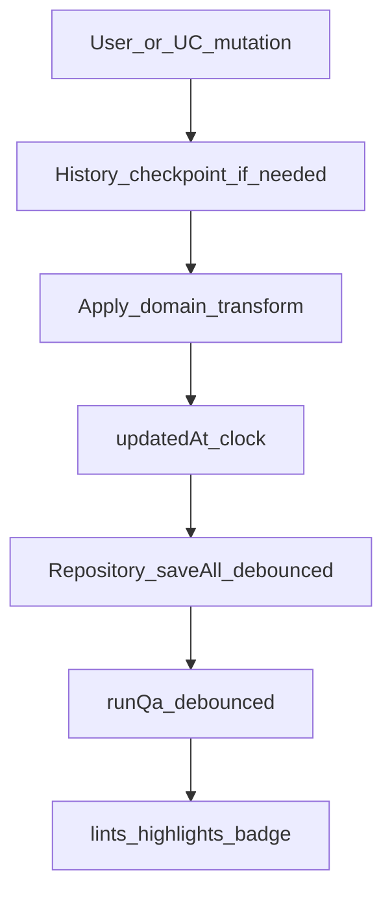
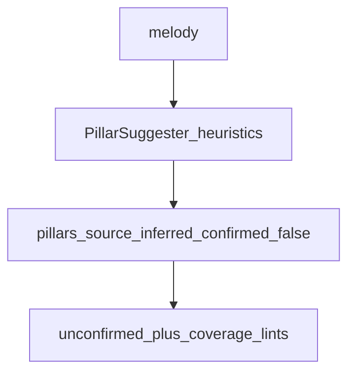
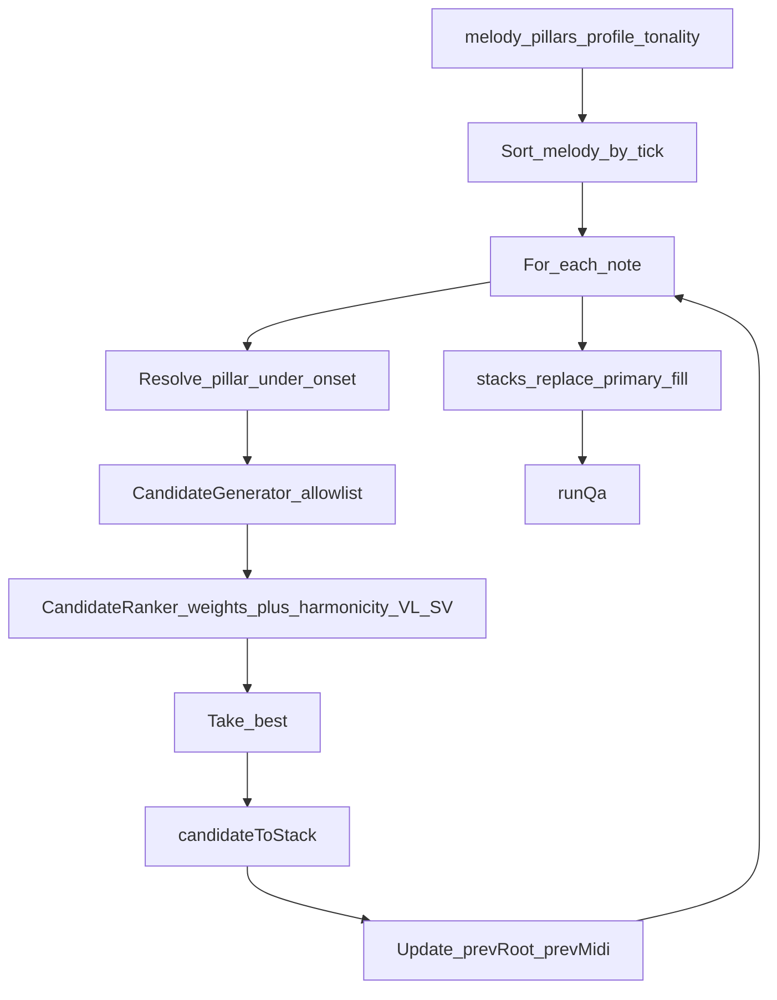
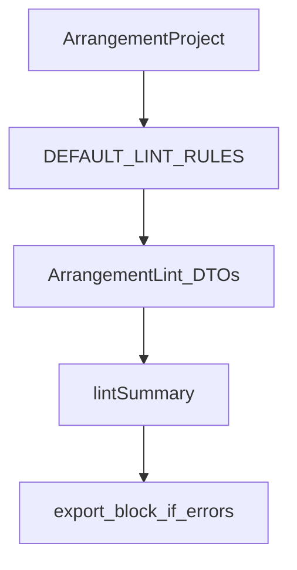
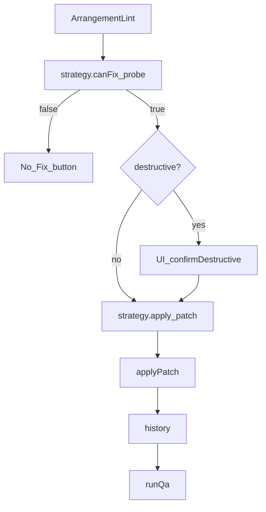
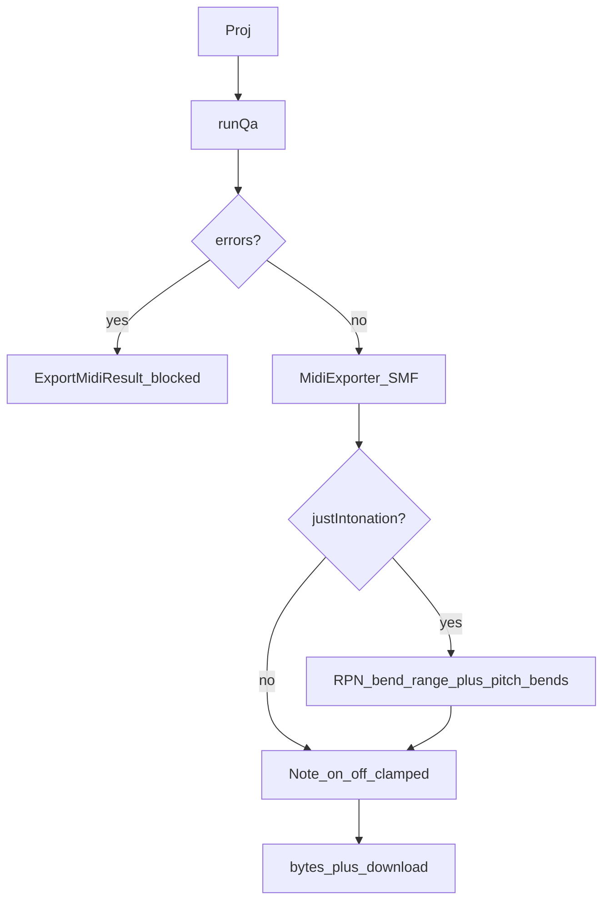
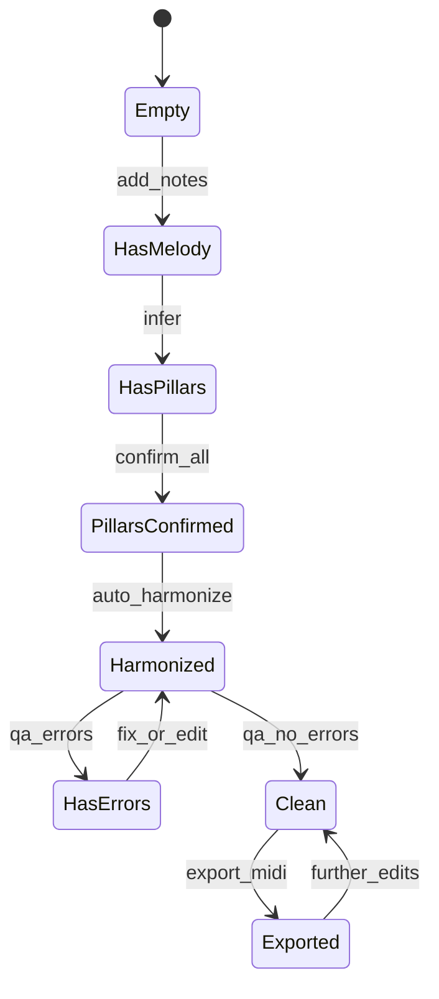

# Workflow behavior guides & user use-case catalog

**Status:** Behavioral specification (companion to [`ux-workflows.md`](ux-workflows.md))  
**Audience:** Product, UI implementers, domain maintainers  
**Principle:** Every user use-case maps to an internal workflow; every internal workflow has observable teaching output.

Related: [`ux-workflows.md`](ux-workflows.md) (modes, chrome, teaching patterns) · [`ui-workflow-evaluation.md`](ui-workflow-evaluation.md) (port readiness snapshot) · [`implementation-plan.md`](implementation-plan.md) · [`feasibility.md`](feasibility.md) (`GO_WITH_LIMITS`)

---

## 0. How to read this document

| Term | Meaning |
| --- | --- |
| **User use-case (UC-*)** | A job the arranger wants to finish (“get a legal contest draft”) |
| **User workflow (UW-*)** | Ordered human steps + UI behaviors to complete one or more UCs |
| **Internal workflow (IW-*)** | Engine/application pipeline that runs when the user acts |
| **Human gate** | Step software must not auto-complete (pillars, lyrics, copyright, taste) |
| **Teaching moment** | Required explanation surface (tip, Why?, lint Learn, toast) |

**Invariants (all workflows)**

1. Document mutations go through application use-cases (or thin store façade calling them).  
2. After mutation → debounced `runQa` → highlights + badge.  
3. Fix UI only if `canApplyFix` is true.  
4. Destructive ops require explicit confirm.  
5. Export blocked while any **error** lint remains.  
6. Undo restores prior document snapshot.

---

## 1. Personas & goals

| Persona | Primary goal | Default mode |
| --- | --- | --- |
| **Novice arranger** | First legal TTBB draft under a melody | Quick Arrange |
| **Student / chapter learner** | Understand *why* chords were chosen | Guided Lesson |
| **Experienced arranger** | Fast fill + polish VL / color | Quick → Review |
| **Coach / educator** | Demo Approach Two live | Guided Lesson |
| **Returning editor** | Fix issues and export MIDI | Review / Polish |

---

## 2. User use-case catalog

Use-cases are **outcomes**. Priority: **P0** must work for MVP UI; **P1** polish; **P2** later (Tag Studio, MusicXML, etc. excluded from P0).

### 2.A Project & session

| ID | Use-case | Priority | Actor | Success looks like |
| --- | --- | --- | --- | --- |
| UC-P01 | Create a new arrangement project | P0 | Any | Empty project with title, default profile `sai11`, tuning `equal` |
| UC-P02 | Open an existing project | P0 | Any | Document restored from IndexedDB |
| UC-P03 | Rename / set BPM / tonality / flats | P0 | Any | Fields persist; QA refreshes |
| UC-P04 | Choose contest profile (SAI-11 / BHS / learning) | P0 | Any | Allowlist changes; illegal natures re-lint |
| UC-P05 | Switch interaction mode | P0 | Any | Same document; chrome changes |
| UC-P06 | Undo / redo last meaningful edit | P0 | Any | Melody/pillars/stacks restored |
| UC-P07 | Install as PWA / work offline | P1 | Any | App install prompt; projects survive reload |
| UC-P08 | Duplicate project | P1 | Any | Copy with new id |
| UC-P09 | Delete project | P0 | Any | Removed from repo + history |

### 2.B Melody entry & editing

| ID | Use-case | Priority | Success |
| --- | --- | --- | --- |
| UC-M01 | Enter lead melody by placing notes | P0 | Notes on roll, snapped |
| UC-M02 | Load demo melody to explore | P0 | Seed melody + tip to Infer |
| UC-M03 | Move / resize / re-pitch a note | P0 | Stack sync keeps harmony aligned |
| UC-M04 | Delete a note | P0 | Orphans cleaned or linted |
| UC-M05 | Mark PMN vs SMN (manual) | P0 | Role overrides auto |
| UC-M06 | Auto-label PMN/SMN | P0 | Heuristic roles applied |
| UC-M07 | Attach lyric syllables | P0 | Lyrics on events; MIDI lyric events |
| UC-M08 | See lead-range / eligibility feedback | P0 | Soft lints; optional transpose Fix |
| UC-M09 | Change key suggestion / transpose chart | P0 | Confirm → melody+stacks+pillars+tonality shift, MIDI clamped |

### 2.C Pillars (Approach Two I–II)

| ID | Use-case | Priority | Success |
| --- | --- | --- | --- |
| UC-R01 | Infer primary pillars from melody | P0 | Suggested pillars; unconfirmed |
| UC-R02 | Edit pillar root / span | P0 | Manual override |
| UC-R03 | Confirm a single pillar | P0 | `confirmed=true` |
| UC-R04 | Confirm all pillars | P0 | Ready for harmonize |
| UC-R05 | Understand missing coverage | P0 | `missing-pillar` lint with Jump |
| UC-R06 | Refuse to auto-lock pillars | P0 | **Human gate** — no silent confirm |

### 2.D Harmonize & candidates

| ID | Use-case | Priority | Success |
| --- | --- | --- | --- |
| UC-H01 | Auto-harmonize entire melody | P0 | Stack per onset under profile |
| UC-H02 | See ranked alternatives for a note | P0 | Candidate list + scores |
| UC-H03 | Understand why #1 was chosen | P0 | Why? with weight factors + tags |
| UC-H04 | Hear a candidate (ET or JI) | P0 | Audition via AudioPreview |
| UC-H05 | Compare top-2 candidates | P0 | A then B playback |
| UC-H06 | Apply an alternate candidate | P0 | Stack replaced; QA refresh |
| UC-H07 | Prefer SCF on SMNs | P0 | Passing layer options appear |
| UC-H08 | Stay inside contest vocabulary | P0 | Generator filters by profile |

### 2.E Strengthen, variety, voicing (VI–VIII)

| ID | Use-case | Priority | Success |
| --- | --- | --- | --- |
| UC-S01 | Strengthen weak stacks (Step VI) | P0 | Better-scoring replacements where gain ≥ threshold |
| UC-S02 | Find swipe / embellishment opportunities | P1 | Seeds + optional apply |
| UC-S03 | Improve voice leading | P0 | VL lint → Fix or pick candidate |
| UC-S04 | Fix doubled third / incomplete triad / thin ninth | P0 | Re-voice via Fix |
| UC-S05 | Soften dull / non-ringing sonority | P1 | Dull-harmonicity lint → Fix |
| UC-S06 | Add secondary-dominant color when few BS7s | P0 | few-sevenths Fix |

### 2.F QA, coaching, learning

| ID | Use-case | Priority | Success |
| --- | --- | --- | --- |
| UC-Q01 | See live issue count while editing | P0 | Badge errors/warns/info |
| UC-Q02 | Jump from issue to roll target | P0 | Selection + highlight |
| UC-Q03 | One-click fix a single issue | P0 | Apply + toast what changed |
| UC-Q04 | Fix all safe issues in batch | P0 | Skips destructive/info |
| UC-Q05 | Learn what a lint means | P0 | Learn blurb / tip / org tip |
| UC-Q06 | Follow Approach Two step-by-step | P0 | Guided mode exit conditions |
| UC-Q07 | Read org-specific guidance (SAI/BHS/TTBB) | P1 | Org tips by profile |
| UC-Q08 | Acknowledge copyright reminder | P0 | Info lint; not auto-cleared |
| UC-Q09 | Compare Equal vs Just on a stack | P0 | Dual hear |

### 2.G Export & handoff

| ID | Use-case | Priority | Success |
| --- | --- | --- | --- |
| UC-E01 | Export MIDI (equal temperament) | P0 | SMF Type 1 TTBB |
| UC-E02 | Export MIDI with JI pitch bends | P0 | RPN + bends; notes 0–127 |
| UC-E03 | Be blocked from export until errors cleared | P0 | Clear blocker list |
| UC-E04 | Know remaining human work after export | P0 | Done checklist: taste, lyrics, copyright |
| UC-E05 | Export MusicXML / sheet | P2 | Deferred |
| UC-E06 | Open in Tag Studio viewport | P2 | Deferred |

### 2.H Teaching / meta

| ID | Use-case | Priority | Success |
| --- | --- | --- | --- |
| UC-T01 | Understand PCF vs SCF in context | P0 | Tip + Why on candidates + glossary |
| UC-T02 | Understand Approach Three motion tags | P0 | Rule-tag lessons (`R1_p5`…) |
| UC-T03 | Understand ring / harmonicity preference | P0 | Factor lessons in Why? |
| UC-T04 | Understand strong lead voicing | P0 | strong-voicing info + SV weight |
| UC-T05 | First-run learn the 3 primary buttons | P0 | Short overlay, dismissible |
| UC-T06 | Open glossary term from any tip | P0 | `education/glossary` |
| UC-T07 | See source citation for a teaching claim | P0 | `SourceCitation` on lesson cards |
| UC-T08 | Learn from a lint without applying Fix | P0 | `explanationForLint` / UW-09 |

---

## 3. Use-case → lint / fix map

| Lint `ruleId` | Typical UC | Fix? | Batch safe? | Teaching |
| --- | --- | --- | --- | --- |
| `no-melody` | UC-M01 | — | — | Add notes |
| `no-pillars` | UC-R01 | — | — | Infer |
| `unconfirmed-pillars` | UC-R03–04 | — | — | Human gate |
| `illegal-nature` | UC-H08, UC-Q03 | Yes | Yes | Profile vocabulary |
| `orphan-stack` | UC-M04, UC-Q03 | Yes | Yes | Harmony follows melody |
| `voice-leading` | UC-S03 | Yes | Yes | TTBB order / m2 / P5 |
| `incomplete-triad` | UC-S04 | Yes | Yes | Chord tones |
| `thin-ninth` | UC-S04 | Yes | Yes* | Fuller ninth |
| `doubled-third` | UC-S04 | Yes | Yes | Avoid muddy thirds |
| `aug-pillar` | UC-H02 | Yes | Yes | Last-resort nature |
| `few-sevenths` | UC-S06 | Yes | Yes | Secondary dominant |
| `lead-range` | UC-M08–09 | Yes | **No** | Transpose confirm |
| `key-suggestion` | UC-M09 | Yes | **No** | Transpose confirm |
| `dull-harmonicity` | UC-S05 | Yes | Yes | Ring / JI |
| `strong-voicing` | UC-T04 | — | — | Prefer 3/7 on lead |
| `missing-pillar` | UC-R05 | — | — | Coverage |
| `swipe-opportunity` | UC-S02 | — | — | Optional color |
| `phrase-length` | UC-M08 | — | — | Contest phrase shapes |
| `copyright-reminder` | UC-Q08, UC-E04 | — | — | Human legal |
| `song-eligibility` | UC-M08 | — | — | Range preset |
| `dim-sustain` / `aug-many` / motion lints | UC-Q05 | — / soft | — | Craft |

\*Info severity skipped by Fix-all-safe even if strategy exists.

---

## 4. User workflows (behavioral specs)

Each UW lists triggers, steps, engine calls, teaching, and failure handling.

### UW-01 — First chart (Quick Arrange)

**Resolves:** UC-P01, UC-M01/M02, UC-R01–04, UC-H01, UC-Q01–04, UC-E01–04, UC-T05

| Step | User | System | Teaching |
| --- | --- | --- | --- |
| 1 | New project | Create empty doc; mode=Quick | Overlay: three buttons |
| 2 | Enter or Demo melody | Notes + eligibility lints | “Lead first” |
| 3 | Infer pillars | `inferPillars` | “Destinations, not every chord” |
| 4 | Edit/confirm pillars | Confirm all | Human gate copy |
| 5 | Auto-harmonize | `autoHarmonize` + QA | “PCF then SCF under the lead” |
| 6 | Open issues if badge > 0 | Issue list | Severity groups |
| 7 | Fix / Fix all safe | `applyFix` / `applyAllSafeFixes` | Toast: what changed |
| 8 | Hear ET vs JI | AudioPreview + compare | Lock vs drafting |
| 9 | Export MIDI | Gate on errors | Copyright + taste checklist |

**Failure:** Harmonize with unconfirmed pillars → warn but allow in learning profile; `sai11` still allows fill but keeps unconfirmed warn. Export never allows errors.

---

### UW-02 — Guided Lesson (Approach Two I–IX)

**Resolves:** UC-Q06, UC-T01–04, plus UW-01 outcomes

| Step | Exit condition | Primary CTA | Engine |
| --- | --- | --- | --- |
| Melody | ≥1 note | — | — |
| I | Pillars exist | Infer | `inferPillars` |
| II | All confirmed | Confirm all | `confirmAllPillars` |
| III | PMN stacks present | Auto-harmonize (or continue fill) | roles + harmonize |
| IV–V | Onsets covered | Continue | SCF prefer on SMN |
| VI | Strengthen once or skip | Strengthen | `strengthenArrangement` |
| VII | Review dismissed | Show seeds | embellishments |
| VIII | errors=0 | Fix issues | QA/fixes |
| IX | Export or ack | Export | `exportMidi` |
| Done | — | Open Review | — |

**Behavior:** Next disabled until exit met; Skip allowed after II with warning banner listing unpaid exit conditions.

---

### UW-03 — Replace a chord (explore alternatives)

**Resolves:** UC-H02–06, UC-T01–03

1. User selects melody onset or stack.  
2. System: `listCandidatesForNote` → ranked DTOs + `CoachExplanation`.  
3. Advanced opens Candidates (if was collapsed).  
4. User expands Why? → factor bars.  
5. Hear / Compare top-2.  
6. Apply → history checkpoint → QA.  
7. Toast: “Applied seventh@G — secondary dominant into C pillar.”

---

### UW-04 — Clear export blockers

**Resolves:** UC-Q01–04, UC-E03

1. User taps Export → blocked modal lists **error** lints only.  
2. Jump → select target.  
3. Fix if available; else open Candidates.  
4. Repeat until `lintSummary().errors === 0`.  
5. Export succeeds; warns/info may remain visible.

---

### UW-05 — Transpose into singable range

**Resolves:** UC-M08–09

1. Lint `lead-range` or `key-suggestion` appears.  
2. User taps Fix → Confirm dialog shows semitone delta + “shifts pillars & harmony”.  
3. On confirm: `applyFix` with `confirmDestructive`.  
4. QA refresh; playhead unchanged.

---

### UW-06 — Melody edit after harmonize

**Resolves:** UC-M03–04

1. User drags note.  
2. Internal: history → `updateMelodyNote` → `syncStackAfterMelodyEdit` (revoice if pitch changed).  
3. QA may raise orphan/missing-pillar/VL.  
4. Teaching toast optional: “Updated harmony under the lead.”

---

### UW-07 — Profile switch mid-project

**Resolves:** UC-P04, UC-H08

1. User switches `sai11` → `bhs_extended` or `learning`.  
2. Confirm if stacks contain natures that would become illegal in *target* (optional soft).  
3. Persist profile → full QA.  
4. New illegal natures get Fix.

---

### UW-08 — Review / Polish return visit

**Resolves:** UC-S01–06, UC-Q07, UC-E01–02

1. Open project → mode Review.  
2. Issue board grouped Blockers / Improve / Learn.  
3. Fix all safe → Strengthen → embellishments optional.  
4. Compare-hear critical cadences.  
5. Export ET or JI.

---

### UW-09 — Learn without changing the chart

**Resolves:** UC-T01–04, UC-Q05, UC-Q07

1. User opens Learn on an info lint or Why? without Apply.  
2. Org tips / glossary (when present).  
3. Hear only.  
4. No document mutation; no history entry.

---

## 5. Internal workflows (engine behavior)

### IW-01 — Document mutation pipeline

**Rules:** Selection-only changes do not checkpoint. Destructive fixes checkpoint once per apply.

---

### IW-02 — Infer pillars

**Outputs:** pillars array. Does not write stacks. Does not confirm.

---

### IW-03 — Auto-harmonize

**Invariants:** Only profile-allowed natures; tenor > lead and bass placement filtered at generate; embellishment layers not wiped if policy says keep (strengthen path preserves embellishments).

---

### IW-04 — Rank one candidate set

**Inputs:** unscored candidates (+ optional `prevMidi`, `nextPillarRoot`)  
**Weights:** motion, primaryLayer, seventh, closed, ring, secondaryDominant, augDimPrimaryPenalty, harmonicity, voiceLead, strongVoice  

**Outputs:** sorted `HarmonizeCandidate[]` with `score`, `harmonicity`, `ruleTags`.  
**Teaching:** `explainRankingBreakdown` for Why?.

---

### IW-05 — Live QA

**Debounce:** ~150ms after edits. Synchronous OK for small charts.

---

### IW-06 — Apply fix

**Batch (`applyAllSafeFixes`):** skip info; skip `key-suggestion` & `lead-range`; continue on null applies.

---

### IW-07 — Melody→stack sync

**Trigger:** melody pitch/time/duration change  
**Behavior:** find stack at previous onset → revoice via generator if pitch changed → else shift envelope + lead (and relative tenor nudge)  
**Then:** QA (orphans, VL, etc.)

---

### IW-08 — Strengthen (Step VI)

For each melody onset: re-rank candidates; replace if score improves by `minScoreGain`; keep embellishment stacks; QA after.

---

### IW-09 — Export MIDI

---

### IW-10 — Persistence

**Load:** IndexedDB → if empty and not yet migrated, import localStorage once → set migrate flag.  
**Save:** putAll projects; mark migrated.  
**Empty after migrate:** must **not** re-import legacy.  
**Remove:** delete project + history record.

---

### IW-11 — Audio preview lifecycle

`createAudioPreview()` per view; `dispose` on unmount; pause clears scheduled timeouts; playhead RAF cancels on stop.

---

## 6. Cross-reference matrix (UC → UW → IW)

| User use-case | User workflow | Internal workflow |
| --- | --- | --- |
| UC-P01–P09 | UW-01, UW-08 | IW-01, IW-10 |
| UC-M01–M09 | UW-01, UW-05, UW-06 | IW-01, IW-07, IW-05 |
| UC-R01–R06 | UW-01, UW-02 | IW-02, IW-05 |
| UC-H01–H08 | UW-01, UW-03 | IW-03, IW-04, IW-11 |
| UC-S01–S06 | UW-02, UW-08 | IW-08, IW-06 |
| UC-Q01–Q09 | UW-04, UW-09 | IW-05, IW-06 |
| UC-E01–E04 | UW-01, UW-04 | IW-09 |
| UC-T01–T05 | UW-02, UW-03, UW-09 | IW-04 (+ copy providers) |

---

## 7. State machine — project readiness

UI may show a subtle readiness chip: `Melody → Pillars → Harmony → Clean → Exported` without becoming a dashboard.

---

## 8. Permission & safety matrix

| Action | Needs melody | Needs confirmed pillars | Needs confirm dialog | Undo |
| --- | --- | --- | --- | --- |
| Infer | Yes | No | No | Yes |
| Confirm pillars | Yes | — | No | Yes |
| Auto-harmonize | Yes | Recommended (warn if not) | No | Yes |
| Apply candidate | Yes | Pillar under note | No | Yes |
| Fix safe | — | — | No | Yes |
| Transpose / lead-range | Yes | — | **Yes** | Yes |
| Export | Yes | — | No (hard block on errors) | N/A |
| Delete project | — | — | Yes | No |

---

## 9. Non-goals (explicit)

| Non-goal | Rationale |
| --- | --- |
| Fully auto-arrange with no pillar confirm | Violates `GO_WITH_LIMITS` |
| Auto-clear copyright | Legal human gate |
| Invent lyrics | Meaning-bearing |
| Guarantee contest win | Heuristic coach, not adjudicator |
| MusicXML / Tag Studio in P0 UI | Deferred P2 |
| Multi-select / clipboard in P0 | Deferred; undo covers mistakes |

---

## 10. Acceptance for “workflows complete” (before UI sign-off)

- [ ] Every **P0** UC has a UW path and IW backing  
- [ ] UW-01 completable without Guided mode  
- [ ] UW-03 always shows Why? with real factors  
- [ ] UW-04 blocks export and recovers via Fix  
- [ ] UW-05 never transpose without confirm  
- [ ] UW-06 never leaves lead desynced from stack after drag  
- [ ] IW-10 empty-IDB does not resurrect legacy projects  
- [ ] Teaching: no silent Fix; toast or Why for every apply  

---

## 11. Document maintenance

When adding a lint, fix, or use-case:

1. Add row to §2 (UC) and §3 (lint map)  
2. Extend or add UW in §4  
3. Note IW impact in §5  
4. Update matrix §6  
5. Keep [`ux-workflows.md`](ux-workflows.md) chrome rules in sync  

Statuses for *engine* shipping stay in [`implementation-plan.md`](implementation-plan.md); this file owns **behavior contracts**.
