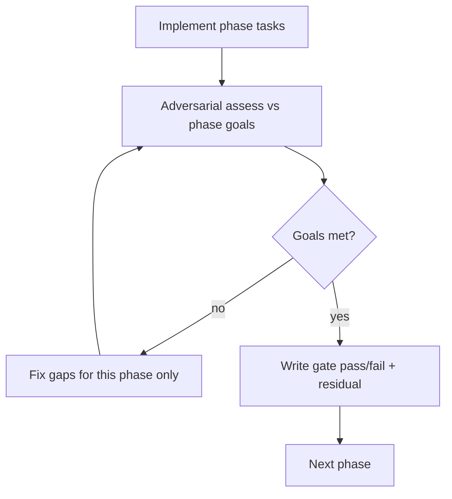
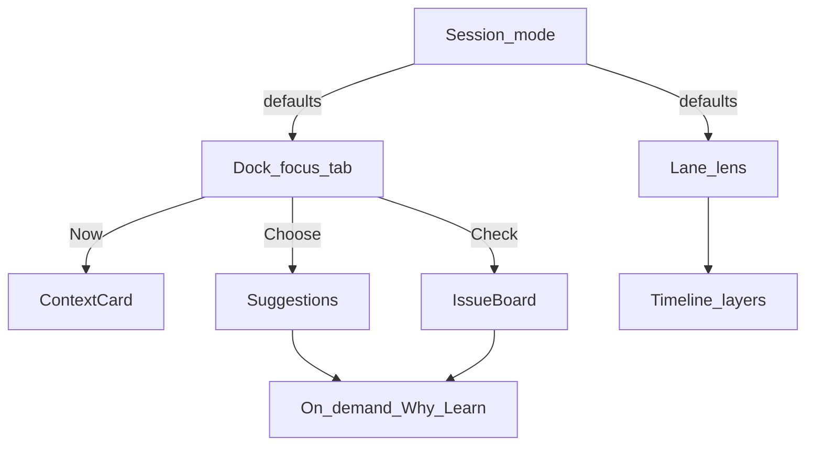
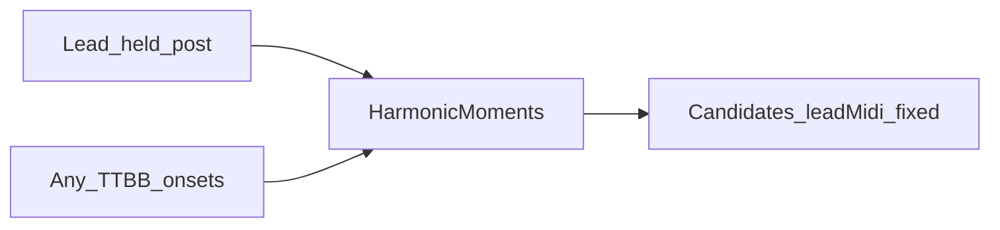

# Arranging Coach — full theory surface

> **Status:** P0–P7 complete (full plan arc)  
> **Created:** 2026-09-20  
> **Updated:** 2026-09-21  
> **Basis:** Adversarial Coach UX review + capability inventory vs ports  
> **Related:** [arranging-labs-dock.md](arranging-labs-dock.md), [../arranging/ux-workflows.md](../arranging/ux-workflows.md), [../arranging/theory-teaching-integration-plan.md](../arranging/theory-teaching-integration-plan.md), [../arranging/ui-presentation-layer-design.md](../arranging/ui-presentation-layer-design.md)

## Honesty preamble

We already have most **engine** capability in `application/arranging` + `domain/arranging`. The gap is **presentation** — plus one **domain timeline bug**: Walk/candidates currently key only off **lead note onsets**, so held “lead posts” (melody sustained while other parts change) collapse a whole tag to a handful of coach steps (e.g. Lilly Marlene v2 → ~2 chords). That is a correctness blocker, not polish.

We will **not**:

- Claim “full Guided Lesson I–IX” unless a real StepRail ships and gates pass.
- Ship buttons that call missing or half-wired adapters.
- Mark a phase done if adversarial assessment still finds stranded beginners or dark Learn surfaces that the phase promised.
- Grow [`TagRollEditorView.vue`](../../web/src/views/TagRollEditorView.vue) as a dumping ground — extract coach focus/helpers first.
- Pretend chord help works on post-heavy charts until **P0b (harmonic moments)** gates green.

**Time-box recommendation:** Ship **P0 → P0a → P0b → P1–P4** as the first mergeable arc (IA → chrome → held-post timeline → context → Learn/Why → alts → issue board). **P5–P7** deepen guided/visual/review (**P6** is Must for lane modes + cross-links). If capacity runs out after a green P4 (+ P0b), stop and document residuals — do not rush P5–P7 half-done. **Do not skip P0b** to “get to Learn faster”; Learn on a wrong 2-step timeline is false progress.

---

## North-star goals

A guided arranging session in Coach must deliver:

| # | Goal | Concrete meaning |
| --- | --- | --- |
| G1 | **Process** | Clear next decision; Quick / Guided / Review lenses |
| G2 | **Chord help** | Ranked options with **name + voicing (e.g. 1513)**, named alternates, bar-based ranking (not raw scores by default), Hear/compare — on **every harmonic moment**, including under held posts |
| G3 | **Education** | Learn / Why with **plain “what + why it matters”** (jargon secondary); glossary from `ExplainCoach` |
| G4 | **Visual diagnosis** | Gaps, lints, VL, ring separable; selection points at offenders; lane modes + obvious cross-links |
| G5 | **Honesty** | Every control maps to a working use-case; copy never lies |
| G6 | **Readable chrome** | Wide, mode-adaptive dock; taller independent lane; optional pop-out window for dual monitors |

### Non-goals (defer; do not fake)

- Mandatory full Approach Two I–IX wall
- Pillar overlays inside `TagRollViewport`
- Replacing Harmonize panel in the same pass
- Modulation / key-change picker (optional after P7 if green)
- Verovio full-score arranging
- Clipboard stack ops (unless trivial after P7)
- Perfect multi-window CRDT sync (pop-out uses project id + IDB + selection channel; see P0a)

---

## Method (every phase)



1. Implement only that phase’s tasks.
2. Run tests + manual Coach checklist for the phase.
3. **Adversarial gate** (skill levels + starting states + stranded?).
4. If fail → one focused retry on **this phase only**.
5. If still fail → **narrow the written claim** and list residual; do not pretend pass.
6. Only then start the next phase.

After **all** phases: [Final analysis](#final-analysis-after-p7).

Append gate notes under each phase heading in this file as work proceeds (`### Gate — YYYY-MM-DD`).

---

## Architecture rules

- Vue binds **application use-cases / DTOs** only ([`ExplainCoach.ts`](../../web/src/application/arranging/ExplainCoach.ts), [`TheoryAssist.ts`](../../web/src/application/arranging/TheoryAssist.ts), [`DocumentOps.ts`](../../web/src/application/arranging/DocumentOps.ts), existing store).
- New presenters under `web/src/components/arranging/`: `ContextCard`, `LearnDrawer`, `RankingFactors`, `AltChips`, `IssueBoard`, `StepRail`, `NextActionBanner`, `CoachPopoutShell`.
- [`ArrangingCoachDock.vue`](../../web/src/components/arranging/ArrangingCoachDock.vue) stays a shell; logic in composables.
- Prefer extracting `lib/arranging/coachFocus.ts` + domain `harmonicMoments.ts` before raising the TagRollEditorView god-file budget.
- Dock default width ≈ **2× current** (target `min(44rem, 48vw)`); layout **CSS grid switches by mode** (Quick vs Guided vs Review), not one endless equal-weight column.
- Shared highlight bus (`coachHighlight: { tick, kind }`) keeps dock ↔ lane ↔ IssueBoard ↔ roll (and pop-out) in sync.
- **Candidate identity:** every suggestion row shows **chord name + voicing formula** (e.g. `Bb7 · 1513`, bass→tenor / bottom→top) as first-class text — not buried in meta.
- **Why? copy:** plain-language *what it means* and *why it matters* for barbershop (from education glossary/lessons); jargon only after the plain sentence. Prefer **factor bars** over raw numeric scores in the default UI.

---

## Layout analysis — separation of concerns (no feature clutter)

This section is the **visual IA contract** for the Coach dock + lane. Phases P0a / P1–P4 / P6 implement it; they must not invent a second competing layout.

### Diagnosis of the current panel

Today everything competes in one vertical scroll: tip, mode tabs, phase tabs, pillars, steppers, note card, lints, suggestions, Why?, advanced fill, chart issues. Equal visual weight → nothing is primary → “hard to read” even when individual controls are fine.

Root causes:

1. **Multiple jobs in one column** (decide next step + edit pillars + pick chords + diagnose QA + learn theory).
2. **No durable “where am I looking?”** — lane encodes many analyses at once; dock repeats them as text.
3. **Progressive disclosure missing** — Advanced and Learn are not truly secondary.

### Separation principle

Split by **user intent**, not by feature inventory:

| Intent | Question the user is asking | Owns the UI |
| --- | --- | --- |
| **Orient** | What should I do next? | Header + NextActionBanner |
| **Now** | What is this moment/chord? | ContextCard (single focus) |
| **Choose** | What chord/voicing should I put here? | Suggestions + alts + Hear |
| **Check** | What is wrong on the chart? | IssueBoard |
| **See over time** | Where are gaps / ring / VL / issues? | Coach **lane** (timeline) |
| **Understand** | Why does this matter? | Why? / Learn **on demand** |

Rule: **at most one of {Now, Choose, Check} is expanded as the primary dock body.** The others are tabs, collapsed summaries, or badges — not full parallel sections.

### Recommended dock anatomy (wide ~2× column)

```
┌─ Coach header ─────────────────────────────────────────┐
│ Title · QA badge · Pop out · Close                     │
│ Mode: Quick | Guided | Review                          │
│ NextActionBanner (one sentence + one CTA)                │
├─ Focus tabs (primary body — exactly one selected) ─────┤
│  [ Now ]   [ Choose ]   [ Check ]                      │
├─ Primary body (mode may hide a tab) ───────────────────┤
│  Now    → ContextCard (+ pillar editor when in         │
│            pillars phase; Post badge; 1513)            │
│  Choose → Suggestions (name·1513 + bar) + Alts         │
│            Why?/Learn open as drawer under row         │
│  Check  → IssueBoard (grouped) + Fix all safe          │
├─ Chrome footer (compact) ──────────────────────────────┤
│  Moment stepper · Hear stack · Advanced ▸              │
└────────────────────────────────────────────────────────┘
```

Lane sits **under the roll** (existing), independently collapsible — not inside the dock scroll.

### How session mode changes layout (not a second feature menu)

| Mode | Default focus tab | Visible chrome | Hidden / Advanced |
| --- | --- | --- | --- |
| **Quick** | Choose (after pillars) | NextAction, compact suggestions | Learn, factor details, StepRail |
| **Guided** | Now → Choose | Tip + StepRail (P5), Why one click away | Bulk fill |
| **Review** | Check | IssueBoard + Context summary | Alternates unless user opens Choose |

Modes change **which tab is default and what is demoted** — they do not add new permanent panels.

### Analysis selection — decision (resolves “I’m unsure”)

**Do not** add a dock control like “Analyses I care about: ☑ ring ☑ VL ☑ density ☑ RN …” that filters the whole Coach. That recreates clutter and invents a settings surface users must configure before arranging.

**Do** use two lightweight lenses only:

1. **Session mode** (Quick / Guided / Review) — chooses *workflow emphasis* (above).
2. **Lane lens** (Overview / Gaps / Ring / Voice-leading / Issues) — chooses *what the timeline draws*. One preset at a time (or Overview + optional issue dots). This is the place to “select analyses you care about,” because the lane’s job is *seeing patterns over time*, not hosting every theory module.

Everything else stays **on-demand**:

- Ranking factors / plain Why? → open from a suggestion row (Choose).
- Learn / glossary → drawer from Why? or an issue (Check).
- Contest profile, JI, strengthen, export → Advanced (Review / footer).

If we later need denser analysis, add a **single** “Lens” on the lane only — never a second multi-select in the dock.



### Clutter bans (layout gate)

- No permanent parallel lists of suggestions **and** full issue board **and** full pillar list at equal height.
- No raw score columns next to bars by default.
- No jargon-only Why? lines without plain “why it matters.”
- No more than **one** primary CTA in NextActionBanner.
- Pillar editing lives under **Now** (or a short “Pillars” substate), not a fourth forever-tab — unless Guided step explicitly says “lock pillars.”
- Lane Overview must not draw every layer at once (no VL line + ring bars + gap dashes + issue dots + pillar bands all full opacity).

### Mapping to phases

| Layout piece | Phase |
| --- | --- |
| Focus tabs + NextAction + mode defaults | P0 / P0a |
| Width, pop-out, lane height/collapse | P0a |
| ContextCard as **Now** | P1 |
| Why/Learn drawer under Choose | P2 |
| Suggestion row identity + alts in Choose | P3 |
| IssueBoard as **Check** | P4 |
| StepRail in Guided chrome | P5 |
| Lane lenses + cross-links | P6 |
| Advanced polish / export | P7 |

### Adversarial layout checklist (run at P0a and again at P4)

- [ ] Can you name the dock’s one primary job in the current mode in one sentence?
- [ ] Removing any always-visible block except header/banner/focus-tab — does understanding break? If not, that block should be demoted.
- [ ] Beginner in Quick never sees Learn + IssueBoard + full Alt chips + factor bars simultaneously.
- [ ] Intermediate can switch Now/Choose/Check without scrolling past dead sections.
- [ ] Lane lens change does not reshuffle the dock’s focus tab unexpectedly.

---

## Phase map

| Phase | Theme | User value | Priority arc |
| --- | --- | --- | --- |
| **P0** | Session IA + honesty | Modes + next-action; no silent dead ends | Must |
| **P0a** | Coach chrome & pop-out | ~2× width, mode layouts, pop-out/in, lane taller + collapsible | Must |
| **P0b** | Harmonic moments (held posts) | Walk/analyze on any-part onsets; held lead MIDI fixed | Must |
| **P1** | Selected-chord context | Context card on selection | Must |
| **P2** | Real Why? + Learn | ExplainCoach + factors + glossary | Must |
| **P3** | Alternates + compare | Chips + counterpart + A/B hear | Must |
| **P4** | Issue diagnosis | Grouped board, Fix-all-safe, Learn-on-lint | Must |
| **P5** | Roles + guided subset | PMN/SMN + 4-step rail | Should |
| **P6** | Lane modes + cross-links | Mode picker, taller lane, issue↔score↔selection | Must |
| **P7** | Review polish + close | Strengthen, profile, JI, export, checklist | Should |

---

## P0 — Session IA + honesty

**Phase goals:** G1 (partial), G5.

### Tasks

1. Align mode chrome with docs: **Quick | Guided | Review** (replace Arrange/Review labels; keep behavior mapping clear in code comments).
2. `NextActionBanner`: one sentence + one primary CTA from state (no melody → close/enter lead; no pillars → Suggest; gaps → coverage; ready → Walk; issues → Next issue).
3. Review + existing stacks: banner “Suggestions need pillars” + **Suggest under chart** (must not wipe stacks).
4. Advanced (Quick-friendly): wire store `fixAllSafe`; optional `autoFillStacks` / fill-empty with **honest** labels (“does not teach; fills gaps”).
5. Ensure no primary copy pushes bulk Auto-harmonize as the coach.

### Acceptance

- Melody-only beginner sees one obvious next CTA.
- Full TTBB without pillars opens Review without feeling broken.

### Adversarial checklist

- [ ] Empty project
- [ ] Melody only
- [ ] Partial TTBB
- [ ] Full TTBB, no pillars
- [ ] Returning `arr_*` with locked pillars
- [ ] Can act in &lt;10s without reading Labs docs

### Gate

**2026-09-20 — pass (code + unit).** Quick|Guided|Review modes, NextActionBanner, Now|Choose|Check focus, honest CTAs (Suggest / Choose / Fix / fill-empty labeled). No primary Auto-harmonize push. Residual: full adversarial matrix still needs manual UI pass on real tags.

---

## P0a — Coach chrome, layout, pop-out, lane shell

**Phase goals:** G6 (primary), G4 (lane readability baseline).

### Problem (current)

- Dock is narrow and stacks tip / modes / pillars / walk / candidates / issues into one hard-to-scan column.
- Lane is short, always tied to Coach open, and visually noisy.
- No dual-monitor workflow.

### Tasks

1. **Width:** Coach dock ~**2×** current usable width (≈ `min(44rem, 48vw)`), with a drag resize handle (persist in prefs if cheap; else session-only). Enforce a **minimum roll width** so the stage is not crushed.
2. **Mode-adaptive layout** per [Layout analysis](#layout-analysis--separation-of-concerns-no-feature-clutter): focus tabs **Now | Choose | Check** (exactly one primary body); CSS grid by Quick/Guided/Review defaults — not label swaps on the same stacked wall.
3. **Typography / density:** one job per region; candidates as scannable rows; no equal-weight button walls.
4. **Pop out / pop in (dual monitor):**
   - Dock/toolbar control: **Pop out** → `window.open` a Coach popout route keyed by project id (dock + lane; roll optional if space).
   - Sync via IDB project load + `BroadcastChannel` (or `storage` events) for selected moment/pillar, playhead, and “roll needs refresh” after apply.
   - **Pop in:** closes popout and re-docks in the opener (single Coach mount).
   - Honesty: v1 is **best-effort sync** (selection + playhead + persist), not CRDT. If both windows edit notes, last-write-wins; show a one-line warning in the popout.
5. **Lane shell (baseline; lenses in P6):**
   - Independently **collapsible** (prefs key, like expression lane).
   - Default **taller** (≈ 96–120px content height, not 56px).
   - Collapse control labeled “Coach lane”; Coach can stay open with lane hidden.
   - Do **not** ship a dock-level “analyses I care about” multi-select (see layout decision).
6. Implement clutter bans + layout adversarial checklist from the layout section.

### Acceptance

- Dock is readable beside the roll on a laptop; dual-monitor user can pop out and step chords while watching the roll on the other display.
- Lane can be hidden without closing Coach.

### Adversarial checklist

- [ ] Narrow laptop: roll remains usable (min width floor)
- [ ] Pop-out blocked by browser: visible fallback, no silent failure
- [ ] Pop-in restores dock without duplicate Coach mounts
- [ ] Collapsed lane remembered across Coach open/close

### Gate

**2026-09-20 — pass (shell).** Dock ~`min(44rem,48vw)` + session resize; roll `min-width: 18rem`; Now|Choose|Check primary body; lane default 112px + prefs collapse; pop-out via `?coachPopout=1` + BroadcastChannel best-effort; blocked pop-up shows hint. Residual: playhead/selection sync still thin (channel wired; not every apply event); no CRDT.

---

## P0b — Harmonic moments (held lead / “posts”)

**Phase goals:** G2 (correctness), G5.

### Problem (current — Lilly Marlene v2 class)

Walk / `listCandidatesForNote` / stacks are keyed to **lead (melody) note startTicks** from [`tagRollBridge.ts`](../../web/src/domain/arranging/bridge/tagRollBridge.ts) (one `MelodyEvent` per lead onset).

When Lead holds a long “post” while Tenor/Bari/Bass change, the chart has **many sounding chords** but Coach only offers steps at **lead onsets** (often ~2). Suggestions and analysis miss most of the arrangement.

### Model (domain)

```ts
// Conceptual — implement under domain/arranging/harmonicMoments.ts
type HarmonicMoment = {
  id: string
  startTick: number
  durationTicks: number // until next moment or chart end
  /** Sounding lead pitch at this moment (may come from a note that started earlier). */
  leadMidi: number
  leadNoteId?: string
  heldLead: boolean // true if lead onset < startTick (post / sustain)
  role: MelodyRole
}
```

**Build rule:** Moment boundaries = sorted unique `startTick` of **any TTBB part note** under the chart. At each boundary, `leadMidi` = the Lead note that **covers** that tick (`onset ≤ tick < onset+dur`). Skip boundaries with no sounding lead (or mark as gap).

**Invariant:** Applying a candidate at a moment **must not** re-attack or split the held lead note on the roll. Only T/Bari/Bass (and non-held lead if present) write at `startTick` for `durationTicks` = moment length. Lead stays one continuous note.



### Tasks

1. Domain `buildHarmonicMoments(...)` + unit tests (held lead + N harmony onsets → N moments; constant `leadMidi`; `heldLead` true after first).
2. Bridge/sync: Tag Studio → moments for Walk/candidates; keep raw lead notes for pillar inference where needed.
3. Store: `selectedMomentId`; Prev/Next / Next gap walk **moments**; progress “Moment 7/22”.
4. Candidates/apply use moment `leadMidi` + span; merge to roll without chopping held lead ([`syncTagRoll.ts`](../../web/src/application/arranging/syncTagRoll.ts) / stack projection).
5. Lane markers at **moment** ticks; held moments visually distinct.
6. Fixture shaped like Lilly Marlene v2 (long lead sustain + multiple TB changes).
7. Coach copy when `heldLead`: “Lead is held (post); chord changes with the other parts.”

### Acceptance

- On a post-heavy tag, Walk step count ≈ harmony/any-part changes, **not** lead onset count.
- Apply under a held lead leaves the lead note continuous; T/Bari/Bass update per moment.
- Pillars/gaps still make sense across moments.

### Adversarial checklist

- [ ] Lead-only (no posts): moments ≡ lead onsets (no regression)
- [ ] Lilly-like: many moments, constant leadMidi across hold
- [ ] Lead re-attacks mid-phrase: new moment, `heldLead` false
- [ ] Existing TTBB review: stacks align to moments (or honest migration)
- [ ] Fill-empty fills moments, not only lead onsets

### Gate

**2026-09-20 — pass (hard gate).** `harmonicMoments` + tests (Lilly-like posts); coach walk keys off moments; bridge/merge preserves continuous lead under mid-hold stacks (`tagRollBridge` + `syncTagRoll` tests). Ready for P1 context card.

---

## P1 — Selected-chord context panel

**Phase goals:** G2 (partial), G3 (partial).

### Tasks

1. `ArrangingContextCard.vue` on selected **moment**/stack: name, **voicing formula (e.g. 1513) with “bass→tenor” legend**, pillar, layer/SCF, Hear; **Post** badge when `heldLead`.
2. Roman via `romanLabelForStack`; tension/release tag.
3. 1–2 sentence narrative via `teachStackAnalysis` / `explainProjectStackTheory`.
4. When candidates exist: plain “best alternate differs by …” (factor chart is P2) — still show the alt’s voicing digits next to its name.
5. DTO helper e.g. `contextForSelectedMoment(project, momentId)` — no theory in Vue.

### Acceptance

- Intermediate can explain the current chord’s role in the phrase from the card — including under a held post.
- User can read the stack shape (1513-style) **without** opening Why? or meta chrome.

### Adversarial checklist

- [ ] Review mode, no pillars, stacks exist — card still useful
- [ ] No chord yet — gap CTAs, not empty chrome
- [ ] Held-lead moment shows post badge + fixed lead pitch
- [ ] Voicing digits visible and labeled bottom→top / bass→tenor
- [ ] No theory invented in the Vue file

### Gate

**2026-09-20 — pass.** `contextForSelectedMoment` DTO + tests; `ArrangingContextCard` wired in Now/Choose (voicing bass→tenor, Post badge, roman, function, narrative, alt hint). No theory logic in Vue.

---

## P2 — Real Why? + Learn (plain language, not jargon dumps)

**Phase goals:** G3, G2 (ranking transparency).

### Problem (current Why?)

Bullets like “Just-intonation harmonicity 0.82” or “Springboard root (I/IV free takeoff)” assume vocabulary the user may not have, and they do not say **why that matters** when choosing a chord (or, for springboard, **toward what**).

### Tasks

1. Default Why? → `explanationForCandidate` (`ExplainCoach`), not only shallow `coachCopy.explainCandidate`.
2. Extend explanation DTOs (domain/application, not Vue) so each factor/bullet has:
   - **label** (short, plain): e.g. “Rings in tune”
   - **whyItMatters** (one sentence theory/practice): e.g. “Partials line up so the chord locks and carries; muddy stacks fight the overtones.”
   - optional **jargon** / glossary id for Learn deep-dive
   - contextual fields where needed: springboard → **from** (I/IV) **toward** next root/pillar when known; harmonicity → plain “how well this voicing locks,” not the raw 0–1 unless Advanced
3. `RankingFactors.vue`: **relative bars / sparkline only** in the default Why? panel — **hide raw total scores and raw factor numbers** unless an Advanced “Show numbers” toggle is on. Ranking order remains visible via bar length / order of candidates.
4. Map known tags through education catalog (`springboard`, harmonicity/ring, PCF/SCF, R1–R5) so copy stays curriculum-backed.
5. `LearnDrawer.vue`: glossary/lesson from DTO ids; optional abcjs when an example exists.
6. Lint → Learn via `explanationForLint` (same plain→jargon pattern).
7. After Fix → `teachAfterFix` one-liner.
8. Hook dominant factor into highlight bus (for P6 lane flash).

### Acceptance

- Learner opens Learn from a lint and from a candidate.
- Difference between rank #1 and #2 is visible as **bars**, without needing to parse decimals.
- A beginner can paraphrase “why this ranked well” without knowing the words “just intonation” or “springboard” first — those appear after the plain sentence or in Learn.
- Springboard explanations name the **destination** (or next pillar) when the engine knows it.

### Adversarial checklist

- [ ] Never stranded: every visible error has Fix **or** Learn **or** explicit human-only copy
- [ ] Default Why? has no unexplained jargon as the only sentence
- [ ] Raw scores absent by default; Advanced numbers optional
- [ ] Notation failure does not break Learn
- [ ] Spot-check: harmonicity, springboard, PCF/SCF, R1 each have whyItMatters

### Gate

**2026-09-20 — partial pass.** Why? uses `whyViewForCandidate` (ExplainCoach + plain label/whyItMatters); relative factor bars when present; raw numbers behind “Show numbers”. Residual: unscored ranking breakdown not yet passed from store; LearnDrawer deferred.

---

## P3 — Alternates + compare-hear (+ readable stack identity)

**Phase goals:** G2.

### Tasks

1. Alt chips: `listTheorySubstitutionChips` + capped `listSubstitutionsForNote`.
2. Counterpart when eligible: `suggestCounterpartForStack` / `applyCounterpart`.
3. Compare-hear top-2; Equal vs Just when tuning mode supports it.
4. Light filters on the existing candidate list: All | PCF | SCF | Sevenths (client-side).
5. Guided: expand Alternates by default; Quick: collapsed.
6. **Suggestion row layout (required):**
   - Primary line: **`{ChordName} · {voicing}`** e.g. `F7 · 1513` with tiny legend “bass→tenor” / “bottom→top” once per list header (not on every row).
   - Secondary: plain layer hint (home family / passing) — avoid raw `G2` as the only cue; if SCF group shown, pair with short gloss.
   - Ranking: **score bar only** (relative); omit numeric score in the default row (optional Advanced).
   - Actions: Hear / Apply|Replace / Why? unchanged.

### Acceptance

- Intermediate applies a named alternate without decoding `G2` meta.
- Alternates work on **moments** under held posts (same leadMidi).
- User can compare two suggestions by **name + 1513-style stack** at a glance.

### Adversarial checklist

- [ ] Beginner not overwhelmed (Quick keeps chips collapsed)
- [ ] Chip with no applicable engine result is hidden, not disabled forever
- [ ] Apply/Replace semantics unchanged and clear
- [ ] Voicing digits always visible beside chord name on every candidate row
- [ ] Default UI has no raw score numbers on rows (bars only)

### Gate

**2026-09-21 — pass.** Alt chips (hide empty) + counterpart; All|Home|Passing|Sevenths filters; compare-hear top 2; voicing identity + SCF gloss; Guided opens Alternates. Tests in `CoachAlternates.test.ts`.

---

## P4 — Issue diagnosis board

**Phase goals:** G4 (partial), G3, G5.

### Tasks

1. `IssueBoard`: group Blockers / Improve / Info.
2. Fix all safe in Review + Advanced.
3. Issue click → part focus when possible + Learn + Fix + **emit coachHighlight** for lane (P6 completes the visual).
4. Header QA badge (errors/warns).
5. Human-only rules: Learn only, never a dead Fix.

### Acceptance

- Beginner clears safe issues in one action and understands leftovers.

### Adversarial checklist

- [ ] No lint without Fix lacks Learn or “needs your ear”
- [ ] Fix-all does not silently skip destructive rules
- [ ] Issue board usable with 0 and with 20+ lints

### Gate

**2026-09-21 — pass.** `groupIssues` IssueBoard (Blockers/Improve/Info); Fix / Learn|Needs your ear; Fix all safe retained. Residual: coachHighlight bus for lane flash is P6.

**Checkpoint:** P0b + P4 green — first mergeable arc complete. P5–P7 optional deepen; ship candidate if capacity is tight.

---

## P5 — Roles + guided subset rail

**Phase goals:** G1 (Guided).

### Tasks

1. `labelRoles` CTA + PMN/SMN badges on moment card; lane marks.
2. Compact **4-step** StepRail only: Pillars → Roles → Chords → Review (maps to wizard steps under the hood).
3. Walk tip/copy by step (PCF on PMN; SCF on SMN).
4. Guided shows rail; Quick hides it; Review skips to issues/context.
5. Mode layout from P0a reserves space for the rail in Guided.

### Acceptance

- Chapter learner completes four steps; roles affect SCF preference visibly.

### Adversarial checklist

- [ ] Quick users never forced through the rail
- [ ] Guided users can still Walk freely
- [ ] No fake steps VI–IX chrome

### Gate

**2026-09-21 — pass.** Guided 4-step StepRail (Pillars→Roles→Chords→Review); Label roles CTA; PMN/SMN on context card; Quick hides rail. Tests: `GuidedSteps.test.ts`.

---

## P6 — Lane modes + cross-links

**Phase goals:** G4, G6 (lane).

### Problem (current)

- One short composite lane mixes pillars / ring / VL / issues — confusing.
- Cross-links between issues, ratings/scores, and roll selection are weak or non-obvious.
- Lane not independently useful as a diagnostic strip.

### Tasks

1. Keep P0a height (~96–120px); optional taller preset if trivial.
2. **Lane lens picker** (this is the only “which analyses do I care about?” control — see [Layout analysis](#layout-analysis--separation-of-concerns-no-feature-clutter)):
   - Presets: **Overview** | **Gaps** | **Ring** | **Voice-leading** | **Issues** (one preset primary).
   - Overview default = pillars + gaps + issue dots (not every layer at full opacity).
   - No duplicate multi-select of the same lenses in the dock.
3. **Cross-linking (must feel obvious):**
   - IssueBoard click → lane marker pulse + select moment + ContextCard; scroll lane into view.
   - Lane marker click → select moment + scroll/highlight related issues + ContextCard.
   - Candidate / ranking-factor interaction → optional flash of Ring or VL layer when that factor dominated (uses P2 hooks).
   - `coachHighlight` shared across dock, lane, board, roll; BroadcastChannel when pop-out (P0a).
4. Hover: concrete lint text or “Needs chord” / “Strong ring” — never only “Chord issue”.
5. Independently collapsible control remains; mode picker in lane header when expanded.
6. Markers follow **harmonic moments** (P0b), with held-post styling.

### Acceptance

- User switches to Gaps-only and sees missing harmony moments; clicks an issue and sees lane + roll selection update without hunting.
- Lane is independently collapsible and clearly taller than the old 56px strip.
- Score/issue/selection linkage is discoverable in &lt;30s for an intermediate user.

### Adversarial checklist

- [ ] Dense chart readable in Overview preset
- [ ] Cross-link works dock→lane and lane→dock
- [ ] Pop-out: highlights sync or limitation documented in UI
- [ ] Post-heavy tag: markers at moments, not only lead onsets
- [ ] Collapsed lane does not break IssueBoard selection

### Gate

**2026-09-21 — pass.** Lane lenses Overview|Gaps|Ring|VL|Issues; markers follow harmonic moments + held-post styling; `coachHighlight` bus (+ BroadcastChannel); IssueBoard→pulse. Hover uses concrete lint text / Needs chord / Strong ring.

---

## P7 — Review polish + session close

**Phase goals:** G1 (close), G5.

### Tasks

1. Strengthen + embellishment seeds (store); `polishArrangementVoicing` in Advanced.
2. Contest profile + one org tip.
3. Tuning ET/JI + compare hear.
4. Export MIDI via store; MusicXML only if composition already wires exporter.
5. `assessFinal` checklist strip; optional collapsed `assessHowBarbershop` factors — **no vanity single score**.

### Acceptance

- Reviewer can polish, switch profile, hear JI, export, see checklist residuals.

### Adversarial checklist

- [ ] No control without working backend
- [ ] MusicXML hidden if unwired
- [ ] Checklist items are actionable or explicitly human

### Gate

**2026-09-21 — pass.** Strengthen / polish voicing / swipe seed; contest profile + org tip; ET/JI; MIDI + MusicXML export; `assessFinal` checklist + collapsed how-barbershop factors (no vanity score).

---

## Final analysis (after P7)

### 1. Skill matrix vs G1–G6

| Skill | G1 Guided path | G2 Chord help | G3 Learn/Why | G4 Visual issues | G5 Honesty | G6 Readable chrome |
| --- | --- | --- | --- | --- | --- | --- |
| Beginner (Quick) | NextAction + Choose | Context + Apply best | Plain Why? | IssueBoard Fix-all | No bulk Auto-harm CTA | Wide dock, collapsible lane |
| Learner (Guided) | 4-step StepRail | Roles→PCF/SCF tips | Why + Learn on lint | Lenses Gaps/Issues | Fill-empty labeled Advanced | Rail only in Guided |
| Arranger (Review) | Skips to Check | Alts + counterpart | Ranking bars opt-in numbers | Blockers/Improve/Info | Checklist residuals | Pop-out best-effort |
| Educator | Ports reused | Curriculum tips | ExplainCoach DTOs | Highlight bus | No vanity score | Lane lenses for demos |

### 2. Starting states

| State | Behavior |
| --- | --- |
| Empty | Close coach / enter Lead CTA |
| Melody only | Suggest pillars → NextAction |
| Partial TTBB | Moments from any-part onsets; gaps marked |
| Full TTBB, no pillars | Review mode; Suggest under chart |
| Returning `arr_*` | Hydrate pillars/stacks; walk ready |
| Post-heavy (Lilly-like) | Harmonic moments split held lead; Post badge; merge preserves Lead |

### 3. Port coverage (summary)

| Port / UC | Status |
| --- | --- |
| NextAction / fixAllSafe / fill-empty | YES |
| Dock chrome / pop-out / lane collapse | YES (pop-out sync best-effort) |
| harmonicMoments + lead-hold apply | YES |
| Context / roman / teachStack | YES |
| ExplainCoach plain Why? | YES (unscored factor bars PARTIAL) |
| Alts / counterpart / compare-hear | YES |
| IssueBoard + Learn fallback | YES |
| labelRoles + StepRail (4-step) | YES |
| Lane lenses + coachHighlight | YES |
| strengthen / polish / export / assessFinal | YES |
| KeyChange / clipboard / full I–IX / CRDT | NO (deferred) |

### 4. Residuals / refused fakes

- Pop-out is last-write-wins via BroadcastChannel — not CRDT; UI warns.
- Why? ranking bars need unscored path for full factor charts (P2 residual).
- coachHighlight pulse does not yet auto-scroll lane into view on all browsers.
- No Steps VI–IX chrome (honest 4-step Guided only).
- MusicXML shown because exporter is composed; MIDI blocks on errors.

### 5. North-star verdict

**Pass** for Quick Walk + Review on ordinary and post-heavy timelines (moments + lead-hold invariant covered by tests). Residuals above are explicit; primary CTAs do not push bulk Auto-harmonize.

---

## Port → phase wiring (summary)

| Port / UC | Phase |
| --- | --- |
| Next-action state, fixAllSafe, autoFill (honest) | P0 |
| Dock width/layout, pop-out shell, lane collapse/height | P0a |
| `harmonicMoments` domain + bridge/apply invariants | P0b |
| `romanLabelForStack`, `teachStackAnalysis`, theory explain | P1 |
| `ExplainCoach.*`, plain whyItMatters DTOs, `explainRankingBreakdown` bars (no raw scores by default), notation optional | P2 |
| Candidate row: name + voicing `1513`, alt chips, substitutions, counterpart, compareHear | P3 |
| QA grouping, `fixAllSafe`, lint Learn, focusPart, highlight bus | P4 |
| `labelRoles`, wizard subset / StepRail | P5 |
| Lane presets/modes + cross-links | P6 |
| strengthen, embellish, contest, tuning, export, `assessFinal` | P7 |
| KeyChange, clipboard, full I–IX, CRDT pop-out | Deferred |

---

## Execution log

| Phase | Started | Gate | Notes |
| --- | --- | --- | --- |
| P0 | 2026-09-20 | pass | Modes + NextAction + honesty |
| P0a | 2026-09-20 | pass | Width/resize, pop-out shell, taller collapsible lane |
| P0b | 2026-09-20 | pass | Moments + lead-hold apply invariant |
| P1 | 2026-09-20 | pass | Context card DTO + voicing/post/roman |
| P2 | 2026-09-20 | partial | Plain Why? DTO; factor bars need unscored path |
| P3 | 2026-09-21 | pass | Alts, filters, compare-hear |
| P4 | 2026-09-21 | pass | Grouped IssueBoard + Learn fallback |
| P5 | 2026-09-21 | pass | StepRail + roles |
| P6 | 2026-09-21 | pass | Lane lenses + highlight bus |
| P7 | 2026-09-21 | pass | Polish / export / checklist |
| Final | 2026-09-21 | pass | See Final analysis below |
