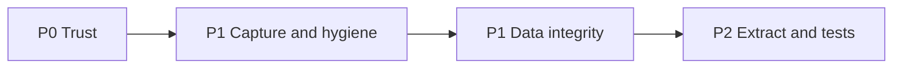

# Audio Recorder — prioritized roadmap

Based on the adversarial UX review and code/architecture audit. Goal: singers can Quick Record, keep takes, crop safely, and export files that actually play — without silent data loss.

## Priority legend

- **P0** — Trust breakers (ship before treating Labs as usable)
- **P1** — Core rehearsal UX / data integrity
- **P2** — Practice differentiation + maintainability
- **P3** — Polish

---

## P0 — Trust (do first)

### 1. Guard leave-while-recording

**Problem:** `onUnmounted` → `cancelRecording()` discards audio with no confirm when navigating away ([`web/src/views/RecorderSessionView.vue`](../web/src/views/RecorderSessionView.vue)).

**Plan:**

- On in-app navigation while `recording`: `onBeforeRouteLeave` confirm: **Stop & save** | **Discard** | **Stay**
- Keep `beforeunload` for tab close
- Prefer default action **Stop & save** when user confirms leave

### 2. Confirm Cancel and Crop

**Problem:** Cancel and Crop are irreversible; crop undo is memory-only.

**Plan:**

- Confirm before Cancel recording
- Confirm before Crop to selection (copy: replaces take; undo available until refresh)
- Short-term: keep one-step undo; document limit in confirm copy
- Follow-up in P1: persist last crop backup in IDB

### 3. Honest export encoding

**Problem:** “MP3” can passthrough WebM/WAV with `.mp3` name/MIME ([`web/src/download/recorderExport.ts`](../web/src/download/recorderExport.ts) + `encodeQualityForDownload('mp3')` → `original`).

**Plan:**

- Recorder export never uses catalog “original passthrough”
- Always decode → encode to chosen format (mp3 / m4a)
- UI labels: **MP3** / **M4A** (drop “Original as published”)
- Add unit tests that mocked WebM input produces re-encode path (not identical bytes)

### 4. Quick Record permission failure cleanup

**Problem:** Session is created before mic grant; deny leaves empty sessions.

**Plan:**

- Preferred: request mic *before* `createSession` on the list page (same user gesture), then create + navigate + continue recording (pass stream via short-lived module/ref, or start after navigation with already-granted permission)
- On failure after create: auto-delete empty session (0 takes) or prompt “Remove empty session?”
- Clear error + Retry on session page

---

## P1 — Capture quality and session hygiene

### 5. Level meter + music/raw mic mode

**Problem:** Forced `echoCancellation` / `noiseSuppression`; no meter ([`web/src/audio/recorderCapture.ts`](../web/src/audio/recorderCapture.ts)).

**Plan:**

- Quick Record settings + session capture: **Processing** = `Music (raw)` (default for singing) | `Voice call` (AEC/NS on)
- Live input level meter (AnalyserNode) on session transport while armed/recording
- Refresh device list after first successful `getUserMedia` (labels populate)

### 6. Pause / resume recording

**Plan:** Use `MediaRecorder.pause()` / `resume()` where supported; hide or disable with tooltip where not; elapsed timer pauses with recording

### 7. Take rename + delete session in-session

**Plan:**

- Inline rename for take labels (wire existing `renameTake`)
- “Delete session” on session page (confirm → back to list)
- Auto-delete or banner for 0-take sessions older than N minutes / on list load

### 8. Search includes labels; list shows time meta

**Plan:**

- Extend [`filterRecorderSessions`](../web/src/types/recorder.ts) haystack: name + notes + labels
- List row: take count, duration sum or latest take length, avoid relying only on colliding timestamp titles

### 9. Honor `session.capture` or stop storing it

**Plan:** Pick one:

- **Use it:** load capture from session on open; persist when changed on that session
- **Or drop** field from model to avoid dead snapshot

Recommendation: **use session.capture** for session page; Quick settings remain global defaults for *new* sessions only.

### 10. Persist crop undo

**Plan:** Store one prior blob per take in IDB (`cropBackup` store or side key) cleared on next crop / delete take / explicit dismiss; survive refresh

---

## P1 — Data integrity and performance

### 11. Atomic take append

**Problem:** `putRecorderTake` then separate `putRecorderSession` for `takeIds` ([`web/src/stores/recorder.ts`](../web/src/stores/recorder.ts)).

**Plan:**

- Single IDB transaction: take + blob + session.takeIds
- On failure, no orphan
- Add DB test for cascade delete and failed-tx behavior (fake-indexeddb)

### 12. Recording start guards + stream leak fix

**Plan:**

- Re-entrancy lock on `startRecording`
- Always `track.stop()` if failure after `getUserMedia` before `active` is set
- Extract `useRecorderCapture.ts` (see P2)

### 13. Player object-URL race

**Plan:** In [`RecorderPlayer.vue`](../web/src/components/RecorderPlayer.vue) `loadTake`: only publish `objectUrl` after successful load; revoke loser when `seq !== loadSeq`

### 14. Stop full-blob scan for totals

**Plan:** `totalBytes` = sum of take `byteLength` (maintain on add/replace/delete); remove `sumRecorderBlobBytes` full materialization from hot path

---

## P2 — Architecture and tests (no god classes)

### 15. Extract orchestration from SessionView

[`RecorderSessionView.vue`](../web/src/views/RecorderSessionView.vue) (~684 LOC) is the main extraction target — not a Local Library god class, but too much lifecycle in one SFC.

**Extract:**

- `useRecorderCapture()` — start/stop/cancel/pause/elapsed/devices/beforeunload/route-leave
- `useRecorderSession(id)` — reload/meta/takes via **store only** (no direct `recorderDb` in view)
- `RecorderQuickSettings.vue` — shared capture + auto labels/notes UI used by list (and optionally session)

Keep [`RecorderPlayer.vue`](../web/src/components/RecorderPlayer.vue) as one component unless crop UI grows further.

### 16. Test pyramid (close critical gaps)

| Layer | Add tests for |
|-------|----------------|
| Unit | Capture start/stop/cancel/settled/stream release; date-range filter; quick prefs; export always re-encodes |
| Store/DB | Atomic addTake; delete session cascade; crop backup persist; totalBytes accounting |
| Prefs/router | Labs flag persist; More link; deep-link auto-enable (mirror Local Library tests) |
| Component smoke | Session Record→Stop mock MediaRecorder; Quick Record navigates with `?quick=1`; leave-while-recording confirm |

---

## P2 — Practice differentiation

### 17. Linked SingTag dual play — **cancelled**

Out of scope for this pass. Session `linkedTag` remains metadata / open-in-catalog only.

---

## P3 — Polish (later)

- Empty-state simplification (hide filters until ≥1 session)
- Focus management for errors; session title as heading
- Sort by `updatedAt` option (“Recently worked”)
- Soft quota warning before record when origin usage high
- iOS Quick Record: keep gesture and `getUserMedia` on same tick before navigate (ties to P0.4)

---

## Suggested implementation waves

| Wave | Scope | Outcome |
|------|--------|---------|
| **1** | P0.1–P0.4 | No silent discard; honest files; no orphan Quick Records |
| **2** | P1.5–P1.10 | Usable mic, pause, rename, search/labels, crop backup, session.capture |
| **3** | P1.11–P1.14 | Safe IDB + streams + perf |
| **4** | P2.15–P2.16 | Lean views; regression safety |

~~Wave 5 (linked SingTag dual play)~~ — **cancelled** for this pass (see Explicit non-goals).

---

## Explicit non-goals (for now)

- Cloud sync / backup of recorder blobs into app-state
- Multi-track overdub mixdown
- Metronome / tuner inside recorder
- My Library merge of sessions
- **Linked SingTag dual play** — cancelled / out of scope for this roadmap pass

---

## Success criteria

- Quick Record → deny mic → **no** empty session left behind
- Record → navigate away → user chooses save or discard (never silent loss)
- Export MP3/M4A opens in standard players
- Crop confirm + undo survives refresh
- `RecorderSessionView` script orchestration mostly in composables; capture/export/DB covered by tests

---

## Implementation checklist

1. [x] Wave 1: leave-while-recording confirm (save/discard/stay) + Cancel confirm
2. [x] Wave 1: Crop confirm + clearer undo messaging
3. [x] Wave 1: Always re-encode recorder exports; fix MP4/MP3 labels + tests
4. [x] Wave 1: Mic before create / cleanup empty Quick Record sessions
5. [x] Wave 2: Music/raw processing default, level meter, device refresh
6. [x] Wave 2: Pause/resume; take rename UI; delete session in-page
7. [x] Wave 2: Search labels; honor session.capture; persist crop backup
8. [x] Wave 3: Atomic addTake; start guards; objectURL race; totalBytes from metadata
9. [x] Wave 4: useRecorderCapture composable; critical path tests
10. [x] ~~Wave 5: Linked SingTag dual play~~ — cancelled
