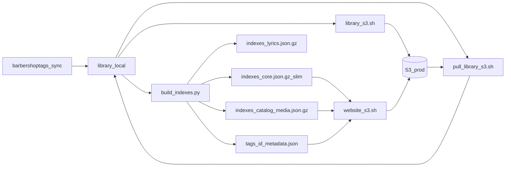

# Catalog secondary docs + S3 library pull

> **Status:** Planned  
> **Created:** 2026-10-05  
> **Updated:** 2026-10-05  
> **Related:** [../publish.md](../publish.md), [../decisions/audio-storage-cache.md](../decisions/audio-storage-cache.md), [../decisions/offline-library.md](../decisions/offline-library.md), [../../build/README.md](../../build/README.md), [../../sync/README.md](../../sync/README.md), [../../deploy/README.md](../../deploy/README.md)

## How AI agents should use this document

1. **Execute one phase at a time.** Do not start phase *N+1* until phase *N* acceptance criteria are met and the phase checklist is checked off.
2. **Check off tasks** (`- [ ]` → `- [x]`) in this file as you complete them; append a short `### Gate — YYYY-MM-DD` note under the phase.
3. **Do not delete catalog fields** — only move them between published artifacts (`core` → `catalog-media`). Per-tag detail JSON and `library/*/metadata.json` stay complete.
4. **Do not rewrite `sync/`** to read SPA indexes. Mirror / lyrics / audio / sheets tooling must keep using local `library/` as SSOT.
5. **Do not change audio encode tiers** (Phase 6 cancelled). No WebP recompress, no ultra bitrate changes, no mix-reconstruction work.
6. Prefer matching existing bash style in [`deploy/library_s3.sh`](../../deploy/library_s3.sh) and helpers in [`deploy/lib/deploy_common.sh`](../../deploy/lib/deploy_common.sh).
7. After each phase that touches TypeScript: run focused Vitest for catalog / sheetPaths / smoke views; fix regressions before claiming the gate.
8. Do **not** commit unless the human asks. Do **not** push unless asked.

---

## North-star

| # | Goal | Meaning |
| --- | --- | --- |
| G1 | **Slim live Browse** | First paint loads a smaller `core.json.gz` (identity + filter fields only) |
| G2 | **Keep all data** | Path-heavy / media-hint fields still publish as `catalog-media.json.gz` (moved, not dropped) |
| G3 | **Deep links unchanged** | `/tags/{id}/metadata.json` remains the tag-detail source |
| G4 | **PC pull from prod** | Fresh workstation can restore `library/` (+ `_state`) from S3 without re-mirroring origin |
| G5 | **Python tooling seamless** | Existing `sync/*.py` keep working after pull; only `build_indexes.py` (+ docs) change for the catalog split |
| G6 | **Encode status quo** | Online HQ / offline ultra behavior stays as in the audio ADR — no further compaction pass |

### Non-goals (do not do in this plan)

- Phase 1 minify / folding expansions into core
- Phase 2 offline pack `details.json.gz`
- Phase 3 hashed manifests / delta packs
- Moving media hosting to R2
- Teaching `sync/` to consume SPA `core` / `catalog-media`
- Changing Opus/WebP encode pipelines
- Dropping `sheetPages` (or any field) from the published surface entirely

---

## Architecture (target)



| Artifact | Role | Blocks first Browse paint? |
| --- | --- | --- |
| `indexes/core.json.gz` | Slim `TagSummary` rows for search / Browse | Yes |
| `indexes/catalog-media.json.gz` | Path / media hints by tag id | **No** — on demand or after paint |
| `indexes/lyrics.json.gz` | Lyrics sidecar (already deferred) | No |
| `tags/{id}/metadata.json` | Tag deep-link detail | Only on tag open |
| `library/*` | Edit SSOT (gitignored) | N/A (dev / publish) |

### Field split (locked)

**Stay on slim core row** (Browse / filter / list):

`id`, `title`, `altTitle`, `arranger`, `key`, `writKey`, `rating`, `ratingCount`, `downloads`, `type`, `collection`, `classic`, `year`, `parts`, `hasSheet`, `audioParts`

**Move to `catalog-media.json.gz` `byId[id]`** (still published):

`sheet`, `sheetPreview`, `sheetPages`, `audioTiers`, `ultraLow`, `partsRecombinable`

**Unchanged elsewhere:**

- Full `spa_metadata` → `web/public/tags/{id}/metadata.json`
- Full mirror metadata → `library/*/metadata.json`
- Offline manifests still built from **tags** JSON via [`build_offline_manifest.py`](../../build/build_offline_manifest.py)

### Target `catalog-media.json.gz` shape (v1)

```json
{
  "version": 1,
  "builtAt": "2026-10-05T12:00:00Z",
  "byId": {
    "240": {
      "sheet": "...",
      "sheetPreview": "...",
      "sheetPages": ["..."],
      "audioTiers": ["playback", "ultra_solo"],
      "ultraLow": "mono_solos",
      "partsRecombinable": true
    }
  }
}
```

Bump `CoreIndex.version` when slim core ships. Client must tolerate **old fat core** (fields still present on the row) until the next full publish.

---

## Python inventory (do not rediscover — act on this)

Repo: **41** `.py` files under `build/` (3) + `sync/` (38). **None** use boto3/S3; all assume local `library/` via [`sync/lib/config.py`](../../sync/lib/config.py) (`ROOT_DOWNLOAD_DIR`, `STATE_DIR`).

| Action | Scripts |
| --- | --- |
| **Must change** | [`build/build_indexes.py`](../../build/build_indexes.py) only (emit `catalog-media`, slim core rows; keep fat tags JSON) |
| **Docs only** | [`build/README.md`](../../build/README.md), [`sync/README.md`](../../sync/README.md), [`docs/publish.md`](../publish.md), [`deploy/README.md`](../../deploy/README.md) |
| **No code change** | `build_offline_manifest.py`, `audio_playable.py`, all of `sync/mirror/*`, `sync/lyrics/*`, `sync/audio/*`, `sync/sheets/*`, `sync/lib/*`, `lambda_sync.py` |
| **Name collision** | [`sync/mirror/build_catalog.py`](../../sync/mirror/build_catalog.py) writes `library/_state/catalog.jsonl` — **not** SPA `catalog-media.json.gz`. Do not conflate. |

`library_s3.sh` already uploads `_state/` (excludes only `.venv` / `__pycache__`). Pull must preserve that so lyric-review queues restore.

---

## Phase 0 — `_state` audit + publish notes

**Goal:** Confirm library push includes `_state/`; document continuity for lyric/Python tooling.

### Tasks

- [ ] Re-read [`deploy/library_s3.sh`](../../deploy/library_s3.sh): confirm no `_state` exclude (only `.venv` / `__pycache__`).
- [ ] Note in [`docs/publish.md`](../publish.md) Working library section: pull restores `_state` **if it was previously pushed**; machine-local WIP never pushed will not appear on S3.
- [ ] Note in [`sync/README.md`](../../sync/README.md): after `./deploy/pull_library_s3.sh`, existing lyric/mirror commands work unchanged.

### Acceptance

- Documented that `_state` is already in push scope; no code change required unless audit finds a new exclude.
- No encode / catalog-split code yet.

### Gate —

_(fill when done)_

---

## Phase 1 — S3 → local pull scripts

**Goal:** Fresh PC can restore prod `library/` (and optionally published indexes) without origin re-mirror.

### Tasks

- [ ] Add [`deploy/pull_library_s3.sh`](../../deploy/pull_library_s3.sh) as inverse of `library_s3.sh`:
  - Source `deploy/lib/deploy_common.sh`; same env: `S3_BUCKET`, `S3_PREFIX`, `S3_LIBRARY_PREFIX`, `DRY_RUN`, `.env.deploy`.
  - `aws s3 sync s3://$BUCKET/[$PREFIX/]library/ → $ROOT/library/`
  - Default **without** `--delete` (preserve local-only WIP).
  - Opt-in `DELETE_LOCAL=1` to pass `--delete` for exact mirror.
  - Same excludes as push (`.venv`, `__pycache__`) so junk is not pulled either.
- [ ] Add [`deploy/pull_website_indexes.sh`](../../deploy/pull_website_indexes.sh):
  - Sync prod `indexes/*.json.gz` + `expansions.json` into `web/public/indexes/`.
  - Optionally sync `tags/` into `web/public/tags/` when `INCLUDE_TAGS=1` (gitignored; useful for local SPA without rebuild).
  - Does **not** replace rebuilding from `library/` after edits.
- [ ] Add [`deploy/pull.sh`](../../deploy/pull.sh) dispatcher: `library|indexes|all` (mirror `publish.sh` shape).
- [ ] Update [`deploy/README.md`](../../deploy/README.md) with pull commands.
- [ ] Update [`docs/publish.md`](../publish.md) with the catch-up workflow:

```bash
./deploy/pull_library_s3.sh
# optional: ./deploy/pull.sh indexes
# edit library/... via sync/*.py as today
python3 build/build_indexes.py
python3 build/build_offline_manifest.py   # if packs affected
./deploy/publish.sh library               # if media/meta changed
./deploy/publish.sh website
```

### Acceptance

- `DRY_RUN=1 ./deploy/pull_library_s3.sh` prints sensible aws sync dry-run (requires configured `.env.deploy` / credentials when human verifies).
- Shell scripts are executable and shellcheck-clean enough to match sibling deploy scripts.
- Docs state: pull = **prod fidelity**, not a full origin frontier; use `sync/` for origin refresh.

### Gate —

_(fill when done)_

---

## Phase 2 — Emit `catalog-media.json.gz` + slim core

**Goal:** Build pipeline writes secondary media index; Browse core no longer carries path arrays.

### Tasks

- [ ] In [`build/build_indexes.py`](../../build/build_indexes.py) `build()`:
  - While building each published tag, collect media fields into a `media_by_id` map (string keys or int keys JSON-encoded consistently — prefer string keys matching the sample above).
  - Slim the `row` dict to the locked Browse fields only (`hasSheet` still derived from sheet presence).
  - `write_gz("catalog-media.json.gz", { "version": 1, "builtAt": <utc>, "byId": media_by_id })`.
  - Bump core payload `version` (e.g. `2`) when slim shape ships.
  - Keep writing full `spa_metadata` to `tags_out/{id}/metadata.json` **unchanged**.
- [ ] Update [`build/README.md`](../../build/README.md) outputs table to include `catalog-media.json.gz`.
- [ ] Update [`docs/publish.md`](../publish.md) pipeline diagram / artifact list.
- [ ] Update [`sync/README.md`](../../sync/README.md) diagram line that says “core/lyrics gzip” → include catalog-media.
- [ ] Smoke: with a local `library/`, run `python3 build/build_indexes.py` and confirm:
  - `web/public/indexes/catalog-media.json.gz` exists
  - gunzipped core tags lack `sheetPages` / large path fields
  - gunzipped catalog-media `byId` has those fields
  - a sample `web/public/tags/{id}/metadata.json` still has `sheet_pages` / `audio_tiers`

### Acceptance

- No changes to `build_offline_manifest.py` required; it still reads tags JSON.
- `deploy/weekly_prod.sh` needs **no** edit (it already runs `build_indexes.py`).
- Committed indexes under `web/public/indexes/` should be regenerated in this phase or the following client phase before website publish (human decides commit timing).

### Gate —

_(fill when done)_

---

## Phase 3 — Client: on-demand catalog-media merge

**Goal:** Browse first paint uses slim core only; path consumers get media extras without blocking paint; deep links unchanged.

### Tasks

- [ ] Types in [`web/src/types/tag.ts`](../../web/src/types/tag.ts):
  - Keep media fields on `TagSummary` as **optional** (compat with fat core + merged rows).
  - Add `CatalogMediaIndex` interface (`version`, `builtAt?`, `byId: Record<string, CatalogMediaEntry>`).
- [ ] [`web/src/stores/catalog.ts`](../../web/src/stores/catalog.ts):
  - Continue loading only `core.json.gz` (+ expansions) for initial catalog ready.
  - Add `ensureCatalogMedia()` (or equivalent) that fetches `indexes/catalog-media.json.gz` once, merges entries onto in-memory summaries (or exposes a side map).
  - Never await catalog-media inside the critical Browse-ready path.
  - Tolerate missing file / old deploys: if fetch fails, summaries keep whatever core had (fat or slim).
- [ ] Call sites that need paths from summaries — wire `ensureCatalogMedia` before use:
  - [`web/src/lib/sheetPaths.ts`](../../web/src/lib/sheetPaths.ts) / callers of `summarySheetPages`
  - [`web/src/stores/favoritesNotice.ts`](../../web/src/stores/favoritesNotice.ts)
  - Any offline-readiness / favorites path that reads `summary.sheetPages` without opening tag detail
- [ ] Tag open path unchanged: still `/tags/{id}/metadata.json` via existing detail loader.
- [ ] Tests:
  - Catalog load with slim core still paints list.
  - After `ensureCatalogMedia`, `summarySheetPages` returns pages.
  - Fat-core fixture still works (fields already on row; merge is no-op / overlay).
  - Update smoke mocks in [`web/src/views/views.smoke.test.ts`](../../web/src/views/views.smoke.test.ts) if they stub `core.json.gz` only — add catalog-media stub where needed.

### Acceptance

- First Browse paint does not wait on `catalog-media.json.gz`.
- Opening a tag by id still works with only per-tag JSON (no dependency on catalog-media).
- Focused Vitest green for catalog / sheetPaths / favoritesNotice / affected views.

### Gate —

_(fill when done)_

---

## Phase 4 — Docs: Phase 6 cancelled + workflow SSOT

**Goal:** Publish/ADR honesty; no encode work; agents do not reopen compaction.

### Tasks

- [ ] Short note in [`docs/publish.md`](../publish.md) and/or [`docs/decisions/audio-storage-cache.md`](../decisions/audio-storage-cache.md): **no further WebP/Opus compaction pass planned**; online continues to prefer playback/HQ ([`onlinePlayAudioPath`](../../web/src/lib/audioTiers.ts)); offline packs continue ultra via `build_offline_manifest.py`.
- [ ] Explicitly list non-touched encode files: [`sync/audio/encode_audio_tiers.py`](../../sync/audio/encode_audio_tiers.py), [`sync/lib/audio_tiers.py`](../../sync/lib/audio_tiers.py).
- [ ] Ensure this plan’s status line and [`docs/plans/README.md`](README.md) row stay accurate.

### Acceptance

- Docs state cancelled encode work; pull + catalog-media workflow is discoverable from publish.md.
- No encode script diffs in the implementation PR unless unrelated and human-approved.

### Gate —

_(fill when done)_

---

## Phase 5 — Integration verify (human-assisted)

**Goal:** End-to-end confidence before/at publish.

### Tasks

- [ ] Rebuild indexes + offline manifests from a real or fixture `library/`.
- [ ] `npm run build` in `web/` succeeds; `dist/indexes/` contains `catalog-media.json.gz`.
- [ ] Local `npm run dev`: Browse loads; tag deep link works; a path that needs `summarySheetPages` works after media ensure.
- [ ] Optional: `DRY_RUN=1` pull scripts against prod credentials.
- [ ] Website publish syncs new index file automatically via existing `indexes/` sync in `website_s3.sh` — confirm no exclude.

### Acceptance

- Checklist above done; residual issues filed or fixed.
- Mark this plan **Implemented** (or **In progress — residual**) in `docs/plans/README.md` when shipped.

### Gate —

_(fill when done)_

---

## Implementation order (summary)

| Phase | Deliverable |
| --- | --- |
| 0 | `_state` audit + docs note |
| 1 | `pull_library_s3.sh`, indexes pull, `pull.sh`, deploy/publish docs |
| 2 | `build_indexes.py` → `catalog-media.json.gz` + slim core; build/sync/publish READMEs |
| 3 | Client on-demand merge; tests |
| 4 | Phase 6 cancelled docs |
| 5 | Integration verify |

---

## Out of scope (reminders)

- Format Phases 1–3 from the broader download/format initiative (minify, pack details, hash manifests).
- R2 / CDN media moves.
- Changing `sync/` to read SPA indexes.
- Any audio/sheet re-encode pass.
