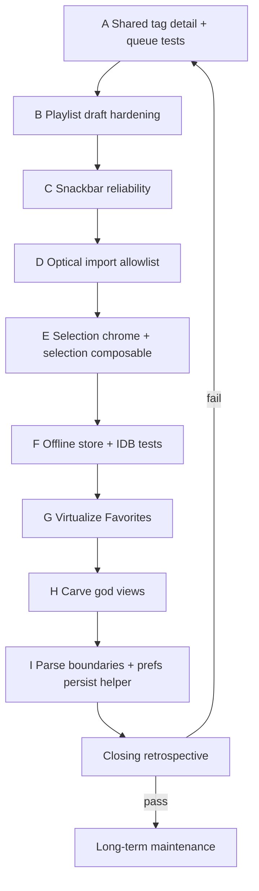

# Code quality hardening — phased maintenance plan

> **Status:** In progress — Phases A–B done; Phase C next  
> **Created:** 2026-09-06  
> **Updated:** 2026-09-06 — shipped A1–A2 and B1–B2  
> **Source:** Adversarial review of SingTags `web/` (god views/stores, duplicated queue/detail loaders, thin draft/offline tests, teleported chrome sprawl).  
> **Related:** [local-library-hardening.md](local-library-hardening.md), [product-honesty.md](product-honesty.md), [local-library-transfer.md](local-library-transfer.md)

**North star:** Incremental extraction and tests that lock correctness — not a rewrite. Every phase ends with an adversarial retrospective that can reshuffle later phases. Every task ends with a correctness / UI / tests / maintainability review. The plan only closes after a skeptical whole-plan retrospective; if confidence is low, re-enter the loop.

**Out of scope (unless a later retrospective explicitly promotes them):**
- Full rewrite of `HomeView` / `SheetViewer` / `TagPlayer`
- Phase C S3 optical transfer
- Virtual piano / vibe search / roulette product work
- Runtime schema library adoption (zod/valibot) as a big-bang — Phase F may add a **narrow** `parseTagDetail` helper only

---

## Operating rules (apply to every task)

### After each task — mandatory review (≤15 min)

Fill these four boxes before merging the PR (or before starting the next task in the same PR):

| Lens | Ask |
| --- | --- |
| **Correctness** | Did offline/online fallbacks still work? Did drafts not persist on Cancel? Did snackbars still surface errors? Manual smoke: Browse multiselect queue; Create set list → Cancel; Import PDF into My Library |
| **UI patterns** | One job per chrome surface; no duplicate CTAs; selection bars match catalog vs library visually; toast/stacking z-index not broken |
| **Tests** | New pure helpers have unit tests; store state machines have store tests; no “logic only in Vue SFC” regressions without a smoke |
| **Maintainability** | LOC moved out of god views/stores; call sites decreased; no new parallel CSS/copy of selection-bar/toast |

**Hard stop:** If any lens fails, fix in-place before advancing. Do not “note for later” P0 correctness failures.

### After each phase — adversarial retrospective

Answer in the PR description or a short note at the bottom of this plan’s Status section:

1. What did we claim vs what shipped?
2. What new duplication or coupling did we introduce?
3. What did tests fail to catch that a user would notice?
4. What should **promote / demote / reorder** in remaining phases?
5. Confidence (high / medium / low) to proceed.

If confidence is **low**, add a corrective task at the top of the next phase before new work.

### After all phases — skeptical whole-plan retrospective

See [Closing loop](#closing-loop--skeptical-whole-plan-retrospective). If any exit criterion fails, repeat the failed phase’s corrective path until exit criteria pass.

---

## Priority overview

| Phase | Why first |
| --- | --- |
| A–B | Highest duplicated / untested user-data paths (queue + drafts) |
| C–D | Error visibility + import trust |
| E–F | Shared chrome + offline persistence confidence |
| G–H | Scale lists / shrink god views once foundations exist |
| I | Hardening polish that benefits from earlier extraction |

---

## Progress log

### Phase A — done (2026-09-06)

| Task | Shipped |
| --- | --- |
| A1 | `web/src/lib/loadTagDetailCached.ts` + tests; Home/Recent use it directly; Favorites keeps a thin in-memory-first wrapper; `loadTagForTransfer` uses `{ includeTransferred: true }` |
| A2 | `queueSelectedTags.test.ts` covers ok / skip / empty / offline wording |

**Post-task review (A):** Correctness — ladder order locked by unit tests; Favorites still prefers store detail before IDB. UI — no chrome change. Tests — green. Maintainability — three duplicated ladder bodies removed; one thin Favorites wrapper remains (intentional hot path).

**Adversarial retrospective (A):**
1. Claimed one canonical loader — shipped; Favorites is a one-line memory prefer, not a fourth ladder.
2. No new circular imports (`loadTagDetailCached` → fetch/pack/IDB only).
3. Tests mock each step; did not catch Favorites memory prefer (manual/code review).
4. Promote A3? No — transfer paths unified. Proceed to B.
5. Confidence: **high**.

### Phase B — done (2026-09-06)

| Task | Shipped |
| --- | --- |
| B1 | `stores/localPlaylists.test.ts` — draft lifecycle (memory-only mutate, discard, replace, delete, commit) |
| B2 | `views/LocalPlaylistView.test.ts` — Cancel / Save / unmount discard; `createPlaylist` documented as immediate-persist fork |

**Post-task review (B):** Correctness — Cancel never puts IDB; Save commits then clears draft. UI — Cancel label only for drafts. Tests — green. Maintainability — intentional `createPlaylist` vs `beginDraft` fork documented on the store.

**Adversarial retrospective (B):**
1. Two drafts impossible — second `beginDraft` replaces.
2. `addSelectionToPlaylist` still uses `createPlaylist` (persists immediately) — documented.
3. View Save needed `vi.waitFor` for IDB settle — store unit tests were enough for the state machine.
4. No B3 race — unmount discard and Save commit coexist as designed.
5. Confidence: **high**.

---

## Evidence anchors (pre-gathered)

Use these so implementers do not re-discover the map:

| Concern | Primary files |
| --- | --- |
| Triplicated queue detail load | **Shipped A1:** `lib/loadTagDetailCached.ts`; Favorites thin memory prefer only |
| Richer transfer ladder (includes transferred IDB) | **Shipped A1:** `loadTagForTransfer` / `anyHighResTransferAvailable` use `loadTagDetailCached(..., { includeTransferred: true })` |
| Queue modes already shared | `lib/queueSelectedTags.ts`, `components/QueueDownloadModeDialog.vue`, `components/TagSelectionBar.vue` |
| Draft playlists | `stores/localPlaylists.ts` (`beginDraft` / `commitDraft` / `discardDraft`), `views/LocalPlaylistView.vue`, `views/LocalLibraryView.vue` `createPlaylist` |
| Single-slot snackbar | `stores/snackbar.ts` (`show` replaces prior); callers also in `lib/localDocReceive.ts`, `stores/localLibrary.ts`, `stores/favorites.ts` |
| MIME allowlist | `types/localLibrary.ts` `LOCAL_LIBRARY_ACCEPT_MIME` + `isLocalLibraryAcceptMime` |
| Optical receive → library | `lib/localDocReceive.ts`, `views/OpticalTransferView.vue`, `lib/decimen/localDocTransfer.ts` |
| Parallel selection bar CSS | `LocalLibraryView.vue` Teleport `.selection-bar` (~1201+) + unscoped styles (~2127+); catalog uses `TagSelectionBar.vue` |
| IDB library | `offline/localLibraryDb.ts` (~516 LOC, no dedicated test file) |
| Offline packs store | `stores/offlineLibrary.ts` (~890 LOC, no store test file) |
| Favorites list (no virtualizer) | `views/FavoritesView.vue` `v-for` over ordered records |
| Browse virtualizer pattern to copy | `views/HomeView.vue` + `@tanstack/vue-virtual` |
| List drag composable already exists | `composables/useSortableListDrag.ts` — **no** `useListSelection` yet |

**LOC reality check (do not expand further without extracting):**

| File | ~LOC |
| --- | ---: |
| `HomeView.vue` | 2550 |
| `SheetViewer.vue` | 2355 |
| `LocalLibraryView.vue` | 2206 |
| `TagPlayer.vue` | 1945 |
| `OpticalTransferView.vue` | 1741 |
| `localLibrary.ts` store | 973 |
| `offlineLibrary.ts` store | 890 |
| `preferences.ts` store | 888 |

---

## Phase A — Shared tag detail loader + queue async tests

| | |
| --- | --- |
| **Problem** | Three near-identical `loadTagDetailForQueue` ladders; transfer loader has a fourth variant with `getTransferredTag`. `queueSelectedTags()` async path is untested (only `queueTracksFromTagDetail` is). |
| **Goal** | One canonical loader; queue helper fully tested; views become thin callers. |

### Task A1 — Extract `loadTagDetailCached`

| | |
| --- | --- |
| **Create** | `web/src/lib/loadTagDetailCached.ts` |
| **API (proposed)** | `export async function loadTagDetailCached(id: number, opts?: { includeTransferred?: boolean }): Promise<TagDetail \| null>` |
| **Fallback order** | (1) `fetchCached(tagDetailUrl(id))` → (2) `sheetsPack.get(...)` → (3) `getStarred(id)?.detail` → (4) if `includeTransferred`, `getTransferredTag(id)?.detail` |
| **Wire** | Home / Recent / Favorites: replace local `loadTagDetailForQueue`. `loadTagForTransfer.ts`: replace private `loadTagDetail` with `loadTagDetailCached(id, { includeTransferred: true })`. |
| **Do not** | Change JSON casting yet (that’s Phase I). Keep `as TagDetail` behind the helper. |
| **Tests** | `loadTagDetailCached.test.ts` — mock/stub each ladder step; assert order; transferred only when opted in. |
| **Done when** | Zero duplicated ladder bodies in those four call sites; tests green. |

**Post-task review:** Correctness of offline-only devices (starred/pack only); no UI change expected.

### Task A2 — Test `queueSelectedTags()` end-to-end

| | |
| --- | --- |
| **Extend** | `web/src/lib/queueSelectedTags.test.ts` |
| **Cases** | (1) all tags load → `ok` message for sheets/tracks/all; (2) some `loadDetail` null → skipped + offline vs online wording; (3) detail with no matching assets for mode → skipped; (4) empty ids → no files queued. |
| **Done when** | Async API covered; Home/Recent/Favorites remain thin wrappers around `queueSelectedTags({ loadDetail: loadTagDetailCached, ... })`. |

**Optional A2b:** Pass `loadTagDetailCached` directly from views (drop local wrappers entirely).

### Phase A — adversarial retrospective

- Did Favorites still queue when only IDB detail exists?
- Did optical transfer high-res still find transferred tags?
- Any circular imports (`loadTagDetailCached` ↔ stores)?
- **Promote?** If transfer still special-cases paths, add A3 before B.
- **Confidence gate:** medium+ required to start B.

---

## Phase B — Playlist draft hardening

| | |
| --- | --- |
| **Problem** | Draft set lists are in-memory only (`localPlaylists.draft`) with no store tests; Cancel / unmount / Save race risk. |
| **Goal** | Lock draft state machine; UI Cancel never persists. |

### Task B1 — Store tests for draft lifecycle

| | |
| --- | --- |
| **Create** | `web/src/stores/localPlaylists.test.ts` (fake-indexeddb or existing IDB test harness used by `favoritesDb.idb.test.ts` / `localLibrary.test.ts`) |
| **Cases** | `beginDraft` → `byId` / `isDraft` true, not in `sorted`; mutate via `addEntries` / `renamePlaylist` without IDB put until `commitDraft`; `discardDraft` clears; `commitDraft` puts and clears draft; second `beginDraft` replaces prior draft; `deletePlaylist` on draft id discards. |
| **Done when** | State machine locked without mounting Vue. |

### Task B2 — View smoke for Cancel / Save

| | |
| --- | --- |
| **Create or extend** | Thin test near `views.smoke` or dedicated `LocalPlaylistView` test |
| **Cases** | Navigate to draft route → Cancel → draft gone and list unchanged; Save empty set list → appears in list; leaving route unmount discards draft (match `LocalPlaylistView` `onUnmounted`). |
| **UI check** | Cancel label only for drafts; Save vs Done labeling unchanged and honest. |

### Phase B — adversarial retrospective

- Can two drafts exist? (Should be impossible.)
- Does `addSelectionToPlaylist` still **persist immediately** (not draft)? Document that intentional fork in store comment if missing.
- **Promote?** If unmount discard fights Save navigation, add B3 race fix before C.
- **Confidence gate:** high for draft correctness.

---

## Phase C — Snackbar reliability

| | |
| --- | --- |
| **Problem** | `snackbar.show` replaces the visible toast; concurrent ok/info can wipe errors. Lib layers call Pinia directly. |
| **Goal** | Errors are not silently replaced; lib returns results where practical. |

### Task C1 — Priority / queue policy

| | |
| --- | --- |
| **Change** | `stores/snackbar.ts` |
| **Policy (pick one, document in store comment)** | **Preferred:** small queue (cap 3): if showing info/ok and new `error` arrives, replace immediately; if showing error and new info arrives, enqueue info until error dismisses. Alternative: never replace `error` with non-error until dismiss/timeout. |
| **Tests** | Extend `snackbar.test.ts` for replace/queue rules. |
| **UI** | Keep single visible toast (no toast stack UI). |

### Task C2 — Decouple hot lib paths from snackbar (incremental)

| | |
| --- | --- |
| **First targets** | `lib/localDocReceive.ts` size-warn / post-import: return `{ entry, warnings[] }` / let callers show; keep a thin compatibility wrapper if needed. |
| **Defer** | Full purge of snackbar from `localLibrary` / `favorites` stores (note residual in Phase H/I). |
| **Done when** | At least receive helpers are testable without mounting snackbar; OpticalTransfer / LocalLibrary still show toasts. |

### Phase C — adversarial retrospective

- Manual: trigger error then ok quickly — error must remain visible or queue correctly per policy.
- App.vue pack toasts vs snackbar — still two channels; document, don’t merge in this phase unless easy.
- **Confidence gate:** medium+.

---

## Phase D — Optical → My Library import allowlist

| | |
| --- | --- |
| **Problem** | Decimen verifies checksum/framing; semantic type allowlisting for library import is soft. |
| **Goal** | Reject non-library MIME/roles before IDB write; honest error toast. |

### Task D1 — Central reject helper

| | |
| --- | --- |
| **Use** | `types/localLibrary.ts` `LOCAL_LIBRARY_ACCEPT_MIME` / existing accept helpers |
| **Create** | e.g. `assertLocalLibraryImportAssets(assets): void` throwing clear Error |
| **Call from** | `localDocReceive` import/replace paths; OpticalTransfer local-doc import |
| **Tests** | Accept PDF/image/audio; reject `application/zip`, empty mime, unexpected roles |
| **UI** | Error tone snackbar; do not partial-write entry |

### Phase D — adversarial retrospective

- Can a malicious peer still fill IDB with huge **allowed** PDFs? Size warns exist (`LOCAL_*_WARN_BYTES`) — soft only; note hard caps as future if needed.
- Collection sheet receive must not break (different path).
- **Confidence gate:** medium+.

---

## Phase E — Selection chrome + `useListSelection`

| | |
| --- | --- |
| **Problem** | Catalog uses `TagSelectionBar`; My Library duplicates Teleport + CSS. Long-press/select-mode logic reimplemented across lists. |
| **Goal** | Shared chrome + one selection composable; library keeps library-specific actions via slots. |

### Task E1 — Shared selection bar shell

| | |
| --- | --- |
| **Approach** | Extract presentational shell (Teleport, `.selection-bar` styles, count, Clear) used by `TagSelectionBar` and LocalLibrary bars; **or** generalize `TagSelectionBar` with slots (`#actions`) and optional favorite/collection/queue. |
| **Preserve** | Catalog: Queue Downloads → mode dialog. Library songs: Group / Set list / Merge / Transfer / Delete. Library set lists: Delete. |
| **CSS** | One unscoped stylesheet (or shared import); delete LocalLibrary duplicate block (~2127+). |
| **UI** | Visual parity with existing bars; z-index ≥ 25; raised above bottom nav. |

### Task E2 — `useListSelection` composable

| | |
| --- | --- |
| **Create** | `composables/useListSelection.ts` |
| **API (proposed)** | `{ selectedIds, selectMode, showRowSelect, toggle, clear, onRowPointerDown/Move/End, onRowClickCapture }` mirroring Home/LocalLibrary long-press constants |
| **Adopt** | LocalLibrary songs + set lists first; then Recent/Favorites if low-risk; Home/catalog store selection may stay store-backed — document why. |
| **Tests** | Composable unit tests for toggle/clear/long-press suppress click. |

### Phase E — adversarial retrospective

- Did slot API make TagSelectionBar harder to read? If yes, prefer thin shell + two wrappers.
- Mobile long-press still enters select mode?
- **Promote?** If Favorites selection still diverges badly, do Favorites before G.
- **Confidence gate:** medium+.

---

## Phase F — Offline store + IDB tests

| | |
| --- | --- |
| **Problem** | `offlineLibrary` (~890) and `localLibraryDb` (~516) lightly tested at their layer. |
| **Goal** | Confidence in pack sync dismiss/busy and library IDB round-trips. |

### Task F1 — `localLibraryDb` persistence tests

| | |
| --- | --- |
| **Create** | `offline/localLibraryDb.test.ts` (fake-indexeddb) |
| **Cases** | put/get/list/delete entry + assets + blob; playlist put/list/delete; migration path if still relevant (`migrateDocsToEntries` / lyricsHint). |

### Task F2 — `offlineLibrary` store tests (narrow)

| | |
| --- | --- |
| **Create** | `stores/offlineLibrary.test.ts` |
| **Focus** | dismiss/sync offer keys; busy flag; pause; do **not** attempt full network pack download in unit tests — mock fetch/pack APIs. |
| **Done when** | Critical UX state transitions locked. |

### Phase F — adversarial retrospective

- Tests flake on IDB? Stabilize harness before G.
- **Demote** G if IDB flaky on CI.
- **Confidence gate:** medium+.

---

## Phase G — Virtualize Favorites

| | |
| --- | --- |
| **Problem** | Favorites renders full list; Browse already has the pattern. |
| **Goal** | Window virtualizer for Favorites rows; preserve selection, collections strip, drag-reorder if present. |

### Task G1 — Port Browse virtualizer patterns

| | |
| --- | --- |
| **Reference** | `HomeView.vue` `@tanstack/vue-virtual` + `useWindowVirtualizer` |
| **Preserve** | Multiselect, TagSelectionBar, collection chips, share/backup entry points, scroll restore via `tagReturn` |
| **Reorder** | If drag-reorder conflicts with virtualizer, keep reorder for active collection only or document limitation in UI |
| **Tests** | Smoke: mount with N favorites; selection bar still works; scroll restore if applicable |
| **Defer** | My Library virtualization unless Favorites proves the pattern cleanly — then optional G2 |

### Phase G — adversarial retrospective

- Did reorder break? Did sticky collection chrome z-index regress?
- Measure: 500 favorites scroll jank before/after (manual).
- **Confidence gate:** medium+.

---

## Phase H — Carve god views (composable extraction)

| | |
| --- | --- |
| **Problem** | Home / LocalLibrary / OpticalTransfer scripts are too large to reason about. |
| **Goal** | Extract orchestration without visual redesign. Target −200–400 script LOC per pass. |

### Task H1 — LocalLibrary import orchestration composable

| | |
| --- | --- |
| **Extract** | `useLocalLibraryImport.ts` — file inputs, combine staging, separate import, empty song, busy flags, size warns |
| **Keep in view** | Template wiring + selection + tabs |

### Task H2 — Home queue/selection actions composable (if not done in E)

| | |
| --- | --- |
| **Extract** | `useCatalogQueueSelection.ts` — `addSelectedToQueue`, star/collection helpers |

### Task H3 — OpticalTransfer receive-import branches (optional stretch)

| | |
| --- | --- |
| **Extract** | Pure handlers for ad-hoc / sheet / local entry / collection batch into `lib/` or composable; view keeps camera/UI |

### Phase H — adversarial retrospective

- Net LOC in views down? Imports clearer?
- No behavior change expected — diff should be mostly moves.
- **Confidence gate:** medium; if extractionsuction caused regressions, revert the worst PR and stop H3.

---

## Phase I — Parse boundaries + preferences persist helper

| | |
| --- | --- |
| **Problem** | Blind `as TagDetail` at JSON boundaries; `preferences.ts` watch boilerplate (~18). |
| **Goal** | Narrow runtime guard; smaller prefs persistence. |

### Task I1 — `parseTagDetail(unknown)`

| | |
| --- | --- |
| **Create** | `types/tag.ts` or `lib/parseTagDetail.ts` |
| **Guard** | Require `tag_id: number`; optional title string; return null if invalid |
| **Use** | Inside `loadTagDetailCached` JSON paths |
| **Tests** | Valid / missing id / non-object |

### Task I2 — `persistRef` helper for preferences

| | |
| --- | --- |
| **Refactor** | Group similar localStorage watches in `preferences.ts` behind a tiny helper |
| **Tests** | Existing `preferences.test.ts` must stay green; add one helper unit test |

### Phase I — adversarial retrospective

- Did parseTagDetail reject legitimate sparse details from pack?
- Prefs migrate still works on fresh load?

---

## Closing loop — skeptical whole-plan retrospective

Run only when Phases A–I are marked done (or explicitly deferred with reason).

### Exit criteria (all must be true)

| # | Criterion | How to verify |
| --- | --- | --- |
| 1 | Single tag-detail ladder | `rg loadTagDetailForQueue` empty; transfer uses shared helper |
| 2 | Draft Cancel never persists | Store tests + manual Cancel |
| 3 | Queue async messages tested | `queueSelectedTags.test.ts` covers offline skip |
| 4 | Errors not wiped by info | Snackbar policy tests + manual |
| 5 | Optical reject non-library MIME | Unit test + manual reject path |
| 6 | One selection-bar CSS source | No duplicate unscoped block in LocalLibrary |
| 7 | offlineLibrary + localLibraryDb tests exist | CI green |
| 8 | Favorites virtualized or deferred with written reason | Code or plan note |
| 9 | At least one god-view extraction landed | Net script LOC ↓ on LocalLibrary or Home |
| 10 | No new P0 product regressions | Smoke: Browse queue modes, set list draft, My Library import, optical receive |

### If any criterion fails

1. Open a **corrective mini-phase** (Cx) with only the failing items.
2. Re-run the four-lens task review on each fix.
3. Re-run this skeptical retrospective.
4. Repeat until all criteria pass or product explicitly accepts a documented residual (link from [status.md](../status.md)).

### Confidence statement (required to close)

> We are confident this plan succeeded when exit criteria 1–10 pass and a second reviewer (human) agrees the adversarial notes did not leave an untracked P0.

---

## Final analysis — long-term maintenance

After the plan closes, record stewardship defaults:

### Architecture rules of thumb

1. **Pure logic in `lib/` + store tests** before growing Vue SFCs past ~800 script lines.
2. **One chrome implementation** per UX pattern (selection bar, confirm dialog, mode dialog).
3. **Loaders with fallback ladders are shared** — never copy Cache → pack → IDB again.
4. **Snackbar is UI** — stores/libs return results; views/App show toasts (exceptions documented).
5. **Draft vs persisted** state machines always get store tests in the same PR as the feature.
6. **Virtualize** any list expected to exceed ~100 interactive rows on phone.
7. **Optical trust model** remains proximity + checksum + MIME allowlist — not peer identity.

### Watch metrics (quarterly)

| Metric | Healthy signal |
| --- | --- |
| `HomeView` / `LocalLibraryView` / `OpticalTransferView` LOC | Flat or down |
| Untested Pinia stores >300 LOC | Zero |
| Duplicated selection-bar CSS | Zero |
| `as TagDetail` outside parse helper | Trending down |
| Flaky IDB tests | Investigated within a week |

### Residuals explicitly not owed by this plan

- SheetViewer / TagPlayer deep watch-race suites (schedule separately if field bugs appear)
- Hard byte caps on optical imports
- Merging App pack-progress toasts into snackbar
- My Library list virtualization (follow-on to G)

### Handoff

Update [README.md](README.md) status to **Implemented** (or **Implemented with residuals**) and add a one-line pointer in [../status.md](../status.md) under maintenance/quality when closed.

---

## Suggested PR slicing

| PR | Contents |
| --- | --- |
| 1 | A1 + A2 |
| 2 | B1 + B2 |
| 3 | C1 (+ C2 if small) |
| 4 | D1 |
| 5 | E1 |
| 6 | E2 |
| 7 | F1 + F2 |
| 8 | G1 |
| 9 | H1 (then H2) |
| 10 | I1 + I2 |
| 11 | Closing retrospective notes + status/docs |

Prefer **green CI + manual smoke** over bundling phases.
