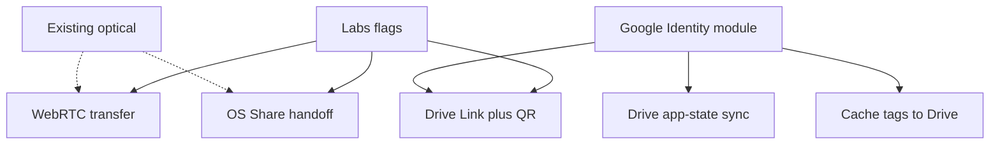

# Labs wireless transfers + Google Drive sync

> **Status:** In progress — WebRTC + OS Share as separate Labs pages mirroring Optical UX (idle receive + fullscreen); Drive deferred.
> **Created:** 2026-09-09
> **Goal:** Labs wireless transfers (WebRTC, OS Share) plus later Google Drive Link/sync.

## Honest scope notes (locked decisions)

- **WebRTC:** Pure PWA DataChannel + QR/optical pairing; same Wi‑Fi / personal hotspot; no Capacitor.
- **“Google Quick Share” Labs feature:** There is **no Quick Share web API**. Ship an **OS Share handoff**: pack a SingTags bundle → `navigator.share({ files })` → user picks Quick Share / AirDrop; Android **share_target** import back into SingTags. Docs in Labs explain OS interop limits (no Google Account on iPhone receiver for OS Quick Share QR cloud path; iPhone sender uses AirDrop).
- **Drive Link:** In-app Google Sign-In → upload pack to the user’s Drive → `anyone with link` → show QR. One-time OAuth; later sends can be one-tap. Not silent forever; not offline.
- **Drive sync / cache:** Separate Labs (or Settings) track; **same Google Identity module**. Sync config via Drive app-data or a dedicated SingTags folder; optional “cache tags to Drive” mirrors offline pack bytes.

All three transfer experiments live under **SingTags Labs** until promoted (same soft-flag pattern as Optical / My Library in [LabsView.vue](web/src/views/LabsView.vue) + [preferences.ts](web/src/stores/preferences.ts)).

---

## Shared foundation

### Labs flags + entry

Extend [preferences.ts](web/src/stores/preferences.ts) / [LabsView.vue](web/src/views/LabsView.vue):

- `singtags.labs.webrtcTransfer.enabled.v1` (default off)
- `singtags.labs.osShareTransfer.enabled.v1` (default off)
- `singtags.labs.driveLinkTransfer.enabled.v1` (default off)
- Later: `singtags.labs.driveSync.enabled.v1`, `singtags.labs.driveCache.enabled.v1`

Optical Transfer UI stays on its own `/tx`/`/rx` pages. Wireless and OS Share are **separate Labs pages** (`/wireless`, `/share`) until a later unified transfer surface.

### Pack pipeline (reuse)

One internal `buildTransferBundle(queue) → File` used by optical (already), WebRTC, OS Share, and Drive Link—prefer existing Decimen/collection pack or a zip of the same payloads so receive/import stays one ingest path ([localDocReceive](web/src/lib/localDocReceive.ts) / optical receive ingest).

### Google Identity (for Drive Link + Drive sync)

New module e.g. `web/src/lib/google/googleAuth.ts`:

- GIS (`google.accounts.oauth2`) token client; scopes: Drive file create/share for Link; Drive appdata (and/or `drive.file`) for sync/cache.
- Persist refresh via **minimal backend** (recommended) or accept access-token-only SPA with re-consent—call out in Labs: “Connect Google” settings card.
- No Quick Share calls from this module.

---

## Feature 1 — WebRTC transfer (Labs)

**UX:** Tx: “Wireless (Wi‑Fi / Hotspot)” → show pairing QR after ICE complete. Rx: “Wireless receive” → scan offer → show answer QR → progress → ingest.

**Tech:** `RTCPeerConnection` + `RTCDataChannel`; `iceServers: []` offline; optional STUN when online; IndexedDB chunk assembly; wake-lock / keep-awake hints; fallback CTA to optical.

**Tests:** Unit tests for SDP compress/round-trip; happy-dom limited—manual matrix: iOS↔Android same Wi‑Fi, hotspot either direction, cellular-only expect fail → optical.

**Done when:** Labs-on users can move a multi-file pack over hotspot without SingTags servers; clear fail → optical.

---

## Feature 2 — OS Share / Quick Share handoff (Labs)

**UX:** Tx: “Share via device…” → build bundle → `navigator.share({ files })` (else download + instructions). Rx Android: installed PWA appears in share sheet. Rx iOS: “Import shared file” file picker (AirDrop → Files → Import).

**Tech:**

- Manifest `share_target` POST `/import-share` (files: zip/octet-stream/pdf/audio)—[vite PWA manifest](web/vite.config.ts); SW intercept → cache → redirect `?share-target=1` ([web.dev pattern](https://web.dev/patterns/files/receive-shared-files)).
- Import UI wires to existing My Library / optical ingest.
- Labs copy documents AirDrop↔Quick Share interop as OS-dependent; cloud QR path needs internet; not SingTags-controlled.

**Done when:** Android share-into-SingTags works offline for the PWA shell; iOS import path documented and one-tap from Labs/Optical.

---

## Feature 3 — Drive Link + in-app Google login (Labs)

**UX:** Connect Google (once) → Send → upload → set anyone-with-link → show QR + copy link. Rx: scan/open → download → Import (or open `/rx`-adjacent import). Status: uploading %, link expiry note (Drive links don’t auto-expire unless you delete file / use your own GCS).

**Tech:** Drive API v3 `files.create` multipart + `permissions.create` `type=anyone` `role=reader`; QR via existing QR helpers; revoke/disconnect Google in Labs.

**Limits:** Needs network; sender needs Google Account; not silent first-run; optional later: auto-delete file after N hours via backend cron.

**Done when:** iPhone or Android sender (signed in) can show a QR another phone opens without SingTags installed on the receiver (browser download → import if they have SingTags).

---

## Feature 4 — Drive as configuration datastore (+ optional tag cache)

Separate Labs track; depends on Google Identity.

### 4a — App state sync (favorites / recent / config)

**Reuse** [appStateBackup.ts](web/src/lib/appStateBackup.ts) (`singtags.app-state` + favorites IDB via `favoritesBackup`) as the blob format.

**Store:** Drive **Application Data folder** (`spaces: appDataFolder`) for private sync—avoids cluttering My Drive; or a visible `SingTags Sync/` folder if users want manual access (Labs toggle).

**Flows:**

- **Backup now** / **Restore** / **Auto-backup** on debounce after favorites/recent/prefs changes (Labs).
- Conflict: last-write-wins with `exportedAt` + confirm dialog if cloud newer.
- Expand `APP_STATE_LOCAL_KEYS` carefully (include Labs flags only if desired).

**Not in v1:** full My Library blob sync (huge); offer “include My Library zip” as opt-in using existing [localLibraryBackup.ts](web/src/lib/localLibraryBackup.ts).

### 4b — Cache tags to Google Drive

**Goal:** Reduce SingTags origin fetches when online-to-Drive is OK but origin is slow/blocked.

**Approach:** Mirror offline pack artifacts (sheet/audio cache entries from [libraryPack.ts](web/src/offline/libraryPack.ts) / [cacheManage.ts](web/src/offline/cacheManage.ts)) into Drive appData or `SingTags Cache/` as content-addressed files + a small manifest JSON (`tagId`, paths, hashes, quality).

**Flows:** “Upload offline packs to Drive” / “Restore packs from Drive” / optional “prefer Drive when SingTags origin fails.”

**Caveats:** Drive quota is the user’s; large audio packs; eviction policy; still need initial catalog indexes (or cache `core.json.gz` too). Not a CDN replacement for cold users.

**Done when:** Labs user can wipe site data, Sign in with Google, restore favorites/recent/prefs, and optionally rehydrate a previously uploaded pack set without re-downloading everything from SingTags (subject to Drive availability).

---

## Implementation order

1. Labs flags + Optical mode switcher stub + shared `buildTransferBundle`
2. OS Share handoff + Android `share_target` (smallest; no Google)
3. WebRTC Labs (highest offline value among new wireless options)
4. Google Identity module
5. Drive Link + QR
6. Drive app-state sync
7. Drive tag-cache mirror (heaviest)

## Non-goals

- Capacitor / native Nearby
- Real Quick Share API integration (does not exist for web)
- Cold offline bootstrap via QR/NFC
- Replacing optical as the radio-hostile default
