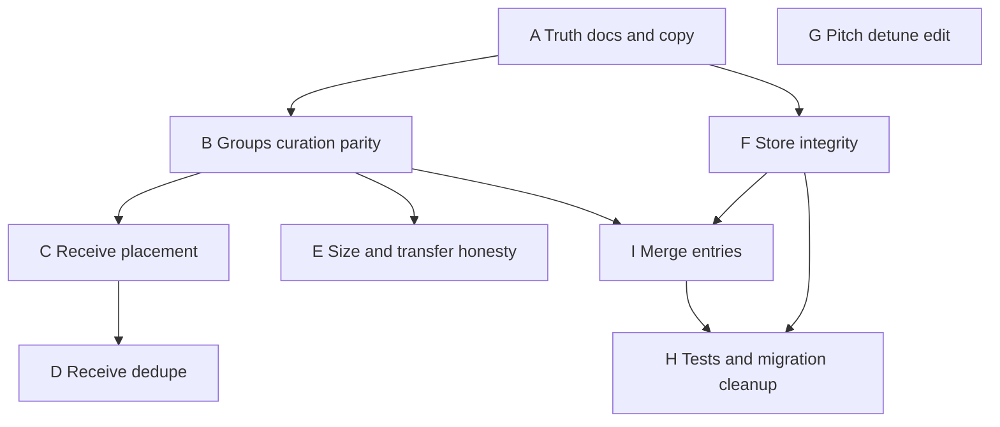

# Local Library hardening — resolution plan

> **History:** Implemented. Phase tables below are a record of the work, not open backlog.  
> Follow-up to [local-library-transfer.md](local-library-transfer.md).

**Status:** Implemented (A–I). Residual polish only if field-testing finds gaps. Phase C short-lived S3 transfer remains deferred on the transfer plan.  
**Created:** 2026-09-02  
**Out of scope:** Phase C short-lived S3 transfer; bottom-nav promotion; catalog optical restore; indexed/full-text search; practice-set parity with Favorites.

**North star for this plan:** Groups behave like Favorites collections for a &lt;50-song on-device library; bad imports are fixable via merge; receive and transfer don’t surprise; docs/copy match the shipped Entry+Asset model.

---

## Priority overview

Ship **A → D** as the critical path for review fallout. **I (merge)** sits with curation: high user value for import mistakes, after store integrity (F) and ideally after selection-bar patterns (B). E–H can parallelize.

| Phase | Why first |
| --- | --- |
| A | Cheap; stops steering from a stale plan |
| B | Sharpest product lie (Favorites chrome without curation) |
| C | New songs land in All with no placement story |
| D | Re-transfer duplicates are inevitable in optical workflows |
| I | Fixes “imported tracks the wrong way” without re-upload |
| E | Soft failures (QR/IDB) beat silent multi-send defaults |
| F–H | Correctness debt; F before merge; H covers merge tests |

---

## Phase A — Truth: plan + discoverability copy

| | |
| --- | --- |
| **Problem** | Plan still describes single-blob `LocalDoc` + “audio later” + v1 MIME only. More menu says “PDFs and images” while audio tracks ship. |
| **Approach** | Rewrite [local-library-transfer.md](local-library-transfer.md) **Shipped** / Phase A–B to Entry + Assets + audio + v2 `local-entry` (v1 receive retained). Point residual work here. Update More menu desc to charts/images/tracks. |
| **Files** | `docs/plans/local-library-transfer.md`, `docs/plans/README.md`, `docs/status.md`, `AppMoreMenu.vue` (+ test assert if cheap) |
| **Done when** | A new reader cannot conclude audio is “later” or that send only uses v1 |

---

## Phase B — Groups curation (best suggestion)

**Recommendation:** Mirror Favorites’ selection → “Add to collection” flow. Do **not** invent a second membership model; keep dual `entry.groupIds` + `group.entryIds` but make list UI the source of user intent.

| | |
| --- | --- |
| **Problem** | Membership is almost only “import while a group chip is active.” No add/remove-from-group; empty-group copy trains the wrong habit; manage sheet is create/delete only. Reorder-in-group is polish on an uncuratable collection. |
| **Approach** | |
| Store | Add `addEntriesToGroup(groupId, entryIds)` and `removeEntriesFromGroup(groupId, entryIds)` that keep `groupIds` ↔ `entryIds` in sync (append order = current All/`entryOrder` relative order, or append at end). Fix `trackNewEntry` to sync **all** `groupIds`, not only `[0]`. |
| List selection | Selection bar: **Add to group** → `FilterSheet` picker (existing groups + inline create), same pattern as Favorites/`TagSelectionBar`. |
| Active group | When a group is selected: selection action **Remove from group** (does not delete songs). Optional row overflow later — selection is enough for v1. |
| Empty group | Copy like Favorites: select songs → Add to group (keep import-into-active-group as a bonus, not the only path). |
| Manage | Add **rename** in manage sheet (putLocalGroup). Skip nested folders / colors. |
| Doc page | Optional stretch: group chips in Edit. Prefer list curation first. |
| **Files** | `localLibrary.ts`, `LocalLibraryView.vue`, maybe small `LocalGroupPicker` if the sheet markup gets heavy; tests in `localLibrary.test.ts` |
| **Done when** | User can build a rehearsal group from All without re-importing; can remove without deleting; reorder still works |

**Non-goal:** Drag-and-drop across groups; multi-group picker with checkboxes on every row (chips on row can remain filter shortcuts).

---

## Phase C — Receive placement

| | |
| --- | --- |
| **Problem** | Optical/`openNow` always imports with `groupIds: []`. Songs dump into All; active library group is irrelevant when receive happens on `/rx` or Browse. |
| **Approach (preferred)** | Always import to All (predictable). Snackbar after successful local import: **Open** (existing) + **Add to group…** when `groups.length > 0` (reuse Phase B picker). Do **not** silently use a sticky `activeGroupId` from a background library visit — surprising on Browse. |
| **Fallback if no groups** | Snackbar Open only; optional one-line “Tip: create groups in Local Library.” |
| **Files** | `OpticalTransferView.vue`, Browse camera path in `HomeView.vue`, shared helper e.g. `localDocOpen.ts` / small composable for post-import snackbar actions |
| **Done when** | Receiving a song never requires re-import to place it in a group |

**Rejected alternative:** Pref “default receive group” — useful later, easy to forget and mis-file; defer until someone asks.

---

## Phase D — Receive dedupe / replace

| | |
| --- | --- |
| **Problem** | Every receive creates new IDs. Re-sending the same chart duplicates; &lt;50 library fills with clones. |
| **Approach** | On successful parse, before import, probe for a **soft match**: same `title` (case-insensitive trim) + same total payload bytes (sum of asset byte lengths), or single-asset v1 byteLength. If match: dialog or snackbar actions **Open existing** / **Keep both** / **Replace**. Replace = delete old entry (or overwrite meta+assets in place — prefer **in-place replace** to preserve `groupIds` + order). |
| **Files** | `localLibrary.ts` (`findSoftDuplicate`, `replaceEntryFromBundle`), receive callers, thin confirm UI |
| **Done when** | Re-transfer default path can update a song without a second row; Keep both remains available |

**Non-goal:** Cryptographic content-ID sync across devices; merge of divergent *remote* edits. (Local **entry merge** is Phase I — different problem.)

---

## Phase E — Size and transfer honesty

| | |
| --- | --- |
| **Problem** | Multi-select optical uses primary-sheet defaults with no explanation. Large PDFs/audio can fail QR or IDB opaquely. Plan Phase C size caps don’t help optical. |
| **Approach** | (1) Multi-select transfer: confirm toast/dialog — “N songs, primary sheet only (no audio).” Link or secondary “Choose files…” only if cheap; otherwise document and keep defaults. (2) Soft warn on import/transfer when any file &gt; ~12–15 MB or entry total &gt; ~20 MB (“may be slow or fail over optical”). (3) Optional: `navigator.storage.estimate()` warn when usage &gt; ~80% of quota. |
| **Files** | `LocalLibraryView.vue`, `LocalDocView.vue` / transfer sheet, maybe `localDocTransfer.ts` helpers for size sums |
| **Done when** | User is not surprised that multi-send omitted tracks; large files get a warning once |

---

## Phase F — Store integrity (small fixes)

| | |
| --- | --- |
| **Problem** | `trackNewEntry` only syncs first group; `bumpEntryInList` rewrites `entries` array order while UI uses `entryOrder` — future bugs. |
| **Approach** | Sync all `groupIds` in `trackNewEntry`. Change `bumpEntryInList` to **in-place update or stable merge** without forcing “newest first” (or document + assert that no UI reads raw `entries` for order). Ensure `updateMeta({ groupIds })` remains the low-level path; Phase B APIs call it or shared sync helper. |
| **Files** | `localLibrary.ts`, unit tests |
| **Done when** | Membership sync is total; list order tests only assert `entryOrder` / `group.entryIds` |

---

## Phase G — Pitch / detune completeness (stretch)

| | |
| --- | --- |
| **Problem** | `detuneCents` exists on entry + transfer but isn’t editable; local creates stay 0. |
| **Approach** | Expose cents on Edit (or reuse Tag pitch affordance) clamped ±50; include in save/`updateMeta`. Low priority vs B–D / I. |
| **Done when** | Transferred detune is visible/editable; new saves round-trip |

---

## Phase H — Tests and migration cleanup

| | |
| --- | --- |
| **Problem** | Coverage is store/helpers-heavy; IDB v1→v2→v3 and `finalizeLocalLibraryMigration` soft-leave `docs` store; UI untested. |
| **Approach** | Tests: add/remove group APIs; soft duplicate; **mergeEntries** (roles, blob move, source delete, groups/order); bump vs order; smoke mount `LocalLibraryView` search+selection bar affordances. Migration: either finish dropping `docs` in a v4 upgrade or make `finalize` actually clear it; add one fake-idb migration test. |
| **Done when** | Critical membership, merge, and dedupe paths have regression tests; legacy store isn’t a permanent zombie without a comment+ticket |

---

## Phase I — Merge entries (fix bad imports)

**User story:** Imported Lead/Bass/Tenor as separate songs (or “Import files” instead of “Import as one song”), and/or have a sheet entry and want those tracks attached. Need to **combine existing library entries** without re-picking files from disk.

**Recommendation:** Selection-bar **Merge…** → staging sheet (reuse patterns from `LocalLibraryCombineStaging`, but sourced from existing assets). Prefer **merge into a chosen survivor** over creating a brand-new entry (preserves deep links, group membership, and list position of the target).

| | |
| --- | --- |
| **Problem** | Separate-file import and optical receives create one Entry per package. Wrong import mode leaves tracks/sheets as siblings. “Add files” on a song only helps if the user still has the originals. |
| **Approach** | |
| Entry | Select **2+** rows → **Merge** on selection bar (disabled for 1). |
| Target | Staging UI: pick **Keep as song** (radio; default = first selected with a `sheet`/`pdf` asset, else first selected). Other entries are **sources**. |
| Meta | Target keeps title/arranger/notes/key/detune by default; optional fields to copy blank target fields from a source (e.g. fill empty arranger). Do **not** auto-concatenate notes unless user opts in (“Append notes from merged songs”). |
| Assets | Flat list of all assets from target + sources (blobs stay in IDB; re-point `entryId` + new `sortIndex`). Per-asset **role** + **label** editable (same controls as combine staging / Edit). Auto-guess: existing roles preserved; if multiple `sheet`, demote extras to `alternateSheet`; audio stays `track`. |
| Groups | Union of `groupIds` onto the target; strip sources from all `group.entryIds`. |
| Cleanup | After success: `removeEntry` on each source (assets already moved — delete must not nuke moved blobs). Survivor stays at its `entryOrder` index; drop source ids from order. |
| Navigate | Open `/library/:targetId?edit=1` so user can confirm roles/meta. |
| Store | `mergeEntries(targetId, sourceIds, { assets: { id, role, label, sortIndex }[], meta?, appendNotes? })` — transactional as far as IDB allows (move assets, patch target, delete sources, sync groups/order). |
| **Files** | `localLibrary.ts`, new `LocalLibraryMergeStaging.vue` (or generalize combine staging to “asset rows from File \| LocalAsset”), `LocalLibraryView.vue` selection bar, tests |
| **Done when** | User can turn “sheet song + three track songs” into one Entry with correct roles without re-importing files |

**Edge cases**

- Only one selected → hide/disable Merge.
- Target has no sheet and sources do → after role edit, ensure at most one primary `sheet` (validation like combine staging).
- Merge while searching/reordering → clear selection after; works on filtered selection ids.
- Soft-duplicate receive (Phase D) is **replace same song**; merge is **combine different songs**. Keep both verbs distinct in UI (“Merge songs” vs “Replace existing”).

**Non-goals for v1:** Merge across devices; partial asset pick leaving source entries alive (always consume sources); undo stack (confirm dialog is enough: “Merge N songs into “Title”? Sources will be removed.”).

---

## Explicit non-goals (near term)

- Phase C S3 / CAPTCHA uploads
- Local Library in bottom nav (revisit after groups+receive feel solid)
- A–Z sort modes / Favorites backup parity
- Catalog optical buttons restore
- Searching notes by default (keep opt-in; maybe add placeholder hint “include notes via checkbox”)
- Split entry (inverse of merge) — add only if merge ships and users ask

---

## Suggested ship slices

1. **Slice 1 (docs):** Phase A only — can land immediately.  
2. **Slice 2 (curation):** B + F — store APIs + selection bar + empty copy + rename.  
3. **Slice 2b (merge):** I — selection Merge + staging + `mergeEntries` (depends on F; shares selection-bar patterns with B).  
4. **Slice 3 (receive):** C + D — placement snackbar + soft duplicate.  
5. **Slice 4 (honesty + safety):** E + H (+ G if time).

If import mistakes are the loudest pain **right now**, ship **2b before 3**.

---

## Open decisions (defaults chosen above)

| Question | Default in this plan |
| --- | --- |
| Silent receive into active group? | **No** — snackbar Add to group |
| Dedupe fingerprint? | Title + total bytes; Replace preserves groups |
| Multi-send asset UI? | Confirm defaults; full chooser later |
| Bottom nav? | Defer |
| Notes search default? | Stay off |
| Merge survivor? | User-picked target; default prefers entry that already has a sheet |
| Merge sources? | Always deleted after assets move |
| Merge vs dedupe Replace? | Separate flows; do not conflate in UI |
