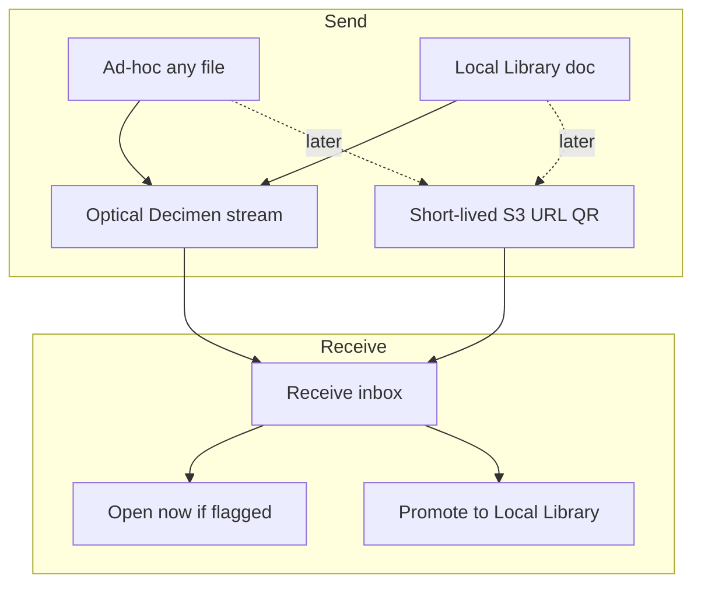

# Local Library & transfer

> **Status:** planned  
> **Created:** 2026-09-02  
> **Goal:** First-class local documents (PDF / image / sheet) with metadata and pitch, plus optical (and later short-lived link) transfer that is not tied to the remote SingTags catalog.  
> **Related:** [sheet-qr-transfer.md](sheet-qr-transfer.md) (transport restore point), Labs optical flag.

---

## Product split

| Kind | Local Library? | Metadata / pitch | Transfer |
| --- | --- | --- | --- |
| PDF / image / sheet music | Yes (curated docs) | title, arranger, notes, concert pitch/key | Optical: **file + metadata**; receive recreates library entry |
| Audio | Later | same + playable | Same envelope |
| Arbitrary other files | Not as curated docs | none | **Ad-hoc only** via `/tx` inbox; optional open-now for known MIME |

Catalog SingTags tags use deep links / static QR. Catalog optical list buttons were removed after tag `optical-transfer-catalog-buttons` (see sheet-qr plan).

---

## Phase A — Local Library shell

- IndexedDB (or OPFS) store: `LocalDoc` `{ id, title, arranger, notes, pitch (aHz/cents/key), mime, blobRef, createdAt, updatedAt, groups[] }`.
- UI: Local Library view (More entry first; bottom nav later if needed) — import PDF/image, edit metadata, open in sheet/PDF viewer with **pitch button** (reuse TagView / pitch-pipe patterns).
- Groups: simple named folders (light reuse of user-collections patterns).

**v1 defaults:** curated library = PDF + image (+ sheet-as-image); audio later.

## Phase B — Optical for library docs + ad-hoc

- Transfer envelope: Decimen file container MIME e.g. `application/vnd.singtags.local-doc` with JSON meta + bytes; `openNow` flag; multi-file batch.
- Ad-hoc: existing `/tx` queue any file → receive inbox without promoting.
- Receive: honor `openNow` for PDF/image/audio; snackbar actions; multi-file progress.
- Browse camera: keep receiving; route local-doc packages into Local Library / inbox (not fake catalog tag ids via `putTransferredTag`).

Pitch travels only with curated local docs.

## Phase C — Short-lived link transfer (optional, later)

**Problem:** Pure client + public S3 cannot safely accept arbitrary uploads without an abuse gate. Performance without end-user auth is fine if uploads are **anonymous + size-capped + TTL + rate-limited**.

**Shape (no app accounts):**

- Lambda: `createUpload` → **presigned PUT** + transfer id + short TTL (15–60 min); optional `createDownload` for private GET URLs in the QR.
- QR encodes HTTPS URL the SPA opens and pulls (`/rx?t=…` or CDN object URL).
- Hard limits: **&lt;50 MB** per object, optional content-type allowlist, max uploads / IP / day, S3 lifecycle expiry.
- Abuse: CAPTCHA or one-time upload token from Lambda — not full user auth.
- Optical remains the zero-infra path; S3 is for files too large for fountain QR.

Do **not** build Phase C until A/B prove Local Library value.

---

## Non-goals (near term)

- Re-adding catalog optical buttons on Browse/Recent/Favorites (restore from git tag if needed).
- Hosting unpublished charts on the SingTags library S3 bucket as permanent catalog entries.
- End-user accounts / OAuth for transfer.
