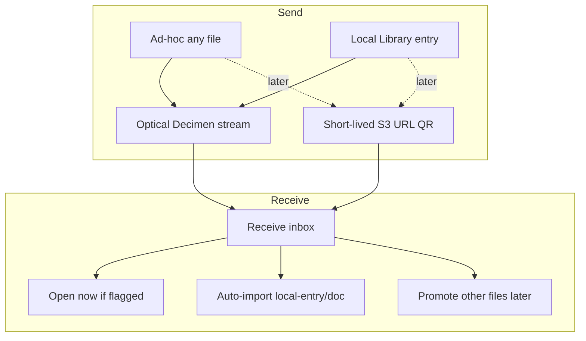

# Local Library & transfer

> **Status:** Shell + optical Entry transfer shipped; residual polish in [local-library-hardening.md](local-library-hardening.md)  
> **Created:** 2026-09-02  
> **Goal:** First-class on-device songs (Entry + Assets) with metadata and pitch, plus optical (and later short-lived link) transfer that is not tied to the remote SingTags catalog.  
> **Related:** [sheet-qr-transfer.md](sheet-qr-transfer.md) (transport restore point), Labs optical flag, [local-library-hardening.md](local-library-hardening.md).

---

## Shipped so far

- IndexedDB Local Library (`singtags-local-library`, v3) + Pinia store
- Model: **Entry** (title, arranger, notes, key, detuneCents, groups) + **Assets** (sheet / alternateSheet / image / track / other)
- More → Local Library (`/library`, `/library/:id`) — Tag-like item view + Edit; list with groups, Favorites-style reorder, basic search (title/arranger/key; optional notes)
- Import: N→N files, or N→1 song with role staging; PDF / image / **audio**
- Optical send **v2** `application/vnd.singtags.local-entry` (whole entry + selected assets); **v1** `…local-doc` still received
- Send from list or item (asset chooser; default = primary sheet); receive on `/rx` and Browse camera → auto-import to Local Library (`openNow` supported)
- Catalog optical list buttons removed (restore tag `optical-transfer-catalog-buttons`)

---

## Product split

| Kind | Local Library? | Metadata / pitch | Transfer |
| --- | --- | --- | --- |
| PDF / image / sheet | Yes (Entry + sheet/image assets) | title, arranger, notes, key, detune | Optical: selected assets + meta |
| Audio tracks | Yes (`track` assets + TagPlayer) | same | Opt-in via asset chooser (not default) |
| Arbitrary other files | Not as curated Entries | none | **Ad-hoc** via `/tx` inbox; optional open-now for known MIME |

Catalog SingTags tags use deep links / static QR.

---

## Residual (do next)

Tracked in **[local-library-hardening.md](local-library-hardening.md)**:

- Groups curation parity (add/remove like Favorites collections)
- **Merge entries** (combine wrongly split imports — sheet + tracks → one song)
- Receive placement + soft dedupe/replace
- Size / multi-send honesty; store integrity; tests/migration cleanup
- Docs/copy already partially addressed there (Phase A)

---

## Phase C — Short-lived link transfer (optional, later)

**Problem:** Pure client + public S3 cannot safely accept arbitrary uploads without an abuse gate.

**Shape (no app accounts):** Lambda presigned PUT + short TTL; QR → HTTPS pull; &lt;50 MB; rate limits; CAPTCHA or one-time token.

Do **not** build Phase C until hardening proves Local Library value for rehearsal kits.

---

## Non-goals (near term)

- Re-adding catalog optical buttons on Browse/Recent/Favorites
- Hosting unpublished charts on the SingTags library S3 bucket as permanent catalog entries
- End-user accounts / OAuth for transfer
- Bottom-nav Local Library (revisit after hardening)
