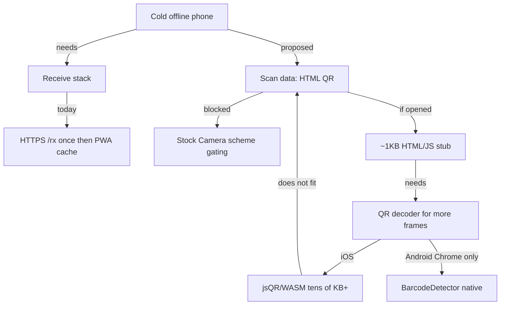
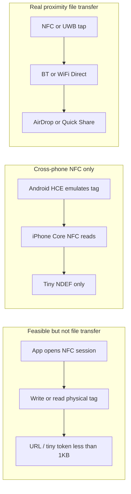
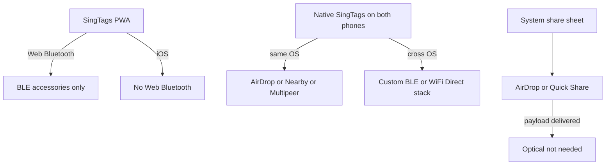
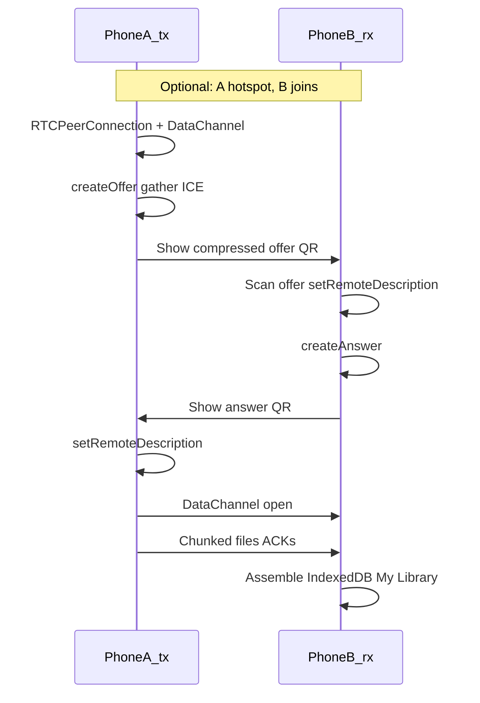
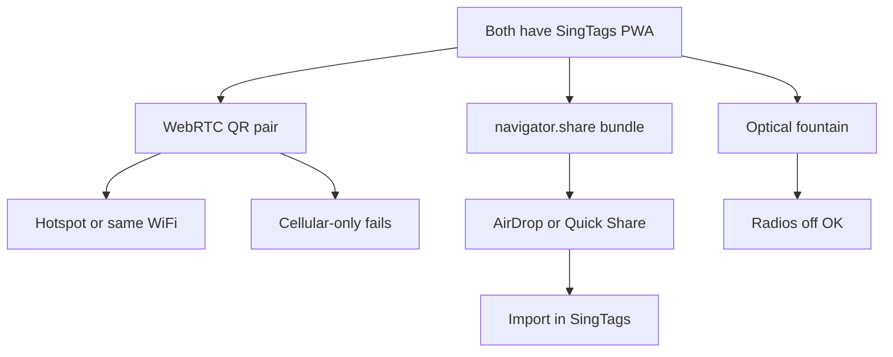

# Offline optical bootstrap via HTML-in-QR — feasibility

> **Status:** Research only — not feasible for stock-camera cold bootstrap; no product impl.
> **Created:** 2026-09-09
> **Goal:** Evaluate HTML-in-QR / multi-QR cold offline bootstrap for SingTags receive.

## Verdict

**Not feasible as a stock-camera, zero-prior-install product path on mobile (especially iOS).** Your intuition about multi-level bootstrap is right about the capacity gap, but two harder blockers kill it before minification helps:

1. **Stock cameras won’t open `data:text/html` QRs** as browser navigations (iOS Camera: “no usable data”; Android often copy-text only).
2. **Even if opened, one QR holds ~3 KB absolute / ~1 KB practical** — orders of magnitude short of a camera+QR+fountain receiver.

Current SingTags already solves the *post-bootstrap* problem (optical LT fountain after `/rx` is loaded). The missing piece is **how the cold offline phone first obtains that receiver**.

---

## What the receiver actually needs today

From [web/src/views/OpticalTransferView.vue](web/src/views/OpticalTransferView.vue) / Decimen receive path:

- Camera (`getUserMedia`)
- Frame decode: `DecimenReceiveCapture` → worker pool → **decimen-codec WASM** (zxing-cpp) → LT fountain → XZ unpack (`lzma-wasm`)
- Local persist (IndexedDB / My Library)

**Approx cold `/rx` budget** (current `web/dist`):

| Layer | ~gzip |
|---|---:|
| Receive-specific (view + decodeWorker + decimen wasm) | ~144 KB |
| SPA shell including embedded lzma | ~428 KB |
| **Usable receive path** | **~570 KB** |
| Full PWA precache | ~4.5 MB |

After one online visit, PWA/Workbox makes `/rx` work offline ([opticalTransferNav](web/src/lib/decimen/opticalTransferNav.ts) invite is still just an HTTPS URL). A cold offline phone with no prior SingTags has **nothing to run**.

---

## QR / `data:` constraints (mobile-first)

| Constraint | Number / fact |
|---|---|
| QR V40-L byte max | **2,953 B** |
| Practical phone scan (screen→camera) | **~0.5–1.5 KB** at usable ECC/size |
| `data:text/html,` header | ~15–30 B before content |
| Encoding | Byte mode (lowercase HTML); percent/base64 inflate further |
| iOS Camera + `data:` | **Does not open** as a link |
| Android Camera + `data:` | Usually **text / copy**, not open-in-browser |
| Browser `data:` size limits | Irrelevant (MB-scale; QR is KB-scale) |
| `BarcodeDetector` for nano-stub Stage-2 | **Chrome Android yes; Safari iOS no** (needs WASM/jsQR) |

Multi-QR only helps **after** something on the phone can already decode QRs and assemble payloads. That something does not fit in Stage-0 for iOS, and Stage-0 itself usually never runs.

---

## Why “multi-level bootstrap” still fails

Hypothetical ladder:

1. **Stage 0** — one QR → tiny HTML with `getUserMedia` + assemble loop  
2. **Stage 1** — scan N more QRs → download jsQR/WASM + mini receiver  
3. **Stage 2** — full Decimen optical receive  

**Stage 0 blockers:** camera scheme + capacity.  
**Stage 1 blockers on iOS:** no native `BarcodeDetector` → stub must ship a decoder → doesn’t fit in Stage 0.  
**Android-only lab path:** Chrome `BarcodeDetector` stub (~hundreds of bytes of JS) *could* assemble further frames **if** the user somehow opens the Stage-0 `data:` page (copy/paste from Camera — not product UX). Still doesn’t help iPhone, your #1 consumer class alongside Android.

Prior art (TagDrop, UR/animated QR, RaptorQR, Decimen) all assume a **preinstalled reader** or **already-open browser page**. None solve cold offline stock-camera bootstrap.

---

## FAQ (clarifications)

### What is “Native/sidecar SingTags Receive app”?

Not a second product the user would prefer. It means: **preinstall a small decoder** (App Store / Play / enterprise MDM / TestFlight) that already knows how to:

- open a custom URI (`singtags-rx://…`) or read a TagDrop-style QR/NFC payload, and
- run camera + fountain decode without needing the SingTags PWA from the network.

“Sidecar” = that mini app exists *beside* the web PWA, solely so a cold offline phone has a decoder. **It does not solve zero-prior-install.** It only moves the seed to “install once while online (or via MDM), then optical forever.” Same chicken-and-egg as PWA, with worse distribution cost.

### Can built-in QR reading help?

| Built-in surface | What it can do cold/offline | Enough to bootstrap receive? |
|---|---|---|
| **iOS/Android Camera QR** | Opens `https://` (needs net); ignores/`text` for `data:` | **No** |
| **Control Center NFC Tag Reader (iOS)** / Android NFC background | Opens `https://` NDEF URIs (needs net); tiny MIME payloads | **No** for ~570 KB stack |
| **In-browser `BarcodeDetector`** | Chrome Android only; Safari iOS **no** | Only after a page is already open |
| **In-browser `getUserMedia` + jsQR/WASM** | Full control | Needs the JS/WASM already on device (~tens–hundreds KB) |

Stock OS QR/NFC readers are **URL launchers**, not offline app installers. They will not assemble multi-part bootstraps or eval HTML from a tap in a product-safe way.

### AirDrop / Nearby Share?

Agreed: **if you can AirDrop the files, you don’t need optical.** Optical’s value is when radios/sharing UIs are unavailable, blocked, or undesirable (airplane mode without peer share, locked-down devices, cross-ecosystem without accounts, demo “screen only”).

AirDrop of a *receiver HTML/PWA package* is theoretically a seed, but on iOS you generally can’t “AirDrop an installable PWA” the way you AirDrop photos—Safari origin + service worker registration don’t transfer that way. So peer file share replaces optical for **payload**, and does **not** cleanly seed the **receiver app**.

### NFC?

**Also not a cold offline bootstrap for the receive stack.**

| NFC fact | Implication |
|---|---|
| Common tags (NTAG213/215/216) | **~144 / 504 / 888 bytes** user memory — URL-sized, not app-sized |
| Phone→phone | Not a general “beam 0.5 MB of JS” pipe on modern iOS; Android Beam is gone; Web NFC is **Chrome Android + HTTPS only** |
| What stock OS does on tap | Open **https URI** in browser (needs network), or hand a tiny NDEF text/MIME blob to an **already-installed** app |
| Custom URI / AAR | Requires the app already installed |

So NFC is at best a **shorter invite than typing a URL** (`https://www.singtags.com/rx?fullscreen`) while online, or a **wake signal for a preinstalled receiver**. It cannot carry the Decimen/SPA bootstrap onto a virgin offline phone.

---

## Is *any* completely offline, zero-prior-install bootstrap feasible?

**No practical path on stock iPhone/Android** using only Camera/NFC/browser with no prior SingTags bits.

What “completely offline bootstrap” would require: move ~**0.5 MB+** of executable receive code onto a device that has **no SingTags origin, no app, no cached SW**, using only channels the OS exposes without another installed helper. Available channels:

- QR / NFC NDEF → **KB-scale** + scheme gating  
- Peer radios (AirDrop/Nearby/BT) → **can move files**, which makes optical redundant for the payload, and still awkward for installing a web receiver  
- USB / computer → not phone-to-phone optical story  

**Feasible offline stories that remain:**

1. **Online once** (or MDM) → PWA/app cached → optical offline thereafter (**current product**).  
2. **Both phones already have SingTags** (or one has it and shares *files* via AirDrop—not optical).  
3. **Preinstalled decoder app** (native sidecar) — offline optical, but not zero-prior-install.

---

## In-app NFC transfers (Android ↔ iPhone)

Question: could SingTags (PWA or native shell) **trigger** NFC to move payload or bootstrap between two phones?

### Short answer

**No viable product path for phone↔phone file (or receive-stack) transfer over NFC**, especially cross-platform and from the current web app. Modern OS NFC is **reader ↔ passive tag** (or tightly gated card-emulation), not a general app-controlled data pipe. Where “tap to share” exists, **NFC only handshakes**; bytes ride Bluetooth/Wi‑Fi (Quick Share / AirDrop), which again makes optical redundant for the payload.

### Capability matrix

| Capability | SingTags PWA (today) | Native Android app | Native iOS app |
|---|---|---|---|
| Read/write **physical NFC tags** (NDEF) | **Chrome Android only** (Web NFC); **no iOS** | Yes | Yes (Core NFC, app in foreground) |
| Emulate tag / HCE (be a card another phone reads) | **No** (Web NFC forbids HCE/P2P) | Yes (general HCE) | **No** for general 3P apps; HCE entitlement is payment/EEA-scoped, not “send files to iPhone” |
| True NFC P2P (Beam-style) | No | **Deprecated/removed** (Beam gone by Android 10–14) | Never supported |
| NFC as tap trigger → then BT/Wi‑Fi file xfer | No app API from PWA | OS **Quick Share / Tap to Share** (system), not a clean “SingTags starts NFC xfer” API | OS **AirDrop / NameDrop**; apps don’t drive AirDrop over NFC |
| Cross iPhone↔Android over NFC alone | — | Only awkward: **Android HCE + iPhone as reader** for **tiny** NDEF (~URI/contact sized), not megabytes | Same limit |

Sources of truth for web: [Chrome Web NFC](https://developer.chrome.com/docs/capabilities/nfc) — NDEF tag R/W only; explicitly **no** peer-to-peer, **no** HCE. iOS has **zero** Web NFC.

### What “app-triggered NFC” can actually mean

1. **Tag accessory in the middle** — both apps write/read an NTAG stickers/card. Capacity **~0.1–0.9 KB**. Useful for pairing tokens or `https://…/rx?fullscreen`, not sheets/audio or the receive SPA.
2. **Android-as-tag, iPhone-as-reader** — theoretically app-triggered: Android `HostApduService` / HCE NDEF; iPhone `NFCNDEFReaderSession`. Still **tiny payloads**, flaky UX (roles, timing, system sheets), **iPhone cannot reverse roles** (no general HCE). **iPhone↔iPhone impossible** (two readers).
3. **NFC handshake → radio transfer** — what OS vendors ship (Android Tap to Share → Quick Share; Apple NameDrop/AirDrop). Bandwidth is fine; **SingTags does not control this from a PWA**, and building a parallel Nearby Connections stack is a **native multi-platform project** that duplicates AirDrop/Quick Share—and again, if radios work, optical isn’t needed for the files.

### Implications for SingTags

| Goal | NFC verdict |
|---|---|
| Cold offline bootstrap of receive stack | **No** (capacity + iOS PWA/Web NFC gap) |
| In-app transfer of optical **payload** phone↔phone | **No** over NFC bytes; use AirDrop/Quick Share/optical instead |
| In-app “tap to open invite URL” while online | **Possible on Android PWA** (Web NFC write URI to tag) or native both platforms vs a **physical tag**; phone↔phone URI bump only via Android HCE→iOS read (awkward, Android-sender-only) |
| Replace optical with tap-to-share files | That’s **OS sharing**, not something to reimplement in SingTags |

**Recommendation:** Do not invest in NFC as a SingTags transfer transport. Optionally later: native or Android-Web NFC **“write invite to tag”** as a convenience when online—not a transfer path.

---

## In-app Bluetooth transfers (Android ↔ iPhone)

Question: could SingTags trigger **Bluetooth** (or “Nearby”) transfers between phones instead of optical?

### Short answer

**Not from the current PWA in a cross-platform way.** Bluetooth *can* move files offline, but only with **native apps on both devices** (custom protocol) or by handing off to **OS sharing** (AirDrop / Quick Share)—which again replaces optical for the payload. It does **not** bootstrap a virgin phone that has no SingTags.

### Capability matrix

| Capability | SingTags PWA | Native Android | Native iOS |
|---|---|---|---|
| **Web Bluetooth** (GATT to peripherals) | Chrome Android (user gesture + device picker); **no Safari iOS** | N/A (use native BT) | No in WKWebView/Safari |
| Phone advertises as BLE peripheral for another browser | **No practical web API** | Yes (GATT server) | Yes (CoreBluetooth peripheral) |
| **Same-ecosystem** high-level P2P files | No | Nearby Connections / Quick Share | MultipeerConnectivity / AirDrop |
| **Cross Android↔iOS** via those high-level APIs | — | **Nearby ≠ Multipeer** — they **do not interoperate** | Same |
| Custom cross-platform BLE file pipe | No (needs peripheral + central roles in-app) | Possible if **both** run SingTags native | Possible if **both** run SingTags native |
| Cold offline bootstrap (no SingTags yet) | No — other phone has nothing speaking your protocol | No | No |

### What works in practice

1. **PWA / Web Bluetooth** — Designed for talking to **headphones, sensors, ESP32s**, not phone↔phone file sync. Central-only from the page; user must pick a device in a browser sheet. **Useless for iPhone SingTags users** without a third-party Safari extension (not productizable).
2. **OS share (recommended when radios are allowed)** — User taps Share → AirDrop / Quick Share. Uses BT/Wi‑Fi under the hood. SingTags already can export files; no custom BT stack required. **If this works, skip optical for that transfer.**
3. **Native same-platform P2P** — iOS↔iOS Multipeer / Android↔Android Nearby: solid offline file APIs, **still requires SingTags (or OS share) installed on both**, and **does not cross the OS boundary**.
4. **Native custom cross-platform BLE** — Both apps implement GATT (or L2CAP CoC) chunking. Feasible engineering project; **slow/fragile for large media** vs Wi‑Fi Direct; pairing/permissions UX is heavy; **both phones need the app already**. Does not help “cold phone with only Camera.”

### Throughput reality (why optical still has a niche)

- BLE GATT writes: often **tens of KB/s** effective after MTU/ATT overhead (varies widely).
- Classic BT / Wi‑Fi Direct (AirDrop, Quick Share, Nearby): **MB/s** — fine for sheets/audio.
- Optical Decimen: useful when **radios/share UIs are unavailable or undesirable**, not when Bluetooth already works.

### Implications for SingTags

| Goal | Bluetooth verdict |
|---|---|
| Cold offline bootstrap of receive stack | **No** |
| PWA-triggered Android↔iPhone file xfer | **No** |
| “Share file via system sheet” when online/offline radios OK | **Yes** — prefer OS AirDrop/Quick Share over custom BT |
| Native SingTags↔SingTags offline xfer | **Possible** (large project); same-OS via Nearby/Multipeer; cross-OS needs custom stack — still prior install on both |
| Replace optical entirely | Only when peer radios + share UX are acceptable; optical remains the **screen-only** path |

**Recommendation:** Do not build a custom Bluetooth transfer layer in the SingTags PWA. Keep optical for radio-hostile offline; use **OS share** for radio-friendly offline. A native BT/Nearby feature is only worth considering if you already commit to native apps for other reasons—and it still won’t bootstrap a device that has zero SingTags.

---

## Both phones already have SingTags PWA

This is a **different** problem from cold bootstrap. Receive stack is present on both sides.

### What you can do today (no new native)

| Approach | Wireless? | Fully offline? | Cross iPhone↔Android? | Notes |
|---|---|---|---|---|
| **Optical** (`/tx` → `/rx`) | No (light) | **Yes** | **Yes** | Shipped; radios off OK |
| **OS Share sheet** | Yes | Often | Partial (see below) | `navigator.share` → user picks target |
| **WebRTC + QR/optical signaling** | **Yes** | **Yes on same LAN / hotspot** | **Yes** | Pure PWA; flesh-out below |

---

### Personal hotspot / tether

When phone A runs a **Personal Hotspot** and phone B joins it, both devices are typically on one private IPv4 subnet (e.g. Android `192.168.43.x`, iOS `172.20.10.x`). For **browser WebRTC**, that usually behaves like **same Wi‑Fi LAN**: host ICE candidates with private IPs can connect **without STUN/TURN and without internet uplink**.

| Scenario | WebRTC likely? |
|---|---|
| A hotspot, B joins; both open SingTags; QR handshake | **Yes — primary offline wireless case** |
| Both on same café/home Wi‑Fi | **Yes** |
| Both on cellular only (no shared LAN) | **No** without TURN (internet) |
| One on café Wi‑Fi, one on cellular | **No** without TURN |

Caveats to prototype early:

- Hotspot must stay up; some phones interrupt hotspot under load.
- iOS “Limit IP Address Tracking” / mDNS ICE candidates can make debugging noisy; still often works on-LAN.
- Native Android WebRTC SDK historically under-enumerated tether interfaces; **in-browser** Chrome/Safari on the hotspot clients is the path SingTags would use (usually fine).
- UX copy: “Turn on Hotspot → join → Start wireless send → scan pairing QR.”

**Optical remains fallback** if hotspot join fails or users refuse radios.

---

### AirDrop / Quick Share — cross-platform?

| Path | Cross-platform? | Offline? | App-controllable? |
|---|---|---|---|
| **AirDrop** (Apple↔Apple) | Apple only | Yes (proximity radios) | Only via share sheet |
| **Quick Share** (Android↔Android) | Android family | Yes | Only via share sheet |
| **Quick Share ↔ AirDrop interop** | **Emerging, device-limited** (Pixel 8a+, many 2025–26 flagships; Samsung needs “Share with Apple devices”; iPhone must set AirDrop **Everyone for 10 minutes**) | Intended offline/proximity | Share sheet only |
| **Quick Share QR → browser download** | Works more broadly Android→iPhone | **Needs internet** — Google-operated temp host (see below) | Share sheet only |

**iPhone as sender (not the QR cloud path):** The **24h Google webpage QR** is an **Android Quick Share → Apple** feature (Android uploads; iPhone only downloads). There is **no matching “iPhone uploads to Google for Android to scan”** in that product. iPhone→elsewhere is:

| Destination | Mechanism |
|---|---|
| Another Apple device | **AirDrop** (share sheet) |
| Supported Android (e.g. Pixel 9+ excl. 9a, some OEMs with interop) | iPhone **AirDrop** sheet → Android appears if Quick Share visibility allows (“Everyone for 10 minutes” / Receive mode) — proximity radios, not the Google temp link |
| Unsupported / no interop Android | No AirDrop; use SingTags **optical**, **WebRTC+hotspot**, email/Messages, or save+cable |
| SingTags on both | Optical or WebRTC; or `navigator.share` and hope the peer’s OS target appears |

So iPhone users who “don’t use Google” are fine as **receivers** of the QR cloud path, and as **senders** they never need Google — they use AirDrop (same-ecosystem or interop) or SingTags paths. The Google Account, when involved, sits on the **Android Quick Share** side of the cloud QR flow only.

### “Sign into Google” inside SingTags?

**Does not unlock Quick Share.** Quick Share / the 24h Google webpage QR are **OS + Play services** features. There is no third-party web API for “create a Quick Share session / temp Quick Share link” from your PWA, with or without Google Sign-In.

What Sign-In **can** unlock (standard Google Identity + APIs):

| Capability | With Google Sign-In in SingTags PWA? |
|---|---|
| Quick Share / AirDrop interop | **No** |
| **Drive upload + “anyone with the link”** (or expiry via apps-script/workaround) | **Yes** — works on **iPhone and Android** browsers; **iPhone can be sender** |
| Show QR of that Drive link for the other phone to open | **Yes** (your UI) |
| Offline / airplane | **No** — needs internet + Google |

So a “Sign in with Google → upload pack → share link / QR” feature is really a **SingTags-branded Drive drop**, not Quick Share. Implications:

- **Sender** must have/accept a Google Account (hurts “iPhone users who don’t use Google” as *senders*).
- **Receiver** can stay anonymous if link is “anyone with the link.”
- Quota/privacy: uses **their** Drive (or a SingTags GCP bucket you operate — then *you* pay and become a file host).
- Overlaps poorly with offline optical/WebRTC goals; fine as an **optional online** convenience.

**Recommendation:** Don’t add Google Sign-In expecting Quick Share parity. Prefer optical + WebRTC+hotspot for offline; `navigator.share` for OS paths. Only add Drive/GCS relay if you explicitly want an online “send link” product and accept account friction.

**“Upload to Drive → QR link” with no user interaction?** Not fully.

| Step | Can be automatic? |
|---|---|
| First-time **Google Sign-In / OAuth consent** (Drive scopes) | **No** — Google requires an explicit user grant (and often a user-gesture popup). Can’t be silent forever on first use. |
| Later uploads (token still valid / refresh token on **your backend**) | **Mostly yes** — after consent, SingTags can upload + set `anyone with link` + show QR with one tap or even on “Send,” without another Google UI. Pure SPA without a backend must re-prompt when the access token dies. |
| Receiver gets the file | **No zero-interaction** — they must scan/open the QR/link and usually tap Download/Save. Google may show its own interstitial. |
| Airplane / no network | **No** |

So the most “seamless” honest product is: **one-time Connect Google** → later **one tap Send** auto-uploads and shows QR → peer scans. Not “zero interaction ever,” and not offline. A SingTags-operated GCS bucket with signed URLs is the same shape (you host; sender may not need Google Sign-In if you use anonymous short-lived uploads — then *you* pay and moderate abuse).

**You cannot** from a PWA:

- Deep-link straight into “AirDrop this exact bundle” with no UI.
- Auto-launch Quick Share / AirDrop as a dedicated activity with a guaranteed recipient.
- Force cross-OS interop on unsupported devices.

**You can:**

1. Build a **SingTags transfer bundle** (zip / existing optical pack file / My Library export).
2. Call `navigator.share({ files: [bundle], title, text })` (Web Share Level 2 — good on iOS 15+ / Android Chrome).
3. User picks AirDrop or Quick Share from the **system sheet**.
4. Receiver gets a file in Files/Downloads — then **imports into SingTags**.

That is “easy send,” not “fully automatic open SingTags with payload.”

---

### Auto-bundle + open share apps + easy import

**Send side (both platforms, PWA):**

- Pack selection → one `File`/`Blob` (reuse optical pack format or zip).
- `navigator.share({ files })` when available; else download + snackbar “Share the file via AirDrop/Files.”
- Cannot skip the OS chooser or auto-confirm the peer.

**Receive / import side:**

| Mechanism | Android PWA | iOS PWA |
|---|---|---|
| **Web Share Target** (`manifest.share_target` POST files) | **Yes** if installed — SingTags appears in share sheet; SW catches POST → IndexedDB / My Library import | **No** — Safari does not implement share targets |
| “Open in…” / Files | Limited | User saves from AirDrop → **Files** → SingTags file picker / “Import to My Library” |
| In-app file input / drag | Yes | Yes (needed as iOS path) |
| Optical `/rx` | Yes | Yes |

Practical SingTags import UX:

1. **Android:** add `share_target` for `application/zip`, `application/octet-stream`, PDF, audio MIME → route `/import-share` handled in SW → open Local Library import (same pipeline as optical receive ingest where possible).
2. **iOS:** prominent **Import files** on Local Library / Optical receive idle; document “AirDrop → Save to Files → Import in SingTags.”
3. Optional: register a clear **`.singtags` / existing bundle extension** so Files is less confusing (still manual open on iOS).

There is **no** reliable “AirDrop lands and SingTags auto-opens with the file” on iOS PWAs.

---

### WebRTC wireless transfer — fleshed out

**Goal:** After both have SingTags, move large payloads over Wi‑Fi (incl. hotspot) faster than optical, still 100% PWA.

#### Phases

1. **Pair (seconds)** — Manual signaling only (no server):
   - Compress SDP (+ trickle ICE batch, or wait for `iceGatheringState === complete` for one-shot QR).
   - Show QR on A; B scans with existing camera stack (`jsQR` / receive camera).
   - B shows answer QR; A scans (or reverse roles with a “I’m receiving” button).
   - If SDP too big for one QR: 2–3 static QRs, or a **short optical fountain of the handshake only** (you already have Decimen).
2. **Connect** — `iceServers: []` for offline/LAN/hotspot. Optionally add public STUN only when online as a soft upgrade (still no TURN unless you accept a relay dependency).
3. **Transfer** — Binary frames over `RTCDataChannel` (`ordered: true` or app-level sequencing):
   - Manifest (file list, sizes, hashes) → chunked blobs → per-chunk ACK or sliding window.
   - Persist chunks to **IndexedDB** immediately (avoid iOS Safari OOM).
   - Reuse ingest paths from optical receive (My Library / transferred tags) where possible.
4. **Teardown** — Close PC; show success; keep optical as “Try light transfer instead.”

#### Product UX sketch

- On `/tx`: toggle **Wireless (same Wi‑Fi / Hotspot)** vs **Optical**.
- Helper text: “Receiver: join sender’s hotspot or same Wi‑Fi, open Receive → Wireless, scan pairing code.”
- Progress: bytes, rate, reconnect/cancel.
- Fallback button → existing optical stream.

#### Engineering notes for SingTags

- Feature-detect `RTCPeerConnection` + DataChannel.
- Prefer **complete ICE before QR** to avoid trickle complexity on first version.
- Compression: you already ship LZMA/gzip tooling ideas; for SDP, lz-string / raw deflate is enough.
- Security: ephemeral session; optional confirm code (4 digits) shown on both screens; DataChannel is DTLS-encrypted by WebRTC.
- Do **not** require Capacitor for v1.

#### Failure matrix

| Condition | Outcome | User action |
|---|---|---|
| Same Wi‑Fi or hotspot | Success path | — |
| Cellular only | Fail ICE | Enable hotspot/Wi‑Fi or use optical |
| Backgrounded PWA mid-transfer | Often stalls (esp. iOS) | Keep screens on / guided wake lock where allowed |
| Very large multi-file pack | Memory pressure | IndexedDB chunking; split batches (you already batch optically) |

---

### “Pseudo-native” shell (Capacitor) — wrap, not port

Only if WebRTC+hotspot is insufficient **and** you want OS Nearby discovery without QR. Embeds same `web/dist`; adds plugins. Still App Store/Play cost. **Not needed** for the WebRTC design above.

### Recommendation when both already have SingTags

1. Keep **optical** as universal offline fallback.
2. Add **WebRTC + QR pairing**, marketed around **Hotspot or same Wi‑Fi** — best pure-PWA wireless path.
3. Improve **Share bundle + import**: `navigator.share(files)` send; Android `share_target` receive; iOS file-picker import (AirDrop won’t auto-open the PWA).
4. Treat AirDrop↔Quick Share interop as **best-effort OS luck**, not a SingTags feature dependency.

---

## Credible alternatives (ranked for SingTags)

1. **Keep current model (recommended):** invite = `https://…/rx?fullscreen`; first visit needs network once; thereafter PWA-offline optical. Already shipped.
2. **When both already have SingTags:** optical today; optionally add **WebRTC DataChannel + QR handshake** for same-LAN wireless bulk transfer — **pure PWA, no port**. Capacitor wrap only if that is not enough and store packaging is acceptable (still not a rewrite).
3. **Do not treat AirDrop/NFC/BT QR as receiver bootstrap** — peer file share replaces optical for payloads when radios work; none install the stack on a virgin phone.
4. **Do not pursue** HTML-in-QR / NFC payload / custom BT from the naked PWA as mobile product transports for cold or cross-platform magic.

Optional **lab-only** curiosity (not product): Android Chrome copy/paste `data:` stub using `BarcodeDetector` to pull a few KB of follow-on frames — demos only.

---

## Conclusion

Cold offline **zero-prior-install** bootstrap via QR/NFC/BT is blocked. **Once both phones have SingTags**, keep optical; the best pure-PWA wireless add-on is **WebRTC DataChannels with QR pairing on the same LAN or a personal hotspot**. AirDrop/Quick Share help via `navigator.share` but are not fully auto and only partly cross-platform; Android can `share_target`-import, iOS needs a file picker. Capacitor is optional packaging, not a rewrite, and not required for WebRTC.
