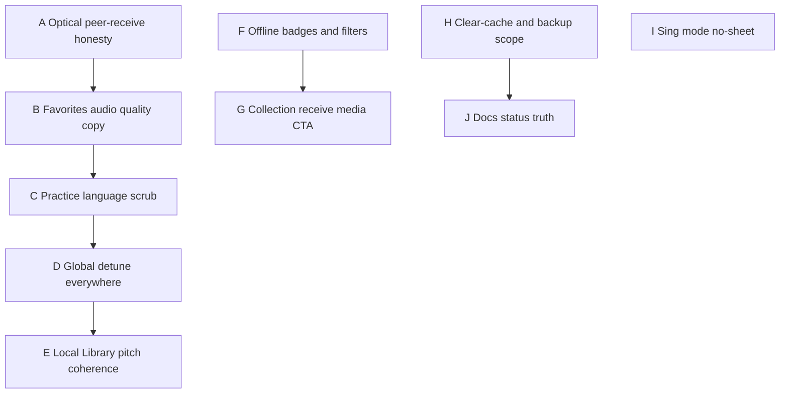

# Product honesty — overpromise fix plan

Follow-up to an adversarial audit of SingTags UI/copy vs shipped behavior (optical, favorites quality, practice kill, pitch/offline readiness, Local Library).

**Status:** Implemented (Slices 1–4 + residual copy/CTA/tests)  
**Created:** 2026-09-02  
**Related:** [sheet-qr-transfer.md](sheet-qr-transfer.md), [local-library-transfer.md](local-library-transfer.md), [sing-session-hardening.md](sing-session-hardening.md), [audio-storage-cache.md](../decisions/audio-storage-cache.md)

**North star:** User-visible promises match what the device can do tonight. Prefer **honest copy** over restoring demoted features unless we explicitly choose to re-ship them.

**Out of scope:** Vibe search / roulette / virtual piano (not advertised in SPA); Phase C S3 transfer; re-opening live DSP vs bake; full Local Library ↔ Favorites backup parity (unless called out as a stretch).

---

## Priority overview

| Phase | Why |
| --- | --- |
| A–C | Highest trust breakers; mostly copy; ship first |
| D–E | Global detune must drive Mix + Local Library Tracks; keep “Apply tuning globally” truthful |
| F–I | Partial features that over-read as “done” |
| J | Steward docs still claim dead features |

**Default product stance (do not reopen without an explicit decision):**

| Topic | Default in this plan |
| --- | --- |
| Catalog optical **send** UI | Stay demoted; **rewrite receive copy** around Local Library + ad-hoc + collection sheet receive |
| Favorites audio tier | Keep 64 kbps; **stop saying original/higher quality** |
| Practice mode | Stay killed; **remove leftover promises** |
| Mix + global detune | **Wire everywhere** when “Apply tuning globally” is on: tag Pitch, Mix bake, Local Library sheet + tracks (plus entry detune). Keep the global label. |

---

## Phase A — Optical peer-receive honesty

| | |
| --- | --- |
| **Problem** | Offline prompts, Browse/Favorites empty states, welcome, and `/tx` copy imply another phone can stream **catalog tag sheets**. Catalog send chrome was removed; only Local Library / ad-hoc / deep-link leftovers remain. |
| **Approach** | Rewrite all user-facing copy to what works: **Local Library songs**, **ad-hoc files**, and **receive** of sheets that a peer can still send (collection batches / Local Library / any remaining deep-link). Do **not** restore catalog list buttons in this plan (restore path stays documented in [sheet-qr-transfer.md](sheet-qr-transfer.md)). |
| **Copy targets** | `OfflineOpticalTransferPrompt.vue`, `HomeView` / `FavoritesView` empty states, `BrowseWelcomeDialog.vue` (offline), `OpticalTransferView.vue` intro, `OpticalReceiveInvite.vue` |
| **Suggested voice** | “Send or receive files and Local Library songs via animated QR — works offline.” Avoid “tag sheets from the catalog” / “build your library” unless Local Library is named. |
| **Done when** | A user with two phones and no catalog send UI is not told peers can stream catalog tags |

**Explicit fork (only if product reverses demotion):** Phase A′ restore catalog optical from tag `optical-transfer-catalog-buttons` — then keep current “tag sheets” copy. Do not mix half-restore with old promises.

---

## Phase B — Favorites / offline audio quality honesty

| | |
| --- | --- |
| **Problem** | App sheets prompt and welcome say **original** / **higher-quality** audio for favorites; Settings intro still says higher-quality. Device favorites are **64 kbps Opus** (`DEVICE_AUDIO_STORAGE_QUALITY`). |
| **Approach** | Align all user copy with Settings’ honest card: favorite/cache = compact offline Mix audio (64 kbps), not originals. Fix “star in Settings” misdirection — starring happens while browsing; Settings caches favorites. |
| **Files** | `App.vue` (sheets/audio prompts), `BrowseWelcomeDialog.vue`, `SettingsView.vue` intro blurb, any star tooltips that imply HQ |
| **Done when** | No user-visible “original quality” for favorites cache; welcome/settings don’t contradict the 64k card |

---

## Phase C — Practice language scrub

| | |
| --- | --- |
| **Problem** | `PRACTICE_MODE_ENABLED = false` hides the mode, but star tooltip, welcome, Favorites file comment, Settings backup (“practice order”), and `docs/status.md` still promise practice sets. |
| **Approach** | Replace “practice sets” with **offline / favorites / custom order** language. Keep practice store + custom favorites order for backup/reorder (useful without the mode). Soften backup string to “favorites custom order” not “practice order” unless exporting the dead mode snapshot (internal key can stay). |
| **Files** | `HomeView.vue` star title, `BrowseWelcomeDialog.vue`, `SettingsView.vue` backup/export copy, `docs/status.md`, Favorites header comments if user-visible |
| **Done when** | Grep of user-visible strings finds no “practice set(s)” promise; status.md does not list practice as shipped |

---

## Phase D — Global detune everywhere (product decision)

| | |
| --- | --- |
| **Problem** | “Apply tuning globally” only reliably affects pay-the-key cents. Mix bake stays A440-relative unless `?detune=` is set. Local Library combines entry detune with prefs inconsistently for Tracks. Users expect one concert A for the whole app when the toggle is on. |
| **Approach** | **Ship the coupling** (former hardening Phase I / stretch D′). When `prefs.applyDetuneGlobally` is on, include `pitchPipeDetuneCents` (via existing prefs helper) in: |
| | 1. Tag **Pitch** / pay-key (already roughly true via `fineDetuneForPayKey`) |
| | 2. Catalog **Mix** bake / `TagPlayer` pitch path (fold cents into bake — fractional semitones if the pipeline supports them; else nearest semitone + remainder on pay-key / fine path — same rule as hardening I(a)) |
| | 3. **Local Library** sheet Pitch + Tracks Mix (global + entry `detuneCents`) |
| | Keep control title **“Apply tuning globally”**; update tooltip to say Mix + Pitch + Local Library tracks, not “Mix stays A440-relative.” |
| | When the toggle is **off**, Mix and Pitch stay A440-relative aside from per-tag/`?detune=` / entry detune. |
| **Files** | `preferences.ts`, `TagView.vue`, `TagPlayer.vue` / player bake inputs, `LocalDocView.vue`, `PitchPipeView.vue` tooltip; tests for bake + pay-key with global on/off |
| **Done when** | With the toggle on, shifting concert A on Pitch Pipe audibly moves Mix and pay-key (catalog + Local Library) without a `?detune=` URL hack |
| **Related** | Supersedes “copy-only” residual in [sing-session-hardening.md](sing-session-hardening.md) Phase I |

---

## Phase E — Local Library pitch coherence

| | |
| --- | --- |
| **Problem** | More menu promises pitch; song page has Pitch + detune for sheet/pay-key, but Tracks `TagPlayer` is not driven by the same `keyShift` / song+global detune. |
| **Approach** | **E1 required:** Pass shared `keyShift` + combined detune (entry `detuneCents` + global when enabled) into Local Library `TagPlayer`, matching Phase D. Soften copy only if E1 is blocked by bake limits (unlikely if D ships). |
| **Files** | `LocalDocView.vue`, `TagPlayer` props already used on TagView |
| **Done when** | Sheet Pitch and Tracks Mix share one shift/detune story on a local song |
---

## Phase F — Offline readiness wording

| | |
| --- | --- |
| **Problem** | “Available offline” and row badges read as Mix-ready; implementation is “some sheet/audio blob cached.” Chip title already hedges. |
| **Approach** | Soften badge titles/tooltips: e.g. “Cached on device: sheets” / “Cached audio (may still need network for full Mix).” Keep filter behavior; optional subtitle under chip. No algorithm change required in this phase. |
| **Files** | `tagDisplay.ts` / `TagListRowContent.vue`, `SearchChips.vue` |
| **Done when** | Tooltips don’t imply guaranteed cold-hall Mix |

---

## Phase G — Collection optical receive → media CTA

| | |
| --- | --- |
| **Problem** | Receive creates Favorites/collection membership + sheet images; no prompt to cache tracks. Feels like a full offline set. |
| **Approach** | After successful collection import snackbar: **View collection** (existing) + **Cache audio for these tags** (or “Add media to favorites cache”) when online — reuse queue/favorites cache path. If offline, message: “Sheets saved — connect later to download tracks.” |
| **Files** | `OpticalTransferView.vue`, possibly `collectionReceive` / favorites star helpers |
| **Done when** | User isn’t left assuming Mix works offline after sheet-only receive |

---

## Phase H — Clear-cache / backup scope honesty

| | |
| --- | --- |
| **Problem** | “Clear all offline cache” and backup copy omit **Local Library** (separate IDB). Users may think wipe/backup covers everything on device. |
| **Approach** | Settings: clarify clear-cache does **not** delete Local Library; add line on backup that Local Library is separate (and/or “Export Local Library” stretch — not required here). Optional confirm dialog footnote. |
| **Files** | `SettingsView.vue` |
| **Done when** | Clear/backup strings name what is and isn’t included |

---

## Phase I — Sing mode + no sheet

| | |
| --- | --- |
| **Problem** | Sing mode promises fullscreen tags; audio-only / missing sheet opens empty fullscreen. |
| **Approach** | If no sheet assets: don’t force fullscreen (open normal tag view) **or** show a single clear empty state with “Exit” + open Tracks. Prefer skip-fullscreen when `!hasSheet`. |
| **Files** | `tagOpen.ts` / `TagView.vue` / sing-mode entry |
| **Done when** | Audio-only tags don’t strand users in empty FS chrome |

---

## Phase J — Docs truth

| | |
| --- | --- |
| **Problem** | `docs/status.md` lists practice set as shipped; optical/local plans may still drift. |
| **Approach** | Update status + plan READMEs: practice dead; optical = Local Library + ad-hoc + receive; favorites = 64k device cache. Link this plan from README. |
| **Done when** | Steward docs match A–C decisions |

---

## Suggested ship slices

1. **Slice 1 (honesty copy):** A + B + C + J — can land without behavior risk.  
2. **Slice 2 (global detune + LL pitch):** D + E1 — Mix/Pitch/Local Library all honor “Apply tuning globally.”  
3. **Slice 3 (offline nuance):** F + H + I.  
4. **Slice 4 (receive finish):** G.

If catalog optical demotion is reversed, insert **A′** before rewriting A copy.

---

## Test / verification

- Grep user-facing strings: `original quality`, `practice set`, `stream tag sheets`, `higher-quality`; confirm Pitch Pipe tooltip no longer says Mix stays A440-relative when global is on.  
- Smoke: offline Browse empty + optical prompt wording; Settings clear-cache footnote; star tooltip; with global detune on, Mix bake + pay-key + Local Library tracks shift together.  
- Update any copy assertions in `BrowseWelcomeDialog` / More / Offline prompt / Pitch Pipe tests.

---

## Open decisions (defaults above)

| Question | Default |
| --- | --- |
| Restore catalog optical send? | **No** — honesty rewrite |
| Favorites original audio? | **No** — keep 64k, fix copy |
| Revive practice mode? | **No** — scrub language |
| Mix uses global detune? | **Yes — everywhere** when toggle on (Pitch, Mix, Local Library) |
| Local Library Mix shares Pitch? | **Yes (E1)** + global detune from D |
| Local Library in app backup? | **Not required** — disclose exclusion |
