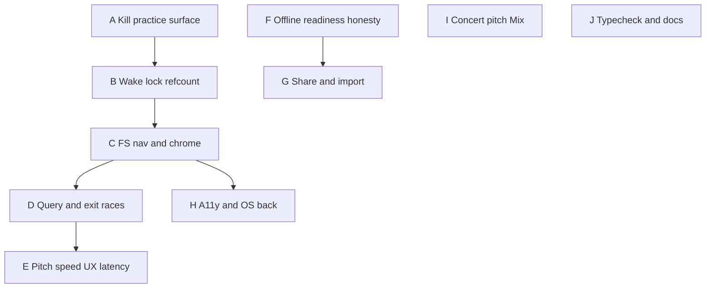

# Sing-session hardening — resolution plan

Follow-up to [sing-session-ux.md](sing-session-ux.md) after correctness + edge-case review of the uncommitted Phases 0–7 work.

**Status:** Implemented (A–J landed in working tree). Practice mode disabled via `PRACTICE_MODE_ENABLED`. Residual Mix↔global detune coupling moved to [product-honesty.md](product-honesty.md) Phase D (product decision: honor “Apply tuning globally” for Mix + Pitch + Local Library). Live DSP not pursued.

**Out of scope for this plan:** Ephemeral singing queue (Phase 8), e-ink, vibe search, live DSP redesign that would reopen [pitch-speed-bake](../decisions/pitch-speed-bake.md).

**Practice mode:** Treat as **dead for now**. Hide/disable UI and deep-link entry; keep store/code behind a flag or dead paths so we can revive later. Do **not** invest in Start practice, `?set=practice` polish, or auto-advance.

---

## Priority overview

Ship **A → E** as the critical path for singing tonight. F–J can parallelize after B/C stabilize.

---

## Phase A — Kill practice (for now)

| | |
| --- | --- |
| **Problem** | Practice is incomplete (no Start practice, list links omit `?set=practice`) but still surfaces banners, share `set=practice`, TagView auto-advance, and Favorites copy mentioning practice sets. |
| **Approach** | Feature-flag or hard-disable: ignore `?set=practice` (strip on enter or no-op `inPractice`), hide practice banner / auto-advance / Exit practice, stop encoding `practice` in `tagShare` / Favorites share copy, soften star tooltip (“practice sets”). Keep `practice` store + favorites custom order (reorder is useful without practice mode). |
| **Files** | `TagView.vue`, `tagShare.ts`, `tagReturn.ts` (practice branch), `FavoritesView.vue` copy, tests that assert practice flows |
| **Tests** | `?set=practice` does not show banner / does not auto-advance; share URLs omit `set=practice`; existing practice smoke tests updated or skipped behind “dead” note |
| **Done when** | Users cannot enter a half-broken practice session; custom favorites order still works |

---

## Phase B — Wake lock correctness

| | |
| --- | --- |
| **Problem** | Single global `wantLock` flag. Pause Mix drops lock while sheet FS; exit FS drops lock while Mix plays; track end / A–B stop / unmount often never release → leak or sleep mid-sing. |
| **Approach** | Refcounted (or multi-holder) API: e.g. `acquireWakeLock('sheet' \| 'audio')` / `releaseWakeLock('sheet' \| 'audio')`. Holders: SheetViewer fullscreen, TagPlayer while `playing`. Release on: FS exit, pause, natural end, region stop, `playbackReady→false`, component unmount, route leave. Keep visibility re-acquire when **any** holder still wants the lock. |
| **Files** | `wakeLock.ts`, `SheetViewer.vue`, `TagPlayer.vue`, `wakeLock.test.ts`, SheetViewer/TagPlayer tests |
| **Tests** | FS + play both held → pause keeps lock; FS + play → exit FS keeps lock; play → end releases; unmount releases; missing API still no-ops |
| **Done when** | Screen stays awake for the whole sing session; never stuck on after leaving tag |

---

## Phase C — Fullscreen page nav + chrome

| | |
| --- | --- |
| **Problem** | `goPage` / arrows use `scrollIntoView` under `overflow: clip` + stage transform — indicator lies. `watch(displayPages)` resets `pageIndex` to 0 on PDF upgrade. Auto-enter watcher can yank user back into FS after Tag/Escape. Compact chrome hides Mix behind ⋮ (product tradeoff — optional soften). |
| **Approach** | 1) Page change: translate/scroll the **stage** (or set page offset in zoom-pan space), not `scrollIntoView`. Sync indicator from the same source of truth. 2) Preserve `pageIndex` across `displayPages` reassignment when length unchanged (or clamp). 3) Latch `userExitedFullscreen` / clear auto-enter as soon as Tag/Escape fires (don’t wait only on router). 4) Optional: keep Play mix visible in compact chrome (Pitch + Play + ⋮ + Tag + ✕). |
| **Files** | `SheetViewer.vue`, `sheetZoomPan.ts` if needed, `SheetViewer.sing.test.ts` |
| **Tests** | Two-page FS: next advances visible page + indicator; PDF upgrade does not reset page; Tag exit does not re-enter on page-count flicker |
| **Done when** | Multi-page sheets are usable in huddle FS; leaving to Tag page sticks |

---

## Phase D — Navigation / query races

| | |
| --- | --- |
| **Problem** | Soft FS isn’t history; OS back leaves the tag. `exitToOrigin` does `setFullscreen(false)` → async query `replace` then `goBack()` — history can reorder. Shift `replace` and FS-clear `replace` both spread `route.query` and can fight. Empty `?fullscreen=1` with no sheet has no error. |
| **Approach** | 1) Single `patchTagQuery(mutator)` serializer on TagView (queue microtasks / coalesce). 2) ✕: navigate first (or `goTagBack` without intermediate replace), let unmount clear FS; or clear query in the same navigation. 3) Document / optionally intercept: while FS, treat browser back as Tag exit once (pushState FS sentinel **or** `popstate` handler) — pick one strategy and test on Android Chrome + iOS Safari. 4) Sing entry with zero pages: status message “No sheet to open fullscreen” + clear `fullscreen` query. |
| **Files** | `TagView.vue`, `SheetViewer.vue`, `tagReturn.ts` as needed |
| **Tests** | Coalesced shift+FS-clear; exit-origin ends on list without leftover tag+fullscreen; empty assets clear query |
| **Done when** | ✕ / Tag / Escape / OS back behave predictably; no resurrected `fullscreen=1` after exit |

---

## Phase E — Pitch / speed “not instant” (expected bake + UX)

| | |
| --- | --- |
| **Problem** | Non-identity pitch/speed **must bake** (WSOLA + formant worker) before audio changes — see ADR. UI updates immediately; **sound** lags until bake completes. Feels broken, especially from FS ± or rapid taps. Sequential `setPitch` then `setSpeed` can double-bake. |
| **Approach (do not violate ADR)** | 1) **Visible baking state** in TagPlayer + FS chrome when `player.baking` (disable or spin ± / speed; “Updating pitch…”). 2) FS ± should call **`setTransform(pitch, speed)` once** (or ensure TagPlayer coalesces) so one bake covers both. 3) **Warm / prefetch**: on tag load, optionally kick identity warm-up (already partly there) and debounce ± (e.g. 150–250 ms) so rapid taps bake once. 4) Cache hit path: assert bake cache key hits feel near-instant on re-selecting a prior shift; add test. 5) Pay-key (PitchPlayer) stays live — only Mix is bake-bound; copy should say Mix takes a moment to retune. |
| **Non-goals** | Live `playbackRate ≠ 1`, SoundTouch worklet — rejected by ADR unless a new decision reopens it. |
| **Files** | `TagPlayer.vue`, `player.ts` / bake cache if needed, `TagView.vue` / SheetViewer shift wiring, copy in tips |
| **Tests** | Rapid ± → single latest bake wins; UI shows baking then settles; `setTransform` preferred when both change; cache hit applies without full worker path (existing player tests extended) |
| **Done when** | Users understand the wait; rapid shifts don’t stack confusing audio; second visit to same shift is snappy |

---

## Phase F — Offline readiness honesty

| | |
| --- | --- |
| **Problem** | Cached filter ≈ any blob; pack complete doesn’t `refreshCacheReady`; Favorites badges ≠ pack index; Recent/TagView have no readiness. |
| **Approach** | 1) Call `refreshCacheReady()` on pack progress/complete (debounce). 2) Tighten definition **or** rename chip copy to “Has offline files” vs “Sing-ready (sheet + Mix)” — prefer honesty over false confidence. 3) Align Favorites row badges with `cacheReadyByTag` where possible. 4) Optional light indicator on TagView (“Sheet/audio available offline”). |
| **Files** | `offlineLibrary.ts`, `offlineReadiness.ts`, SearchChips copy, FavoritesView, maybe TagView |
| **Tests** | Pack complete → ready map updates without remount; readiness helper unit cases for partial vs both |
| **Done when** | “Cached” doesn’t over-promise a cold hall sing |

---

## Phase G — Favorites share / import

| | |
| --- | --- |
| **Problem** | QR via `api.qrserver.com` (privacy + offline); import metadata-only; duplicate collection names; long URL silent fail. |
| **Approach** | 1) Client-side QR (small dep or canvas) — no third party. 2) After import confirm: optional “Download media for offline” CTA (queue pack / favorite media). 3) Reuse collection if same name exists (prompt). 4) Warn when encoded URL length &gt; ~2k chars. |
| **Files** | `FavoritesView.vue`, `favoritesShare.ts`, maybe tiny `qr.ts` |
| **Tests** | Parse/encode round-trip; length warning; QR generated without network mock |
| **Done when** | Share works offline; import can lead to sing-ready cache |

---

## Phase H — A11y + soft FS shell

| | |
| --- | --- |
| **Problem** | No `aria-modal` / `inert` / focus trap; toasts under/over Sing FAB; bottom nav 6-col with 5 tabs. |
| **Approach** | On FS enter: `inert` app shell (or focus trap inside `.sheet.fullscreen`), restore on exit. Toast stacking vs Sing FAB (offset or suppress non-critical while FS). Fix nav grid to 5. |
| **Files** | `SheetViewer.vue`, `App.vue` / toast host, nav CSS |
| **Tests** | Focus stays in FS chrome; Escape still exits per Phase D |
| **Done when** | Keyboard/SR usable in huddle FS |

---

## Phase I — Global concert pitch → Mix (optional product)

| | |
| --- | --- |
| **Problem** | “Use this tuning for tag pitches too” only affects pay-key cents, not Mix bake. |
| **Approach** | Either (a) fold global detune into bake pitch (fractional semitones if pipeline supports, else nearest + pay-key remainder), or (b) change copy to “Pay-key / Pitch Pipe only” until bake supports cents. Prefer (b) short-term if bake is integer-semitone only; (a) if cents already flow into formant. |
| **Files** | `preferences.ts`, `TagView.vue`, `TagPlayer.vue` / player, PitchPipe copy |
| **Done when** | Checkbox matches audible reality |

---

## Phase J — Typecheck + docs hygiene

| | |
| --- | --- |
| **Problem** | `TagView` `@click="copyShareUrl"` TS2345; unused `sheetViewerRef`; plan docs over-claim Phases 0–7 “done.” |
| **Approach** | Wrap share click `() => copyShareUrl()`; remove or use ref; update `sing-session-ux.md` status → “implemented with known gaps; see sing-session-hardening.md.” Fix or quarantine unrelated `downloadConcurrency` erasableSyntax error if it blocks CI. |
| **Done when** | `npm run typecheck` clean for web; docs match reality |

---

## Suggested ship order (PR-sized)

1. **A** Kill practice surface  
2. **B** Wake lock holders  
3. **C** Page nav + auto-enter latch + optional compact Play  
4. **D** Query serializer + exit/OS-back policy + empty FS  
5. **E** Baking UX + coalesce transforms  
6. **J** Typecheck/docs (can land anytime after A)  
7. **F** then **G** offline honesty + share QR  
8. **H** a11y  
9. **I** concert pitch honesty or Mix coupling  

---

## Smoke checklist (after each phase)

- Browse Sing on → tag opens FS → Pitch hold works → ⋮ → Play mix → pause/resume → Tag → tag page → Back → same list  
- ✕ from FS → list; Sing still on  
- Multi-page tag: page controls move the sheet  
- ± then hear Mix change (with baking affordance)  
- Airplane mode: cached tag still opens; readiness copy not lying  
- No practice banner for any URL  

---

## Explicit non-goals (revisit later)

- Revive practice / Start practice / singing queue  
- Live pitch/speed without bake  
- E-ink paging  
- In-app QR scanner (outbound QR is enough for G)
