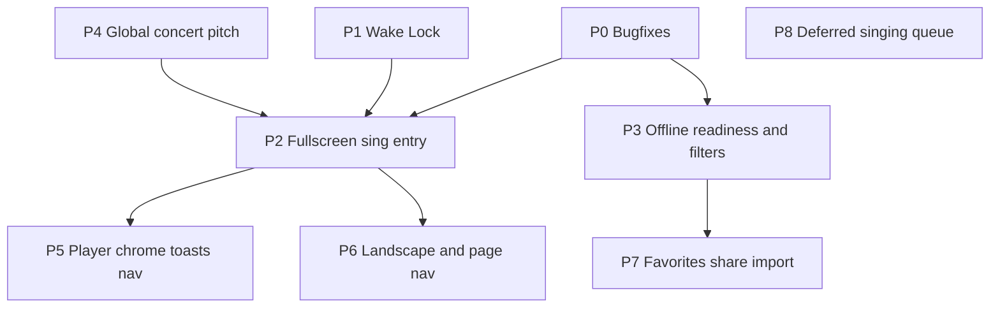

# Sing-session UX — phased feature plan

Roadmap for making SingTags faster for four people standing together with phones/tablets and spotty internet.

**Checkpoint:** `17e1bf3` (offline upgrade cull, pack/perf fixes, docs cleanup).

/** Implementation status:** Phases 0–7 largely in the working tree; hardening in progress per [sing-session-hardening.md](sing-session-hardening.md) (practice mode dead; wake lock refcount; FS paging; bake UX; offline honesty). Phase 8 remains deferred.

**Out of scope for this plan:** e-ink paging (known gap), vibe search, tag roulette, virtual piano, ephemeral “singing queue” (deferred — see Phase 8). **Practice mode** is treated as dead in the hardening plan (do not expand here).

**Working rules for every phase**
- One phase = one PR-sized slice when possible; land tests before expanding UI.
- After each phase: run targeted Vitest suites for touched files, plus a smoke pass of Browse → Tag → fullscreen sheet → pitch → play.
- Prefer extending existing surfaces ([`SheetViewer.vue`](../../web/src/components/SheetViewer.vue), filters, preferences) over new modes/toggles.
- Watch pack/list probe cost: readiness must not reintroduce O(n) `listUrls` on every row paint.

---

## Dependency overview

P0 / P1 / P4 can start in parallel. P2 benefits from P1 (wake while fullscreen) and P4 (detune while paying key). P7 benefits from P3 (shared lists that show what is cached).

---

## Phase 0 — Bugfixes (ship first)

### 0a. Browse default stays Collection

| | |
| --- | --- |
| **Problem** | Catalog defaults to `collection`, but [`HomeView.applyRoute`](../../web/src/views/HomeView.vue) treats a missing `?sort=` as `title`. Collection omits sort from the URL, so a clean `/` often shows Title. |
| **Fix** | When `route.query.sort` is absent, use `DEFAULT_BROWSE_SORT` (`collection`) from [`catalog.ts`](../../web/src/stores/catalog.ts), not `'title'`. |
| **Files** | `web/src/views/HomeView.vue`, possibly a small HomeView / catalog route test |
| **Tests** | Mount or unit: `/` with empty query → `sortMode === 'collection'`; explicit `?sort=title` still title; Collection still omits `sort` from URL via `routeQueryPatch`. |
| **Done when** | Cold load and home-nav to Browse open Collection grouping without a sticky wrong Title mode. |

### 0b. Copy URL includes key shift

| | |
| --- | --- |
| **Problem** | [`sharePageUrl`](../../web/src/views/TagView.vue) builds `/tag/:id` only and drops `?shift=`. |
| **Fix** | Resolve share URL with current `shift` (and keep practice `set` if present). Prefer `navigator.share` when available; clipboard fallback stays. |
| **Files** | `TagView.vue`, TagView / share unit test |
| **Tests** | `shift=2` → copied/shared href contains `shift=2`; `shift=0` omits or normalizes cleanly; practice query preserved when active. |
| **Done when** | Quartet can text a transposed tag and land on the same key. |

---

## Phase 1 — Screen Wake Lock

| | |
| --- | --- |
| **Goal** | Keep the screen awake while singing (fullscreen sheet and/or audio playing). Huge real-world pain vs OS “never sleep” settings. |
| **Approach** | Use the [Screen Wake Lock API](https://developer.mozilla.org/en-US/docs/Web/API/Screen_Wake_Lock_API). Request on sheet fullscreen enter and while player is playing; release on exit / pause / route leave. Re-request on `visibilitychange` when document becomes visible again (browsers drop the lock on hide). Graceful no-op where unsupported. |
| **Files** | New small helper e.g. `web/src/lib/wakeLock.ts`; wire from `SheetViewer.vue` and/or `TagPlayer.vue` / `TagView.vue` |
| **Tests** | Mock `navigator.wakeLock.request`; assert request/release on fullscreen enter/exit and play/pause; no throw when API missing. |
| **Perf / risk** | Low. Do not hold the lock on Browse idle. |
| **Done when** | Shared tablet in fullscreen sheet stays on without changing device sleep settings. |

---

## Phase 2 — Open into fullscreen “sing” sheet (no mode toggle)

| | |
| --- | --- |
| **Goal** | **Sing mode** (prefs toggle, default off) makes Browse/Recent/Favorites open tags with `?fullscreen=1`, which auto-enters extended fullscreen sheet (pitch, ±, Mix play/scrub, hideable). With Sing mode off, list taps open the normal tag page. |
| **Approach** | Persisted `prefs.singMode`. Floating Sing control on Browse; toolbar toggles on Recent/Favorites. `tagOpenLocation` / `isTagFullscreenQuery` in `lib/tagOpen.ts`. Exit fullscreen clears `fullscreen` (and legacy `sheet`/`sing`) from the URL. Share links omit fullscreen. |
| **Files** | `SheetViewer.vue`, `TagView.vue`, list row links in `HomeView.vue` / `RecentView.vue` / `FavoritesView.vue`, maybe `tagReturn.ts` |
| **Tests** | Flag → `enterFullscreen` called when sheets ready; chrome exposes pitch/shift/play; hide chrome leaves sheet visible; without flag, existing tag layout unchanged. |
| **Integration** | Works with Phase 0b (`shift` in URL), Phase 1 (wake while fullscreen), Phase 4 (global detune on pitch). |
| **Done when** | One tap from a list can put Mix + pitch + score on screen for a huddle without scrolling the tall tag page. |

**Decision locked:** extend existing fullscreen viewer; Sing mode is an explicit prefs toggle (default off), not a separate route or stripped tag page.

---

## Phase 3 — Offline readiness + cached filters

| | |
| --- | --- |
| **Goal** | See and filter whether a tag’s **sheet**, **tracks**, or **both** are cached before opening. |
| **Approach** | Derive per-tag readiness from packs + favorites blobs (reuse pack pathname index / existing probes; batch, do not N×`listUrls`). Show chips on Browse / Favorites / Recent / TagView. Add filter facets: cached any / sheets / audio / both / not cached. |
| **Files** | New helper under `web/src/offline/` or `web/src/lib/`; `FilterSheet.vue` / `SearchChips.vue` / `catalog` filters; list row UI; TagView banner |
| **Tests** | Fixture packs → readiness map; filter reduces result set; no readiness work on every scroll tick (debounce or indexed set). |
| **Perf gate** | Opening Browse with full catalog must not regress; measure or assert probe is set-membership, not full cache scan per row. |
| **Done when** | At a venue you can filter “sheets+audio cached” and only open what will actually play offline. |

---

## Phase 4 — Global concert pitch / detune from Pitch Pipe

| | |
| --- | --- |
| **Goal** | Keep the Pitch Pipe page. Add a checkbox: when checked, A=Hz / fine detune applies to **all** pitches in the app (pipe notes + tag pay-the-key). |
| **Approach** | Persist e.g. `applyDetuneGlobally` on [`preferences`](../../web/src/stores/preferences.ts) next to existing `pitchPipeAHz` / `detuneCents`. [`PitchPlayer`](../../web/src/audio/pitchPlayer.ts) / TagView pay-key: add global cents on top of key-shift detune when flag on. Pitch Pipe UI checkbox with clear copy (“Use this tuning for tag pitches too”). |
| **Files** | `preferences.ts`, `PitchPipeView.vue`, `TagView.vue`, `pitchPlayer.ts` if centralizing |
| **Tests** | Flag off → tag pitch ignores pipe slider; flag on → A432 (or fine cents) shifts tag tonic; prefs survive reload; pipe page still works standalone. |
| **Done when** | Quartet tunes the room once on Pitch Pipe and tag keys match without re-setting per song. |

---

## Phase 5 — Player priority, toast coalesce, nav declutter

| | |
| --- | --- |
| **Goal** | Faster learning controls; quieter first-run; clearer primary nav for singing. |
| **5a Player** | Surface **speed** (and keep pitch sync) outside Advanced on [`TagPlayer`](../../web/src/components/TagPlayer.vue); leave Custom mix / Solo / Balance secondary. Align with fullscreen Mix control from Phase 2 (same default part: Mix). |
| **5b Toasts** | Coalesce welcome / install / sheets / sync / reconnect so venue opens aren’t a toast pile ([`App.vue`](../../web/src/App.vue), snackbar store). Prefer one “offline prep” path at home. |
| **5c Nav** | Demote Queue (zip/export) and heavy Offline prep: e.g. Queue under overflow/Settings; keep Browse / Favorites / Recent / Pitch Pipe prominent. Exact IA in implementation notes when touching `App.vue`. |
| **Tests** | Player: speed control visible without opening Advanced; smoke nav routes still resolve; toast: at most one blocking prompt class on cold start in test harness. |
| **Done when** | Thumb reaches speed quickly; Offline/Queue don’t compete with singing destinations; first-open noise is reduced. |

---

## Phase 6 — Shared tablet: pages + landscape chrome

| | |
| --- | --- |
| **Goal** | Better multi-page reading and landscape huddle use on the Phase 2 fullscreen surface. |
| **Approach** | Prev/next **page** controls in fullscreen (in addition to scroll). Landscape-aware chrome placement (pitch / page / mini transport on a thumb edge). Prefer fit-width + page step over “fit all pages” as the shared default. |
| **Files** | `SheetViewer.vue`, `sheetZoomPan.ts` as needed |
| **Tests** | Multi-page fixture: next/prev changes visible page; landscape media query or class applies chrome layout; Fit-all not forced on enter. |
| **Depends on** | Phase 2 |
| **Done when** | Three people can follow a multi-page tag on a landscape tablet without pinching through a stacked scroll. |

---

## Phase 7 — Favorites share / import / bulk add

| | |
| --- | --- |
| **Goal** | Move a favorites list (or user collection) to another device via **URL** and **QR**; open in the PWA; optional in-app QR scan; **add by tag numbers** (comma/space-separated). |
| **Approach** | Encode a compact share payload (tag ids + optional collection name) in a route or hash the app already can open, e.g. `/favorites?import=…` or `/import/favorites#…` (keep URL length sane; for large sets use compressed id list). Show QR (client-side generator). Import screen: confirm → merge into favorites / named collection. “Add from tag #s” textarea on Favorites. **Surface** `createdAt` / `updatedAt` already on [`userCollections`](../../web/src/stores/userCollections.ts) in the UI (sort/display). In-app camera QR scan: progressive enhancement where `BarcodeDetector` / getUserMedia allows; otherwise “upload QR image” or OS camera + open link. |
| **Files** | `FavoritesView.vue`, `userCollections.ts` / `favorites.ts`, router, small QR helper, import view or modal |
| **Tests** | Round-trip encode/decode id list; import merges without dupes; invalid payload errors cleanly; tag-number parse (`31, 922 1776`); dates render for collections. |
| **Security / UX** | Import is local-only (no server); confirm before large merges; deep link works when PWA handles origin links. |
| **Depends on** | Phase 3 helpful for “cache these after import” CTA, not strictly required for share plumbing. |
| **Done when** | Device A shows QR / texts URL; Device B opens SingTags and gets the same list; typing tag numbers queues favorites quickly. |

---

## Phase 8 — Deferred: ephemeral singing queue

| | |
| --- | --- |
| **Idea** | “Sing X then Y then Z tonight” without saving as favorites/practice. |
| **Decision** | **Defer.** Near-term: use Favorites custom/practice order, Recent, and Phase 7 imports. Revisit after Phases 2–7 if huddles still need a disposable queue. |
| **If revisited** | Separate from download Queue; clear session semantics; optional promote-to-favorites. |

---

## Regression & performance checklist (every phase)

- [ ] Targeted Vitest for changed modules
- [ ] Smoke: Browse Collection → open tag → pitch → sheet → Mix play
- [ ] Offline: open a cached tag with network offline (manual or mocked)
- [ ] No new full-pack `listUrls` on Browse scroll
- [ ] Fullscreen enter/exit does not leak object URLs / wake locks
- [ ] Share / import URLs remain backwards compatible when possible

---

## Suggested build order (summary)

| Order | Phase | Type | Effort (rough) |
| --- | --- | --- | --- |
| 1 | 0a + 0b | Bugfix | S |
| 2 | 1 Wake Lock | Feature | S |
| 3 | 4 Global detune | Feature | S–M |
| 4 | 2 Fullscreen sing entry | Feature | M–L |
| 5 | 3 Readiness + filters | Feature | M–L |
| 6 | 5 Player / toasts / nav | Polish | M |
| 7 | 6 Landscape + pages | Feature | M |
| 8 | 7 Favorites share/import | Feature | L |
| — | 8 Singing queue | Deferred | — |

Start implementation with **Phase 0**, then **Phase 1**, unless product priority shifts to readiness (Phase 3) for an upcoming offline event.
