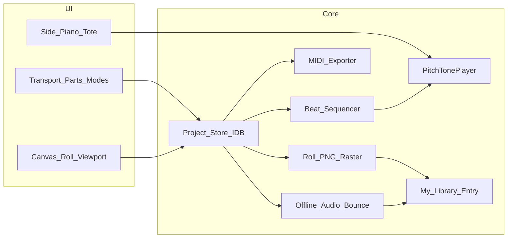
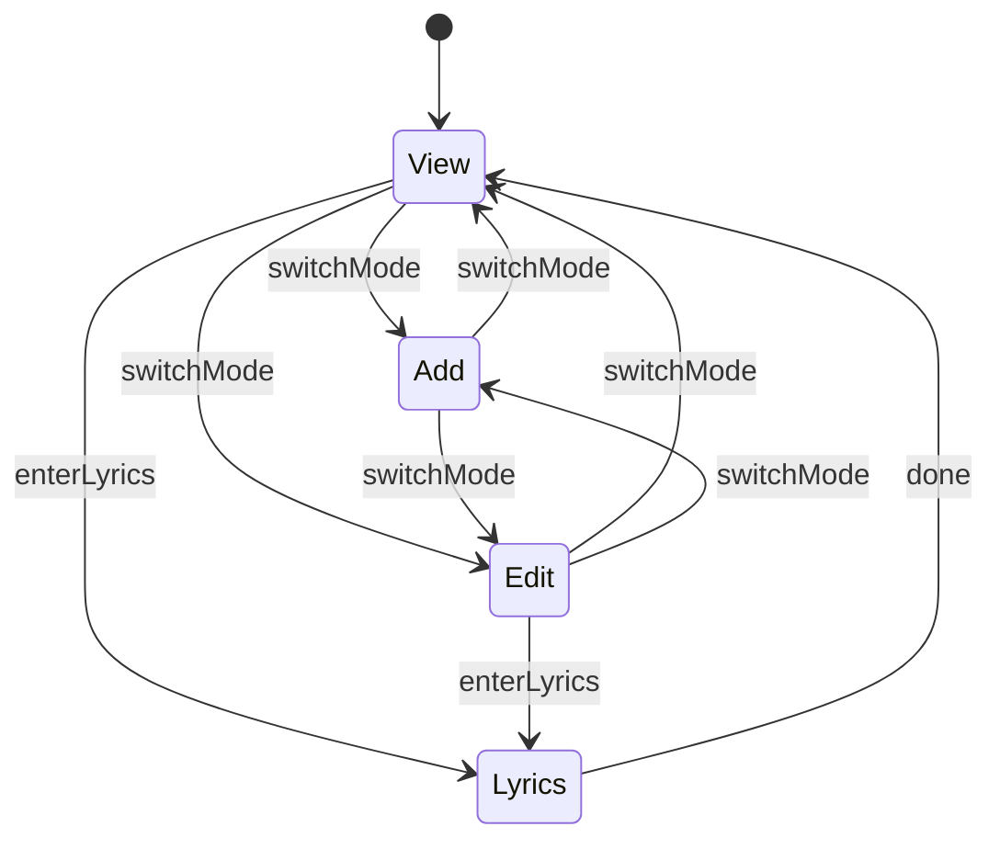

# Tag Roll — piano-roll tag composer

> **Status:** In progress — Phase 1 started on `piano-roll` branch  
> **Updated:** 2026-09-17  
> **Goal:** Labs-gated polyphonic piano-roll editor for sketching original tags: one shared pitch×time grid, colored custom parts, playback, lyrics-by-part, MIDI export, Save to My Library (sheet PNG + rendered tracks), and a barbershop lead→chord harmonizer.  
> **Related:** [virtual-piano.md](virtual-piano.md) (live keyboard / engines — complementary, not a sequencer), My Library ([local-library-ux.md](local-library-ux.md)), Pitch Pipe Sound Lab, [MuseScore Barbershop Harmonizer](https://github.com/znarf94/MuseScore_Barbershop_Harmonizer) (Phase 7 reference).

The live poly keyboard plan ([virtual-piano.md](virtual-piano.md)) remains separate: Tag Roll is a **sequencer/editor**; virtual piano is a **playable instrument**. They share pitch-tone engines.

---

## Product framing

**Tag Roll** lets users sketch polyphonic tags on one shared piano-roll grid. Notes are colored by voice part (custom names/colors; N≥4 allowed and stackable). Playback uses the existing pitch-tone engines. Interchange is MIDI export and a My Library handoff (not catalog publish in v1).

| Surface | Route | Gate |
| --- | --- | --- |
| Project list | `/labs/tag-roll` | `singtags.labs.tagRoll.enabled.v1` (default off) |
| Editor | `/labs/tag-roll/:id` | same; router auto-enable like other labs |

Labs card on `LabsView.vue`. Optional More/nav pin later via `primaryNav.ts`.

**Non-goals (v1):** staff notation, cloud sync, catalog upload as a published SingTags tag, velocity editing, external MIDI keyboard input, WebGL (Canvas 2D is enough; revisit only if note density proves too slow), MusicXML/PDF engraving.

**In scope for library handoff:** convert a Tag Roll project into a **My Library** song (sheet image + rendered audio tracks).



---

## Reuse vs new

| Reuse | New |
| --- | --- |
| `createPitchTonePlayer` / note IDs / MIDI helpers (`web/src/audio/pitchTone.ts`, `pianoSamples.ts`) | Beat/grid project model + IndexedDB |
| Piano lock / multitouch conflict ideas (`PianoHorizontalScroll.vue`) | Canvas roll + note hit-testing |
| Pinch/pan math patterns (`sheetZoomPan.ts`, `SheetViewer.vue`) | Axis-weighted multitouch resize |
| Labs + IDB patterns (`localLibraryDb.ts`, prefs gates) | Transport clock + MIDI SMF export |
| Part label helpers (`parts.ts`) as defaults only | Part color palette + custom parts |
| My Library import (`localLibrary` store; image + audio roles) | Full-roll sheet raster + offline bounce |

---

## Data model

New module `web/src/lib/tagRoll/` + IDB `singtags-tag-roll` (mirrors recorder/library: `idbReq`, `newLocalId`).

```ts
// Conceptual schema (singtags.tagRoll.project.v1)
type TagRollPart = {
  id: string
  name: string // custom ("Lead", "Guest", …)
  color: string // CSS color
  midiGroup: 'upper' | 'lower' | 'solo' // for 2-track export
}

type TagRollNote = {
  id: string
  partId: string
  midi: number // 0–127; display via midiToNote
  startTick: number // PPQ ticks from 0
  durationTicks: number
  lyric?: string // syllable / word fragment for this note
}

type TagRollProject = {
  schema: 'singtags.tagRoll.project.v1'
  id: string
  title: string
  bpm: number
  ppq: 480
  snapTicks: number // default = ppq/4 (16th)
  lengthTicks: number // grows with content / user extend
  soundEngine: 'synth' | 'samples'
  /** Concert pitch class 0–11 for harmonizer root grids (C=0). */
  tonality?: number
  preferFlats?: boolean
  parts: TagRollPart[]
  notes: TagRollNote[]
  /** When set, last successful “Save to My Library” target (update vs create). */
  localEntryId?: string | null
  // view prefs (also mirrored in session): cellW, cellH, scrollX/Y, lockPiano, mode, …
  updatedAt: number
}
```

**Defaults:** 4 TTBB parts with a fixed color palette (new map); `midiGroup` upper = tenor/lead, lower = bari/bass; custom parts default `solo`.

**Storage shape:** Persist a flat `notes[]` (fast canvas hit-test / spatial queries). Derive `notesByPartId` indexes in the store for lyrics walk and MIDI export.

**Parts panel:** Add / rename / delete parts; color from a **preset swatch matrix** (plus custom hex). Deleting a part confirms: reassign orphans or delete those notes.

**Infinite length:** `lengthTicks` auto-extends when a note is placed within one measure of the end, plus explicit “+ measure(s)” control.

**Persistence:** Pinia `useTagRollStore` — load/list/create/save debounced; list page for projects.

---

## Editor UX (single grid)

### Layout

```
[ Projects ]  Title     BPM  Sound▾  Parts▾  Export ▾
[ ⏮ ▶ ⏸ ⏹ ]  scrub  |  Mode: View / Add / Edit   Dur▾   [🗑]  [Lyrics]
┌────┬────────────────────────────────────────────────────────┐
│Tote│  Piano roll canvas (pitch ↑  ·  time →)                │
│keys│  notes colored by part; lyrics inside note if room     │
└────┴────────────────────────────────────────────────────────┘
[ − cellW + ] [ − cellH + ]  [ Lock piano ]  active part chips
```

- **One grid:** all parts share the same pitch×time plane (not separate lane tracks). Stacking = overlapping rects; draw order = part order / selection on top.
- **Tote (left):** piano key labels; click sounds pitch via tone player; vertical scroll syncs with roll unless **Lock piano** (locks pitch scroll; time pan still works). Same idea as pitch-pipe `lockPosition`.

### Interaction state machine



- **View (idle):** pan/zoom, tote audition, transport only — no place/select/move. Default when opening a project; auto-enter View on Play (v1 stays in View until the user switches).
- **Add:** toolbar **default duration** dropdown (whole / half / quarter / eighth / sixteenth → ticks); tap empty cell → create on **active part** at snap; optional horizontal drag while placing extends duration when zoomed in enough.
- **Edit:** click note → select (highlight + Delete + duration dropdown); drag body → move pitch/time (snapped); **duration drag-handles only when `cellW` ≥ threshold** (e.g. ~24px).
- **Lyrics:** overlay mode; not for placing notes.
- **Active part:** chips + Parts panel; new notes and lyrics target this part.

### Zoom / pan / multitouch

- **+/- buttons:** independently step `cellW` (px per beat) and `cellH` (px per semitone).
- **Click-drag / one-finger pan:** scroll time and pitch (unless lock piano → time only).
- **Two-finger multitouch (angle-based aspect):** contact vector angle mixes horizontal vs vertical scale — mostly horizontal → `cellW`; mostly vertical → `cellH`; diagonal → both (`tagRollZoomPan.ts`; SheetViewer pointer-map pattern).
- Cull notes outside the viewport on the canvas.
- **Zoom-dependent handles:** resize grips drawn/hittable only above the `cellW` threshold.

### Lyrics (part-by-part)

- Enter **Lyrics mode** with an active part; caret on selected note or chronologically first note of that part.
- **Space:** commit buffer as `lyric`; advance to next note of that part (`startTick`, then `midi`).
- **Dash (-):** commit buffer **with a trailing hyphen** (syllable split); advance to next note.
- Backspace on empty buffer returns to previous note of that part.
- On-note text: if note bbox is below width/height thresholds, **hide** the lyric; otherwise draw centered.

### Playback

- Transport: **Play / Pause / Stop** (silence, leave playhead) / **Return-to-zero** / scrub on the time ruler.
- Lookahead scheduler (`AudioContext.currentTime`) + `createPitchTonePlayer` (polyphony on). Mute/solo per part = v1.5; v1 plays all.
- BPM changes **cursor velocity** only (ticks stay fixed).
- Sound dropdown (v1): **Synth** | **Piano samples** (Sound Lab voice applies to synth).

---

## MIDI export

`web/src/lib/tagRoll/midiExport.ts` — SMF Type 1 (hand-rolled writer or a tiny dependency).

| Mode | Mapping |
| --- | --- |
| **1 track** | All notes on one polyphonic MIDI track |
| **2 tracks** | `midiGroup` upper vs lower; `solo` parts by median pitch or user override |
| **All tracks** | One MIDI track per part (custom names as track names) |

Include tempo meta and MIDI lyric events at note starts when present. Download as `.mid`.

---

## Save to My Library

Toolbar **Save to My Library** (alongside MIDI). Uses `localLibrary` APIs (`createEmptyEntry` / `updateMeta` + `importFromBytes` / `addFilesToEntry`). Library accepts images + audio (`sheet` / `track` roles).

### Artifacts

| Artifact | Role | Content |
| --- | --- | --- |
| Roll snapshot | `sheet` (PNG) | Full arrangement raster (not only the viewport) |
| Spill pages | `alternateSheet` / extra images | If too large for one canvas, slice by measure ranges |
| Per-part audio | `track` | One WAV per part; `partId` = slug of part name |
| Mix (default on) | `track` `partId: 'mix'` | All parts bounced together |

Entry metadata: `title` from project; `lyricsHint` from early lyric syllables; `notes` may say “Created from Tag Roll”.

**Update path:** if `project.localEntryId` still exists, replace prior Tag-Roll-generated assets (filename prefix `tag-roll-*`) and refresh meta; else create a new entry and store `localEntryId`.

### Sheet raster

- Shared offscreen draw path: `renderTagRollSheet(project, viewOpts) → Blob`.
- Entire `lengthTicks` × pitch range used by notes (pad ±2 semitones), part colors, lyrics when they fit, grid, optional legend.
- PNG via `canvas.toBlob` (see `sheetErode.ts`). Progress: “Rendering sheet…”

### Track bounce

- `OfflineAudioContext` schedule of the same events as the live sequencer, at project BPM, using the selected sound engine (preload samples when needed).
- One pass per part + optional mix; encode WAV via existing recorder/export helpers; attach as `track` with `partId`.
- Progress per part; warn/cap very long arrangements (e.g. >3 minutes).

### Export menu UX

```
Export ▾
  MIDI — 1 track / 2 tracks / All tracks
  Save to My Library…
    ☑ Mix track
    ☑ Per-part tracks
    [ Create new | Update linked song ]
```

On success: snackbar **Open in My Library** → `/library/:id`. Auto-enable `localLibraryEnabled` if needed (same deep-link pattern as other labs).

**Handoff non-goals:** PDF/MusicXML; overwriting unrelated user assets on a linked song; service-worker background bounce.

---

## Implementation structure

| Area | Files (planned) |
| --- | --- |
| Types + normalize | `web/src/lib/tagRoll/types.ts`, `normalize.ts` |
| IDB | `web/src/offline/tagRollDb.ts` |
| Store | `web/src/stores/tagRoll.ts` |
| Sequencer | `web/src/lib/tagRoll/scheduler.ts` |
| MIDI | `web/src/lib/tagRoll/midiExport.ts` |
| Sheet raster | `web/src/lib/tagRoll/sheetRender.ts` |
| Offline bounce | `web/src/lib/tagRoll/audioBounce.ts` |
| Library handoff | `web/src/lib/tagRoll/saveToLibrary.ts` |
| Harmonizer | `web/src/lib/tagRoll/harmonizer/` + `TagRollHarmonizePanel.vue` |
| Zoom/pan math | `web/src/lib/tagRoll/zoomPan.ts` |
| Canvas editor | `web/src/components/tagRoll/TagRollViewport.vue` |
| Tote | `web/src/components/tagRoll/TagRollTote.vue` |
| Chrome / transport | `web/src/components/tagRoll/TagRollToolbar.vue` |
| Lyrics field | `web/src/components/tagRoll/TagRollLyricsInput.vue` |
| Pages | `web/src/views/TagRollListView.vue`, `TagRollEditorView.vue` |
| Labs/router/prefs | LabsView, router, preferences, optional primaryNav |
| Tests | normalize, snap, midi bytes, scheduler (fake clock), zoomPan angle mix, sheetRender bounds, bounce duration math, harmonizer filters |

**Rendering:** canvas for note grid + playhead; DOM for toolbar, tote, lyrics input, dialogs (same split as `WaveformView.vue`).

---

## Phased delivery

### Phase 1 — Skeleton + model

Labs gate, list/create project, IDB save/load, empty canvas grid, cellW/H +/-, pan, lock piano, tote click-to-hear.

### Phase 2 — Notes + modes

View/Add/Edit state machine, duration dropdowns, place/select/move/resize/delete, parts panel + swatches, snap, auto-extend length, zoom-gated resize handles.

### Phase 3 — Playback

Play/Pause/Stop/Return-to-zero, BPM, sound engine toggle, lookahead scheduler; auto-enter View on Play.

### Phase 4 — Lyrics + MIDI

Per-part lyrics (Space commit; Dash + trailing `-`), bbox-aware lyric hide, MIDI export 1 / 2 / all tracks.

### Phase 5 — Save to My Library

Full-roll PNG sheet; OfflineAudioContext bounce (mix + per-part); create/update `LocalEntry`; link `localEntryId`; open-in-library CTA.

### Phase 6 — Multitouch polish + hardening

Angle-weighted pinch resize, handle threshold tuning, prefs for last cell sizes, tests + mobile pass.

### Phase 7 — Barbershop chord entry (harmonizer)

Assist entering TTBB chords from a **lead** note using barbershop arranging roles. Workflow inspired by [znarf94/MuseScore_Barbershop_Harmonizer](https://github.com/znarf94/MuseScore_Barbershop_Harmonizer) ([MuseScore project page](https://musescore.org/en/project/barbershop-harmonizer)).

**User flow**

1. Select a **Lead** note (or place the playhead on one).
2. Open the **Harmonize** panel.
3. Pick **root** (diatonic I–VII relative to project tonality, plus chromatic / tritone-sub offsets as in the plugin).
4. Pick **chord nature** — natures that do not contain the lead pitch class are disabled.
5. Pick a **voicing** filtered so the lead’s chord-tone role matches; choose **closed** (default) or **spread**.
6. **Preview** the candidate chord, then **Apply** to create/update Tenor / Bari / Bass at the same `startTick` + `durationTicks` as the lead.

Unlike the MuseScore plugin (which only retunes existing accompanying notes), Tag Roll **inserts** missing harmony notes when needed.

#### Chord preview (before apply)

While root / nature / voicing are selected — **before** Apply:

- **Visual ghost:** translucent candidate Tenor/Bari/Bass rects on the roll at the lead’s time span (lead stays solid). Changing root/nature/voicing refreshes the ghost immediately.
- **Audio preview:** **Hear** control (optional auto-preview on voicing change) sounds the four pitches together via the pitch-tone player as a short stab or held chord — does **not** write notes and does **not** start transport.
- **Apply** commits ghosts; **Cancel** / leaving the panel clears ghosts and stops preview audio.

#### Playhead cursor + stack audition

A **playhead cursor** remains essential (scrub, transport from cursor, return-to-zero, harmonize near cursor). It stays visible whenever the editor is open.

Separately, hear the vertical note stack **without** starting transport:

| Action | Behavior |
| --- | --- |
| **Hear stack at cursor** | Toolbar / shortcut: play all notes spanning the playhead tick (all parts) as a stab or sustain-while-held. Playhead does not move; transport stays stopped. |
| **Hear stack at column** | Click / long-press the time ruler (or a thin strip above the grid): audition the stack at that tick. **Does not move the playhead** by default (peek without losing edit position). Shift-click (or equivalent) also moves the cursor to that tick. |
| During Harmonize | Ghost pitches participate in Harmonize **Hear**; committed stack audition ignores ghosts unless preview is active. |

`auditionStackAtTick(tick)` → intersecting notes → `noteOn` all → release on timeout or pointer-up. Uses the live tone player; does not run the lookahead sequencer.

**Implementation**

Port chord/voicing tables to pure TypeScript under `web/src/lib/tagRoll/harmonizer/`:

| Piece | Source in plugin | Tag Roll |
| --- | --- | --- |
| Chord vocabulary + PC offsets | `chords_model` (major, 7, ø7, +, 9, 6, M7, m, m7, o7, o, add9, madd6) | `chords.ts` |
| Voicing strings `bass\|bari\|lead\|tenor` (e.g. `"5317"`) | `*_voicings` ListModels | `voicings.ts` |
| Octave stacking (tenor above lead; closed vs spread bari) | `voicing_selected()` | `applyVoicing.ts` |
| Preview pitches | — | `previewVoicing.ts` (ghost + Hear) |
| Tonality | MuseScore key signature | Project `tonality` (0–11) + sharp/flat preference |
| Stack pick | — | `notesAtTick.ts` |

UI: `TagRollHarmonizePanel.vue` — Root → Chord → Voicing; **Hear** + **Apply**; ghost overlay. Editor chrome: always-on playhead; **Hear stack** button; ruler click = column audition.

**Attribution:** credit the MuseScore plugin as UX/algorithm reference; reimplement in TS (do not ship the QML). Upstream has no clear license — inspiration only.

**Non-goals for Phase 7:** phrase-level voice-leading automation, Barbershop Checker linting, women’s-range transpose presets (easy follow-on), using stack audition as a scrubbing transport replacement.

---

## Acceptance rules

- Window resize / zoom must **not** rebuild the note list — mutate view transform only.
- View never mutates notes; Add never selects; Edit never places.
- Duration edge-handles hittable only when `cellW` ≥ threshold.
- Lock piano blocks vertical scroll only.
- More than four overlapping notes at one tick/pitch allowed; hit-test prefers smallest / topmost / active-part match.
- Custom parts: add/rename/recolor/delete via parts panel (orphans reassigned or deleted with confirm).
- Lyric dash always stores a trailing hyphen on the committed syllable.
- Save to My Library always produces a full-roll sheet image (paginated if needed) and playable track assets with part ids.
- Harmonizer: only enable chord natures / voicings where the selected lead pitch class is a chord tone; applying a voicing never moves the lead pitch.
- Harmonizer ghosts + Hear preview must not mutate the project until Apply; Cancel clears ghosts.
- Playhead cursor is always available; stack audition works without starting transport and does not require relocating the cursor (ruler peek leaves playhead put unless modifier).
