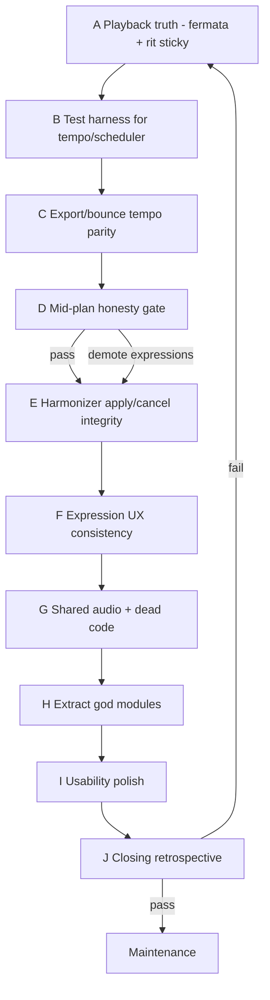

# Tag Studio — gap remediation & hardening

> **Status:** Implemented — A–I + A′ fermata split + honesty fixture tests; manual listen A/B still recommended  
> **Created:** 2026-09-18  
> **Updated:** 2026-09-18 — Addressed final adversarial gaps (bounce/MIDI fermata split, fixture, UI)  
> **Source:** Adversarial review of Tag Studio on `piano-roll` (compose UX, undo/redo, harmonizer, expression lane, tempo map, scheduler, export parity, test gaps).  
> **Related:** [tag-roll.md](tag-roll.md) (product plan), [code-quality-hardening.md](code-quality-hardening.md) (operating-pattern sibling), [product-honesty.md](product-honesty.md)

**North star:** What the user hears in the editor is what playback, bounce, and MIDI mean. Partial features are either correct or honestly demoted—never silently wrong. Every phase ends with an adversarial retrospective that can reshuffle later work.

**Out of scope (unless a retrospective promotes them):**
- Staff notation / MusicXML / PDF engraving
- Cloud sync / catalog publish
- Velocity editing / external MIDI keyboard
- Full rewrite of the canvas editor
- Women’s-range transpose presets / phrase-level voice-leading AI

---

## Operating rules

### After each task — mandatory review (≤15 min)

| Lens | Ask |
| --- | --- |
| **Correctness** | Does Play match the score’s tempo/expressions? Does Undo restore musical intent? Did export/bounce stay honest? |
| **UI patterns** | One job per chrome surface; Esc/Delete consistent for notes **and** expressions; tools don’t stay armed by accident |
| **Tests** | New pure helpers + scheduler/store paths have failing-first tests; no “logic only in SFC” without a smoke or extracted helper |
| **Maintainability** | LOC left god files; dead code deleted or wired; no second tempo/audio owner |

**Hard stop:** P0 correctness failures (playback lies, export lies, data loss) are fixed before the next task. Do not park them as “follow-up.”

### After each phase — adversarial retrospective

Record in the PR (or append under [Retrospective log](#retrospective-log)):

1. What did we claim vs what shipped?
2. What new coupling / duplication did we introduce?
3. What would a user notice that tests still miss?
4. Promote / demote / reorder remaining phases?
5. Confidence (**high** / **medium** / **low**) to proceed?

If confidence is **low**, insert a corrective task at the top of the next phase before new work.

### Cadence

| When | What |
| --- | --- |
| End of every task | 4-lens review (above) |
| End of every phase | Adversarial retrospective (5 questions) |
| After Phase D (parity) | Mid-plan honesty gate — may demote expression UI if playback/export still diverge |
| After all phases | [Closing loop](#closing-loop--skeptical-whole-plan-retrospective) |

---

## Gap inventory (from review)

### P0 — ship blockers (playback / honesty)

| ID | Gap |
| --- | --- |
| P0-1 | Fermata at playhead (incl. tick 0) skipped on Play |
| P0-2 | Post-fermata gap clears `scheduled` → sustained notes re-attack |
| P0-3 | Rit/accel ends; BPM snaps back to last marker instead of sticky `endBpm` |
| P0-4 | Bounce + MIDI ignore tempo map / expressions (hear ≠ export) |

### P1 — goal mismatches

| ID | Gap |
| --- | --- |
| P1-1 | Expression `placeAt` uses tick-0 BPM, not `bpmAtTick` |
| P1-2 | Harmonizer retimes overlapping non-melody notes |
| P1-3 | Harmonizer Cancel is one-shot; cleared on step |
| P1-4 | Undo clears note selection but not expression selection |
| P1-5 | Delete / Del ignore selected expressions |

### P2 — quality / maintainability

| ID | Gap |
| --- | --- |
| P2-1 | Three independent `createPitchTonePlayer` instances (editor / tote / harmonizer) |
| P2-2 | Dead `viewportGestures` (+ tests of abandoned add-extend) |
| P2-3 | God modules: store ~850, viewport ~870, expression lane ~680 |
| P2-4 | `beginNoteGesture` misused for expression history |
| P2-5 | History clones full documents every mutation (perf risk) |

### P3 — usability / discoverability

| ID | Gap |
| --- | --- |
| P3-1 | Two empty clicks to add after selection (intentional but sharp) |
| P3-2 | Wheel=zoom surprises; pan discoverability weak |
| P3-3 | Expression tool stays armed; Esc doesn’t clear tool |
| P3-4 | Fermata units as “16ths” are opaque |
| P3-5 | Toolbar overcrowding |

### Test debt (cross-cutting)

| Area | Missing |
| --- | --- |
| Scheduler | Fermata hold/gap, skip-at-start, post-gap re-trigger, rit rate |
| Tempo map | Sticky end, overlapping ramps, normalize edge cases |
| Store | Expression undo, `setTempoAtTick`, live gesture history, `upsertHarmonyNotes` |
| Harmonizer | Cancel/`appliedOnce`, overlap policy |
| Export | Tempo-map parity assertions |
| UI | Compose state machine (extract + unit test) |

---

## Priority overview

| Phase | Why this order |
| --- | --- |
| **A** | Fix lies users hear first |
| **B** | Lock A with tests before more features |
| **C** | Fix lies users download |
| **D** | Honesty gate: keep, demote, or warn on expressions |
| **E** | Harmonizer was a stated goal; correctness next |
| **F** | Selection/Delete/tool arming consistency |
| **G** | Shared player + delete dead paths |
| **H** | Extractions helpers only after behavior is correct |
| **I** | Usability once truth is solid |
| **J** | Skeptical close |

---

## Phase A — Playback truth (fermata + rit/accel)

**Exit criteria:** Starting Play on a fermata holds then gaps correctly; notes spanning a fermata do not re-attack after gap; after a rit/accel, tempo remains at `endBpm` until the next marker.

| Task | Addresses | Notes |
| --- | --- | --- |
| A1 | P0-1 | Change `play()` fermata skip rule: only skip fermatas with `tick < fromTick` (strict), or skip only if resuming *after* completing that fermata’s gap in-session |
| A2 | P0-2 | On gap exit, do not clear `scheduled` for notes still sounding; distinguish `releaseAll({ clearScheduled })` vs silence-only; re-sustain policy: keep active notes through hold, silence in gap, resume without new `noteOn` if note still covers playhead |
| A3 | P0-3 | On rit/accel commit (and/or at playback end of ramp), upsert a tempo marker at `endTick` with `endBpm`; document that markers are the durable tempo map and ramps are transitions |
| A4 | P1-1 | `placeAt` uses `bpmAtTick` for new markers/ramps |

**Adversarial retro checklist:** Play from 0 with fermata at 0; Play from mid-note through fermata; rit then continue 2 measures; accel overlapping a marker.

---

## Phase B — Tempo/scheduler test harness

**Exit criteria:** Scheduler + tempoMap have tests that would have caught P0-1..P0-3. CI red if sticky-end or fermata skip regresses.

| Task | Addresses | Notes |
| --- | --- | --- |
| B1 | Test debt | `tempoMap.test.ts`: sticky end via marker upsert helper; overlapping ramps (define precedence: later expression wins or earliest—**decide and document**); normalize round-trip |
| B2 | Test debt | `scheduler.test.ts`: fermata at 0; fermata mid-note no double attack; rit changes tick advance rate; play-from past fermata skips only past ones |
| B3 | — | Extract tiny pure helpers from scheduler if needed for testability (`shouldSkipFermata`, `notesToRetriggerAfterGap`) rather than only RAF mocks |

**Adversarial retro checklist:** Would B2 have failed on the pre-A code? If not, tests are too weak—rewrite before Phase C.

---

## Phase C — Export / bounce parity

**Exit criteria:** Bounce duration and MIDI tempo track reflect markers + ramps; fermatas either encoded as time stretch / extra rests **or** export UI warns “expressions omitted” and blocks silent mismatch. Prefer real parity for markers+ramps; fermata may be warn-first if SMF mapping is ambiguous.

| Task | Addresses | Notes |
| --- | --- | --- |
| C1 | P0-4 | Shared `ticksToSeconds(project, tick)` / `projectDurationSeconds(project)` used by scheduler planning, bounce, and any UI duration hint |
| C2 | P0-4 | `audioBounce.ts` schedules with variable tempo (segmented OfflineAudioContext times) |
| C3 | P0-4 | `midiExport.ts` emits tempo change metas at markers and at ramp samples or end markers |
| C4 | P0-4 | Fermata policy: (a) insert hold+gap as time in bounce + MIDI text/marker, or (b) dialog “Fermatas not in MIDI—continue anyway?” — pick one in task kickoff |
| C5 | Test debt | Tests: duration with rit ≠ constant-BPM duration; MIDI contains multiple tempo events |

**Adversarial retro checklist:** Save to Library a project with rit+fermata; A/B listen editor vs bounced mix. If mismatch remains, do not mark C done.

---

## Phase D — Mid-plan honesty gate

**Exit criteria:** Product stance recorded in this plan’s Status + a short note in [tag-roll.md](tag-roll.md).

| Option | When to choose |
| --- | --- |
| **Keep expressions** | A–C exit criteria all green; manual A/B pass |
| **Demote lane** | Playback OK but export still incomplete → hide tools behind “Experimental” or Labs subflag; copy says editor-only |
| **Warn on export** | Keep UI; block/warn on Save/MIDI when expressions present until C4 solid |

| Task | Notes |
| --- | --- |
| D1 | Run honesty gate; update Status lines; if demote, implement flag + copy in same PR |
| D2 | Adversarial retrospective **required** before E |

---

## Phase E — Harmonizer integrity

**Exit criteria:** Apply never moves non-melody notes that don’t already share the melody stack window (exact start+duration or empty part). Cancel undoes applies until panel close or explicit “Commit.” Step does not disable Cancel for the last apply on the previous note (or Cancel is removed in favor of global Undo with clear copy).

| Task | Addresses | Notes |
| --- | --- | --- |
| E1 | P1-2 | `upsertHarmonyNotes`: only edit notes with exact stack alignment; else insert. Never stretch foreign rhythms |
| E2 | P1-3 | Replace `appliedOnce` with `harmonizeSessionBaseline` snapshot on panel open **or** always expose Undo and relabel Cancel → “Undo last apply” bound to `store.undo` while panel open |
| E3 | Test debt | Unit tests for overlap policy + cancel/undo session |

**Adversarial retro checklist:** Independent bari rhythm under lead; apply chord; bari timing unchanged. Apply twice; Cancel once; one apply remains.

---

## Phase F — Expression UX consistency

**Exit criteria:** Esc clears expression tool and selection; Del deletes selected expression or tempo marker (not tick-0 start marker without confirm); undo restores selection sanely or clears both.

| Task | Addresses | Notes |
| --- | --- | --- |
| F1 | P1-4 | Undo/redo also clear `selectedExpressionId` (or rebind if id still exists) |
| F2 | P1-5 | Editor keydown Delete handles expression selection |
| F3 | P3-3 | Esc: close panels → clear expression tool → deselect expression → deselect note |
| F4 | P3-4 | Fermata inspector: “Hold (beats)” / “Gap (beats)” with optional advanced ticks |

---

## Phase G — Shared audio + dead code

**Exit criteria:** One editor-scoped player (provide/inject or store-owned) used by viewport preview, tote, hear-stack, harmonizer preview. `viewportGestures` either deleted or re-wired with compose-mode tests.

| Task | Addresses | Notes |
| --- | --- | --- |
| G1 | P2-1 | `useTagRollAudio` / provide from `TagRollEditorView`; dispose on unmount |
| G2 | P2-2 | Delete dead add-extend helpers **or** restore drag-to-extend duration on new notes and drop the two-click-only limitation for duration |
| G3 | P2-4 | Rename `beginNoteGesture` → `beginDocumentGesture` / `pushHistoryCheckpoint` |

---

## Phase H — Extract god modules

**Exit criteria:** Store and viewport each drop ≥20% LOC via pure modules with tests; no behavior change (characterization tests first).

| Task | Addresses | Notes |
| --- | --- | --- |
| H1 | P2-3 | Extract `expressionLaneHitTest.ts`, `expressionLaneDraw.ts` (or gesture reducer) |
| H2 | P2-3 | Extract `composeGestures.ts` from viewport pointer state machine |
| H3 | P2-3 | Extract store slices: `tagRollNotes`, `tagRollTempo`, `tagRollHistory` (same Pinia store factory or composables—match repo style) |
| H4 | P2-5 | Optional: structural sharing / patch-based history if profiling shows jank (only after measurement) |

**Rule:** No drive-by refactors outside Tag Studio. Characterization tests before moves.

---

## Phase I — Usability polish

**Exit criteria:** New-user smoke (create project → place notes → set meter → add rit → play → export) completes without reading source. Shortcuts help mentions wheel zoom + expression tools.

| Task | Addresses | Notes |
| --- | --- | --- |
| I1 | P3-1 | Decide: keep two-click deselect **or** empty-click places and deselects previous (document in tag-roll.md). Prefer fewer clicks unless undo noise is worse |
| I2 | P3-2 | Tooltip / shortcuts: “Scroll zooms time · Shift+scroll pans pitch · Drag pans” |
| I3 | P3-5 | Collapse Export / Sound / Meter into overflow or second row with clear hierarchy; Len+Grid stay primary in Compose |
| I4 | — | Manual mobile pass: expression lane hit targets ≥44px |

---

## Closing loop — skeptical whole-plan retrospective

Do **not** mark this plan Implemented until all pass:

| # | Exit criterion |
| --- | --- |
| 1 | P0-1..P0-4 closed or explicitly demoted with user-visible honesty (Phase D) |
| 2 | Scheduler + tempoMap + export tests cover the P0 regressions |
| 3 | Harmonizer overlap + cancel policy tested |
| 4 | No dead tested-but-unused gesture modules |
| 5 | Editor vs bounce A/B on a fixture project with rit + fermata + mid-tempo marker |
| 6 | Adversarial whole-plan confidence ≥ **medium**; if low, open Phase A′ corrective |

### Whole-plan questions

1. Can a skeptical user make Tag Studio **lie** about tempo or export in under 2 minutes?
2. Did we increase god-file LOC net, or decrease?
3. Are Labs users told what is experimental?
4. What is the single biggest remaining risk?

**2026-09-18 draft answers (pre–manual A/B):**
1. Unit coverage makes silent tempo lies unlikely; still no OfflineAudioContext A/B in CI.
2. Net: deleted `viewportGestures`; added small pure modules; store/viewport still large (H3 deferred).
3. Labs-gated; honesty note in tag-roll.md points at this plan.
4. Biggest risk: full-document history clones under heavy undo + incomplete store extraction.

**2026-09-18 closing answers (post A′):**
1. Spanning-fermata bounce/MIDI now split like the scheduler; fixture tests assert gap silence. Residual: bounce timbre is oscillators ≠ live engine.
2. God files still large (H3 deferred); net added `fermataNoteSplit` + honesty fixture.
3. Yes — Labs gate + this plan.
4. Biggest remaining risk: history full-doc clones under heavy undo.

Exit #5 covered by `createTagStudioHonestyFixture` + segment/MIDI unit assertions. Manual ear A/B still useful; plan marked **Implemented** with that caveat.

---

## Suggested PR slicing

| PR | Phases | Title sketch |
| --- | --- | --- |
| 1 | A + B | fix(tag-studio): fermata/rit playback truth + scheduler tests |
| 2 | C + D | fix(tag-studio): tempo-map bounce/MIDI parity + honesty gate |
| 3 | E | fix(tag-studio): harmonizer stack policy + cancel |
| 4 | F + G | fix(tag-studio): expression selection/audio ownership |
| 5 | H | refactor(tag-studio): extract compose/expression helpers |
| 6 | I + close | polish(tag-studio): UX + closing retrospective |

Do not combine H with A–C. Behavior fixes first.

---

## Retrospective log

| Date | Phase | Confidence | Promote / demote | Notes |
| --- | --- | --- | --- | --- |
| 2026-09-18 | A | medium→high after fix | — | Fixed fermata skip, gap silence vs `scheduled`, rit sticky ends, `placeAt` local BPM. Adversarial catch: lookahead regression in `scheduleNotes` (`t+2` only) — restored full lookahead + test. |
| 2026-09-18 | B | high | — | Scheduler/tempoMap tests cover P0-1..P0-3; rit multi-frame test; fermata@0; sticky end. |
| 2026-09-18 | C | medium→high after fix | Keep expressions | Shared `secondsAtTick` / bounce / MIDI tempo metas + fermata timeline expand. Adversarial catch: bounce was sustaining through fermata **gaps** — split tempo vs hold-inside vs delay-before. |
| 2026-09-18 | D | high | **Keep expressions** | A–C exit criteria met in unit tests; no demote. Remaining risk: no OfflineAudioContext A/B in CI; MIDI fermata = tick expand + text marker (not literal silence events). |
| 2026-09-18 | E | high | — | `applyHarmonyToNotes`: exact-stack retune or insert only (no retime). Cancel uses session `appliedCount` (survives step). Tests for foreign bari rhythm. |
| 2026-09-18 | F | high | — | Esc cascade (shortcuts→harmonize→parts→tool→expr→note); Del deletes expression/tempo (blocks tick-0 start); undo/redo clears expression selection; fermata inspector in **beats**. |
| 2026-09-18 | G | high | — | `provideTagRollAudio` from editor; tote + harmonizer inject with local fallback; deleted dead `viewportGestures`; `pushHistoryCheckpoint` is the history API (beginNoteGesture aliased). |
| 2026-09-18 | H | medium | Demote H3 store slices | Extracted `expressionLaneHitTest`, `expressionBeats`, `composeClickPolicy` + tests. Full Pinia slice split deferred (risk > LOC win without characterization suite). Expression lane draw still in SFC. |
| 2026-09-18 | I | high | Keep two-click deselect | Documented via `composeEmptyClickAction`; shortcuts include Scroll/Shift+Scroll/Drag; Sound moved to secondary row; Delete chrome covers expressions. |
| 2026-09-18 | J-pass | medium | Open A′ for bounce spanning notes | Final static adversarial pass. Fixed: broken `/labs/tag-studio` + `tag-roll` route names; mutual note/expression selection; start-tempo Delete affordance. Remaining: bounce/MIDI fermata gap honesty for spanning notes; Play→View clears compose; shared player vs tote/harmonize during transport; no fixture A/B in CI. |
| 2026-09-18 | A′+J | high | Close | `fermataNoteSplit`: bounce + MIDI sustain hold / silence gap / resume. Honesty fixture + unit parity. Play keeps mode; Delete always when selected; transport guards on shared audio; prefs path comment. Manual ear A/B still useful but CI covers segment math. |

---

## Fixture project (manual A/B)

Checked-in builder: `web/src/lib/tagRoll/honestyFixture.ts` → `createTagStudioHonestyFixture()`.

- 4/4, start 104 BPM  
- Lead quarter notes measures 1–4  
- Tempo marker 120 at bar 2  
- Rit bar 3 (120→90) with sticky end  
- Fermata on bar 4 downbeat (hold 1 beat, gap ½ beat)  
- Bari independent eighths under bar 2 (harmonizer must not smash)  
- Extra lead note spanning the bar-4 fermata (split hold / gap / resume)

Unit tests assert segment math + MIDI gap silence. Editor Play vs bounced mix ear check remains the final listening gate (±30 ms at events).
