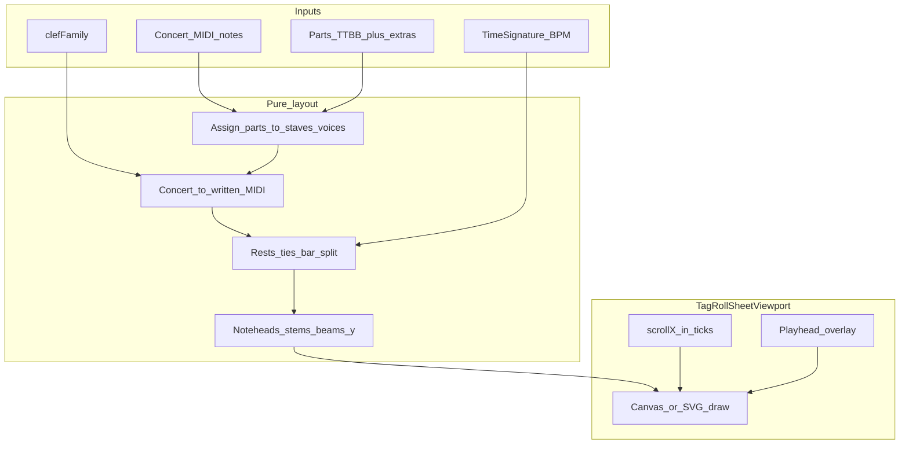

# Tag Studio — continuous horizontal sheet view

> **Status:** In progress — Phases 0–3 + View Roll/Sheet toggle; sheet uses **VexFlow (Bravura)**  
> **Created:** 2026-09-19  
> **Goal:** In **View** mode, choose **Roll** (default, read-only piano roll) or **Sheet** (VexFlow-engraved continuous barbershop score) with the same playhead / measures.  
> **Related:** [tag-roll.md](tag-roll.md), [tag-studio-ux-polish.md](tag-studio-ux-polish.md), existing `musicxmlExport.ts` / `measureBeat.ts` / `TagRollViewport.vue`

---

## Product intent

Arrangers sketch on the piano roll (Compose / Lyrics). When they switch to **View**, they see the arrangement as **sheet music**: two bracketed staves in traditional barbershop layout, scrolling **horizontally without page wraps**, with the **same playback cursor** and **same measure grid** as the roll.

This is **view-only**. No note entry, drag, or lyric edit on the staff. Compose remains the editor; View becomes the score reader.

---

## Notation rules (canonical)

Correcting common naming: barbershop does **not** use the orchestral C-clef “tenor clef.” It uses **octave-transposing G/F clefs**:

| Ensemble | Upper staff (Tenor + Lead) | Lower staff (Bari + Bass) | Effect |
| --- | --- | --- | --- |
| **Men’s / TTBB** | Treble clef with **8 below** (vocal tenor / octave-down G clef) | Normal bass clef | Upper parts sound **one octave lower** than written |
| **Women’s / SSAA** | Normal treble clef | Bass clef with **8 above** (octave-up F clef) | Lower parts sound **one octave higher** than written |

**Stem / beam voices** (BHS Notation Manual):

| Staff | Voice 1 (stems / beams **up**) | Voice 2 (stems / beams **down**) |
| --- | --- | --- |
| Upper | Tenor | Lead |
| Lower | Baritone | Bass |

Connect the two TTBB/SSAA staves with a **choral bracket** (not a piano brace). Barlines stop at each staff (systemic barline at the left only).

**Extra parts** (name ≠ Tenor/Lead/Bari/Bass, or `midiGroup: 'solo'`): each gets its **own staff** below the grand staff (default treble; later: clef heuristic by median MIDI). Same continuous time axis.

**Source of truth:** project notes stay **concert MIDI**. Clefs only change **written** pitch for display (±12). Playback / bounce / MIDI unchanged.

Reference: [BHS Notation Manual](https://www.barbershop.org/files/documents/getandmakemusic/Barbershop%20Notation%20Manual.pdf), Sweet Adelines arranging notes on TTBB vs SSAA clefs.

---

## UX in Tag Studio

### When it appears

- `project.view.mode === 'view'` → user picks **Roll** (default) or **Sheet** via toolbar (`view.scoreSurface`).
- **Roll:** read-only piano roll (pan / playhead / audition only).
- **Sheet:** VexFlow (Bravura) continuous horizontal score.
- Compose / Lyrics → existing `TagRollViewport` roll (editable as before).
- Switching modes keeps `playheadTick`, transport state, and horizontal scroll position in **ticks** (convert via each viewport’s px-per-tick).

### Shared with the roll

| Concern | Behavior |
| --- | --- |
| Playhead | Same `playheadTick`; vertical cursor line through all staves; scrub on sheet (ruler or body, View rules) |
| Measures | Barlines at `measureTicks(timeSignature)`; beat subdivision optional (lighter lines) |
| Transport | Existing Play / Pause / Stop / RTZ / Space / Enter |
| Hear stack | Still works at playhead (notesAtTick) — no staff hit-testing required for v1 |
| Zoom time | Horizontal zoom maps to sheet `pxPerBeat` (or reuse `cellW` as time scale) |
| Vertical | Sheet has its own scrollY (staff stack); no pitch-row scroll |

### View-only interactions

- Pan horizontally (and vertically if many staves).
- Scrub playhead.
- Optional: click a measure to jump playhead to that bar’s start.
- **No** note select, place, resize, lyric, or expression edit on the staff.
- **Expression lane stays visible under the sheet in View** (read-only for now — no add/drag/edit). Revisit hiding later if clutter becomes an issue.

### Clefs control

New project field (persisted):

```ts
/** Barbershop clef family for sheet view + future MusicXML clefs. */
clefFamily: 'ttbb' | 'ssaa'  // default 'ttbb'
```

UI: View-mode control or More… → “Men’s clefs (TTBB)” / “Women’s clefs (SSAA)”. Harmonizer / tonality unrelated. Default **`ttbb`**.

---

## Layout model (continuous horizontal)

Unlike page-based engravers (OSMD, typical VexFlow scores), this view is a **single infinite-x system**:

```
x = leftMargin + ticksToPx(tick, pxPerBeat)
```

All measures laid out left→right for `lengthTicks`. No system breaks, no wrapping. Measure numbers above barlines (every bar or every 4 — start with every bar, thin type).



### Staff assignment

1. Resolve canonical parts by name (case-insensitive): Tenor, Lead, Bari/Baritone, Bass.
2. **Grand staff pair** if at least one upper and one lower canonical part exists (or always show empty staves when default TTBB parts present).
3. Remaining parts → **solo staves** in part order, each monophonic voice 1 stems-up (v1).

### Written pitch

| `clefFamily` | Staff | Written MIDI |
| --- | --- | --- |
| `ttbb` | Upper | `concert + 12` |
| `ttbb` | Lower | `concert` |
| `ssaa` | Upper | `concert` |
| `ssaa` | Lower | `concert - 12` |
| solo | (treble) | `concert` (v1) |

Staff Y from written pitch via diatonic staff position + accidental from `preferFlats` (reuse `midiToMusicXmlPitch` spelling).

### Rhythm / measures

Reuse and extend export helpers rather than inventing a second timeline:

- `collapsePartNotesMono` (per voice)
- Measure split / ties across barlines (same idea as `splitSlicesAtMeasures`)
- Rests fill gaps within each measure per voice
- Duration glyphs: whole…32nd + dots (align with `durationGlyphs.ts` / snap presets)

**Portamento overlaps:** sheet shows as separate notes (or tied) — do **not** draw portamento curves on staff in v1; roll remains the place for glide visualization.

**Fermatas / rit / accel:** v1 draw simple fermata marks at expression ticks above the upper staff; rit/accel as dashed brackets or omit until Phase C. Playback already uses the tempo map — sheet is cosmetic here.

### Beaming (v1 policy)

- Beam within each **beat** (from `beatTicks` / time signature), per voice, independently.
- Eighths and shorter beam; quarters+ unbeamed.
- Stem direction forced by voice (ignore “majority pitch” auto stems).
- Collision avoidance between voice 1 and 2 on one staff: minimal v1 (fixed stem lengths); improve later if overlaps look bad.

### Lyrics

- Show lyrics under the **Lead** voice (voice 2 upper) when present.
- Extra-part lyrics under that staff.
- Dash / melisma: use stored lyric strings as-is (existing hyphen convention).

---

## Rendering approach (decision)

| Option | Pros | Cons |
| --- | --- | --- |
| **A. Custom Canvas 2D engraving** | Matches roll architecture; continuous-x trivial; shared playhead math; small dependency surface | Must implement noteheads/beams/accidentals |
| **B. VexFlow / OSMD** | Richer engraving | Page/system oriented; fighting continuous scroll + sync cursor; large deps |
| **C. MusicXML → OSMD in a strip** | Reuse export | Same pagination fight; laggy live update |

**Recommendation: Option A** — pure layout module + Canvas (or SVG) drawer, same family as `TagRollViewport`. Use SMuFL/Bravura **only if** we already want font-quality glyphs; v1 can use simple geometric noteheads + text accidentals to ship faster.

Optional later: “Export MusicXML with correct barbershop clefs” by updating `attributesXml` from `clefFamily` (separate small task; not required for View).

---

## File / module plan

| Piece | Path | Role |
| --- | --- | --- |
| Types | `types.ts` | `clefFamily` on project; normalize default `ttbb` |
| Staff assign | `lib/tagRoll/sheetScore/assignStaves.ts` | Parts → staves / voices |
| Pitch map | `lib/tagRoll/sheetScore/writtenPitch.ts` | Concert ↔ written; staff position |
| Rhythm layout | `lib/tagRoll/sheetScore/rhythmLayout.ts` | Measures, rests, ties, beam groups |
| Geometry | `lib/tagRoll/sheetScore/engrave.ts` | x/y for heads, stems, beams, clefs, brackets |
| Draw | `lib/tagRoll/sheetScore/drawSheet.ts` | Canvas paint from engraver output |
| Component | `components/tagRoll/TagRollSheetViewport.vue` | Scroll, playhead scrub, resize |
| Editor wire | `TagRollEditorView.vue` | Swap viewport on `mode === 'view'` |
| Prefs UI | Toolbar / More… | Clefs TTBB/SSAA |
| Tests | `*.test.ts` per pure module | Assignment, octave map, barlines, beams |

Keep existing `sheetRender.ts` (piano-roll PNG for library) **unchanged** — different product (raster handoff, not notation).

---

## Editor integration details

```text
TagRollEditorView
  ├─ mode compose|lyrics → TagRollViewport (roll)
  └─ mode view           → TagRollSheetViewport
       ├─ reads project.notes/parts/timeSignature/clefFamily/expressions
       ├─ scrollXTicks ↔ shared with store (new view.scrollX already px-based —
       │    prefer storing scroll as ticks OR convert on mode switch)
       └─ emits playhead / scroll like roll
```

**Scroll sync recommendation:** on mode switch, convert:

`scrollTick = pxToTicks(scrollX, cellW)` → sheet `scrollX = ticksToPx(scrollTick, sheetPxPerBeat)`.

Persist one canonical `view.scrollTick` long-term (optional cleanup); v1 can convert at switch only.

**Time zoom:** View mode wheel zooms `sheetPxPerBeat` (clamp for readability). Need not share `cellW` with compose.

**Height:** Fill stage like the roll; staves centered or top-aligned with padding; vertical pan if extras overflow.

**Sticky left column:** Clefs, choral bracket, and part names (Tenor / Lead / Bari / Bass + extras) stay fixed on the left while the music scrolls horizontally underneath. Barlines and notes scroll; the margin does not.

---

## Phased delivery

### Phase 0 — Spec lock (done 2026-09-19)

- [x] TTBB/SSAA clefs (table above).
- [x] View **replaces** roll with sheet (not dual pane).
- [x] Default `clefFamily: 'ttbb'`.
- [x] Expression lane visible in View, read-only for now.
- [x] Sticky left column for clefs + part names.
- [x] Extra parts = own staves; view-only.

### Phase 1 — Skeleton viewport + playhead

- [x] `TagRollSheetViewport` with empty grand staff, clefs, bracket, barlines for `lengthTicks`.
- [x] Shared playhead line + scrub.
- [x] Mode swap in editor; scroll/zoom time (`cellW`).
- [x] `clefFamily` field + View-mode Clefs toggle.
- [x] Sticky left margin; expression lane read-only in View; tote hidden in View.

**Exit:** Enter View → see continuous empty TTBB/SSAA staves; playhead moves with transport; measures match roll meter.

### Phase 2 — Notes + voices

- [x] Map Tenor/Lead/Bari/Bass to voices; written pitch; noteheads + forced stems.
- [x] Rests + ties across bars.
- [x] Basic beaming by beat.
- [x] Accidentals from `preferFlats`.

**Exit:** Default quartet fixture looks like a readable two-staff score; playback cursor tracks notes.

### Phase 3 — Lyrics, extras, expressions cosmetics

- [x] Lead lyrics under upper staff.
- [x] Extra parts → additional staves (with optional solo lyrics).
- [x] Fermata symbols; rit/accel bracket marks.
- [x] Measure numbers; part name column at left (Tenor/Lead/Bari/Bass).

**Exit:** Custom 5th part appears on its own staff; lyrics readable while following playhead.

### Phase 4 — Polish + honesty

- Stem collision / ledger lines quality pass.
- Performance: draw only visible tick window (virtualize x).
- Tests for octave maps, staff assign, beam grouping.
- Update MusicXML clefs to match `clefFamily` (nice-to-have).
- Adversarial: mid-measure playhead, 3/4 and 6/8 meters, portamento overlaps, empty measures, SSAA vs TTBB same concert pitches look different on staff.

---

## Non-goals (this feature)

- Editing notes/lyrics/expressions on the staff
- Page-wrapped / printable pagination (use Save-to-Library roll PNG or future PDF engraver)
- Full BHS Notation Manual compliance (slurs, breath marks, voicing analysis, contest formatting)
- Real-time collaborative cursors
- Replacing My Library sheet PNG with engraved notation
- Drawing portamento curves on the staff

---

## Risks & mitigations

| Risk | Mitigation |
| --- | --- |
| Engraving rabbit hole | Geometric v1 glyphs; defer Bravura |
| Beaming / collision ugliness | Forced stems + beat beams only; iterate visually on honesty fixture |
| Scroll desync roll ↔ sheet | Convert via ticks on mode switch; one playhead source |
| Wrong clef folklore (“tenor clef”) | Document TTBB 8-below / SSAA 8-above in UI helper text |
| Live re-layout cost while scrubbing | Layout from notes only when notes/meter/clefs change; pan is camera-only |
| Extra parts clutter | Cap visible solo staves or collapse behind “more staves” later if needed |

---

## Acceptance criteria

1. View mode shows continuous horizontal barbershop grand staff (not the piano roll).
2. TTBB: treble-8va-bassa upper, bass lower; SSAA: treble upper, bass-8va-alta lower — user-selectable.
3. Tenor up / Lead down; Bari up / Bass down.
4. Additional parts on separate staves.
5. Measure barlines match `timeSignature` / existing measure math.
6. Playhead is the same tick as roll transport; scrubbing works in View.
7. No staff editing; Compose still required to change notes.
8. Concert MIDI model unchanged; only display transposition for clefs.

---

## Phase 0 decisions (locked)

| # | Question | Decision |
| --- | --- | --- |
| 1 | Roll + sheet dual pane? | **Toggle in View** — default **Roll** (read-only); optional **Sheet** (VexFlow) |
| 2 | Default `clefFamily`? | **`ttbb`** |
| 3 | Expression lane in View? | **Yes**, visible and **read-only** for now |
| 4 | Left margin? | Clefs drawn by VexFlow on measure 1; sticky custom margin retired |
| 5 | Engraving engine? | **VexFlow 5 + Bravura** (replaced hand-drawn canvas) |

---

## Implementation order (when coding starts)

1. Types + normalize `clefFamily`
2. Pure `assignStaves` + `writtenPitch` + tests
3. Barline / empty-staff canvas viewport + editor mode swap
4. Note layout + draw + beam tests
5. Lyrics + extra staves + fermata marks
6. Virtualized draw + polish
