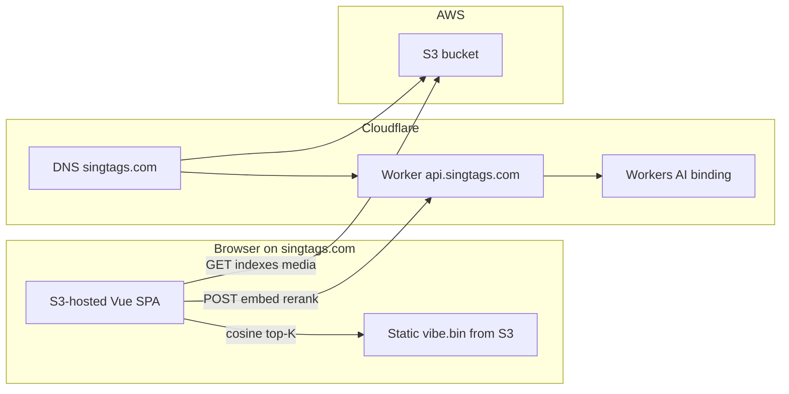
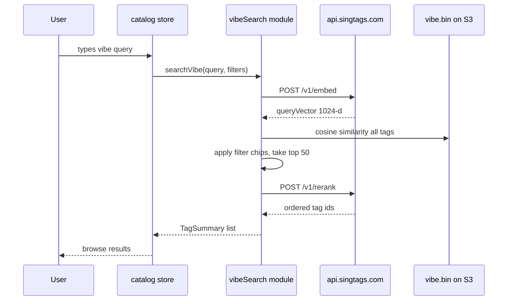

# Search by Vibe — implementation specification

**Status:** Planned (not implemented).  
**Domain:** `singtags.com` (DNS on Cloudflare; static site on S3).  
**AI runtime:** Cloudflare Workers AI via a dedicated Worker at `api.singtags.com`.

This document is the full build spec for **Search by Vibe**: a **Search | Vibe** toggle next to the home search box. Vibe mode accepts natural-language descriptions (e.g. “bittersweet contest closer”) and returns semantically similar tags using embeddings + reranking, with sentiment computed offline during catalog sync.

Related docs:

- [publish.md](../publish.md) — catalog sync and S3 deploy
- [architecture.md](../architecture.md) — app boundaries
- [setup.md](../setup.md) — domain and hosting (S3 path)

---

## Table of contents

1. [Goals and non-goals](#goals-and-non-goals)
2. [Architecture](#architecture)
3. [Models](#models)
4. [User experience](#user-experience)
5. [Cloudflare Worker setup](#cloudflare-worker-setup)
6. [Worker API specification](#worker-api-specification)
7. [Offline publish pipeline](#offline-publish-pipeline)
8. [Static vibe index format](#static-vibe-index-format)
9. [Client implementation](#client-implementation)
10. [Security](#security)
11. [Cost and limits](#cost-and-limits)
12. [Testing plan](#testing-plan)
13. [Rollout plan](#rollout-plan)
14. [Troubleshooting](#troubleshooting)
15. [File checklist](#file-checklist)
16. [Implementation order](#implementation-order)

---

## Goals and non-goals

### Goals

- Add **Search | Vibe** mode toggle beside the existing search input on the home/browse page.
- **Vibe mode:** natural-language query → ranked tag list using semantic similarity.
- Use Cloudflare Workers AI models:
  - `@cf/qwen/qwen3-embedding-0.6b` — embeddings (offline catalog + online query)
  - `@cf/baai/bge-reranker-base` — rerank top candidates (online)
  - `@cf/huggingface/distilbert-sst-2-int8` — sentiment on title/lyrics (offline sync only)
- **No API keys in the browser or S3 bundle.** Runtime AI calls go through a Cloudflare Worker with an `[ai]` binding.
- Reuse existing filter chips in Vibe mode (narrow candidates before vector math).
- Shareable URLs: `?mode=vibe&q=…`

### Non-goals (v1)

- Sentiment as a visible filter chip (sentiment is stored and may softly boost ranking later).
- Real-time re-sentiment on every page load.
- Cloudflare Vectorize as the embedding store (see [Why not Vectorize](#why-not-vectorize)).
- Replacing keyword search; Search mode stays unchanged.
- Server-side full-catalog search on every request (cosine runs in the browser against a static index).

---

## Architecture

SingTags remains a **static SPA on S3** (optionally CloudFront). Cloudflare provides **DNS** and a **Worker** subdomain for AI. The Worker is not hosted on S3—it is a separate Cloudflare service routed via DNS.



### Request flow (Vibe search)



### Why a Worker

Workers AI authentication is provided by an **`[ai]` binding** in `wrangler.toml`. The Worker calls `env.AI.run(modelId, input)` with no secret in source code. The browser only talks to `https://api.singtags.com`, which validates origin and rate limits.

### Why not Vectorize

| Factor | Value |
| --- | --- |
| Embedding model | `@cf/qwen/qwen3-embedding-0.6b` |
| Dimensions per vector | **1024** |
| Catalog size (full) | ~7,100 tags |
| Stored dimensions | 7,100 × 1,024 ≈ **7.3M** |
| Vectorize Free tier cap | **5M** stored dimensions |

Vectorize does not fit the free tier at full catalog size with this model. Instead:

1. **Offline:** compute embeddings during sync; pack as **int8-quantized** vectors in a static `vibe.bin` on S3 (~7 MB).
2. **Online:** browser loads `vibe.bin` once, runs cosine similarity locally.
3. **Worker:** embed the user query + rerank top ~50 candidates only.

This minimizes Neuron usage and keeps search fast after the index is cached.

---

## Models

| Role | Workers AI model ID | When | Input |
| --- | --- | --- | --- |
| Catalog embedding | `@cf/qwen/qwen3-embedding-0.6b` | Offline sync | `{ "text": string }` or `{ "text": string[] }` |
| Query embedding | `@cf/qwen/qwen3-embedding-0.6b` | Each vibe search (Worker) | User vibe text |
| Rerank | `@cf/baai/bge-reranker-base` | Each vibe search (Worker) | `{ "query": string, "contexts": [{ "text": string }] }` |
| Sentiment | `@cf/huggingface/distilbert-sst-2-int8` | Offline sync | `{ "text": string }` → POSITIVE/NEGATIVE scores |

### Text prepared per tag (offline)

Concatenate for embedding and (truncated) sentiment:

```text
{title}. {alt_title if any}. {first ~400 characters of lyrics}
```

- Tags **with lyrics:** use full formula.
- Tags **without lyrics:** title + alt_title only.
- Strip excessive whitespace; cap total length at ~2,000 characters before API call.

### Sentiment fields (stored in metadata + index)

| Field | Type | Description |
| --- | --- | --- |
| `sentimentLabel` | `"positive"` \| `"negative"` | Argmax of model scores |
| `sentimentScore` | `number` | POSITIVE probability (0–1) |
| `vibe_enriched_at` | ISO timestamp | Skip re-enrich unless `--force` |

v1 does not expose sentiment in the UI. Optional future use: soft boost when vibe query implies mood (e.g. “sad” → slight weight toward negative-sentiment tags). Not required for initial ship.

---

## User experience

### Placement

[`web/src/views/HomeView.vue`](../../web/src/views/HomeView.vue) — in `.searchrow`, add a segmented control **before** the search input:

```text
[ Search | Vibe ]  [________________ search input ________________]  [Clear]
```

New component: `web/src/components/SearchModeToggle.vue` (to create).

### Mode behavior

| Mode | Placeholder | Engine |
| --- | --- | --- |
| **Search** | `Search titles, arrangers, or n123…` | Existing [`SearchEngine`](../../web/src/search/engine.ts) — unchanged |
| **Vibe** | `Describe a vibe… e.g. bittersweet contest closer` | New vibe pipeline |

### Interaction details

- **Debounce:** 500 ms in Vibe mode (slightly longer than keyword search’s 320 ms to reduce API calls).
- **URL sync:** `mode=search` (default, omit param) or `mode=vibe`; `q` carries query text (same as today).
- **Filter chips:** Still apply in Vibe mode — intersect chip-filtered tag set with cosine candidates before rerank.
- **Empty query:** Show default browse sections (same as keyword search with no `q`).
- **Loading:** `role="status"` — “Finding vibe matches…”
- **Error:** “Vibe search is unavailable. Try Search mode or try again later.”
- **Hints:** Hide `n123` / `c45` syntax hints in Vibe mode; show one line: “Describe mood, occasion, or feel — not exact lyrics.”
- **Accessibility:** `role="radiogroup"` with two `role="radio"` buttons; `aria-pressed` / `aria-checked` as appropriate.

### Feature flag

Build-time flag for staged rollout:

```bash
VITE_VIBE_ENABLED=1   # show toggle; omit or 0 to hide entirely
```

When disabled, UI and vibe index fetch are skipped.

---

## Cloudflare Worker setup

One-time infrastructure. The Worker lives in the repo under `workers/vibe-api/`.

### Prerequisites

- Cloudflare account with `singtags.com` **Active** (nameservers pointed from Namecheap).
- [Wrangler](https://developers.cloudflare.com/workers/wrangler/install-and-update/) CLI.
- Workers AI enabled (default on Free plan).

### Create the project

```bash
mkdir -p workers/vibe-api/src
cd workers/vibe-api
npm init -y
npm i -D wrangler typescript @cloudflare/workers-types
npx wrangler login
```

### `workers/vibe-api/wrangler.toml`

```toml
name = "singtags-vibe-api"
main = "src/index.ts"
compatibility_date = "2025-01-01"

[ai]
binding = "AI"

[vars]
ALLOWED_ORIGINS = "https://singtags.com,https://www.singtags.com"

# Optional: rate-limit KV (create namespace in dashboard, paste id)
# [[kv_namespaces]]
# binding = "RATE_LIMIT"
# id = "xxxxxxxxxxxxxxxxxxxxxxxxxxxxxxxx"
```

### Custom domain (DNS route)

1. Cloudflare dashboard → **Workers & Pages** → **singtags-vibe-api**.
2. **Settings** → **Domains & Routes** → **Add** → **Custom domain**.
3. Enter: `api.singtags.com`.
4. Cloudflare creates a proxied DNS record automatically.

No S3 or CloudFront changes required. The apex/www site continues to point at S3; only `api` points at the Worker.

### Local development

Terminal 1:

```bash
cd workers/vibe-api
npx wrangler dev
```

Terminal 2 (Vue app):

```bash
# web/.env.development
VITE_VIBE_API_URL=http://localhost:8787
VITE_VIBE_ENABLED=1
```

CORS in dev: add `http://localhost:5173` to `ALLOWED_ORIGINS` in a `[env.development]` block or local `wrangler.toml` override.

### Deploy

```bash
cd workers/vibe-api
npx wrangler deploy
curl https://api.singtags.com/v1/health
# → {"ok":true}
```

### Cloudflare API token (offline enrich only)

For `build/enrich_vibe.py` on your machine or CI — **not** for the Worker, **not** in the SPA:

1. Cloudflare dashboard → **My Profile** → **API Tokens** → **Create Token**.
2. Use template **Edit Cloudflare Workers** or custom token with:
   - Account → Workers AI → Read
   - Account → Workers AI → Edit (if required by API)
3. Save token in `.env.deploy` (gitignored):

```bash
CLOUDFLARE_ACCOUNT_ID=your_32_char_account_id
CLOUDFLARE_API_TOKEN=your_token
```

Find Account ID on the Workers overview page right sidebar.

---

## Worker API specification

Base URL: `https://api.singtags.com` (production) or `VITE_VIBE_API_URL` (dev).

All `POST` endpoints: `Content-Type: application/json`. Responses: `application/json`.

### `GET /v1/health`

**Response 200:**

```json
{ "ok": true, "version": 1 }
```

Use for deploy verification and uptime checks.

---

### `POST /v1/embed`

Embed a single vibe query.

**Request:**

```json
{ "text": "bittersweet contest closer" }
```

| Field | Rules |
| --- | --- |
| `text` | Required, 1–500 characters after trim |

**Response 200:**

```json
{ "vector": [0.012, -0.034, "... 1024 floats total"] }
```

**Errors:**

| Status | Body |
| --- | --- |
| 400 | `{ "error": "invalid_request", "message": "…" }` |
| 429 | `{ "error": "rate_limited" }` |
| 502 | `{ "error": "ai_unavailable" }` |

**Worker implementation sketch:**

```typescript
const result = await env.AI.run('@cf/qwen/qwen3-embedding-0.6b', {
  text: body.text,
})
// Normalize response shape from Workers AI → number[1024]
```

---

### `POST /v1/rerank`

Rerank candidate tags by relevance to the vibe query.

**Request:**

```json
{
  "query": "bittersweet contest closer",
  "contexts": [
    { "id": 123, "text": "Title. Snippet of lyrics…" },
    { "id": 456, "text": "…" }
  ]
}
```

| Field | Rules |
| --- | --- |
| `query` | Same as embed |
| `contexts` | 1–50 items |
| `contexts[].id` | Tag id (number) |
| `contexts[].text` | Same embed text formula, max 2,000 chars |

**Response 200:**

```json
{
  "results": [
    { "id": 456, "score": 0.91 },
    { "id": 123, "score": 0.87 }
  ]
}
```

Sorted by `score` descending.

**Worker implementation sketch:**

```typescript
const result = await env.AI.run('@cf/baai/bge-reranker-base', {
  query: body.query,
  contexts: body.contexts.map((c) => ({ text: c.text })),
})
// Zip scores back to context ids by index
```

---

### CORS

- `Access-Control-Allow-Origin`: reflect request `Origin` only if listed in `ALLOWED_ORIGINS`.
- `Access-Control-Allow-Methods`: `GET, POST, OPTIONS`
- `Access-Control-Allow-Headers`: `Content-Type`
- Handle `OPTIONS` with 204.

### Rate limiting

Target: **30 requests per minute per IP** on `/v1/*`.

Options (pick one):

1. **Cloudflare Rate Limiting** rule in dashboard on `api.singtags.com/v1/*` (simplest).
2. **KV counter** in Worker: key = `rate:{ip}:{minute}`, increment, return 429 if > 30.

Embed + rerank from one vibe search = 2 requests; 30/min ≈ 15 vibe searches/min/IP.

---

## Offline publish pipeline

Integrate into the existing sync flow documented in [publish.md](../publish.md).

### Publish order (with vibe)

```bash
# 1. Catalog sync (existing)
python3 build/_retired/seed_sample.py --limit 250 --force
python3 build/_retired/rasterize_sheets.py --force

# 2. NEW — AI enrich (local machine; uses CLOUDFLARE_API_TOKEN)
python3 build/enrich_vibe.py --force

# 3. NEW — pack static vibe index
python3 build/build_vibe_index.py

# 4. Existing index build (project sentiment into core.json.gz)
python3 build/build_indexes.py

# 5. Build + deploy SPA to S3
cd web && npm run build
S3_BUCKET=… ./deploy/website_s3.sh
```

Full library: replace `--limit 250` with `--limit 8000` and run `enrich_vibe.py` overnight (~7k API calls).

### `build/enrich_vibe.py` (to implement)

**Purpose:** Call Workers AI REST API from the publish machine; write results to disk.

**CLI:**

```bash
python3 build/enrich_vibe.py [--sample PATH] [--force] [--limit N] [--ids 1,2,3]
```

**Algorithm:**

1. Load `CLOUDFLARE_ACCOUNT_ID` and `CLOUDFLARE_API_TOKEN` from environment or `.env.deploy`.
2. For each `library/{id}/metadata.json`:
   - Skip if `vibe_enriched_at` present and not `--force`.
   - Build embed text (title + alt + lyrics snippet).
   - `POST https://api.cloudflare.com/client/v4/accounts/{account_id}/ai/run/@cf/huggingface/distilbert-sst-2-int8`
   - `POST …/ai/run/@cf/qwen/qwen3-embedding-0.6b`
   - Write to metadata: `sentiment_label`, `sentiment_score`, `vibe_enriched_at`
   - Write sidecar: `library/_state/vibe/embeddings/{id}.json` → `{ "vector": number[1024] }`
3. Batch with exponential backoff on 429/5xx.
4. Write `library/_state/vibe/manifest.json`:

```json
{
  "version": 1,
  "embeddingModel": "@cf/qwen/qwen3-embedding-0.6b",
  "sentimentModel": "@cf/huggingface/distilbert-sst-2-int8",
  "dimensions": 1024,
  "tagCount": 250,
  "builtAt": "2026-08-22T12:00:00Z"
}
```

**REST example (Python):**

```python
import os, requests

ACCOUNT = os.environ["CLOUDFLARE_ACCOUNT_ID"]
TOKEN = os.environ["CLOUDFLARE_API_TOKEN"]
HEADERS = {"Authorization": f"Bearer {TOKEN}"}

def ai_run(model: str, payload: dict):
    url = f"https://api.cloudflare.com/client/v4/accounts/{ACCOUNT}/ai/run/{model}"
    r = requests.post(url, headers=HEADERS, json=payload, timeout=120)
    r.raise_for_status()
    return r.json()["result"]
```

**Alternative:** `workers/vibe-batch` invoked via `wrangler dev` with AI binding, reading tag JSON paths from stdin — same security (no token in repo), fewer REST quirks.

### `build/build_vibe_index.py` (to implement)

**Inputs:** `library/_state/vibe/embeddings/*.json`, metadata sentiment fields.

**Outputs:**

| File | Deployed to |
| --- | --- |
| `web/public/indexes/vibe.bin` | S3 via `dist/indexes/` |
| `web/public/indexes/vibe.json` | S3 (metadata; optional gzip) |

See [Static vibe index format](#static-vibe-index-format).

### Changes to `build/build_indexes.py`

Project optional fields into `core.json.gz` per tag:

```json
{
  "id": 123,
  "title": "…",
  "sentimentLabel": "positive",
  "sentimentScore": 0.82
}
```

### When to re-run enrich

| Event | Action |
| --- | --- |
| New tags added | `enrich_vibe.py` for new ids only (default skip logic) |
| Lyrics/title changed | `enrich_vibe.py --force` for affected ids or full `--force` |
| Model version change | Bump `vibe.bin` version header; full re-embed |
| App-only UI change | No re-enrich |

---

## Static vibe index format

### `vibe.bin` (binary, little-endian)

| Offset | Size | Field |
| --- | --- | --- |
| 0 | 4 | Magic `VIBE` (0x56494245) |
| 4 | 2 | Format version `uint16` (= 1) |
| 6 | 2 | Reserved |
| 8 | 4 | Tag count `uint32` |
| 12 | 4 | Dimensions `uint32` (= 1024) |
| 16 | 4 | `float32` global scale for int8 dequantization |
| 20 | N × (4 + 1024) | Records: `uint32 id` + `int8[1024]` |

**Dequantization:** `float[i] = int8[i] * scale` (scale computed across all vectors at build time for max fidelity).

**Approximate size:** 20 + 7,100 × (4 + 1,024) ≈ **7.3 MB** raw; gzip on S3 may reduce transfer ~30–50%.

### `vibe.json` (metadata)

```json
{
  "version": 1,
  "dimensions": 1024,
  "ids": [1, 2, 3],
  "texts": {
    "123": "Title. Lyrics snippet used for embed…"
  },
  "sentiment": {
    "123": { "label": "positive", "score": 0.82 }
  }
}
```

`texts` map is required for rerank (send same strings to Worker). Keep snippets, not full lyrics, to limit JSON size (~2–4 MB for 7k tags).

### Cache headers

Deploy with same policy as other indexes: `Cache-Control: public, max-age=3600` (see [publish.md](../publish.md)). Bump version or filename on model change if CDN invalidation is manual.

---

## Client implementation

### New module: `web/src/search/vibe/`

| File | Responsibility |
| --- | --- |
| `vibeIndex.ts` | Fetch `indexes/vibe.bin` + `vibe.json`; decode binary; cosine top-K |
| `vibeApi.ts` | `embedQuery(text)`, `rerank(query, contexts)` |
| `vibeSearch.ts` | Orchestrate full pipeline; return `TagSummary[]` |
| `vibeSearch.test.ts` | Unit tests with mocked fetch |

### `vibeApi.ts`

```typescript
const base = import.meta.env.VITE_VIBE_API_URL?.replace(/\/$/, '') ?? ''

export async function embedQuery(text: string): Promise<Float32Array> {
  const res = await fetch(`${base}/v1/embed`, {
    method: 'POST',
    headers: { 'Content-Type': 'application/json' },
    body: JSON.stringify({ text }),
  })
  if (!res.ok) throw new VibeApiError(res.status)
  const { vector } = await res.json()
  return new Float32Array(vector)
}
```

### `vibeSearch.ts` pipeline

```typescript
export async function searchVibe(
  query: string,
  allTags: TagSummary[],
  filters: CatalogFilters,
  index: VibeIndex,
): Promise<TagSummary[]> {
  if (!query.trim()) return []

  const queryVec = await embedQuery(query.trim())

  // 1. Cosine: all tags with embeddings
  let candidates = index.topKByCosine(queryVec, 80)

  // 2. Apply chip filters (reuse filter logic from search/)
  candidates = applyCatalogFilters(candidates, filters, allTags)

  // 3. Take top 50 for rerank
  const top = candidates.slice(0, 50)
  const contexts = top.map((id) => ({
    id,
    text: index.getText(id),
  }))

  // 4. Rerank
  const ranked = await rerank(query, contexts)

  // 5. Map ids → TagSummary preserving order
  return ranked.map((r) => allTags.find((t) => t.id === r.id)!).filter(Boolean)
}
```

### Catalog store changes (`web/src/stores/catalog.ts`)

Add state:

```typescript
searchMode: 'search' | 'vibe'  // sync ?mode=
vibeLoading: boolean
vibeError: string | null
vibeIndex: VibeIndex | null   // lazy-loaded
```

Watch `queryText` + `searchMode`:

- `search` → existing `SearchEngine.search` (320 ms debounce)
- `vibe` → `searchVibe` (500 ms debounce)

On first switch to `vibe`, load `vibe.bin` if `VITE_VIBE_ENABLED`.

### Types (`web/src/types/tag.ts`)

```typescript
export interface TagSummary {
  // …existing fields
  sentimentLabel?: 'positive' | 'negative'
  sentimentScore?: number
}
```

### Environment variables

| Variable | Where | Purpose |
| --- | --- | --- |
| `VITE_VIBE_API_URL` | Web build | Worker base URL |
| `VITE_VIBE_ENABLED` | Web build | Show toggle |
| `CLOUDFLARE_ACCOUNT_ID` | `.env.deploy` only | Offline enrich |
| `CLOUDFLARE_API_TOKEN` | `.env.deploy` only | Offline enrich |

Add to [`deploy/.env.deploy.example`](../../deploy/.env.deploy.example) when implementing.

---

## Security

| Rule | Detail |
| --- | --- |
| No secrets in SPA | Never `CLOUDFLARE_API_TOKEN` in `web/` or S3 |
| Worker auth | AI binding only at runtime |
| CORS | Allow only `https://singtags.com`, `https://www.singtags.com` (+ localhost in dev) |
| Rate limit | 30 req/min/IP on `/v1/*` |
| Input limits | Query ≤ 500 chars; ≤ 50 rerank contexts; ≤ 2 KB text each |
| Logging | Log tag ids and status codes; do not log full lyrics in Worker |
| HTTPS only | Custom domain on Cloudflare; redirect HTTP → HTTPS |

---

## Cost and limits

### Workers AI (Free plan)

- **10,000 Neurons/day** (resets 00:00 UTC).
- Approximate per vibe search: 1 embed + 1 rerank on ~50 snippets → low thousands of neurons.
- Hobby traffic (dozens of vibe searches/day) stays within free tier.

### Offline full-library enrich (one-time per sync)

- ~7,100 tags × (1 embed + 1 sentiment) ≈ 14k API calls.
- Run overnight; use backoff on rate limits.
- May exceed daily Neurons on Free — run in batches across days, or enable **Workers Paid** ($5/mo) for the enrich window.

### S3 / bandwidth

- `vibe.bin` ~7 MB per user first load (browser cache + SW stale-while-revalidate for indexes).
- Acceptable alongside existing `lyrics.json.gz`.

---

## Testing plan

| Layer | What to test |
| --- | --- |
| Worker | `GET /v1/health`; embed returns length 1024; rerank returns sorted ids; CORS preflight; 400 on empty text |
| `vibeIndex.ts` | Decode sample `vibe.bin`; cosine ordering matches known fixture |
| `vibeSearch.ts` | Mock API; filter intersection; empty query |
| `catalog.ts` | Mode toggle updates URL; vibe debounce does not fire search engine |
| `SearchModeToggle.vue` | a11y radiogroup; keyboard |
| `views.smoke.test.ts` | Toggle visible when enabled; Vibe mode changes placeholder |
| Offline scripts | 3-tag golden run; manifest version; skip without `--force` |
| Manual E2E | “funny short tag”, “sad ballad”, “contest closer” return plausible top results |

---

## Rollout plan

| Phase | Action |
| --- | --- |
| 1 | Deploy Worker; verify `curl https://api.singtags.com/v1/health` |
| 2 | Run `enrich_vibe.py` on 250-tag sample; build `vibe.bin` |
| 3 | Ship SPA with `VITE_VIBE_ENABLED=1` to staging or production |
| 4 | Manual QA on `singtags.com` |
| 5 | Run full-library enrich (~7k); redeploy indexes + SPA |
| 6 | Remove feature flag default (enable for all users) |

---

## Troubleshooting

| Symptom | Likely cause | Fix |
| --- | --- | --- |
| CORS error in browser | Origin not in `ALLOWED_ORIGINS` | Add exact `https://singtags.com` (no trailing slash mismatch) |
| 429 from Worker | Rate limit | Wait; tighten client debounce; raise limit slightly |
| 502 `ai_unavailable` | Workers AI outage or bad model id | Check Cloudflare status; verify model strings |
| Empty vibe results | `vibe.bin` not deployed or stale | Re-run `build_vibe_index.py`; check S3 `indexes/` sync |
| Vibe always slow first time | Downloading 7 MB index | Expected once; show “Loading vibe index…” |
| Enrich script 403 | Bad API token permissions | Token needs Workers AI run permission on account |
| Search works, Vibe does not | `VITE_VIBE_API_URL` wrong at build time | Rebuild with correct env; check Network tab host |
| Rerank order seems random | Context text mismatch | Ensure `vibe.json` texts match embed formula |

---

## File checklist

| Path | Status | Purpose |
| --- | --- | --- |
| `workers/vibe-api/wrangler.toml` | To create | Worker config + AI binding |
| `workers/vibe-api/src/index.ts` | To create | HTTP router, CORS, embed, rerank |
| `workers/vibe-api/package.json` | To create | Wrangler dev dependency |
| `build/enrich_vibe.py` | To create | Offline sentiment + embeddings |
| `build/build_vibe_index.py` | To create | Pack `vibe.bin` + `vibe.json` |
| `build/build_indexes.py` | To change | Project sentiment fields |
| `web/public/indexes/vibe.bin` | Generated | Quantized embeddings |
| `web/public/indexes/vibe.json` | Generated | Rerank texts + sentiment map |
| `web/src/search/vibe/vibeIndex.ts` | To create | Binary loader + cosine |
| `web/src/search/vibe/vibeApi.ts` | To create | Worker HTTP client |
| `web/src/search/vibe/vibeSearch.ts` | To create | Pipeline orchestration |
| `web/src/search/vibe/vibeSearch.test.ts` | To create | Unit tests |
| `web/src/components/SearchModeToggle.vue` | To create | Search \| Vibe UI |
| `web/src/stores/catalog.ts` | To change | Mode routing + lazy index |
| `web/src/views/HomeView.vue` | To change | Wire toggle + hints |
| `web/src/types/tag.ts` | To change | Sentiment fields |
| `deploy/.env.deploy.example` | To change | CF token + vibe env vars |
| `docs/publish.md` | To change | Document enrich step in pipeline |

---

## Implementation order

1. **Worker** — `workers/vibe-api` with health, embed, rerank; deploy `api.singtags.com`.
2. **Offline pipeline** — `enrich_vibe.py` + `build_vibe_index.py` on 250-tag sample.
3. **Client core** — `vibeIndex.ts`, `vibeApi.ts`, `vibeSearch.ts` + tests.
4. **UI integration** — `SearchModeToggle`, catalog store, HomeView.
5. **Docs + deploy** — update publish.md, `deploy/.env.deploy.example`; S3 deploy with indexes.
6. **Full library** — overnight enrich for ~7k tags; production enable.

---

*Last updated: 2026-08-22. Status: specification only — no code shipped yet.*
