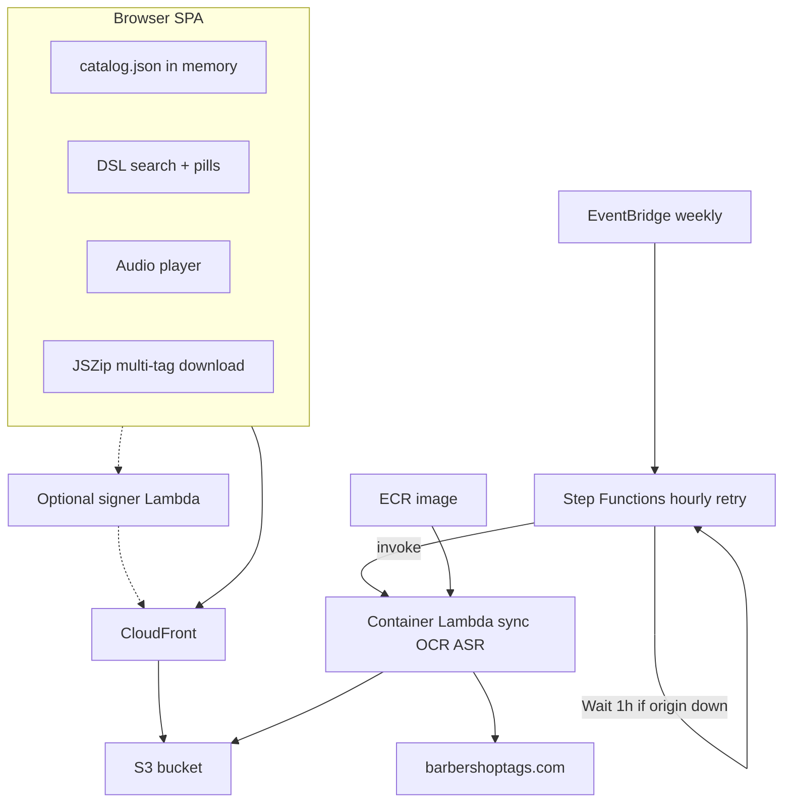
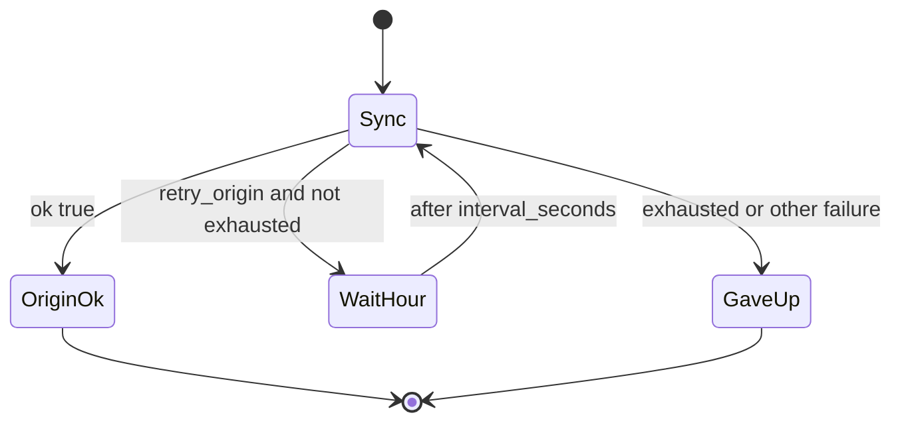

# AWS Searchable Tags Mirror Site

Plan for hosting the local Barbershop Tags library as a low-cost, searchable static website on AWS, with weekly Lambda sync (OCR + light ASR).

## Defaults (chosen)

- **Auth for deploy:** Terraform + scripts use local `AWS_PROFILE` / standard env credentials.
- **Weekly sync:** EventBridge starts a **Step Functions** state machine that invokes the container Lambda (frontier + enrich + sheet/audio + OCR + light ASR). **No long waits inside Lambda.**
- **Origin outages:** Lambda fail-fasts if barbershoptags.com is down / returns `http_error`. Step Functions **Wait**s `ORIGIN_RETRY_INTERVAL_SECONDS` (default **3600** = 1 hour) and re-invokes, up to `ORIGIN_RETRY_MAX_ATTEMPTS` (default **24** ≈ one day), then fails until the next weekly schedule.
- **Lambda packaging:** **Container image** (ECR) so Tesseract/RapidOCR + faster-whisper + baked `small.en` fit; 2048–3008 MB RAM, up to 10–15 min timeout. Weekly additive load is usually a few tags → OCR + ASR are affordable.
- **Region:** `us-east-1`.
- **DNS:** CloudFront default `*.cloudfront.net` only.
- **Media access (v1):** Private S3 + CloudFront OAC (no public bucket). Catalog + SPA + media public via CloudFront. **Optional:** short-lived CloudFront signed cookies via a tiny Lambda Function URL if we later want expiring deep links. **No WAF / rate limiting** in this plan.

## OCR in Lambda — yes

Chosen approach: **Lambda container image** on ECR including:

- Reused libs: `lib/http.py`, `lib/parse_tag_page.py`, `lib/names.py`, OCR path from `mirror/extract_text.py`
- **RapidOCR** (onnxruntime) and/or **Tesseract** in the image
- Flow per new id: fetch page → assets → **ASR Lead** (or next part) for primary lyrics → **OCR only if ASR has no usable words** → fill remaining part_lyrics → upload `tags/{id}/` → patch `catalog.json`

Skip-complete still applies. HTML lyrics preferred when strong; OCR fills gaps.

## ASR in Lambda — light model

| Choice | Value |
|--------|--------|
| Model | **`small.en`** (English-only) |
| Device / compute | **CPU `int8`** (no GPU on Lambda) |
| Beam | **`beam_size=1`** |
| Scope | New/updated tags in the weekly run; skip parts that already have complete `part_lyrics` |
| Packaging | Bake `small.en` into the image (no Hugging Face download on cold start) |
| Deps | [`mirror/requirements-asr-cpu.txt`](../mirror/requirements-asr-cpu.txt) only — **no** `nvidia-*` CUDA wheels |
| Timeout | Stop ASR when **&lt; 90s** remain; unfinished ids → `state.asr_pending` |
| Catalog | Compact `part_lyrics`: per-part `{text, model}` only (drop `raw`) |

Local GPU backfill with `large-v3` stays on the workstation; Lambda never upgrades existing `part_lyrics` unless forced later.

**Entrypoint:** [`mirror/lambda_sync.py`](../mirror/lambda_sync.py) (`handler`). Env:

- `ASR_ENABLED=1` (default on in Lambda)
- `ASR_MODEL=small.en`
- `ASR_BEAM_SIZE=1`
- `ASR_MIN_REMAINING_SECONDS=90`
- `ORIGIN_RETRY_INTERVAL_SECONDS=3600` (Step Functions Wait; Lambda does not sleep this long)
- `ORIGIN_RETRY_MAX_ATTEMPTS=24`

**Image bake (Dockerfile build step):**

```bash
pip install -r mirror/requirements-asr-cpu.txt
python -c "from faster_whisper import WhisperModel; WhisperModel('small.en', device='cpu', compute_type='int8')"
```

Also install `ffmpeg` in the image (left-channel extract).

## S3 / download protection — what is possible

**You cannot make files “browser-only.”** Anything the browser can play/download can be fetched by curl if the URL is known.

| Mechanism | Needs always-on server? | What it does |
|-----------|-------------------------|--------------|
| Private S3 + CloudFront OAC | No | Blocks raw bucket URL access; only CloudFront can read objects |
| Public CloudFront URLs (SPA + `/tags/*`) | No | Simple static site |
| CloudFront **signed cookies/URLs** | **No always-on server** — Lambda Function URL mints signatures | Optional expiring media access |

**Chosen for this plan:**

1. **Required:** Private bucket + OAC — S3 is never world-readable.
2. **Default site mode:** Public CloudFront for SPA + media (simplest zip/playback).
3. **Optional Terraform flag `enable_signed_media`:** CloudFront key group + Lambda Function URL that sets signed cookies for `/tags/*`. Off unless you opt in later.

**Out of scope:** AWS WAF, rate-based rules, or other request throttling.

## Cost posture

- Storage ~7GB S3: main ongoing cost.
- Weekly container Lambda + OCR + light ASR: usually cents (few new tags; ~4 short clips × `small.en` int8 per tag).
- Origin-down retries: Step Functions Wait is free of Lambda duration; up to 24 short probe invocations/day when the site is out.
- CloudFront: free tier / low for personal traffic.
- Signed-cookie Lambda (if enabled): free tier friendly.
- **No WAF** (rate limiting dropped from scope).

## Architecture



## Origin outage retries (no long-running Lambda)

barbershoptags.com is often down for hours. **Do not** use in-Lambda `sleep` / `--poll-minutes` for the cloud job (that burns duration and hits the 15‑minute cap).



1. Weekly EventBridge starts [`infra/statemachine/weekly_sync.asl.json`](../infra/statemachine/weekly_sync.asl.json) with `{ "attempt": 1, "limit": 0 }`.
2. Lambda probes origin; if down (or frontier hits `http_error`), returns `{ ok: false, retry_origin: true, attempt, next_attempt, interval_seconds: 3600 }` and exits in seconds.
3. Step Functions **Wait**s `interval_seconds` (default 1 hour) **without** keeping Lambda warm, bumps `attempt`, re-invokes.
4. On success (`ok: true`), clear `state.origin_retry` and finish.
5. After **24** attempts (~1 day), state machine **Fails** (`OriginUnavailable`); next weekly schedule starts fresh at attempt 1.

Local repair CLI may still use `--poll-minutes` while you babysit a long run; cloud path never does.

**S3 layout:**

```
s3://{bucket}/
  index.html
  assets/...
  catalog.json
  tags/{tag_id}/metadata.json
  tags/{tag_id}/{files}
  state/sync_state.json
```

## Catalog for in-memory search

Extend catalog builder to full `catalog.json` (all user-facing metadata; exclude `ocr_raw` / raw discovered URL maps). Facets for browse. ~2–8 MB at full library size — load once at startup.

Include:

- Identity: `tag_id`, `source_url`, `folder_name`
- Core: `title`, `subtitle`, `key`, `arranger`, `year`, `type`, `parts_count`, `collection`
- People: `posted_by`, `learning_tracks_by`, `made_famous_by`
- Social: `rating`, `votes`, `favorites`, `date_posted`, `download_count`
- Text: `lyrics`, `comments`, `keywords`, `lyrics_source`
- Part lyrics: compact `part_lyrics` map `{lead|bari|bass|tenor: {text, model}}` (no `raw`)
- Files: `parts` map with `{filename, bytes, mime_guess}` for sheet/mix/bass/bari/lead/tenor
- Mirror clarity: original `source_url` on every record

Also emit facet indexes (`keys`, `arrangers`, `users`, rating buckets) for browse views.

Local [`build_catalog.py`](build_catalog.py) already emits compact `part_lyrics` on each `catalog.jsonl` row.

## Static SPA (`web/`)

Vanilla JS + Vite (or plain static) — mobile-first.

**Chrome / mirror clarity**

- Persistent banner: unofficial mirror of barbershoptags.com; originals linked
- Every detail view: prominent **View original** → `source_url`

**Find view**

- Search box with multi-term DSL; tokens become **dismissible filter pills**
- Free-text terms (no operator) match across title/lyrics/keywords/arranger/etc.
- DSL:

| Syntax | Meaning |
|--------|---------|
| `title=Smile` | field equals (case-insensitive) |
| `title!=Smile` | not equals |
| `key=[G Major,Bb Major]` | field in set |
| `arranger!=[Unknown]` | field not in set |
| `lyrics=peace` | contains in lyrics |
| `rating=4` | numeric equals |
| `posted_by=behweemoth` | username |

Fields: `title`, `key`, `arranger`, `lyrics`, `posted_by`, `type`, `year`, `rating`, `tag_id`, `keywords`, `comments`, `made_famous_by`, `learning_tracks_by`.

Parser turns query → pill list → AND across pills. Dismiss a pill to remove that filter.

**Browse views** (same result cards + multi-select)

- A–Z by title
- By key
- By arranger
- By user (`posted_by`)
- By rating (buckets)
- Optional: by year / type

**Result / detail**

- Show **all** catalog metadata fields (including compact `part_lyrics` when present)
- Sheet thumbnail/link when image/PDF
- HTML5 audio for available parts (Mix default); per-part download links
- Checkbox select up to **20** tags from find/browse
- Actions: Download selected (JSZip), Download this tag, Play

**Zip limits:** max 20 tags in UI; progress UI; warn on large Mix files.

If `enable_signed_media`: on boot call signer before media/zip.

## Terraform (`infra/`)

- S3 private + OAC + CloudFront (default cert)
- Cache: long TTL `/tags/*`, short TTL catalog/HTML
- ECR repo + Lambda **container** function (sync+OCR+ASR)
- **Step Functions** state machine from [`infra/statemachine/weekly_sync.asl.json`](../infra/statemachine/weekly_sync.asl.json); EventBridge weekly **starts the state machine** (not the Lambda directly)
- IAM: Lambda → S3/ECR/logs; Step Functions → invoke Lambda; EventBridge → start execution
- Variables: `enable_signed_media` (default false), `project_name`, `schedule_expression`, `origin_retry_interval_seconds` (3600), `origin_retry_max_attempts` (24)
- Outputs: `cloudfront_url`, `bucket_name`, `sync_lambda_name`, `sync_state_machine_arn`, optional `signer_url`

## Deploy scripts

```bash
# One-shot first deploy (bootstrap ECR → build image with baked small.en → Lambda/SFN)
export AWS_PROFILE=your-profile   # optional
./infra/scripts/deploy.sh -y

# Later: rebuild image + publish new Lambda version (moves alias "live")
./infra/scripts/lambda_publish.sh
# or
./infra/scripts/deploy.sh --publish-only

# Infra-only changes
./infra/scripts/infra_apply.sh -y

# Optional: push local state/catalog to S3
./infra/scripts/sync_site.sh
```

Scripts:

| Script | Purpose |
|--------|---------|
| [`infra/scripts/deploy.sh`](../infra/scripts/deploy.sh) | First-time or full deploy |
| [`infra/scripts/infra_apply.sh`](../infra/scripts/infra_apply.sh) | Terraform apply (`--bootstrap` = no Lambda yet) |
| [`infra/scripts/lambda_build_push.sh`](../infra/scripts/lambda_build_push.sh) | `docker build` + ECR push (bakes `small.en`) |
| [`infra/scripts/lambda_publish.sh`](../infra/scripts/lambda_publish.sh) | Build/push + `update-function-code` + publish version + `live` alias |
| [`infra/scripts/sync_site.sh`](../infra/scripts/sync_site.sh) | Sync `_state` (and optional media) to S3 |

Image definition: [`mirror/Dockerfile.lambda`](../mirror/Dockerfile.lambda). Terraform: [`infra/`](../infra/).

## Weekly sync behavior

1. EventBridge → Step Functions (`attempt=1`)
2. Lambda loads `state/sync_state.json` (including `asr_pending`, `origin_retry`)
3. Drain `asr_pending` (local ASR; no origin required) while remaining time &gt; 90s
4. **Probe origin** — if down, return `retry_origin` and exit (SFN waits 1h)
5. Frontier until miss streak; per new id: enrich → assets → ASR → OCR only if no Lead ASR → upload
6. On mid-run `http_error`: abort frontier, return `retry_origin` (do not advance past the failed id’s work; cursor/`max_confirmed_id` only advance on ok/skipped)
7. If remaining time &lt; 90s before ASR: append id to `asr_pending`
8. On full success: clear `origin_retry`, patch `catalog.json`, write state
9. ASR is best-effort: missing audio parts are skipped; empty `part_lyrics` alone does not mark a tag incomplete

## Implementation order

1. SPA + DSL + catalog builder (local)
2. Terraform S3/CloudFront + deploy scripts (public CF mode)
3. Container Lambda + Step Functions retry loop + EventBridge
4. Optional signed-cookie signer behind Terraform flag
5. README: costs, OCR/ASR image build, origin retry, access-control options, mirror disclaimer

## Implementation todos

- Expand catalog builder to full browser `catalog.json` + facets
- Build mobile-friendly SPA: DSL search, pills, browse facets, detail, audio, 20-tag JSZip
- Terraform S3+CloudFront OAC (+ optional signed cookies) + container Lambda + Step Functions + EventBridge; no WAF
- Build/deploy/s3 sync scripts using `AWS_PROFILE`
- Container Lambda frontier sync with OCR + light ASR; write `tags/` + patch `catalog.json`
- README: mirror disclaimer, deploy, costs, OCR/ASR lambda, origin retry, access controls

## Out of scope (for now)

- Custom domain / Route53
- Login/auth wall for humans
- Server-side search
- Always-on API/ECS backend
- AWS WAF / rate limiting
- `large-v3` / GPU ASR in Lambda (local backfill only)
- Full-library ASR backfill in AWS
- In-Lambda multi-hour polling (`wait_for_origin` / `--poll-minutes`) for the cloud path