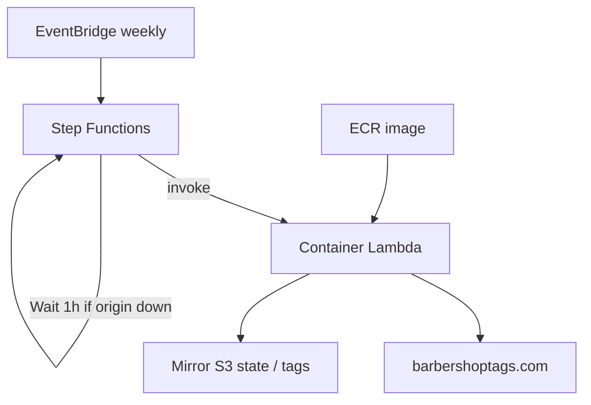
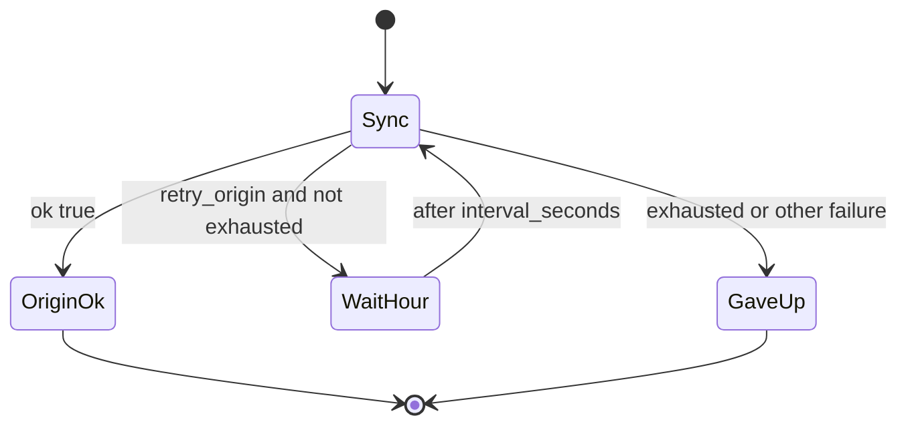

# Weekly Lambda mirror sync

Optional AWS job that runs the same frontier / enrich / assets / OCR / light ASR pipeline as local `mirror/sync.py`, on a schedule.

Day-to-day work stays on a workstation writing `../library/` — see [`../README.md`](../README.md).  
SingTags SPA + media publish stays on website `deploy/` → **public production S3** — see [`../../docs/publish.md`](../../docs/publish.md).  
This Lambda’s Terraform bucket is for **mirror sync state / optional AWS mirror layout**, not a substitute for `./deploy/publish.sh library` today.

## Defaults

| Choice | Value |
| --- | --- |
| Auth | `AWS_PROFILE` / standard AWS env credentials |
| Schedule | EventBridge → **Step Functions** → container Lambda (not Lambda directly) |
| Origin down | Lambda exits fast with `retry_origin`; SFN **Wait**s 1h (default), up to 24 attempts |
| Packaging | ECR **container image** (Tesseract/RapidOCR + faster-whisper `small.en`) |
| Region | `us-east-1` |
| ASR | CPU `int8`, `beam_size=1`; stop when &lt; 90s remain → `state.asr_pending` |

No long sleeps inside Lambda (15‑minute cap). Local CLI may still use `--poll-minutes` while you babysit.

## OCR / ASR in the image

Per new/updated id: assets → **ASR Lead** (or next part) for primary lyrics → **OCR only if ASR has no usable words** → remaining `part_lyrics` → upload → patch catalog state.

- Prefer strong existing lyrics; never overwrite `lyrics_source=manual`
- Bake `small.en` into the image (no Hugging Face download on cold start)
- Deps: [`mirror/requirements-asr-cpu.txt`](../mirror/requirements-asr-cpu.txt) only
- Local GPU `large-v3` backfill stays on the workstation

**Entrypoint:** [`mirror/lambda_sync.py`](../mirror/lambda_sync.py). Env:

- `ASR_ENABLED=1`
- `ASR_MODEL=small.en`
- `ASR_BEAM_SIZE=1`
- `ASR_MIN_REMAINING_SECONDS=90`
- `ORIGIN_RETRY_INTERVAL_SECONDS=3600`
- `ORIGIN_RETRY_MAX_ATTEMPTS=24`

Image bake:

```bash
pip install -r mirror/requirements-asr-cpu.txt
python -c "from faster_whisper import WhisperModel; WhisperModel('small.en', device='cpu', compute_type='int8')"
```

Also install `ffmpeg` in the image.

## Architecture



## Origin outage retries



1. EventBridge starts [`infra/statemachine/weekly_sync.asl.json`](../infra/statemachine/weekly_sync.asl.json) with `{ "attempt": 1, "limit": 0 }`.
2. Lambda probes origin; if down, returns `{ ok: false, retry_origin: true, … }` and exits in seconds.
3. Step Functions Wait → bump `attempt` → re-invoke.
4. Success clears `state.origin_retry`. After 24 failures, state machine Fails until next weekly schedule.

## Weekly run behavior

1. Load `state/sync_state.json` (`asr_pending`, `origin_retry`)
2. Drain `asr_pending` while remaining time &gt; 90s (no origin needed)
3. Probe origin — if down, `retry_origin` and exit
4. Frontier until miss streak; per id: enrich → assets → ASR → OCR if needed → upload
5. Mid-run `http_error`: abort frontier, `retry_origin` (cursor advances only on ok/skipped)
6. Low remaining time before ASR → append id to `asr_pending`
7. Success: clear `origin_retry`, write state / catalog patch

ASR is best-effort: missing audio parts are skipped; empty `part_lyrics` alone does not mark a tag incomplete.

## Terraform & deploy

Under [`infra/`](../infra/): ECR, container Lambda, Step Functions, EventBridge, IAM. Scripts: [`infra/scripts/README.md`](../infra/scripts/README.md).

```bash
cd sync
export AWS_PROFILE=your-profile
cp infra/terraform.tfvars.example infra/terraform.tfvars

./infra/scripts/deploy.sh -y              # first time
./infra/scripts/lambda_publish.sh         # code-only later
./infra/scripts/sync_site.sh              # optional: push local _state to mirror bucket
```

Image: [`mirror/Dockerfile.lambda`](../mirror/Dockerfile.lambda).

## Cost posture

Weekly Lambda + light ASR is usually cents (few new tags). Origin-down retries use Step Functions Wait (no Lambda burn). Storage for a full library mirror is the main ongoing cost if you also host media in that bucket.

## Not in this job

- Publishing the SingTags SPA (use website `deploy/`)
- Full-library ASR backfill / GPU models in Lambda
- In-Lambda multi-hour origin polling
