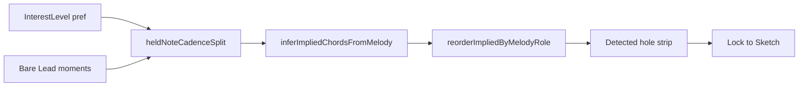

# Plan: Detected interest levels (Basic / Mild / Bold)

Make Detected hole-fills closer to hand-Sketch arranging taste (secondary drive, V7 over V, ii7→V, Dom9, tension→resolve under held Lead) **without** auto-writing Sketch. A Settings dropdown sets aggressiveness; Detected re-ranks live; **Lock** still promotes into Sketch.

**Related:** [cadence-coach-plan.md](./cadence-coach-plan.md) (shared cadence catalog). Bonnie analysis (Bb) showed Detected’s basic diatonic greed misses C7(9), Cm7→F7, and held-pillar posts.

---

## Product decisions (locked)

| Decision | Choice |
|----------|--------|
| Surface | Detected re-rank only (Sketch untouched until Lock) |
| Control | Detected-lane button next to **Lock** (cycles Basic → Mild → Bold) |
| Default | **Mild** |
| Held notes | Mild/Bold may split long holds into cadence pairs when Lead is a common tone |
| Tweaks | Tag Studio toolbar **Settings ▾ → Detected Tweaks…** (right dock); JSON + **Reset to defaults**. Coach dock **Tweaks** covers contest / cadence bias / QA. |

---

## Behavior by level

| Level | Vocabulary | Strong / Passing | Phrase look-ahead | Held-note cadences |
|-------|------------|------------------|-------------------|--------------------|
| **Basic** | Today: diatonic + light I7/IV7/V7 | Today’s triad-vs-seventh reorder | Cadence priority ≤2; `auth_v7_i` matches ^5→any I tone | One chord per Lead onset |
| **Mild** | Same pool; boost **V7 over V**; prefer **ii7** when next is V/V7 | Strong: allow ii7 when it prepares V; Passing: prefer sevenths on V/ii | Next Lead + prior Detected root; **I–I look-ahead** → V7 under first when Lead ∈ V7 | Split obvious holds into **V7→I** or **ii7→V7** if Lead is a common tone |
| **Bold** | Same Mild ★; also **V7/V** / **Dom9** in the pool for alts. Secondary only lifts when next leans V and Lead is characteristic — never steals Mild’s ii7/V7 homes | Same as Mild | Same Mild look-ahead | Same Mild splits; held ^2 may use **V7/V→V7** |

Sketch spans still suppress Detected where covered.



---

## How — implementation map

### 1. Preference + Detected-lane control

**New module** `web/src/lib/tagRoll/detectedInterestPrefs.ts` (mirror [`cadences/prefs.ts`](../src/domain/arranging/cadences/prefs.ts)):

```ts
export type DetectedInterestLevel = 'basic' | 'mild' | 'bold'
const KEY = 'singtags.tagRoll.detectedInterest.v1'
export function loadDetectedInterest(fallback: DetectedInterestLevel = 'mild'): DetectedInterestLevel
export function saveDetectedInterest(level: DetectedInterestLevel): void
```

**UI:** cycle button in [`TagRollDetectedLane.vue`](../src/components/tagRoll/TagRollDetectedLane.vue) gutter, directly above **Lock**. Label shows the current level (`Basic` / `Mild` / `Bold`); click advances Basic → Mild → Bold → Basic.

Hint in `title`: *Mild favors V7, ii7→V, and V7→I under held notes; Bold also allows V7/V and Dom9.*

Wire through [`preferences.ts`](../src/stores/preferences.ts) so `useChordAnalysisBar` can `computed(() => prefs.detectedInterest)` and recompute holes when the button cycles.

---

### 2. Scoring / vocabulary (Mild + Bold)

**Primary file:** [`impliedMelodyChord.ts`](../src/domain/arranging/impliedMelodyChord.ts)

Thread `interest?: DetectedInterestLevel` through:

- `inferImpliedChordsFromMelody`
- `reorderImpliedByMelodyRole` (optional interest-aware pin rules)
- `impliedStacksForBareMelody`

#### Basic
Leave `scoreCandidate` / candidate pool unchanged so existing goldens stay green when `interest === 'basic'`.

#### Mild — adjust scores only (same pool)

In `scoreCandidate` (today: triad +3.5 on I/IV/V with Lead 1/5; seventh −6 on I/IV root; Dom9 −8):

| Condition | Adjustment |
|-----------|------------|
| Nature V7, Lead on 3 or 7 of V, next melody → ^1 | Extra boost (authentic / lead-tone) beyond catalog |
| Nature V7, Lead on 5 of V (^2), next supports I | Prefer V7 over plain V (counter today’s “plain V when Lead on 5”) |
| Nature ii7 / m7 on ^2, next melody or next root is V | Boost ii7; demote early plain V when Strong |
| Strong (`pmn`) + ii7 preparing V | Do **not** shove major triad above ii7 in `reorderImpliedByMelodyRole` when cadence-protected or interest ≥ mild |

Reuse [`scoreCadenceFit`](../src/domain/arranging/cadences/score.ts) with existing catalog ids (`auth_v7_i`, `lead_tone_v7`, `circle_ii_v_i`, …) from [`cadences/catalog.ts`](../src/domain/arranging/cadences/catalog.ts). Mild can keep `maxPriority: 2` but rely on stronger boosts.

#### Bold — expand candidates

In the `push` loop after diatonic chords (today only diatonic + I/IV/V sevenths + m7 on minor degrees):

```ts
// Pseudocode
if (interest === 'bold') {
  const vOfVRoot = (tonality + 2) % 12  // ^2
  push(vOfVRoot, 'seventh', 'II')       // V7/V
  if (lead fits Dom9 tones) push(vOfVRoot, 'ninth', 'II')
  // Soften: if natureId === 'ninth' && interest === 'bold' → −2 instead of −8 (or cadence-gated)
}
```

Use `leadRoleInChord` / `chordContainsLead` from [`chords/chords.ts`](../src/domain/arranging/chords/chords.ts) so C7(9) only appears when Lead is actually in the chord (Bonnie: G or Bb under C7/C9).

Roman labeling already supports V7/V via [`romanForChordDetailed`](../src/domain/arranging/secondaryDominant.ts) when `resolvesToRoot` is V — pass `next` Detected/Sketch root into context when available.

---

### 3. Held-note tension→resolve (the hard part)

#### Problem today

[`bareMelodyMomentsFromTag`](../src/composables/useChordAnalysisBar.ts) emits **one** moment per Lead onset (duration may be long). [`impliedStacksForBareMelody`](../src/domain/arranging/impliedMelodyChord.ts) then emits **one** stack with `durationTicks: m.durationTicks`. A held F never becomes F7→Bb underneath.

#### Approach

Add `expandHeldMomentsForCadences(moments, opts) → BareMelodyMoment[]` (or expand inside `impliedStacksForBareMelody` to emit multiple stacks per hold):

**Inputs:** moments, `interest`, `tonality`, `mode`, `ppq`, `timeSignature` (for beat size via [`beatTicks`](../src/lib/tagRoll/tempoMap.ts)).

**Gate “obvious hold” (Mild/Bold only):**

1. `durationTicks >= 2 * beatTicks` (tunable; start at 2 beats).
2. No sounding TBB already covering the onset (same as today’s bare filter).
3. Held PC is a chord tone of **both** tension and resolve natures (`chordContainsLead`).

**Split recipes** (prefer catalog cadences):

| Recipe | Mild | Bold | Common-tone examples (Bb) |
|--------|------|------|---------------------------|
| V7 → I | yes | yes | Held F (^5), A (^7), or C (^2 as 5 of V) |
| ii7 → V7 | yes | yes | Held C (root of Cm7 / 5 of F7) |
| V7/V → V7 → I | no | yes | Held G (5 of C7 / 9 of …) or Bb (7 of C7 / 1 of Bb) when legal |

**Placement:**

- Tension: `[start, start + half)` or `[start, nearest mid-hold beat)`.
- Resolve: remainder through `start + duration`.
- Snap split to beat grid with `beatTicks(ts, ppq)` so holes align with the strip.

**Do not split when:** Basic; hold too short; Lead PC fails common-tone gate; Sketch already covers ticks; phraseRole is a single tonic arrival on Strong with no dominant context.

**Stack emission:** instead of one `out.push` per moment, push 2–3 stacks with contiguous `startTick`/`durationTicks`. Downstream [`stacksToDetectHoles`](../src/lib/tagRoll/harmonyStrip.ts) already turns stacks into strip segments by duration — no strip rewrite required if stacks are correct.

**Alt cycling:** [`nameCandidatesByTick`](../src/composables/useChordAnalysisBar.ts) keys by `startTick`. After splits, each sub-stack has its own tick — alt still works per hole.

---

### 4. Wiring Detected pipeline

In [`useChordAnalysisBar.ts`](../src/composables/useChordAnalysisBar.ts):

```ts
const interest = computed(() => prefs.detectedInterest) // or loadDetectedInterest()

impliedStacksForBareMelody({
  moments: bareMoments.value,
  existingStacks: harmonyStacks.value,
  tonality: tag.tonality,
  mode: tonalityMode.value,
  songEndTick: tag.lengthTicks,
  cadenceBias: loadCadenceBias(),
  interest: interest.value,
  ppq: tag.ppq,
  timeSignature: tag.timeSignature,
})
```

Pass the same `interest` into every `inferImpliedChordsFromMelody` used for Detected alt lists.

**No changes** to Lock / pillar / Sketch paint paths.

---

### 5. Tests

File: extend [`impliedMelodyChord.test.ts`](../src/domain/arranging/impliedMelodyChord.test.ts) and/or new `detectedInterest.test.ts`.

| Case | Basic ★ | Mild ★ | Bold ★ |
|------|---------|--------|--------|
| Bb, Lead A → Bb | F7 or F | **F7** | F7 |
| Bb, Lead C Strong, next toward F | F | **Cm7** (or Cm7 above F) | Cm7 / C7 |
| Bb, Lead G, next F-ish | Eb / Gm | Eb family | **C7** in pool / ★ |
| Held F, 4 beats, no TBB | single F or F7 | **F7 then Bb** two stacks | same or C7→F7→Bb if gated |
| Held G not common tone of I alone | Eb7 | no bogus Bb split | only if Bold finds legal C7→F7 path |

Keep Basic path bit-identical to current defaults where possible.

---

## File checklist

| File | Change |
|------|--------|
| `web/src/lib/tagRoll/detectedInterestPrefs.ts` | **New** — load/save level |
| `web/src/stores/preferences.ts` | Expose `detectedInterest` + setter |
| `web/src/components/tagRoll/TagRollDetectedLane.vue` | Cycle button next to Lock |
| `web/src/domain/arranging/impliedMelodyChord.ts` | Interest scoring, Bold candidates, held-split helper |
| `web/src/composables/useChordAnalysisBar.ts` | Pass interest + ts/ppq into imply |
| `web/src/domain/arranging/impliedMelodyChord.test.ts` (+ maybe held-split tests) | Goldens |
| `web/src/lib/tagRoll/harmonyHowTo.ts` | One Detected tip mentioning interest levels |

---

## Out of scope

- Auto-Lock / writing Sketch
- Full Coach Suggest / path voicing
- Harmonize Pick catalog changes
- Non-cadence mid-hold color changes (no random SCF under holds)

---

## Implementation order

1. Pref + Detected-lane cycle button next to Lock (Basic = noop wiring).
2. Mild score tweaks + Strong/Passing reorder exceptions + tests.
3. Bold secondary / Dom9 candidates + tests.
4. Held-note split helper + stack emission + tests.
5. How-to blurb + manual check on *My Bonnie Lies Over The Ocean - 2*.
